# 5. 商品搜索

**学习目标**

- Elasticsearch安装

  ```
  docker安装Elasticsearch
  系统参数问题-ES消耗资源高
  跨域操作-Kibana/es-head连接ES
  ```

- IK分词器配置

- Kibana的使用->==DSL语句==

  ```
  Kibana->DSL语句操作->Elasticsearch
  ```

- ==ES导入商品搜索数据==

  ```
  Sku数据导入到Elasticsearch
  Map数据类型->Object
  ```

- ==关键词搜索->能够实现搜索流程代码的编写==

- ==分类统计搜索==


## 5.1. Elasticsearch 安装 

我们之前已经使用过elasticsearch了，这里不再对它进行介绍了，直接下载安装，本章节将采用Docker安装，不过在市面上还有很多采用linxu安装，关于linux安装，已经提供了安装手册，这里就不讲了。


(1)docker镜像下载

```properties
docker pull elasticsearch:5.6.8
docker pull elasticsearch:7.9.3(当时最新)
docker pull elasticsearch:7.9.2(当时最新，配合IK分词器版本)
```

注意：由于镜像有570MB，所以提供的虚拟机里已经下载好了该镜像，如下图：

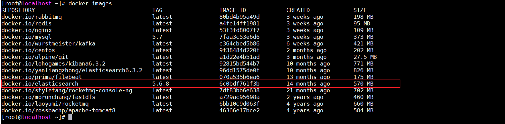


(2)安装es容器

在Linux安装之前要设置命令参数：

**sudo vi /etc/sysctl.conf**（命令）

​	**vm.max_map_count=262144**（内容）

**sysctl -w vm.max_map_count=262144**（命令：不重启， 直接生效当前的命令）

```properties
因为我的云服务器是1G运行内存的导致内存不够无法启动，毕竟学生服务器嘛，9.5包月。土豪可自行跳过。这里需要手动设置一下虚拟机内存。
-Xms512m -Xmx512m

docker run -d --name mall_elasticsearch -p 9200:9200 -p 9300:9300 -e "discovery.type=single-node"  -e ES_JAVA_OPTS="-Xms512m -Xmx512m" elasticsearch:7.9.3(可行)
docker run -d --name mall_elasticsearch -p 9200:9200 -p 9300:9300 -e "discovery.type=single-node"  -e ES_JAVA_OPTS="-Xms512m -Xmx512m" elasticsearch:7.9.2(可行)

docker run -di --name=mall_elasticsearch -p 9200:9200 -p 9300:9300 elasticsearch:7.9.3（旧版不可行，启动一会儿就会崩溃）

firewall-cmd --zone=public --add-port 9200/tcp --permanent;（开放端口9200）
firewall-cmd --zone=public --add-port 9300/tcp --permanent;（开放端口9300）

firewall-cmd --reload;（开放端口生效）
```

 9200端口(Web管理平台端口)  9300(服务默认端口)

浏览器输入地址访问：`http://192.168.211.132:9200/`


(3)开启远程连接

上面完成安装后，es并不能正常使用，elasticsearch从5版本以后默认不开启远程连接，程序直接连接会报如下错误：

```java
failed to load elasticsearch nodes : org.elasticsearch.client.transport.NoNodeAvailableException: None of the configured nodes are available: [{#transport#-1}{5ttLpMhkRjKLkvoY7ltUWg}{192.168.211.132}{192.168.211.132:9300}]
```

我们需要修改es配置开启远程连接，代码如下：

登录容器

```properties
docker exec -it mall_elasticsearch /bin/bash
```

查看目录结构 输入: dir

```properties
[root@fee1bce31d9f elasticsearch]# cd /usr/share/elasticsearch
[root@fee1bce31d9f elasticsearch]# ls
LICENSE.txt  NOTICE.txt  README.asciidoc  bin  config  data  jdk  lib  logs  modules  plugins
```

进入config目录，查看文件

```properties
[root@fee1bce31d9f elasticsearch]# cd /usr/share/elasticsearch/config
[root@fee1bce31d9f config]# ls
elasticsearch.keystore  elasticsearch.yml  jvm.options  jvm.options.d  log4j2.properties  role_mapping.yml  roles.yml  users  users_roles
```


修改elasticsearch.yml文件

```properties
root@07f22eb41bb5:/usr/share/elasticsearch/config# vi elasticsearch.yml
bash: vi: command not found
```

vi命令无法识别，因为docker容器里面没有该命令，我们可以安装该编辑器。

安装vim编辑器

```properties
apt-get update
apt-get install vim
```

安装好了后，修改elasticsearch.yml配置，如下图：

```properties
vi elasticsearch.yml
```

修改如下图：


同时添加下面一行代码：

```properties
cluster.name: my-application
```

重启docker

```properties
docker restart mall_elasticsearch
```

(4)系统参数配置

重启后发现重启启动失败了，这时什么原因呢？这与我们刚才修改的配置有关，因为elasticsearch在启动的时候会进行一些检查，比如最多打开的文件的个数以及虚拟内存区域数量等等，如果你放开了此配置，意味着需要打开更多的文件以及虚拟内存，所以我们还需要系统调优 

修改vi /etc/security/limits.conf ，追加内容 (nofile是单个进程允许打开的最大文件个数 soft nofile 是软限制 hard nofile是硬限制 )

```properties
* soft nofile 65536
* hard nofile 65536
```

修改vi /etc/sysctl.conf，追加内容 (限制一个进程可以拥有的VMA(虚拟内存区域)的数量 )

```properties
vm.max_map_count=655360
```

执行下面命令 修改内核参数马上生效

```properties
sysctl -p
```

重新启动虚拟机，再次启动容器，发现已经可以启动并远程访问 

```properties
reboot
```


(5)跨域配置

修改elasticsearch/config下的配置文件：elasticsearch.yml，增加以下三句命令，并重启:

```properties
http.cors.enabled: true
http.cors.allow-origin: "*"
network.host: http://172.16.26.128/
```

其中：
http.cors.enabled: true：此步为允许elasticsearch跨域访问，默认是false。
http.cors.allow-origin: "*"：表示跨域访问允许的域名地址（*表示任意）。

重启

```properties
 docker restart mall_elasticsearch
```


小提示：如果想让容器开启重启，可以执行下面命令

```properties
docker update --restart=always 容器名称或者容器id
```


## 5.2. IK分词器安装 

(1)安装ik分词器

IK分词器下载地址https://github.com/medcl/elasticsearch-analysis-ik/releases

将ik分词器上传到服务器上，然后解压，并改名字为ik，将ik目录拷贝到docker容器的plugins目录下，**需要注意的是ElasticSearch的版本要和IK版本一致**

```properties
wget https://github.com/medcl/elasticsearch-analysis-ik/releases/download/v7.9.2/elasticsearch-analysis-ik-7.9.2.zip(有些慢，可以提前下载好，传入虚拟机中)
unzip elasticsearch-analysis-ik-7.9.2.zip -d ./ik(解压并重命名)
mv elasticsearch-analysis-ik-7.9.2 ik(重命名作用)
docker cp ./ik mall_elasticsearch:/usr/share/elasticsearch/plugins（复制）

docker restart mall_elasticsearch（重启并访问生效）

-----------------------其他命令----------------------------

	
./bin/elasticsearch-plugin  list(查看已安装插件列表)

docker exec -it mall_elasticsearch /bin/bash
cd /usr/share/elasticsearch/plugins


./bin/elasticsearch-plugin install https://github.com/medcl/elasticsearch-analysis-ik/releases/download/v7.9.2/elasticsearch-analysis-ik-7.9.2.zip
```


(2)IK分词器测试

访问：`http://192.168.211.132:9200/_analyze?analyzer=ik_smart&pretty=true&text=我是程序员`


访问：`http://192.168.211.132:9200/_analyze?analyzer=ik_max_word&pretty=true&text=我是程序员`


## 5.3. Kibana使用-掌握DSL语句

我们上面使用的是elasticsearch-head插件实现数据查找的，但是elasticsearch-head的功能比较单一，我们这里需要一个更专业的工具实现对日志的实时分析，也就是我们接下来要讲的kibana。

Kibana 是一款开源的数据分析和可视化平台，它是 Elastic Stack 成员之一，设计用于和 Elasticsearch 协作。您可以使用 Kibana 对 Elasticsearch 索引中的数据进行搜索、查看、交互操作。您可以很方便的利用图表、表格及地图对数据进行多元化的分析和呈现。

Kibana 可以使大数据通俗易懂。它很简单，基于浏览器的界面便于您快速创建和分享动态数据仪表板来追踪 Elasticsearch 的实时数据变化。

搭建 Kibana 非常简单。您可以分分钟完成 Kibana 的安装并开始探索 Elasticsearch 的索引数据 — 没有代码、不需要额外的基础设施。


### 5.3.1. Kibana下载安装

我们项目中不再使用linux，直接使用Docker，所有这里就不演示在windows的下载安装了。

(1)镜像下载

```properties
docker pull kibana:7.9.2（配合运行的版本）
```

为了节省时间，虚拟机中已经存在该版本的镜像了.

(2)安装kibana容器

执行如下命令，开始安装kibana容器

```properties
docker run -it -d --name kibana --restart=always -p 5601:5601 kibana:7.9.2
docker exec -it kibana /bin/bash
vi /usr/share/kibana/config/kibana.yml(修改elasticsearch.hosts为当前可以访问的IP)
exit
docker restart kibana

firewall-cmd --zone=public --add-port 5601/tcp --permanent;（5601）

firewall-cmd --reload;（开放端口生效）
```

**修改kibana.yml配置后，可能会过一会儿生效**

restart=always:每次服务都会重启，也就是开启启动

5601:5601:端口号


(3)访问测试

访问`http://192.168.211.132:5601`如下：


### 5.3.2. Kibana使用

#### 5.3.2.1. 配置索引

要使用Kibana，您必须至少配置一个索引。索引用于标识Elasticsearch索引以运行搜索和分析。它们还用于配置字段。 


我们修改索引名称的匹配方式即可，下面2个选项不用勾选。点击create，会展示出当前配置的索引的域信息，如下图：


域的每个标题选项分别代表如下意思：


#### 5.3.2.2. 数据搜索

Discover为数据搜索部分，可以对日志信息进行搜索操作。


可以使用Discover实现数据搜索过滤和搜索条件显示以及关键词搜索，如下图：

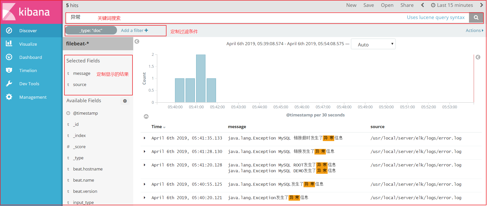


#### 5.3.2.3. DSL语句使用

##### 5.3.2.3.1. Query DSL结构化查询介绍

Query DSL是一个Java开源框架用于构建类型安全的SQL查询语句。采用API代替传统的拼接字符串来构造查询语句。目前Querydsl支持的平台包括JPA,JDO，SQL，Java Collections，RDF，Lucene，Hibernate Search。elasticsearch提供了一整套基于JSON的查询DSL语言来定义查询。
Query DSL当作是一系列的抽象的查询表达式树(AST)特定查询能够包含其它的查询，(如 bool ), 有些查询能够包含过滤器(如 constant_score), 还有的可以同时包含查询和过滤器 (如 filtered). 都能够从ES支持查询集合里面选择任意一个查询或者是从过滤器集合里面挑选出任意一个过滤器, 这样的话，我们就可以构造出任意复杂（maybe 非常有趣）的查询了。


##### 5.3.2.3.2. 索引操作

查询所有索引

```properties
GET /_cat/indices?v
```

(2)删除某个索引

```properties
DELETE /skuinfo
```

(3)新增索引（新增后不可修改）

```properties
PUT /user
```

(4)新增索引以及对应映射（新增后不可修改）

```properties
PUT /user/
{
  "properties": {
    "name":{
      "type": "text",
      "analyzer": "ik_smart",
      "search_analyzer": "ik_smart",
      "store": false
    },
    "city":{
      "type": "text",
      "analyzer": "ik_smart",
      "search_analyzer": "ik_smart",
      "store": false
    },
    "age":{
      "type": "long",
      "store": false
    },
    "description":{
      "type": "text",
      "analyzer": "ik_smart",
      "search_analyzer": "ik_smart",
      "store": false
    }
  }
}
```

(5)新增文档数据

```properties
PUT /user/_doc/1
{
  "name":"李四",
  "age":22,
  "city":"深圳",
  "description":"李四来自湖北武汉！"
}
```

我们再增加3条记录：

```properties
# #新增文档数据 id=2
PUT /user/_doc/2
{
  "name":"王五",
  "age":35,
  "city":"深圳",
  "description":"王五家住在深圳！"
}

# #新增文档数据 id=3
PUT /user/_doc/3
{
  "name":"张三",
  "age":19,
  "city":"深圳",
  "description":"在深圳打工，来自湖北武汉"
}

# #新增文档数据 id=4
PUT /user/_doc/4
{
  "name":"张三丰",
  "age":66,
  "city":"武汉",
  "description":"在武汉读书，家在武汉！"
}

# #新增文档数据 id=5
PUT /user/_doc/5
{
  "name":"赵子龙",
  "age":77,
  "city":"广州",
  "description":"赵子龙来自深圳宝安，但是在广州工作！",
  "address":"广东省茂名市"
}

# #新增文档数据 id=6
PUT /user/_doc/6
{
  "name":"赵毅",
  "age":55,
  "city":"广州",
  "description":"赵毅来自广州白云区，从事电子商务8年！"
}

# #新增文档数据 id=7
PUT /user/_doc/7
{
  "name":"赵哈哈",
  "age":57,
  "city":"武汉",
  "description":"武汉赵哈哈，在深圳打工已有半年了，月薪7500！"
}
```


```
POST /user/_search
{
  "query": {
    "match_all": {}
  }
}
```

(6)修改数据

**a.替换操作**

更新数据可以使用之前的增加操作,这种操作会将整个数据替换掉，代码如下：

```properties
# #更新数据,id=4
PUT /user/_doc/4
{
  "name":"张三丰",
  "description":"在武汉读书，家在武汉！在深圳工作！"
}
```

使用GET命令查看：

```properties
# #根据ID查询
GET /user/_doc/4
```


**b.更新操作**

我们先使用下面命令恢复数据：

```properties
# #恢复文档数据 id=4
PUT /user/_doc/4
{
  "name":"张三丰",
  "age":66,
  "city":"武汉",
  "description":"在武汉读书，家在武汉！"
}
```

使用POST更新某个列的数据（Elasticsearch7.9.2）

```properties
# #使用POST更新某个域的数据
POST /user/_update/4/
{
  "doc":{
    "name":"张三丰修改",
    "description":"在武汉读书，家在武汉！在深圳工作！"
  }
}
```

使用GET命令查看：

```properties
# #根据ID查询
GET /user/_doc/4
```

(7)删除Document

```properties
# #删除数据
DELETE user/_doc/7
```

##### 5.3.2.3.3. 数据查询

(1)查询所有数据

```properties
# #查询所有
GET /user/_search

GET /user/_search
{
  "query": {
    "match_all": {}
  }
}

POST /user/_search

POST /user/_search
{
  "query": {
    "match_all": {}
  }
}
```

(2)根据ID查询

```properties
# #根据ID查询
GET /user/_doc/2
```

(3)Sort排序

```properties
# #搜索排序
GET /user/_search
{
  "query":{
    "match_all": {}
  },
  "sort":{
    "age":{
      "order":"desc"
    }
  }
}
```

(4)分页

```properties
# #分页实现
GET /user/_search
{
  "query":{
    "match_all": {}
  },
  "sort":{
    "age":{
      "order":"desc"
    }
  },
  "from": 0,
  "size": 2
}
```

解释：

from:从下N的记录开始查询

size:每页显示条数

##### 5.3.2.3.4. 过滤查询

(1)term过滤

term主要用于分词精确匹配，如字符串、数值、日期等（不适合情况：1.列中除英文字符外有其它值 2.字符串值中有冒号或中文 3.系统自带属性如_version） 

如下案例：

```properties
# #过滤查询-term----GET _search也可以
GET /user/_search
{
  "query":{
    "term":{
      "city":"武汉"
    }
  }
}
```

(2)terms 过滤

terms 跟 term 有点类似，但 terms 允许指定多个匹配条件。 如果某个字段指定了多个值，那么文档需要一起去做匹配 。

案例如下：

```properties
# #过滤查询-terms 允许多个Term
GET /user/_search
{
  "query":{
    "terms":{
      "city":
        [
          "武汉",
          "广州"
        ]
    }
  }
}
```

(3) range 过滤

range过滤允许我们按照指定范围查找一批数据。例如我们查询年龄范围

案例如下：

```properties
# #过滤-range 范围过滤
# #gt表示> gte表示=>
# #lt表示< lte表示<=
GET _search
{
  "query":{
    "range": {
      "age": {
        "gte": 30,
        "lte": 57
      }
    }
  }
}
```

(4)exists过滤

exists 过滤可以用于查找拥有某个域的数据 

案例如下：

```json
# #过滤搜索 exists：是指包含某个域的数据检索
GET _search
{
  "query": {
    "exists":{
      "field":"address"
    }
  }
}
```

(5) bool 过滤

bool 过滤可以用来合并多个过滤条件查询结果的布尔逻辑，它包含一下操作符：

- must : 多个查询条件的完全匹配,相当于 and。
- must_not : 多个查询条件的相反匹配，相当于 not。
- should : 至少有一个查询条件匹配, 相当于 or。

这些参数可以分别继承一个过滤条件或者一个过滤条件的数组：

案例如下：

```properties
# #过滤搜索 bool 
# #must : 多个查询条件的完全匹配,相当于 and。
# #must_not : 多个查询条件的相反匹配，相当于 not。
# #should : 至少有一个查询条件匹配, 相当于 or。
GET _search
{
  "query": {
    "bool": {
      "must": [
        {
          "term": {
            "city": {
              "value": "深圳"
            }
          }
        },
        {
          "range":{
            "age":{
              "gte":20,
              "lte":99
            }
          }
        }
      ]
    }
  }
}
```

(6) match_all 查询

可以查询到所有文档，是没有查询条件下的默认语句。 

案例如下：

```properties
# #查询所有 match_all
GET _search
{
  "query": {
    "match_all": {}
  }
}
```

(7) match 查询

match查询是一个标准查询，不管你需要全文本查询还是精确查询基本上都要用到它。

如果你使用 match 查询一个全文本字段，它会在真正查询之前用分析器先分析match一下查询字符：

案例如下：

```properties
# #字符串匹配
GET _search
{
  "query": {
    "match": {
      "description": "武汉"
    }
  }
}
```

(8)prefix 查询

以什么字符开头的，可以更简单地用 prefix ,例如查询所有以张开始的用户描述

案例如下：

```properties
# #前缀匹配 prefix
GET _search
{
  "query": {
    "prefix": {
      "name": {
        "value": "赵"
      }
    }
  }
}
```


(9)multi_match 查询

multi_match查询允许你做match查询的基础上同时搜索多个字段，在多个字段中同时查一个 

案例如下：

```properties
# #多个域匹配搜索
GET _search
{
  "query": {
    "multi_match": {
      "query": "深圳",
      "fields": [
        "city",
        "description"
      ]
    }
  }
}
```

##### 5.3.2.3.5. 完整DSL语句代码

```properties
# #查看所有索引
GET /_cat/indices?v

# #删除某个索引
DELETE /skuinfo

# #新增索引
PUT /user

# #创建映射
PUT /user/
{
  "properties": {
    "name":{
      "type": "text",
      "analyzer": "ik_smart",
      "search_analyzer": "ik_smart",
      "store": false
    },
    "city":{
      "type": "text",
      "analyzer": "ik_smart",
      "search_analyzer": "ik_smart",
      "store": false
    },
    "age":{
      "type": "long",
      "store": false
    },
    "description":{
      "type": "text",
      "analyzer": "ik_smart",
      "search_analyzer": "ik_smart",
      "store": false
    }
  }
}

# #新增文档数据 id=1
PUT /user/_doc/1
{
  "name":"李四",
  "age":22,
  "city":"深圳",
  "description":"李四来自湖北武汉！"
}

# #新增文档数据 id=2
PUT /user/_doc/2
{
  "name":"王五",
  "age":35,
  "city":"深圳",
  "description":"王五家住在深圳！"
}

# #新增文档数据 id=3
PUT /user/_doc/3
{
  "name":"张三",
  "age":19,
  "city":"深圳",
  "description":"在深圳打工，来自湖北武汉"
}

# #新增文档数据 id=4
PUT /user/_doc/4
{
  "name":"张三丰",
  "age":66,
  "city":"武汉",
  "description":"在武汉读书，家在武汉！"
}

# #新增文档数据 id=5
PUT /user/_doc/5
{
  "name":"赵子龙",
  "age":77,
  "city":"广州",
  "description":"赵子龙来自深圳宝安，但是在广州工作！",
  "address":"广东省茂名市"
}

# #新增文档数据 id=6
PUT /user/_doc/6
{
  "name":"赵毅",
  "age":55,
  "city":"广州",
  "description":"赵毅来自广州白云区，从事电子商务8年！"
}

# #新增文档数据 id=7
PUT /user/_doc/7
{
  "name":"赵哈哈",
  "age":57,
  "city":"武汉",
  "description":"武汉赵哈哈，在深圳打工已有半年了，月薪7500！"
}

# #更新数据,id=4
PUT /user/_doc/4
{
  "name":"张三丰",
  "description":"在武汉读书，家在武汉！在深圳工作！"
}


# #根据ID查询
GET /user/_doc/4

# #恢复文档数据 id=4
PUT /user/_doc/4
{
  "name":"张三丰",
  "age":66,
  "city":"武汉",
  "description":"在武汉读书，家在武汉！"
}

# #使用POST更新某个域的数据
POST /user/_update/4
{
  "doc":{
    "name":"张三丰",
    "description":"在武汉读书，家在武汉！在深圳工作！"
  }
}

# #根据ID查询
GET /user/_doc/4

# #删除数据
DELETE user/_doc/4

# #查询所有
GET /user/_search

# #根据ID查询
GET /user/_doc/2

# #搜索排序
GET /user/_search
{
  "query":{
    "match_all": {}
  },
  "sort":{
    "age":{
      "order":"desc"
    }
  }
}

# #分页实现
GET /user/_search
{
  "query":{
    "match_all": {}
  },
  "sort":{
    "age":{
      "order":"desc"
    }
  },
  "from": 0,
  "size": 2
}

# #过滤查询-term
GET _search
{
  "query":{
    "term":{
      "city":"武汉"
    }
  }
}

# #过滤查询-terms 允许多个Term
GET _search
{
  "query":{
    "terms":{
      "city":
        [
          "武汉",
          "广州"
        ]
    }
  }
}

# #过滤-range 范围过滤
# #gt表示> gte表示=>
# #lt表示< lte表示<=
GET _search
{
  "query":{
    "range": {
      "age": {
        "gte": 30,
        "lte": 57
      }
    }
  }
}


# #过滤搜索 exists：是指包含某个域的数据检索
GET _search
{
  "query": {
    "exists":{
      "field":"address"
    }
  }
}

# #过滤搜索 bool 
# #must : 多个查询条件的完全匹配,相当于 and。
# #must_not : 多个查询条件的相反匹配，相当于 not。
# #should : 至少有一个查询条件匹配, 相当于 or。
GET _search
{
  "query": {
    "bool": {
      "must": [
        {
          "term": {
            "city": {
              "value": "深圳"
            }
          }
        },
        {
          "range":{
            "age":{
              "gte":20,
              "lte":99
            }
          }
        }
      ]
    }
  }
}

# #查询所有 match_all
GET _search
{
  "query": {
    "match_all": {}
  }
}

# #字符串匹配
GET _search
{
  "query": {
    "match": {
      "description": "武汉"
    }
  }
}

# #前缀匹配 prefix
GET _search
{
  "query": {
    "prefix": {
      "name": {
        "value": "赵"
      }
    }
  }
}

# #多个域匹配搜索
GET _search
{
  "query": {
    "multi_match": {
      "query": "深圳",
      "fields": [
        "city",
        "description"
      ]
    }
  }
}
```

## 5.4. 数据导入ES

### 5.4.1. SpringData Elasticsearch介绍

#### 5.4.1.1. SpringData介绍

Spring Data是一个用于简化数据库访问，并支持云服务的开源框架。其主要目标是使得对数据的访问变得方便快捷，并支持map-reduce框架和云计算数据服务。 Spring Data可以极大的简化JPA的写法，可以在几乎不用写实现的情况下，实现对数据的访问和操作。除了CRUD外，还包括如分页、排序等一些常用的功能。

Spring Data的官网：http://projects.spring.io/spring-data/

#### 5.4.1.2. SpringData ES介绍

Spring Data ElasticSearch 基于 spring data API 简化 elasticSearch操作，将原始操作elasticSearch的客户端API 进行封装 。Spring Data为Elasticsearch项目提供集成搜索引擎。Spring Data Elasticsearch POJO的关键功能区域为中心的模型与Elastichsearch交互文档和轻松地编写一个存储库数据访问层。 官方网站：http://projects.spring.io/spring-data-elasticsearch/ 

### 5.4.2. 搜索工程搭建

创建搜索微服务工程，changgou-service-search,该工程主要提供搜索服务以及索引数据的更新操作。

(1)API工程搭建

首先创建search的API工程,在changgou-service-api中创建changgou-service-search-api，如下图：


pom.xml如下：

```xml
<?xml version="1.0" encoding="UTF-8"?>
<project xmlns="http://maven.apache.org/POM/4.0.0"
         xmlns:xsi="http://www.w3.org/2001/XMLSchema-instance"
         xsi:schemaLocation="http://maven.apache.org/POM/4.0.0 http://maven.apache.org/xsd/maven-4.0.0.xsd">
    <parent>
        <artifactId>changgou-service-api</artifactId>
        <groupId>com.changgou</groupId>
        <version>1.0-SNAPSHOT</version>
    </parent>
    <modelVersion>4.0.0</modelVersion>
    <artifactId>changgou-service-search-api</artifactId>

    <dependencies>
        <!--goods API依赖-->
        <dependency>
            <groupId>com.changgou</groupId>
            <artifactId>changgou-service-goods-api</artifactId>
            <version>1.0-SNAPSHOT</version>
        </dependency>
        <!--SpringDataES依赖-->
        <dependency>
            <groupId>org.springframework.boot</groupId>
            <artifactId>spring-boot-starter-data-elasticsearch</artifactId>
        </dependency>
    </dependencies>
</project>
```


(2)搜索微服务搭建

在changgou-service中搭建changgou-service-search微服务，并进行相关配置。

**pom.xml配置**

```xml
<?xml version="1.0" encoding="UTF-8"?>
<project xmlns="http://maven.apache.org/POM/4.0.0"
         xmlns:xsi="http://www.w3.org/2001/XMLSchema-instance"
         xsi:schemaLocation="http://maven.apache.org/POM/4.0.0 http://maven.apache.org/xsd/maven-4.0.0.xsd">
    <parent>
        <artifactId>changgou-service</artifactId>
        <groupId>com.changgou</groupId>
        <version>1.0-SNAPSHOT</version>
    </parent>
    <modelVersion>4.0.0</modelVersion>
    <artifactId>changgou-service-search</artifactId>

    <dependencies>
        <!--依赖search api-->
        <dependency>
            <groupId>com.changgou</groupId>
            <artifactId>changgou-service-search-api</artifactId>
            <version>1.0-SNAPSHOT</version>
        </dependency>
    </dependencies>

</project>
```


**application.yml配置**

```properties
server:
  port: 18085
spring:
  application:
    name: search
  data:
    elasticsearch:
      cluster-name: my-application
      cluster-nodes: 192.168.211.132:9300
eureka:
  client:
    service-url:
      defaultZone: http://127.0.0.1:7001/eureka
  instance:
    prefer-ip-address: true
feign:
  hystrix:
    enabled: true
# #超时配置
ribbon:
  ReadTimeout: 300000

hystrix:
  command:
    default:
      execution:
        isolation:
          thread:
            timeoutInMilliseconds: 10000
```

配置说明：

```properties
connection-timeout:服务连接超时时间
socket-connect：HTTP请求超时时间
ribbon.ReadTimeout: Feign请求读取数据超时时间
timeoutInMilliseconds：feign连接超时时间
cluster-name：Elasticsearch的集群节点名称，这里需要和Elasticsearch集群节点名称保持一致
cluster-nodes：Elasticsearch节点通信地址
```


(3)启动类

创建SearchApplication作为搜索微服务工程的启动类，代码如下：

```java
@SpringBootApplication(exclude={DataSourceAutoConfiguration.class})
@EnableEurekaClient
public class SearchApplication {

    public static void main(String[] args) {
        /**
        * Springboot整合Elasticsearch 在项目启动前设置一下的属性，防止报错
        * 解决netty冲突后初始化client时还会抛出异常
        * availableProcessors is already set to [12], rejecting [12]
        ***/
        System.setProperty("es.set.netty.runtime.available.processors", "false");
        SpringApplication.run(SearchApplication.class,args);
    }
}
```

分别创建对应的包，dao、service、controller，如下图：


### 5.4.3. 数据导入

现在需要将数据从数据库中查询出来，然后将数据导入到ES中。


数据导入流程如下：

```properties
1.请求search服务,调用数据导入地址
2.根据注册中心中的注册的goods服务的地址，使用Feign方式查询所有已经审核的Sku
3.使用SpringData Es将查询到的Sku集合导入到ES中
```


#### 5.4.3.1. 文档映射Bean创建

搜索商品的时候，会根据如下属性搜索数据,并且不是所有的属性都需要分词搜索，我们创建JavaBean，将JavaBean数据存入到ES中要以搜索条件和搜索展示结果为依据，部分关键搜索条件分析如下：

```properties
1.可能会根据商品名称搜素，而且可以搜索商品名称中的任意一个词语，所以需要分词
2.可能会根据商品分类搜索，商品分类不需要分词
3.可能会根据商品品牌搜索，商品品牌不需要分词
4.可能会根据商品商家搜索，商品商家不需要分词
5.可能根据规格进行搜索，规格时一个键值对结构，用Map
```

根据上面的分析，我们可以在changgou-service-search-api工程中创建com.changgou.search.pojo.SkuInfo，如下

```java
@Document(indexName = "skuinfo",type = "docs")
public class SkuInfo implements Serializable {
    //商品id，同时也是商品编号
    @Id
    private Long id;

    //SKU名称
    @Field(type = FieldType.Text, analyzer = "ik_smart")
    private String name;

    //商品价格，单位为：元
    @Field(type = FieldType.Double)
    private Long price;

    //库存数量
    private Integer num;

    //商品图片
    private String image;

    //商品状态，1-正常，2-下架，3-删除
    private String status;

    //创建时间
    private Date createTime;

    //更新时间
    private Date updateTime;

    //是否默认
    private String isDefault;

    //SPUID
    private Long spuId;

    //类目ID
    private Long categoryId;

    //类目名称
    @Field(type = FieldType.Keyword)
    private String categoryName;

    //品牌名称
    @Field(type = FieldType.Keyword)
    private String brandName;

    //规格
    private String spec;

    //规格参数
    private Map<String,Object> specMap;

	//...略
}
```


#### 5.4.3.2. 搜索审核通过Sku

修改changgou-service-goods微服务，添加搜索审核通过的Sku，供search微服务调用。下面都是针对goods微服务的操作。

修改SkuService接口，添加根据状态查询Sku方法，代码如下：

```java
/**
 * 根据状态查询SKU列表
 */
List<Sku> findByStatus(String status);
```


修改SkuServiceImpl，添加根据状态查询Sku实现方法，代码如下：

```java
/***
 * 根据状态查询SKU列表
 * @return
 */
@Override
public List<Sku> findByStatus(String status) {
    Sku sku = new Sku();
    sku.setStatus(status);
    return skuMapper.select(sku);
}
```


修改com.changgou.goods.controller.SkuController，添加根据审核状态查询Sku方法，代码如下：

```java
/***
 * 根据审核状态查询Sku
 * @param status
 * @return
 */
@GetMapping("/status/{status}")
public Result<List<Sku>> findByStatus(@PathVariable String status){
    List<Sku> list = skuService.findByStatus(status);
    return new Result<List<Sku>>(true,StatusCode.OK,"查询成功",list);
}
```


#### 5.4.3.3. Sku导入ES实现

(1) Feign配置

修改changgou-service-goods-api工程，在com.changgou.goods.feign.SkuFeign上添加findSkuList方法，代码如下：

```java
@FeignClient(name="goods")
@RequestMapping(value = "/sku")
public interface SkuFeign {

    /***
     * 根据审核状态查询Sku
     * @param status
     * @return
     */
    @GetMapping("/status/{status}")
    Result<List<Sku>> findByStatus(@PathVariable String status);
}
```


(2) Dao创建

修改changgou-service-search工程，创建com.changgou.search.dao.SkuEsMapper,该接口主要用于索引数据操作，主要使用它来实现将数据导入到ES索引库中，代码如下：

```java
@Repository
public interface SkuEsMapper extends ElasticsearchRepository<Sku,Long> {
}
```


(3) 服务层创建

修改changgou-service-search工程，创建com.changgou.search.service.SkuService,代码如下：

```java
public interface SkuService {

    /***
     * 导入SKU数据
     */
    void importSku();
}
```


修改changgou-service-search工程，创建com.changgou.search.service.impl.SkuServiceImpl,实现Sku数据导入到ES中，代码如下：

```java
@Service
public class SkuServiceImpl implements SkuService {

    @Autowired
    private SkuFeign skuFeign;

    @Autowired
    private SkuEsMapper skuEsMapper;

    /**
     * 导入sku数据到es
     */
    @Override
    public void importSku(){
        //调用changgou-service-goods微服务
        Result<List<Sku>> skuListResult = skuFeign.findByStatus("1");
        //将数据转成search.Sku
        List<SkuInfo> skuInfos=  JSON.parseArray(JSON.toJSONString(skuListResult.getData()),SkuInfo.class);
        for(SkuInfo skuInfo:skuInfos){
            Map<String, Object> specMap= JSON.parseObject(skuInfo.getSpec()) ;
            skuInfo.setSpecMap(specMap);
        }
        skuEsMapper.saveAll(skuInfos);
    }
}
```


(4)控制层配置

修改changgou-service-search工程，在com.changgou.search.controller.SkuController类中添加如下方法调用上述导入方法，代码如下：

```java
@RestController
@RequestMapping(value = "/search")
@CrossOrigin
public class SkuController {

    @Autowired
    private SkuService skuService;

    /**
     * 导入数据
     * @return
     */
    @GetMapping("/import")
    public Result search(){
        skuService.importSku();
        return new Result(true, StatusCode.OK,"导入数据到索引库中成功！");
    }
}
```


(5)修改启动类

启动类中需要开启Feign客户端，并且需要添加ES包扫描，代码如下：

```java
@SpringBootApplication(exclude={DataSourceAutoConfiguration.class})
@EnableEurekaClient
@EnableFeignClients(basePackages = "com.changgou.goods.feign")
@EnableElasticsearchRepositories(basePackages = "com.changgou.search.dao")
public class SearchApplication {

    public static void main(String[] args) {
        /**
        * Springboot整合Elasticsearch 在项目启动前设置一下的属性，防止报错
        * 解决netty冲突后初始化client时还会抛出异常
        * java.lang.IllegalStateException: availableProcessors is already set to [12], rejecting [12]
        ***/
        System.setProperty("es.set.netty.runtime.available.processors", "false");
        SpringApplication.run(SearchApplication.class,args);
    }
}
```


(6)测试

调用http://localhost:18085/search/import进行测试

打开es-head可以看到如下数据：


## 5.5. 关键字搜索


我们先使用SpringDataElasticsearch实现一个简单的搜索功能，先实现根据关键字搜索，从上面搜索图片可以看得到，每次搜索的时候，除了关键字外，还有可能有品牌、分类、规格等，后台接收搜索条件使用Map接收比较合适。


### 5.5.1. 服务层实现

修改search服务的com.changgou.search.service.SkuService,添加搜索方法，代码如下：

```java
/***
 * 搜索
 * @param searchMap
 * @return
 */
Map search(Map<String, String> searchMap);
```


修改search服务的com.changgou.search.service.impl.SkuServiceImpl,添加搜索实现方法,代码如下：

```java
@Autowired
private ElasticsearchTemplate esTemplate;

public Map search(Map<String, String> searchMap) {

    //1.获取关键字的值
    String keywords = searchMap.get("keywords");

    if (StringUtils.isEmpty(keywords)) {
        keywords = "华为";//赋值给一个默认的值
    }
    //2.创建查询对象 的构建对象
    NativeSearchQueryBuilder nativeSearchQueryBuilder = new NativeSearchQueryBuilder();

    //3.设置查询的条件

    nativeSearchQueryBuilder.withQuery(QueryBuilders.matchQuery("name", keywords));

    //4.构建查询对象
    NativeSearchQuery query = nativeSearchQueryBuilder.build();

    //5.执行查询
    AggregatedPage<SkuInfo> skuPage = esTemplate.queryForPage(query, SkuInfo.class);

    
    //6.返回结果
    Map resultMap = new HashMap<>();    
    resultMap.put("rows", skuPage.getContent());
    resultMap.put("total", skuPage.getTotalElements());
    resultMap.put("totalPages", skuPage.getTotalPages());

    return resultMap;
}
```


### 5.5.2. 控制层实现

修改com.changgou.search.controller.SkuController，在控制层调用Service层即可，代码如下：

```java
/**
 * 搜索
 * @param searchMap
 * @return
 */
@PostMapping
public Map search(@RequestBody(required = false) Map searchMap){
    return  skuService.search(searchMap);
}
```


### 5.5.3. 测试

使用Postman工具，输入http://localhost:18085/search

选中POST提交


## 5.6. 分类统计

### 5.6.1. 分类统计分析

看下面的SQL语句，我们在执行搜索的时候，第1条SQL语句是执行搜，第2条语句是根据分类名字分组查看有多少分类，大概执行了2个步骤就可以获取数据结果以及分类统计，我们可以发现他们的搜索条件完全一样。

```sql
-- 查询所有
SELECT * FROM tb_sku WHERE name LIKE '%手机%';
-- 根据分类名字分组查询
SELECT category_name FROM  tb_sku WHERE name LIKE '%手机%' GROUP BY category_name;
```


我们每次执行搜索的时候，需要显示商品分类名称，这里要显示的分类名称其实就是符合搜素条件的所有商品的分类集合，我们可以按照上面的实现思路，使用ES根据分组名称做一次分组查询即可实现。


### 5.6.2. 分类分组统计实现

修改search微服务的com.changgou.search.service.impl.SkuServiceImpl类，整体代码如下：

```java
public Map search(Map<String, String> searchMap) {

    //1.获取关键字的值
    String keywords = searchMap.get("keywords");

    if (StringUtils.isEmpty(keywords)) {
        keywords = "华为";//赋值给一个默认的值
    }
    //2.创建查询对象 的构建对象
    NativeSearchQueryBuilder nativeSearchQueryBuilder = new NativeSearchQueryBuilder();

    //3.设置查询的条件

    //设置分组条件  商品分类
    nativeSearchQueryBuilder.addAggregation(AggregationBuilders.terms("skuCategorygroup").field("categoryName").size(50));
    nativeSearchQueryBuilder.withQuery(QueryBuilders.matchQuery("name", keywords));

    //4.构建查询对象
    NativeSearchQuery query = nativeSearchQueryBuilder.build();

    //5.执行查询
    AggregatedPage<SkuInfo> skuPage = esTemplate.queryForPage(query, SkuInfo.class);

    //获取分组结果
    StringTerms stringTerms = (StringTerms) skuPage.getAggregation("skuCategorygroup");

    List<String> categoryList = new ArrayList<>();

    if (stringTerms != null) {
        for (StringTerms.Bucket bucket : stringTerms.getBuckets()) {
            String keyAsString = bucket.getKeyAsString();//分组的值
            categoryList.add(keyAsString);
        }
    }
    //6.返回结果
    Map resultMap = new HashMap<>();
    resultMap.put("categoryList", categoryList);
    resultMap.put("rows", skuPage.getContent());
    resultMap.put("total", skuPage.getTotalElements());
    resultMap.put("totalPages", skuPage.getTotalPages());

    return resultMap;
}
```

添加的代码如下:


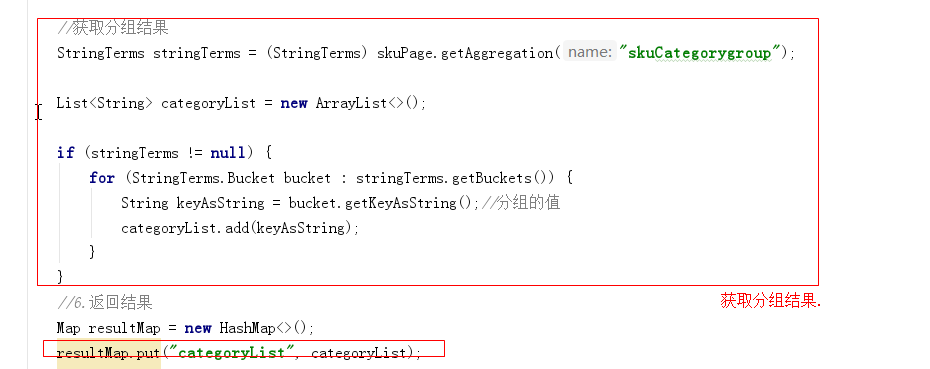


### 5.6.3. 测试

请求http://localhost:18086/search


### 5.6.4. 代码优化

如上,可以将获取分组的代码进行提取,如下代码所示:

```java
/**
 * 获取分类列表数据
 *
 * @param stringTerms
 * @return
 */
private List<String> getStringsCategoryList(StringTerms stringTerms) {
    List<String> categoryList = new ArrayList<>();
    if (stringTerms != null) {
        for (StringTerms.Bucket bucket : stringTerms.getBuckets()) {
            String keyAsString = bucket.getKeyAsString();//分组的值
            categoryList.add(keyAsString);
        }
    }
    return categoryList;
}
```


在search方法中进行调用:


```java
List<String> categoryList = getStringsCategoryList(stringTermsCategory);
```


整体代码如下:

```java
public Map search(Map<String, String> searchMap) {

    //1.获取关键字的值
    String keywords = searchMap.get("keywords");

    if (StringUtils.isEmpty(keywords)) {
        keywords = "华为";//赋值给一个默认的值
    }
    //2.创建查询对象 的构建对象
    NativeSearchQueryBuilder nativeSearchQueryBuilder = new NativeSearchQueryBuilder();

    //3.设置查询的条件

    //设置分组条件  商品分类
    nativeSearchQueryBuilder.addAggregation(AggregationBuilders.terms("skuCategorygroup").field("categoryName").size(50));
    nativeSearchQueryBuilder.withQuery(QueryBuilders.matchQuery("name", keywords));

    //4.构建查询对象
    NativeSearchQuery query = nativeSearchQueryBuilder.build();

    //5.执行查询
    AggregatedPage<SkuInfo> skuPage = esTemplate.queryForPage(query, SkuInfo.class);

    //获取分组结果
    StringTerms stringTermsCategory = (StringTerms) skuPage.getAggregation("skuCategorygroup");

    List<String> categoryList =getStringsCategoryList(stringTermsCategory);
    //6.返回结果
    Map resultMap = new HashMap<>();
    resultMap.put("categoryList", categoryList);
    resultMap.put("rows", skuPage.getContent());
    resultMap.put("total", skuPage.getTotalElements());
    resultMap.put("totalPages", skuPage.getTotalPages());

    return resultMap;
}

private List<String> getStringsCategoryList(StringTerms stringTerms) {
    List<String> categoryList = new ArrayList<>();
    if (stringTerms != null) {
        for (StringTerms.Bucket bucket : stringTerms.getBuckets()) {
            String keyAsString = bucket.getKeyAsString();//分组的值
            categoryList.add(keyAsString);
        }
    }
    return categoryList;
}
```

# 6. 商品搜索（高级搜索）

**学习目标**

- 条件筛选
- 多条件搜索[品牌、规格条件搜索]
- 规格过滤
- 价格区间搜索
- 搜索分页
- 搜索排序
- 搜索高亮


## 6.1. 品牌统计


用户搜索的时候，除了使用分类搜索外，还有可能使用品牌搜索，所以我们还需要显示品牌数据和规格数据，品牌数据和规格数据的显示比较容易，都可以考虑使用分类统计的方式进行分组实现。


### 6.1.1. 品牌统计分析

看下面的SQL语句，我们在执行搜索的时候，第1条SQL语句是执行搜，第2条语句是根据品牌名字分组查看有多少品牌，大概执行了2个步骤就可以获取数据结果以及品牌统计，我们可以发现他们的搜索条件完全一样。

```sql
-- 查询所有
SELECT * FROM tb_sku WHERE name LIKE '%手机%';
-- 根据品牌名字分组查询
SELECT brand_name FROM  tb_sku WHERE name LIKE '%手机%' GROUP BY brand_name;
```

我们每次执行搜索的时候，需要显示商品品牌名称，这里要显示的品牌名称其实就是符合搜素条件的所有商品的品牌集合，我们可以按照上面的实现思路，使用ES根据分组名称做一次分组查询即可实现。


### 6.1.2. 品牌分组统计实现

修改search微服务的com.changgou.search.service.impl.SkuServiceImpl类，添加一个品牌分组搜索,如图:


添加的代码如下:

```
//设置分组条件  商品品牌
nativeSearchQueryBuilder.addAggregation(AggregationBuilders.terms("skuBrandgroup").field("brandName").size(50));
```


执行获取分组结果:


整体代码如下：

```java
public Map search(Map<String, String> searchMap) {

    //1.获取关键字的值
    String keywords = searchMap.get("keywords");

    if (StringUtils.isEmpty(keywords)) {
        keywords = "华为";//赋值给一个默认的值
    }
    //2.创建查询对象 的构建对象
    NativeSearchQueryBuilder nativeSearchQueryBuilder = new NativeSearchQueryBuilder();

    //3.设置查询的条件

    //设置分组条件  商品分类
    nativeSearchQueryBuilder.addAggregation(AggregationBuilders.terms("skuCategorygroup").field("categoryName").size(50));

    //设置分组条件  商品品牌
    nativeSearchQueryBuilder.addAggregation(AggregationBuilders.terms("skuBrandgroup").field("brandName").size(50));


    nativeSearchQueryBuilder.withQuery(QueryBuilders.matchQuery("name", keywords));

    //4.构建查询对象
    NativeSearchQuery query = nativeSearchQueryBuilder.build();

    //5.执行查询
    AggregatedPage<SkuInfo> skuPage = esTemplate.queryForPage(query, SkuInfo.class);

    //获取分组结果  商品分类
    StringTerms stringTermsCategory = (StringTerms) skuPage.getAggregation("skuCategorygroup");
    //获取分组结果  商品品牌
    StringTerms stringTermsBrand = (StringTerms) skuPage.getAggregation("skuBrandgroup");


    List<String> categoryList = getStringsCategoryList(stringTermsCategory);

    List<String> brandList = getStringsBrandList(stringTermsBrand);


    //6.返回结果
    Map resultMap = new HashMap<>();


    resultMap.put("categoryList", categoryList);
    resultMap.put("brandList", brandList);
    resultMap.put("rows", skuPage.getContent());
    resultMap.put("total", skuPage.getTotalElements());
    resultMap.put("totalPages", skuPage.getTotalPages());

    return resultMap;
}
/**
     * 获取品牌列表
     *
     * @param stringTermsBrand
     * @return
     */
private List<String> getStringsBrandList(StringTerms stringTermsBrand) {
    List<String> brandList = new ArrayList<>();
    if (stringTermsBrand != null) {
        for (StringTerms.Bucket bucket : stringTermsBrand.getBuckets()) {
            brandList.add(bucket.getKeyAsString());
        }
    }
    return brandList;
}

/**
     * 获取分类列表数据
     *
     * @param stringTerms
     * @return
     */
private List<String> getStringsCategoryList(StringTerms stringTerms) {
    List<String> categoryList = new ArrayList<>();
    if (stringTerms != null) {
        for (StringTerms.Bucket bucket : stringTerms.getBuckets()) {
            String keyAsString = bucket.getKeyAsString();//分组的值
            categoryList.add(keyAsString);
        }
    }
    return categoryList;
}

```


### 6.1.3. 测试

使用PostMan请求http://localhost:18086/search

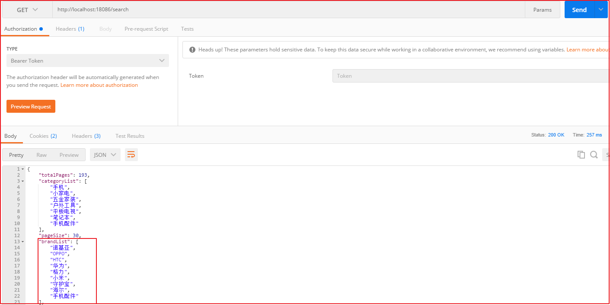


## 6.2. 规格统计


用户搜索的时候，除了使用分类、品牌搜索外，还有可能使用规格搜索，所以我们还需要显示规格数据，规格数据的显示相比上面2种实现略微较难一些，需要对数据进行处理，我们也可以考虑使用分类统计和品牌统计的方式进行分组实现。


### 6.2.1. 规格统计分析

看下面的SQL语句，我们在执行搜索的时候，第1条SQL语句是执行搜，第2条语句是根据规格分组查看有多少规格，大概执行了2个步骤就可以获取数据结果以及规格统计，我们可以发现他们的搜索条件完全一样。

```sql
-- 查询所有
SELECT * FROM tb_sku WHERE name LIKE '%手机%';
-- 根据规格名字分组查询
SELECT spec FROM  tb_sku WHERE name LIKE '%手机%' GROUP BY spec;
```

上述SQL语句执行后的结果如下图：


获取到的规格数据我们发现有重复，不过也可以解决，解决思路如下：

```
1.获取所有规格数据
2.将所有规格数据转换成Map
3.定义一个Map<String,Set>,key是规格名字，防止重复所以用Map，valu是规格值，规格值有多个，所以用集合，为了防止规格重复，用Set去除重复
4.循环规格的Map，将数据填充到定义的Map<String,Set>中
```


我们每次执行搜索的时候，需要显示商品规格数据，这里要显示的规格数据其实就是符合搜素条件的所有商品的规格集合，我们可以按照上面的实现思路，使用ES根据分组名称做一次分组查询，并去除重复数据即可实现。


### 6.2.2. 规格统计分组实现

修改search微服务的com.changgou.search.service.impl.SkuServiceImpl类，添加一个规格分组搜索

如图:添加规格分组条件

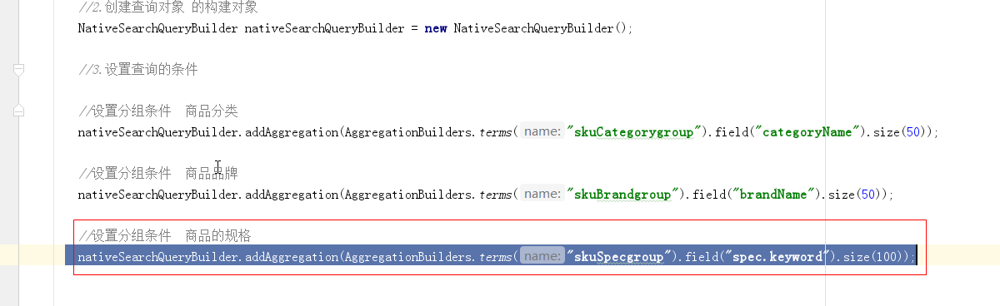

上图代码如下:

```
//设置分组条件  商品的规格
nativeSearchQueryBuilder.addAggregation(AggregationBuilders.terms("skuSpecgroup").field("spec.keyword").size(100));
```


如图:获取规格分组结果:

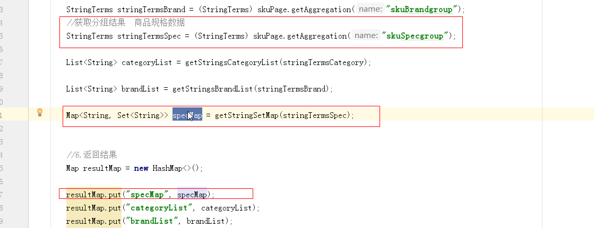


封装调用分组结果的方法:


上图代码如下:

```java
/**
 * 获取规格列表数据
 *
 * @param stringTermsSpec
 * @return
 */
private Map<String, Set<String>> getStringSetMap(StringTerms stringTermsSpec) {
    Map<String, Set<String>> specMap = new HashMap<String, Set<String>>();
    Set<String> specList = new HashSet<>();
    if (stringTermsSpec != null) {
        for (StringTerms.Bucket bucket : stringTermsSpec.getBuckets()) {
            specList.add(bucket.getKeyAsString());
        }
    }
    for (String specjson : specList) {
        Map<String, String> map = JSON.parseObject(specjson, Map.class);
        for (Map.Entry<String, String> entry : map.entrySet()) {//
            String key = entry.getKey();        //规格名字
            String value = entry.getValue();    //规格选项值
            //获取当前规格名字对应的规格数据
            Set<String> specValues = specMap.get(key);
            if (specValues == null) {
                specValues = new HashSet<String>();
            }
            //将当前规格加入到集合中
            specValues.add(value);
            //将数据存入到specMap中
            specMap.put(key, specValues);
        }
    }
    return specMap;
}
```


整体代码如下:

```java
public Map search(Map<String, String> searchMap) {

    //1.获取关键字的值
    String keywords = searchMap.get("keywords");

    if (StringUtils.isEmpty(keywords)) {
        keywords = "华为";//赋值给一个默认的值
    }
    //2.创建查询对象 的构建对象
    NativeSearchQueryBuilder nativeSearchQueryBuilder = new NativeSearchQueryBuilder();

    //3.设置查询的条件

    //设置分组条件  商品分类
    nativeSearchQueryBuilder.addAggregation(AggregationBuilders.terms("skuCategorygroup").field("categoryName").size(50));

    //设置分组条件  商品品牌
    nativeSearchQueryBuilder.addAggregation(AggregationBuilders.terms("skuBrandgroup").field("brandName").size(50));

    //设置分组条件  商品的规格
    nativeSearchQueryBuilder.addAggregation(AggregationBuilders.terms("skuSpecgroup").field("spec.keyword").size(100));


    nativeSearchQueryBuilder.withQuery(QueryBuilders.matchQuery("name", keywords));

    //4.构建查询对象
    NativeSearchQuery query = nativeSearchQueryBuilder.build();

    //5.执行查询
    AggregatedPage<SkuInfo> skuPage = esTemplate.queryForPage(query, SkuInfo.class);

    //获取分组结果  商品分类
    StringTerms stringTermsCategory = (StringTerms) skuPage.getAggregation("skuCategorygroup");
    //获取分组结果  商品品牌
    StringTerms stringTermsBrand = (StringTerms) skuPage.getAggregation("skuBrandgroup");
    //获取分组结果  商品规格数据
    StringTerms stringTermsSpec = (StringTerms) skuPage.getAggregation("skuSpecgroup");

    List<String> categoryList = getStringsCategoryList(stringTermsCategory);

    List<String> brandList = getStringsBrandList(stringTermsBrand);

    Map<String, Set<String>> specMap = getStringSetMap(stringTermsSpec);


    //6.返回结果
    Map resultMap = new HashMap<>();

    resultMap.put("specMap", specMap);
    resultMap.put("categoryList", categoryList);
    resultMap.put("brandList", brandList);
    resultMap.put("rows", skuPage.getContent());
    resultMap.put("total", skuPage.getTotalElements());
    resultMap.put("totalPages", skuPage.getTotalPages());

    return resultMap;
}

/**
     * 获取品牌列表
     *
     * @param stringTermsBrand
     * @return
     */
private List<String> getStringsBrandList(StringTerms stringTermsBrand) {
    List<String> brandList = new ArrayList<>();
    if (stringTermsBrand != null) {
        for (StringTerms.Bucket bucket : stringTermsBrand.getBuckets()) {
            brandList.add(bucket.getKeyAsString());
        }
    }
    return brandList;
}

/**
     * 获取分类列表数据
     *
     * @param stringTerms
     * @return
     */
private List<String> getStringsCategoryList(StringTerms stringTerms) {
    List<String> categoryList = new ArrayList<>();
    if (stringTerms != null) {
        for (StringTerms.Bucket bucket : stringTerms.getBuckets()) {
            String keyAsString = bucket.getKeyAsString();//分组的值
            categoryList.add(keyAsString);
        }
    }
    return categoryList;
}

/**
     * 获取规格列表数据
     *
     * @param stringTermsSpec
     * @return
     */
private Map<String, Set<String>> getStringSetMap(StringTerms stringTermsSpec) {
    Map<String, Set<String>> specMap = new HashMap<String, Set<String>>();
    Set<String> specList = new HashSet<>();
    if (stringTermsSpec != null) {
        for (StringTerms.Bucket bucket : stringTermsSpec.getBuckets()) {
            specList.add(bucket.getKeyAsString());
        }
    }
    for (String specjson : specList) {
        Map<String, String> map = JSON.parseObject(specjson, Map.class);
        for (Map.Entry<String, String> entry : map.entrySet()) {//
            String key = entry.getKey();        //规格名字
            String value = entry.getValue();    //规格选项值
            //获取当前规格名字对应的规格数据
            Set<String> specValues = specMap.get(key);
            if (specValues == null) {
                specValues = new HashSet<String>();
            }
            //将当前规格加入到集合中
            specValues.add(value);
            //将数据存入到specMap中
            specMap.put(key, specValues);
        }
    }
    return specMap;
}
```


### 6.2.3. 测试

使用Postman测试访问http://localhost:18086/search  效果如下：

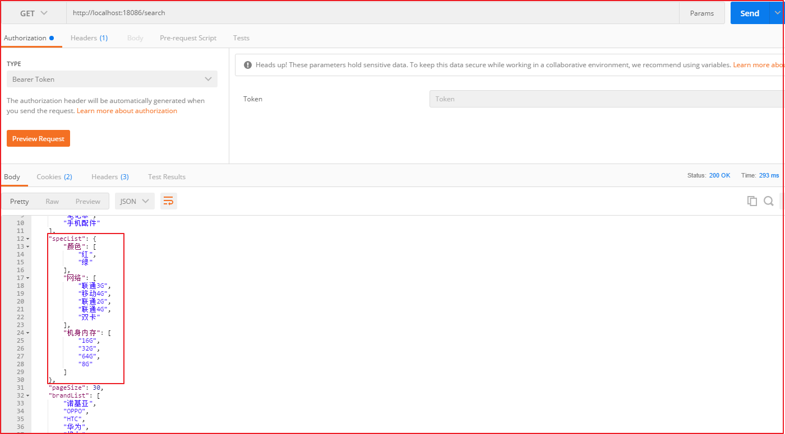


## 6.3. 条件筛选 


用户有可能会根据分类搜索、品牌搜索，还有可能根据规格搜索，以及价格搜索和排序操作。根据分类和品牌搜索的时候，可以直接根据指定域搜索，而规格搜索的域数据是不确定的，价格是一个区间搜索，所以我们可以分为三段时间，先实现分类、品牌搜素，再实现规格搜索，然后实现价格区间搜索。


### 6.3.1. 分类、品牌筛选

#### 6.3.1.1. 需求分析

页面每次向后台传入对应的分类和品牌，后台据分类和品牌进行条件过滤即可。


#### 6.3.1.2. 代码实现

修改搜索微服务com.changgou.search.service.impl.SkuServiceImpl的search方法，添加分类和品牌过滤,

添加过滤条件如下:


PS说明: 以上,我们建议使用filter ,它的搜索效率要优于must.可以参考官方文档说明:

https://www.elastic.co/guide/en/elasticsearch/reference/current/query-dsl-bool-query.html


执行过滤查询如下:

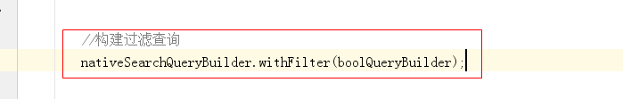


上图整体代码如下：

```java
@Override
public Map search(Map<String, String> searchMap) {

    //1.获取关键字的值
    String keywords = searchMap.get("keywords");

    if (StringUtils.isEmpty(keywords)) {
        keywords = "华为";//赋值给一个默认的值
    }
    //2.创建查询对象 的构建对象
    NativeSearchQueryBuilder nativeSearchQueryBuilder = new NativeSearchQueryBuilder();

    //3.设置查询的条件

    //设置分组条件  商品分类
    nativeSearchQueryBuilder.addAggregation(AggregationBuilders.terms("skuCategorygroup").field("categoryName").size(50));

    //设置分组条件  商品品牌
    nativeSearchQueryBuilder.addAggregation(AggregationBuilders.terms("skuBrandgroup").field("brandName").size(50));

    //设置分组条件  商品的规格
    nativeSearchQueryBuilder.addAggregation(AggregationBuilders.terms("skuSpecgroup").field("spec.keyword").size(1000));


    //设置主关键字查询
    nativeSearchQueryBuilder.withQuery(QueryBuilders.matchQuery("name", keywords));


    BoolQueryBuilder boolQueryBuilder = QueryBuilders.boolQuery();


    if (!StringUtils.isEmpty(searchMap.get("brand"))) {
        boolQueryBuilder.filter(QueryBuilders.termQuery("brandName", searchMap.get("brand")));
    }

    if (!StringUtils.isEmpty(searchMap.get("category"))) {
        boolQueryBuilder.filter(QueryBuilders.termQuery("categoryName", searchMap.get("category")));
    }

    //构建过滤查询
    nativeSearchQueryBuilder.withFilter(boolQueryBuilder);

    //4.构建查询对象
    NativeSearchQuery query = nativeSearchQueryBuilder.build();

    //5.执行查询
    AggregatedPage<SkuInfo> skuPage = esTemplate.queryForPage(query, SkuInfo.class);

    //获取分组结果  商品分类
    StringTerms stringTermsCategory = (StringTerms) skuPage.getAggregation("skuCategorygroup");
    //获取分组结果  商品品牌
    StringTerms stringTermsBrand = (StringTerms) skuPage.getAggregation("skuBrandgroup");
    //获取分组结果  商品规格数据
    StringTerms stringTermsSpec = (StringTerms) skuPage.getAggregation("skuSpecgroup");

    List<String> categoryList = getStringsCategoryList(stringTermsCategory);

    List<String> brandList = getStringsBrandList(stringTermsBrand);

    Map<String, Set<String>> specMap = getStringSetMap(stringTermsSpec);


    //6.返回结果
    Map resultMap = new HashMap<>();

    resultMap.put("specMap", specMap);
    resultMap.put("categoryList", categoryList);
    resultMap.put("brandList", brandList);
    resultMap.put("rows", skuPage.getContent());
    resultMap.put("total", skuPage.getTotalElements());
    resultMap.put("totalPages", skuPage.getTotalPages());

    return resultMap;
}
```


#### 6.3.1.3. 测试

测试效果如下：

访问地址：http://localhost:18085/search


此时只能搜到华为手环设备


### 6.3.2. 规格过滤

#### 6.3.2.1. 需求分析


规格这一块，需要向后台发送规格名字以及规格值，我们可以按照一定要求来发送数据，例如规格名字以特殊前缀提交到后台：`spec_网络制式：电信4G、spec_显示屏尺寸：4.0-4.9英寸`

后台接到数据后，可以根据前缀spec_来区分是否是规格，如果以`spec_xxx`开始的数据则为规格数据，需要根据指定规格找信息。

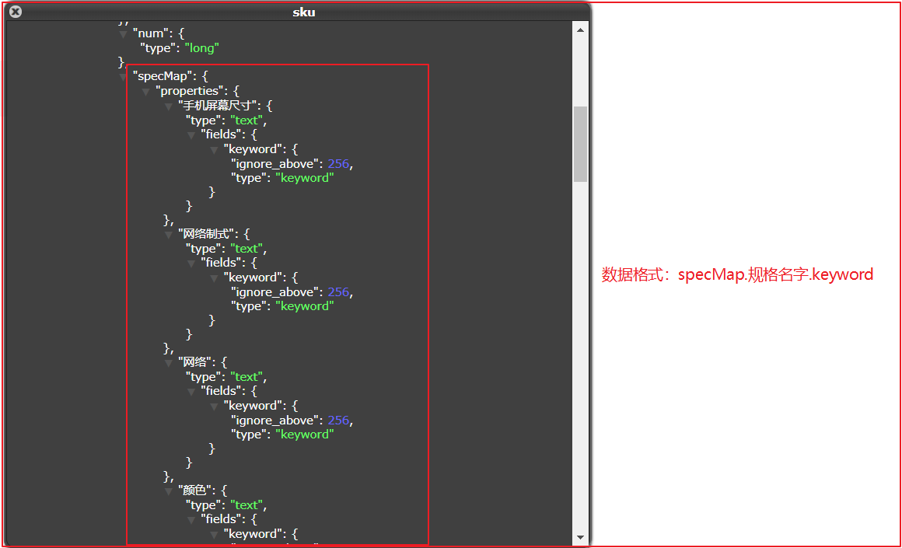

上图是规格的索引存储格式，真实数据在spechMap.规格名字.keyword中，所以找数据也是按照如下格式去找：

`spechMap.规格名字.keyword`

#### 6.3.2.2. 代码实现

修改com.changgou.search.service.impl.SkuServiceImpl的search方法，增加规格查询操作，代码如下：

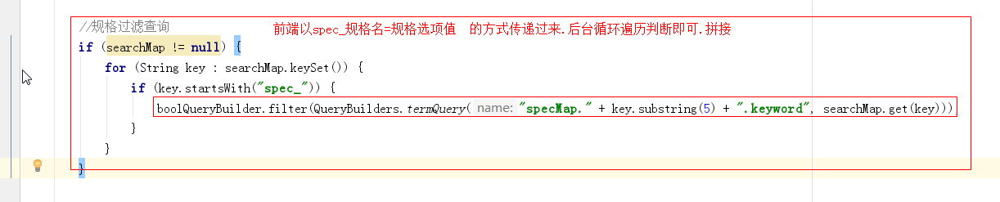


```java
//规格过滤查询
if (searchMap != null) {
    for (String key : searchMap.keySet()) {
        if (key.startsWith("spec_")) {
            boolQueryBuilder.filter(QueryBuilders.termQuery("specMap." + key.substring(5) + ".keyword", searchMap.get(key)));
        }
    }
}
```


#### 6.3.2.3. 测试

访问地址：http://localhost:18085/search

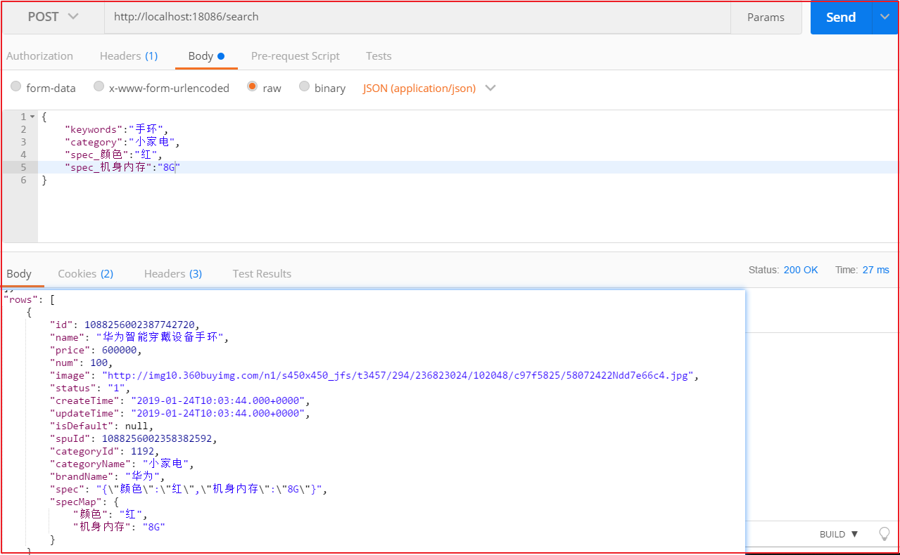


### 6.3.3. 价格区间查询

#### 6.3.3.1. 需求分析


价格区间查询，每次需要将价格传入到后台，前端传入后台的价格大概是`price=0-500`或者`price=500-1000`依次类推，最后一个是`price=3000`,后台可以根据-分割，如果分割得到的结果最多有2个，第1个表示`x<price`，第2个表示`price<=y`。


1.3.2 代码实现

修改com.changgou.search.service.impl.SkuServiceImpl的search方法，增加价格区间查询操作，代码如下：


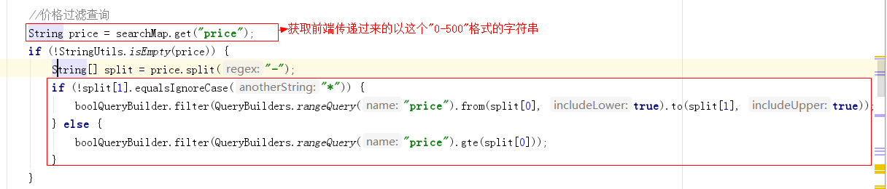


上图代码如下：

```java
//价格过滤查询
String price = searchMap.get("price");
if (!StringUtils.isEmpty(price)) {
    String[] split = price.split("-");
    if (!split[1].equalsIgnoreCase("*")) {
        boolQueryBuilder.filter(QueryBuilders.rangeQuery("price").from(split[0], true).to(split[1], true));
    } else {
        boolQueryBuilder.filter(QueryBuilders.rangeQuery("price").gte(split[0]));
    }
}
```


#### 6.3.3.2. 测试

访问地址：http://localhost:18085/search

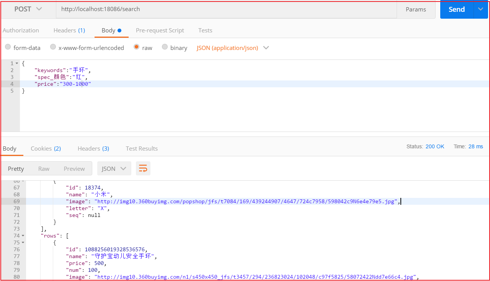

效果如下(部分数据)：

```json
 [
        {
            "id": 1088256019328536576,
            "name": "守护宝幼儿安全手环",
            "price": 500,
            "num": 100,
            "image": "http://img10.360buyimg.com/n1/s450x450_jfs/t3457/294/236823024/102048/c97f5825/58072422Ndd7e66c4.jpg",
            "status": "1",
            "createTime": "2019-01-24T10:03:48.000+0000",
            "updateTime": "2019-01-24T10:03:48.000+0000",
            "isDefault": null,
            "spuId": 1088256019315953664,
            "categoryId": 1108,
            "categoryName": "户外工具",
            "brandName": "守护宝",
            "spec": "{\"颜色\":\"红\",\"机身内存\":\"64G\"}",
            "specMap": {
                "颜色": "红",
                "机身内存": "64G"
            }
        },
        {
            "id": 1088256014043713536,
            "name": "计步器小米手环，适用老人、小孩",
            "price": 800,
            "num": 100,
            "image": "http://img10.360buyimg.com/n1/s450x450_jfs/t3457/294/236823024/102048/c97f5825/58072422Ndd7e66c4.jpg",
            "status": "1",
            "createTime": "2019-01-24T10:03:47.000+0000",
            "updateTime": "2019-01-24T10:03:47.000+0000",
            "isDefault": null,
            "spuId": 1088256014026936320,
            "categoryId": 1192,
            "categoryName": "小家电",
            "brandName": "小米",
            "spec": "{\"颜色\":\"红\",\"机身内存\":\"64G\"}",
            "specMap": {
                "颜色": "红",
                "机身内存": "64G"
            }
        }
    ]
```


## 6.4. 搜索分页

### 6.4.1. 分页分析


页面需要实现分页搜索，所以我们后台每次查询的时候，需要实现分页。用户页面每次会传入当前页和每页查询多少条数据，当然如果不传入每页显示多少条数据，默认查询30条即可。


### 6.4.2. 分页实现

分页使用PageRequest.of( pageNo- 1, pageSize);实现，第1个参数表示第N页，从0开始，第2个参数表示每页显示多少条，实现代码如下：


上图代码如下：

```java
 		//略

		//构建过滤查询
        nativeSearchQueryBuilder.withFilter(boolQueryBuilder);

        //构建分页查询
        Integer pageNum = 1;
        if (!StringUtils.isEmpty(searchMap.get("pageNum"))) {
            try {
                pageNum = Integer.valueOf(searchMap.get("pageNum"));
            } catch (NumberFormatException e) {
                e.printStackTrace();
                pageNum=1;
            }
        }
        Integer pageSize = 3;
        nativeSearchQueryBuilder.withPageable(PageRequest.of(pageNum - 1, pageSize));

		//略


        //4.构建查询对象
        NativeSearchQuery query = nativeSearchQueryBuilder.build();
		//略
```

测试如下:


## 6.5. 搜索排序

### 6.5.1. 排序分析


排序这里总共有根据价格排序、根据评价排序、根据新品排序、根据销量排序，排序要想实现非常简单，只需要告知排序的域以及排序方式即可实现。

价格排序：只需要根据价格高低排序即可，降序价格高->低，升序价格低->高

评价排序：评价分为好评、中评、差评，可以在数据库中设计3个列，用来记录好评、中评、差评的量，每次排序的时候，好评的比例来排序，当然还要有条数限制，评价条数需要超过N条。

新品排序：直接根据商品的发布时间或者更新时间排序。

销量排序：销量排序除了销售数量外，还应该要有时间段限制。


### 6.5.2. 排序实现

这里我们不单独针对某个功能实现排序，我们只需要在后台接收2个参数，分别是排序域名字和排序方式，代码如下：


解释: 前端页面传递要排序的字段(field)和要排序的类型(ASC,DESC),后台接收.


上图代码如下：

```java
//构建排序查询
String sortRule = searchMap.get("sortRule");
String sortField = searchMap.get("sortField");
if (!StringUtils.isEmpty(sortRule) && !StringUtils.isEmpty(sortField)) {
    nativeSearchQueryBuilder.withSort(SortBuilders.fieldSort(sortField).order(sortRule.equals("DESC") ? SortOrder.DESC : SortOrder.ASC));
}
```

测试

根据价格降序：

```
{"keywords":"手机","pageNum":"1","sortRule":"DESC","sortField":"price"}
```

根据价格升序：

```
{"keywords":"手机","pageNum":"1","sortRule":"ASC","sortField":"price"}
```


## 6.6. 高亮显示

### 6.6.1. 高亮分析


高亮显示是指根据商品关键字搜索商品的时候，显示的页面对关键字给定了特殊样式，让它显示更加突出，如上图商品搜索中，关键字编程了红色，其实就是给定了红色样式。

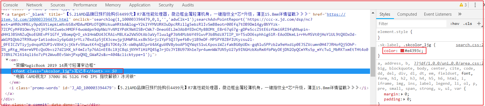


### 6.6.2. 高亮搜索实现步骤解析

将之前的搜索换掉，换成高亮搜索，我们需要做3个步骤：

```
1.指定高亮域，也就是设置哪个域需要高亮显示
  设置高亮域的时候，需要指定前缀和后缀，也就是关键词用什么html标签包裹，再给该标签样式
2.高亮搜索实现
3.将非高亮数据替换成高亮数据
```

第1点，例如在百度中搜索数据的时候，会有2个地方高亮显示，分别是标题和描述，商城搜索的时候，只是商品名称高亮显示了。而高亮显示其实就是添加了样式，例如`<span style="color:red;">笔记本</span>`,而其中span开始标签可以称为前缀，span结束标签可以称为后缀。

第2点，高亮搜索使用ElasticsearchTemplate实现。

第3点，高亮搜索后，会搜出非高亮数据和高亮数据，高亮数据会加上第1点中的高亮样式，此时我们需要将非高亮数据换成高亮数据即可。例如非高亮:`华为笔记本性能超强悍`  高亮数据：`华为<span style="color:red;"笔记本</span>性能超强悍`,将非高亮的换成高亮的，到页面就能显示样式了。


### 6.6.3. 高亮代码实现

修改com.changgou.search.service.impl.SkuServiceImpl的search方法搜索代码，添加高亮显示的域:

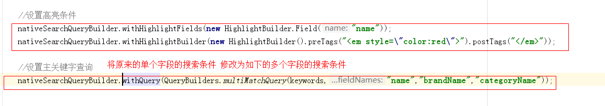

上图代码如下：

```java
 //设置高亮条件
        nativeSearchQueryBuilder.withHighlightFields(new HighlightBuilder.Field("name"));
        nativeSearchQueryBuilder.withHighlightBuilder(new HighlightBuilder().preTags("<em style=\"color:red\">").postTags("</em>"));

        //设置主关键字查询
        nativeSearchQueryBuilder.withQuery(QueryBuilders.multiMatchQuery(keywords,"name","brandName","categoryName"));
```


修改 查询的方法,自定义结果映射器,入下图:

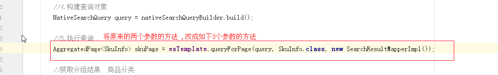


上图图片如下:

```
AggregatedPage<SkuInfo> skuPage = esTemplate.queryForPage(query, SkuInfo.class, new SearchResultMapperImpl());
```


自定义一个映射结果类实现接口,作用就是:自定义映射结果集,获取高亮的数据展示,如下图:


代码如下:

```java
public class SearchResultMapperImpl implements SearchResultMapper {
    @Override
    public <T> AggregatedPage<T> mapResults(SearchResponse response, Class<T> clazz, Pageable pageable) {
        List<T> content = new ArrayList<>();
        //如果没有结果返回为空
        if (response.getHits() == null || response.getHits().getTotalHits() <= 0) {
            return new AggregatedPageImpl<T>(content);
        }
        for (SearchHit searchHit : response.getHits()) {
            String sourceAsString = searchHit.getSourceAsString();
            SkuInfo skuInfo = JSON.parseObject(sourceAsString, SkuInfo.class);

            Map<String, HighlightField> highlightFields = searchHit.getHighlightFields();
            HighlightField highlightField = highlightFields.get("name");

            //有高亮则设置高亮的值
            if (highlightField != null) {
                StringBuffer stringBuffer = new StringBuffer();
                for (Text text : highlightField.getFragments()) {
                    stringBuffer.append(text.string());
                }
                skuInfo.setName(stringBuffer.toString());
            }
            content.add((T) skuInfo);
        }


        return new AggregatedPageImpl<T>(content, pageable, response.getHits().getTotalHits(), response.getAggregations(), response.getScrollId());
    }
}
```


### 6.6.4. 测试

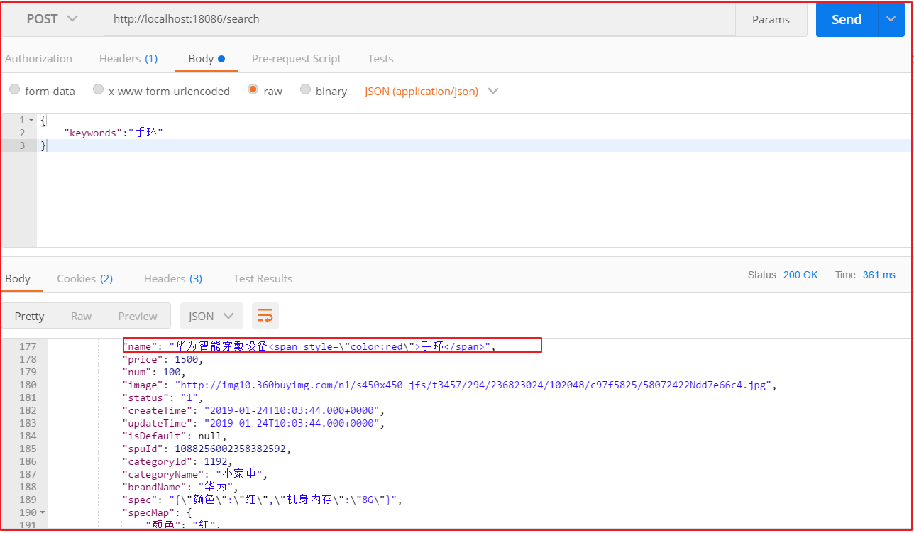

效果如下：

```
"name": "HTC M8Sd (E8) 波尔多红 电信4G<span style=\"color:red\">手机</span> 双卡双待双通",
```


整体代码如下:

```java
@Service
public class SkuServiceImpl implements SkuService {
    @Autowired
    private SkuEsMapper skuEsMapper;

    @Autowired
    private SkuFeign skuFeign;

    @Override
    public void importSku() {
        Result<List<Sku>> listResult = skuFeign.findByStatus("1");

        List<Sku> data = listResult.getData();

        List<SkuInfo> skuInfos = JSON.parseArray(JSON.toJSONString(data), SkuInfo.class);

        for (SkuInfo skuInfo : skuInfos) {
            String spec = skuInfo.getSpec();
            Map map = JSON.parseObject(spec, Map.class);
            skuInfo.setSpecMap(map);
        }

        skuEsMapper.saveAll(skuInfos);
    }

    @Autowired
    private ElasticsearchTemplate esTemplate;

    /**
* @param searchMap
* @return
*/
    @Override
    public Map search(Map<String, String> searchMap) {

        //1.获取关键字的值
        String keywords = searchMap.get("keywords");

        if (StringUtils.isEmpty(keywords)) {
            keywords = "华为";//赋值给一个默认的值
        }
        //2.创建查询对象 的构建对象
        NativeSearchQueryBuilder nativeSearchQueryBuilder = new NativeSearchQueryBuilder();

        //3.设置查询的条件

        //设置分组条件  商品分类
        nativeSearchQueryBuilder.addAggregation(AggregationBuilders.terms("skuCategorygroup").field("categoryName").size(50));

        //设置分组条件  商品品牌
        nativeSearchQueryBuilder.addAggregation(AggregationBuilders.terms("skuBrandgroup").field("brandName").size(50));

        //设置分组条件  商品的规格
        nativeSearchQueryBuilder.addAggregation(AggregationBuilders.terms("skuSpecgroup").field("spec.keyword").size(500000));


        //设置高亮条件
        nativeSearchQueryBuilder.withHighlightFields(new HighlightBuilder.Field("name"));
        nativeSearchQueryBuilder.withHighlightBuilder(new HighlightBuilder().preTags("<em style=\"color:red\">").postTags("</em>"));

        //设置主关键字查询
        nativeSearchQueryBuilder.withQuery(QueryBuilders.multiMatchQuery(keywords,"name","brandName","categoryName"));


        BoolQueryBuilder boolQueryBuilder = QueryBuilders.boolQuery();


        if (!StringUtils.isEmpty(searchMap.get("brand"))) {
            boolQueryBuilder.filter(QueryBuilders.termQuery("brandName", searchMap.get("brand")));
        }

        if (!StringUtils.isEmpty(searchMap.get("category"))) {
            boolQueryBuilder.filter(QueryBuilders.termQuery("categoryName", searchMap.get("category")));
        }

        //规格过滤查询
        if (searchMap != null) {
            for (String key : searchMap.keySet()) {
                if (key.startsWith("spec_")) {
                    boolQueryBuilder.filter(QueryBuilders.termQuery("specMap." + key.substring(5) + ".keyword", searchMap.get(key)));
                }
            }
        }

        //价格过滤查询
        String price = searchMap.get("price");
        if (!StringUtils.isEmpty(price)) {
            String[] split = price.split("-");
            if (!split[1].equalsIgnoreCase("*")) {
                boolQueryBuilder.filter(QueryBuilders.rangeQuery("price").from(split[0], true).to(split[1], true));
            } else {
                boolQueryBuilder.filter(QueryBuilders.rangeQuery("price").gte(split[0]));
            }
        }


        //构建过滤查询
        nativeSearchQueryBuilder.withFilter(boolQueryBuilder);

        //构建分页查询
        Integer pageNum = 1;
        if (!StringUtils.isEmpty(searchMap.get("pageNum"))) {
            try {
                pageNum = Integer.valueOf(searchMap.get("pageNum"));
            } catch (NumberFormatException e) {
                e.printStackTrace();
                pageNum=1;
            }
        }
        Integer pageSize = 3;
        nativeSearchQueryBuilder.withPageable(PageRequest.of(pageNum - 1, pageSize));


        //构建排序查询
        String sortRule = searchMap.get("sortRule");
        String sortField = searchMap.get("sortField");
        if (!StringUtils.isEmpty(sortRule) && !StringUtils.isEmpty(sortField)) {
            nativeSearchQueryBuilder.withSort(SortBuilders.fieldSort(sortField).order(sortRule.equals("DESC") ? SortOrder.DESC : SortOrder.ASC));
        }


        //4.构建查询对象
        NativeSearchQuery query = nativeSearchQueryBuilder.build();

        //5.执行查询
        AggregatedPage<SkuInfo> skuPage = esTemplate.queryForPage(query, SkuInfo.class, new SearchResultMapperImpl());

        //获取分组结果  商品分类
        StringTerms stringTermsCategory = (StringTerms) skuPage.getAggregation("skuCategorygroup");
        //获取分组结果  商品品牌
        StringTerms stringTermsBrand = (StringTerms) skuPage.getAggregation("skuBrandgroup");
        //获取分组结果  商品规格数据
        StringTerms stringTermsSpec = (StringTerms) skuPage.getAggregation("skuSpecgroup");

        List<String> categoryList = getStringsCategoryList(stringTermsCategory);

        List<String> brandList = getStringsBrandList(stringTermsBrand);

        Map<String, Set<String>> specMap = getStringSetMap(stringTermsSpec);


        //6.返回结果
        Map resultMap = new HashMap<>();

        resultMap.put("specMap", specMap);
        resultMap.put("categoryList", categoryList);
        resultMap.put("brandList", brandList);
        resultMap.put("rows", skuPage.getContent());
        resultMap.put("total", skuPage.getTotalElements());
        resultMap.put("totalPages", skuPage.getTotalPages());

        return resultMap;
    }

    /**
* 获取品牌列表
*
* @param stringTermsBrand
* @return
*/
    private List<String> getStringsBrandList(StringTerms stringTermsBrand) {
        List<String> brandList = new ArrayList<>();
        if (stringTermsBrand != null) {
            for (StringTerms.Bucket bucket : stringTermsBrand.getBuckets()) {
                brandList.add(bucket.getKeyAsString());
            }
        }
        return brandList;
    }

    /**
* 获取分类列表数据
*
* @param stringTerms
* @return
*/
    private List<String> getStringsCategoryList(StringTerms stringTerms) {
        List<String> categoryList = new ArrayList<>();
        if (stringTerms != null) {
            for (StringTerms.Bucket bucket : stringTerms.getBuckets()) {
                String keyAsString = bucket.getKeyAsString();//分组的值
                categoryList.add(keyAsString);
            }
        }
        return categoryList;
    }

    /**
* 获取规格列表数据
*
* @param stringTermsSpec
* @return
*/
    private Map<String, Set<String>> getStringSetMap(StringTerms stringTermsSpec) {
        Map<String, Set<String>> specMap = new HashMap<String, Set<String>>();

        Set<String> specList = new HashSet<>();

        if (stringTermsSpec != null) {
            for (StringTerms.Bucket bucket : stringTermsSpec.getBuckets()) {
                specList.add(bucket.getKeyAsString());
            }
        }

        for (String specjson : specList) {
            Map<String, String> map = JSON.parseObject(specjson, Map.class);
            for (Map.Entry<String, String> entry : map.entrySet()) {//
                String key = entry.getKey();        //规格名字
                String value = entry.getValue();    //规格选项值
                //获取当前规格名字对应的规格数据
                Set<String> specValues = specMap.get(key);
                if (specValues == null) {
                    specValues = new HashSet<String>();
                }
                //将当前规格加入到集合中
                specValues.add(value);
                //将数据存入到specMap中
                specMap.put(key, specValues);
            }
        }
        return specMap;
    }
}
```

