# 1. 框架搭建 

**学习目标**

- 了解电商
- 了解畅购架构
- 了解畅购工程结构
- 畅购工程搭建
- 商品微服务搭建
- 品牌增删改查


## 1.1. 走进电商

### 1.1.1. 电商行业分析

近年来，世界经济正向数字化转型，大力发展数字经济成为全球共识。党的十九大报告明确提出要建设“数字中国”“网络强国”，我国数字经济发展进入新阶段，市场规模位居全球第二，数字经济与实体经济深度融合，有力促进了供给侧结构性改革。电子商务是数字经济的重要组成部分，是数字经济最活跃、最集中的表现形式之一。2017年，在政府和市场共同推动下，我国电子商务发展更加注重效率、质量和创新，取得了一系列新的进展，在壮大数字经济、共建“一带一路”、助力乡村振兴、带动创新创业、促进经济转型升级等诸多方面发挥了重要作用，成为我国经济增长的新动力。
2017年，我国电子商务交易规模继续扩大，并保持高速增长态势。国家统计局数据显示，2017年全国电子商务交易额达29.16万亿元，同比增长11.7%；网上零售额7.18万亿元，同比增长32.2%。我国电子商务优势进一步扩大，网络零售规模全球最大、产业创新活力世界领先。数据显示，截止2017年底，全国网络购物用户规模达5.33亿，同比增长14.3%；非银行支付机构发生网络支付金额达143.26万亿元，同比增长44.32%；全国快递服务企业业务量累计完成400.6亿件，同比增长28%；电子商务直接从业人员和间接带动就业达4250万人。


2018天猫全天成交额记录


### 1.1.2. 电商系统技术特点

-  技术新

- 技术范围广

- 分布式

- 高并发、集群、负载均衡、高可用

- 海量数据

- 业务复杂

- 系统安全


### 1.1.3. 主要电商模式

**B2B**

```
B2B （ Business to Business）是指进行电子商务交易的供需双方都是商家（或企业、公司），她（他）们使用了互联网的技术或各种商务网络平台，完成商务交易的过程。电子商务是现代 B2B marketing的一种具体主要的表现形式。

案例：阿里巴巴、慧聪网
```


**C2C**

```
C2C即 Customer（Consumer） to Customer（Consumer），意思就是消费者个人间的电子商务行为。比如一个消费者有一台电脑，通过网络进行交易，把它出售给另外一个消费者，此种交易类型就称为C2C电子商务。

案例：淘宝、易趣、瓜子二手车
```


**B2C**

```
B2C是Business-to-Customer的缩写，而其中文简称为“商对客”。“商对客”是电子商务的一种模式，也就是通常说的直接面向消费者销售产品和服务商业零售模式。这种形式的电子商务一般以网络零售业为主，主要借助于互联网开展在线销售活动。B2C即企业通过互联网为消费者提供一个新型的购物环境——网上商店，消费者通过网络在网上购物、网上支付等消费行为。

案例：唯品会、乐蜂网
```


**C2B**

```
C2B（Consumer to Business，即消费者到企业），是互联网经济时代新的商业模式。这一模式改变了原有生产者（企业和机构）和消费者的关系，是一种消费者贡献价值（Create Value）， 企业和机构消费价值（Consume Value）。

C2B模式和我们熟知的供需模式（DSM, Demand SupplyModel）恰恰相反，真正的C2B 应该先有消费者需求产生而后有企业生产，即先有消费者提出需求，后有生产企业按需求组织生产。通常情况为消费者根据自身需求定制产品和价格，或主动参与产品设计、生产和定价，产品、价格等彰显消费者的个性化需求，生产企业进行定制化生产。

案例：海尔商城、 尚品宅配
```


**O2O**

```
O2O即Online To Offline（在线离线/线上到线下），是指将线下的商务机会与互联网结合，让互联网成为线下交易的平台，这个概念最早来源于美国。O2O的概念非常广泛，既可涉及到线上，又可涉及到线下,可以通称为O2O。主流商业管理课程均对O2O这种新型的商业模式有所介绍及关注。

案例：美团、饿了吗
```


**F2C**

```
F2C指的是Factory to customer，即从厂商到消费者的电子商务模式。
```


**B2B2C**

```
B2B2C是一种电子商务类型的网络购物商业模式，B是BUSINESS的简称，C是CUSTOMER的简称，第一个B指的是商品或服务的供应商，第二个B指的是从事电子商务的企业，C则是表示消费者。

案例：京东商城、天猫商城
注：我们《畅购电商系统开发》课程采用B2C模式，之后的项目实战《品优购电商系统开发实战》采用B2B2C模式。
```


## 1.2. 畅购-需求分析与系统设计

### 1.2.1. 需求分析

网站前台静态原型演示，打开`资料\页面\前台\project-changgou-portal-fis3-master`，首页`index.html`


网站管理后台静态原型演示:http://czpm.itcast.cn/青橙后台/#g=1&p=后台首页


打开`资料\页面\后台\project-changgou-cmm-fis3-master\pages`,首页`all-medical-main.html`


### 1.2.2. 系统设计

畅购商城属于B2C电商模式，运营商将自己的产品发布到网站上，会员注册后，在网站上将商品添加到购物车，并且下单，完成线上支付，用户还可以参与秒杀抢购。


#### 1.2.2.1. 前后端分离

网站后台的部分采用前后端分离方式。

以前的JavaWeb项目大多数都是java程序员又当爹又当妈，又搞前端，又搞后端。随着时代的发展，渐渐的许多大中小公司开始把前后端的界限分的越来越明确，前端工程师只管前端的事情，后端工程师只管后端的事情。正所谓术业有专攻，一个人如果什么都会，那么他毕竟什么都不精。

**对于后端java工程师：**

把精力放在设计模式，spring+springmvc，linux，mysql事务隔离与锁机制，mongodb，http/tcp，多线程，分布式架构，弹性计算架构，微服务架构，java性能优化，以及相关的项目管理等等。

**对于前端工程师：**

把精力放在html5，css3，vuejs，webpack，nodejs，Google V8引擎，javascript多线程，模块化，面向切面编程，设计模式，浏览器兼容性，性能优化等等。


我们在本课程中提供与项目课程配套的管理后台的前端代码，但是不讲解前端的内容。这样我们会将更多的精力放在**后端代码**的开发上！


#### 1.2.2.2. 技术架构


#### 1.2.2.3. 系统架构图


## 1.3. 畅购-框架搭建

### 1.3.1. 环境准备

（1）VMware Workstation Pro安装centos7 镜像

（2）安装docker

（3）拉取mySQL镜像，并创建容器

（4）客户端连接mysql容器，建库建表（建库建表语句在资源文件夹中提供）


虚拟机数据：

- 虚拟机IP:192.168.211.132

- 虚拟机账号：root     密码：123456
- 数据库端口:3306
- 数据库账号：root   密码：123456


数据库脚本：`资料\数据库脚本`


### 1.3.2. 项目结构说明


结构说明：

changgou-gateway

```
网关模块，根据网站的规模和需要，可以将综合逻辑相关的服务用网关路由组合到一起。在这里还可以做鉴权和限流相关操作。
```

changgou-service

```
微服务模块，该模块用于存放所有独立的微服务工程。
```

changgou-service_api

```
对应工程的JavaBean、Feign、以及Hystrix配置，该工程主要对外提供依赖。
```

changgou-transaction-fescar

```
分布式事务模块，将分布式事务抽取到该工程中，任何工程如需要使用分布式事务，只需依赖该工程即可。
```

changgou-web

```
web服务工程，对应功能模块如需要调用多个微服务，可以将他们写入到该模块中，例如网站后台、网站前台等
```


### 1.3.3. 公共工程搭建

#### 1.3.3.1. 父工程搭建

创建父工程 changgou-parent  ,pom.xml文件中增加配置

```xml
<?xml version="1.0" encoding="UTF-8"?>
<project xmlns="http://maven.apache.org/POM/4.0.0"
         xmlns:xsi="http://www.w3.org/2001/XMLSchema-instance"
         xsi:schemaLocation="http://maven.apache.org/POM/4.0.0 http://maven.apache.org/xsd/maven-4.0.0.xsd">
    <modelVersion>4.0.0</modelVersion>

    <groupId>com.changgou</groupId>
    <artifactId>changgou-parent</artifactId>
    <version>1.0-SNAPSHOT</version>

    <parent>
        <groupId>org.springframework.boot</groupId>
        <artifactId>spring-boot-starter-parent</artifactId>
        <version>2.1.4.RELEASE</version>
    </parent>

    <properties>
        <project.build.sourceEncoding>UTF-8</project.build.sourceEncoding>
        <maven.compiler.source>1.8</maven.compiler.source>
        <maven.compiler.target>1.8</maven.compiler.target>
        <skipTests>true</skipTests>
    </properties>

    <!--依赖包-->
    <dependencies>
        <!--测试包-->
        <dependency>
            <groupId>org.springframework.boot</groupId>
            <artifactId>spring-boot-starter-test</artifactId>
        </dependency>

        <!--fastjson-->
        <dependency>
            <groupId>com.alibaba</groupId>
            <artifactId>fastjson</artifactId>
            <version>1.2.51</version>
        </dependency>

        <!--swagger文档-->
        <dependency>
            <groupId>io.springfox</groupId>
            <artifactId>springfox-swagger2</artifactId>
            <version>2.6.1</version>
        </dependency>

        <dependency>
            <groupId>io.springfox</groupId>
            <artifactId>springfox-swagger-ui</artifactId>
            <version>2.6.1</version>
        </dependency>

        <!--
            http://localhost:9011/swagger-ui.html
        -->
    </dependencies>

    <dependencyManagement>
        <dependencies>
            <dependency>
                <groupId>org.springframework.cloud</groupId>
                <artifactId>spring-cloud-dependencies</artifactId>
                <version>Greenwich.SR1</version>
                <type>pom</type>
                <scope>import</scope>
            </dependency>
        </dependencies>
    </dependencyManagement>
</project>
```

删除src文件夹


#### 1.3.3.2. 其他公共模块搭建

创建changgou-gateway、changgou-service、changgou-service-api、changgou-web工程，工程全部为pom工程，并将所有工程的src文件删除。

pom.xml中打pom包

```xml
<packaging>pom</packaging>
```

项目结构如下：


### 1.3.4. Eureka微服务搭建

#### 1.3.4.1. pom.xml依赖

创建模块changgou-eureka ，pom.xml引入依赖 

```xml
<?xml version="1.0" encoding="UTF-8"?>
<project xmlns="http://maven.apache.org/POM/4.0.0"
         xmlns:xsi="http://www.w3.org/2001/XMLSchema-instance"
         xsi:schemaLocation="http://maven.apache.org/POM/4.0.0 http://maven.apache.org/xsd/maven-4.0.0.xsd">
    <parent>
        <artifactId>changgou_parent</artifactId>
        <groupId>com.changgou</groupId>
        <version>1.0-SNAPSHOT</version>
    </parent>
    <modelVersion>4.0.0</modelVersion>
    <artifactId>changgou_eureka</artifactId>

    <dependencies>
        <dependency>
            <groupId>org.springframework.cloud</groupId>
            <artifactId>spring-cloud-starter-netflix-eureka-server</artifactId>
        </dependency>
    </dependencies>
</project>
```


#### 1.3.4.2. appliation.yml配置

创建配置文件application.yml

```yaml
server:
  port: 7001
eureka:
  instance:
    hostname: 127.0.0.1
  client:
    register-with-eureka: false   #是否将自己注册到eureka中
    fetch-registry: false         #是否从eureka中获取信息
    service-url:
      defaultZone: http://${eureka.instance.hostname}:${server.port}/eureka/
```


#### 1.3.4.3. 启动类配置

创建包com.changgou  包下创建启动类EurekaApplication，代码如下：


上图代码如下：

```Java
@SpringBootApplication
@EnableEurekaServer
public class EurekaApplication {

    public static void main(String[] args) {
        SpringApplication.run(EurekaApplication.class);
    }
}
```


测试访问`http://localhost:7001/`,效果如下：


### 1.3.5. 公共模块搭建

#### 1.3.5.1. pom.xml依赖

创建公共子模块changgou-common，pom.xml引入依赖

```xml
<?xml version="1.0" encoding="UTF-8"?>
<project xmlns="http://maven.apache.org/POM/4.0.0"
         xmlns:xsi="http://www.w3.org/2001/XMLSchema-instance"
         xsi:schemaLocation="http://maven.apache.org/POM/4.0.0 http://maven.apache.org/xsd/maven-4.0.0.xsd">
    <parent>
        <artifactId>changgou-parent</artifactId>
        <groupId>com.changgou</groupId>
        <version>1.0-SNAPSHOT</version>
    </parent>
    <modelVersion>4.0.0</modelVersion>
    <artifactId>changgou-common</artifactId>

    <dependencies>
        <!--web起步依赖-->
        <dependency>
            <groupId>org.springframework.boot</groupId>
            <artifactId>spring-boot-starter-web</artifactId>
        </dependency>
        <!-- redis 使用-->
        <dependency>
            <groupId>org.springframework.boot</groupId>
            <artifactId>spring-boot-starter-data-redis</artifactId>
        </dependency>
        <!--eureka-client-->
        <dependency>
            <groupId>org.springframework.cloud</groupId>
            <artifactId>spring-cloud-starter-netflix-eureka-client</artifactId>
        </dependency>
        <!--openfeign-->
        <dependency>
            <groupId>org.springframework.cloud</groupId>
            <artifactId>spring-cloud-starter-openfeign</artifactId>
        </dependency>
        <!--微信支付-->
        <dependency>
            <groupId>com.github.wxpay</groupId>
            <artifactId>wxpay-sdk</artifactId>
            <version>0.0.3</version>
        </dependency>
        <!--httpclient支持-->
        <dependency>
            <groupId>org.apache.httpcomponents</groupId>
            <artifactId>httpclient</artifactId>
        </dependency>
    </dependencies>
</project>
```

公共子模块引入这些依赖后，其他微服务引入changgou-common后也自动引入了这些依赖


#### 1.3.5.2. 常用对象

创建entity包 ，在entity包下创建返回状态码实体类

```java
/**
 * 返回码
 */
public class StatusCode {
    public static final int OK = 20000;//成功
    public static final int ERROR = 20001;//失败
    public static final int LOGINERROR = 20002;//用户名或密码错误
    public static final int ACCESSERROR = 20003;//权限不足
    public static final int REMOTEERROR = 20004;//远程调用失败
    public static final int REPERROR = 20005;//重复操作
    public static final int NOTFOUNDERROR = 20006;//没有对应的抢购数据
}
```


包下建立类Result用于微服务返回结果给前端

```java
/**
 * 返回结果实体类
 */
public class Result<T> {
    private boolean flag;//是否成功
    private Integer code;//返回码
    private String message;//返回消息
    private T data;//返回数据

    public Result(boolean flag, Integer code, String message, Object data) {
        this.flag = flag;
        this.code = code;
        this.message = message;
        this.data = (T) data;
    }

    public Result(boolean flag, Integer code, String message) {
        this.flag = flag;
        this.code = code;
        this.message = message;
    }

    public Result() {
        this.flag = true;
        this.code = StatusCode.OK;
        this.message = "操作成功!";
    }

    // getter and setter.....
}
```


在entity包下建立类用于承载分页的数据结果

```java
/**
 * 分页结果类
 */
public class PageResult<T> {

    private Long total;//总记录数
    private List<T> rows;//记录

    public PageResult(Long total, List<T> rows) {
        this.total = total;
        this.rows = rows;
    }

    public PageResult() {
    }

    //getter and setter ......
}
```


当然，我们还可以将其他工具类都一起倒入到工程中，以后会用到，将`资料\工具类`中的所有类直接导入到entity包下。


### 1.3.6. 数据访问工程搭建

创建公共模块changgou-common-db ，pom文件引入依赖

```xml
<?xml version="1.0" encoding="UTF-8"?>
<project xmlns="http://maven.apache.org/POM/4.0.0"
         xmlns:xsi="http://www.w3.org/2001/XMLSchema-instance"
         xsi:schemaLocation="http://maven.apache.org/POM/4.0.0 http://maven.apache.org/xsd/maven-4.0.0.xsd">
    <parent>
        <artifactId>changgou-parent</artifactId>
        <groupId>com.changgou</groupId>
        <version>1.0-SNAPSHOT</version>
    </parent>
    <modelVersion>4.0.0</modelVersion>
    <artifactId>changgou-common-db</artifactId>

    <!--依赖-->
    <dependencies>
        <!--对changgou-common的依赖-->
        <dependency>
            <groupId>com.changgou</groupId>
            <artifactId>changgou-common</artifactId>
            <version>1.0-SNAPSHOT</version>
        </dependency>
        <!--通用mapper起步依赖-->
        <dependency>
            <groupId>tk.mybatis</groupId>
            <artifactId>mapper-spring-boot-starter</artifactId>
            <version>2.0.4</version>
        </dependency>
        <!--MySQL数据库驱动-->
        <dependency>
            <groupId>mysql</groupId>
            <artifactId>mysql-connector-java</artifactId>
        </dependency>
        <!--mybatis分页插件-->
        <dependency>
            <groupId>com.github.pagehelper</groupId>
            <artifactId>pagehelper-spring-boot-starter</artifactId>
            <version>1.2.3</version>
        </dependency>
    </dependencies>
</project>
```

这个公共模块是连接mysql数据库的公共微服务模块，所以需要连接mysql的微服务都继承自此工程。


### 1.3.7. 商品微服务搭建 

商品微服务主要是实现对商品的增删改查相关操作，以及商品相关信息的增删改查。


#### 1.3.7.1. 公共组件工程搭建

创建changgou-service-api子模块changgou-service-goods-api，并将`资料\javabean\changgou-service-goods-api`中的Pojo导入到工程中。


修改父工程changgou-service-api的pom.xml，添加`persistence-api`和`changgou-common`的依赖，代码如下：

```xml
<dependencies>
    <!--通用的common-->
    <dependency>
        <groupId>com.changgou</groupId>
        <artifactId>changgou-common</artifactId>
        <version>1.0-SNAPSHOT</version>
    </dependency>

    <!--每个工程都有Pojo，都需要用到该包对应的注解-->
    <dependency>
        <groupId>javax.persistence</groupId>
        <artifactId>persistence-api</artifactId>
        <version>1.0</version>
        <scope>compile</scope>
    </dependency>
</dependencies>
```


#### 1.3.7.2. 微服务工程搭建

修改changgou-service的pom.xml引入`changgou-common-db`的依赖，代码如下：

```xml
<!--依赖-->
<dependencies>
    <dependency>
        <groupId>com.changgou</groupId>
        <artifactId>changgou-common-db</artifactId>
        <version>1.0-SNAPSHOT</version>
    </dependency>
</dependencies>
```


在changgou-service中创建changgou-service-goods ，pom.xml引入依赖 

```xml
<?xml version="1.0" encoding="UTF-8"?>
<project xmlns="http://maven.apache.org/POM/4.0.0"
         xmlns:xsi="http://www.w3.org/2001/XMLSchema-instance"
         xsi:schemaLocation="http://maven.apache.org/POM/4.0.0 http://maven.apache.org/xsd/maven-4.0.0.xsd">
    <parent>
        <artifactId>changgou-service</artifactId>
        <groupId>com.changgou</groupId>
        <version>1.0-SNAPSHOT</version>
    </parent>
    <modelVersion>4.0.0</modelVersion>
    <artifactId>changgou-service-goods</artifactId>

    <!--依赖-->
    <dependencies>
        <dependency>
            <groupId>com.changgou</groupId>
            <artifactId>changgou-service-goods-api</artifactId>
            <version>1.0-SNAPSHOT</version>
        </dependency>
    </dependencies>
</project>
```


在resources下创建配置文件application.yml

```yaml
server:
  port: 18081
spring:
  application:
    name: goods
  datasource:
    driver-class-name: com.mysql.jdbc.Driver
    url: jdbc:mysql://192.168.211.132:3306/changgou_goods?useUnicode=true&characterEncoding=UTF-8&serverTimezone=UTC
    username: root
    password: 123456
eureka:
  client:
    service-url:
      defaultZone: http://127.0.0.1:7001/eureka
  instance:
    prefer-ip-address: true
feign:
  hystrix:
    enabled: true
mybatis:
  configuration:
    map-underscore-to-camel-case: true
  mapper-locations: classpath:mapper/*Mapper.xml
  type-aliases-package: com.changgou.goods.pojo
```


在包com.changgou.goods 包下创建启动类GoodsApplication，代码如下：


上图代码如下：

```JAVA
@SpringBootApplication
@EnableEurekaClient
@MapperScan(basePackages = {"com.changgou.goods.dao"})
public class GoodsApplication {
    public static void main(String[] args) {
        SpringApplication.run(GoodsApplication.class);
    }
}
```

***注意*** ：@MapperScan是`tk.mybatis.spring.annotation`包下的，用于扫描Mapper接口


启动`changgou-service-goods` 再访问`<http://localhost:7001/>`效果如下：


## 1.4. 商品微服务-品牌增删改查

### 1.4.1. 需求分析

创建商品微服务，实现对品牌表的增删改查功能。具体包括

（1）查询全部列表数据

（2）根据ID查询实体数据

（3）增加

（4）修改

（5）删除

（6）条件查询

（7）分页查询

（8）分页+条件查询

（9）公共异常处理


### 1.4.2. 表结构分析

品牌表：tb_brand

| 字段名称   | 字段含义   | 字段类型    | 字段长度 | 备注   |
| ------ | ------ | ------- | ---- | ---- |
| id     | 品牌id   | INT     |      |      |
| name   | 品牌名称   | VARCHAR |      |      |
| image  | 品牌图片地址 | VARCHAR |      |      |
| letter | 品牌的首字母 | CHAR    |      |      |
| seq    | 排序     | INT     |      |      |


### 1.4.3. 代码实现

上面品牌表对应Brand实体类

```java
@Table(name="tb_brand")
public class Brand implements Serializable{
	@Id
	private Integer id;//品牌id
	private String name;//品牌名称
	private String image;//品牌图片地址
	private String letter;//品牌的首字母
	private Integer seq;//排序
	
	// getter and setter  .....(省略)
}
```

@Table和@Id都是JPA注解，@Table用于配置表与实体类的映射关系，@Id用于标识主键属性。


#### 1.4.3.1. 品牌列表

(1)Dao创建

在changgou-service-goods微服务下创建com.changgou.goods.dao.BrandMapper接口，代码如下：

```java
public interface BrandMapper extends Mapper<Brand> {
}
```

继承了Mapper接口，就自动实现了增删改查的常用方法。


(2)业务层

创建com.changgou.goods.service.BrandService接口，代码如下：

```java
public interface BrandService {

    /***
     * 查询所有品牌
     * @return
     */
    List<Brand> findAll();
}
```


创建com.changgou.goods.service.impl.BrandServiceImpl实现类，代码如下：

```java
@Service
public class BrandServiceImpl {

    @Autowired
    private BrandMapper brandMapper;

    /**
     * 全部数据
     * @return
     */
    public List<Brand> findAll(){
        return brandMapper.selectAll();
    }
}
```


(3)控制层

控制层  com.changgou.goods包下创建controller包  ，包下创建类

```java
@RestController
@RequestMapping("/brand")
@CrossOrigin
public class BrandController {

    @Autowired
    private BrandService brandService;

    /***
     * 查询全部数据
     * @return
     */
    @GetMapping
    public Result<Brand> findAll(){
        List<Brand> brandList = brandService.findAll();
        return new Result<Brand>(true, StatusCode.OK,"查询成功",brandList) ;
    }
}
```


测试：http://localhost:18081/brand


#### 1.4.3.2. 根据ID查询品牌

(1)业务层

修改com.changgou.goods.service.BrandService接口，添加根据ID查询品牌数据方法，代码如下：

```java
/**
 * 根据ID查询
 * @param id
 * @return
 */
Brand findById(Integer id);
```


修改com.changgou.goods.service.impl.BrandServiceImpl新增方法，代码如下：

```java
/**
 * 根据ID查询
 * @param id
 * @return
 */
@Override
public Brand findById(Integer id){
    return  brandMapper.selectByPrimaryKey(id);
}
```


(2)控制层

BrandController新增方法

```java
/***
 * 根据ID查询品牌数据
 * @param id
 * @return
 */
@GetMapping("/{id}")
public Result<Brand> findById(@PathVariable Integer id){
    //根据ID查询
    Brand brand = brandService.findById(id);
    return new Result<Brand>(true,StatusCode.OK,"查询成功",brand);
}
```


测试：<http://localhost:18081/brand/14026>


#### 1.4.3.3. 新增品牌

(1)业务层

修改com.changgou.goods.service.BrandService，新增方法

```java
/***
 * 新增品牌
 * @param brand
 */
void add(Brand brand);
```


修改com.changgou.goods.service.impl.BrandServiceImpl，新增增加品牌方法代码如下：

```java
/**
 * 增加
 * @param brand
 */
@Override
public void add(Brand brand){
    brandMapper.insertSelective(brand);
}
```


(2) 控制层

BrandController新增方法

```java
/***
 * 新增品牌数据
 * @param brand
 * @return
 */
@PostMapping
public Result add(@RequestBody Brand brand){
    brandService.add(brand);
    return new Result(true,StatusCode.OK,"添加成功");
}
```


测试：http://localhost:18081/brand


#### 1.4.3.4. 修改品牌

(1)业务层

需改com.changgou.goods.service.BrandService,添加修改品牌方法，代码如下：

```java
/***
 * 修改品牌数据
 * @param brand
 */
void update(Brand brand);
```


修改com.changgou.goods.service.impl.BrandServiceImpl，添加修改品牌方法，代码如下：

```java
/**
 * 修改
 * @param brand
 */
@Override
public void update(Brand brand){
    brandMapper.updateByPrimaryKeySelective(brand);
}
```


(2)控制层

BrandController新增方法

```java
/***
 * 修改品牌数据
 * @param brand
 * @param id
 * @return
 */
@PutMapping(value="/{id}")
public Result update(@RequestBody Brand brand,@PathVariable Integer id){
    //设置ID
    brand.setId(id);
    //修改数据
    brandService.update(brand);
    return new Result(true,StatusCode.OK,"修改成功");
}
```


测试：http://localhost:18081/brand/325415


#### 1.4.3.5. 删除品牌

(1)业务层

修改com.changgou.goods.service.BrandService，添加删除品牌方法，代码如下：

```java
/***
 * 删除品牌
 * @param id
 */
void delete(Integer id);
```


修改com.changgou.goods.service.impl.BrandServiceImpl，新增删除品牌方法，代码如下：

```java
/**
 * 删除
 * @param id
 */
@Override
public void delete(Integer id){
    brandMapper.deleteByPrimaryKey(id);
}
```


(2)控制层

BrandController新增方法

```java
/***
 * 根据ID删除品牌数据
 * @param id
 * @return
 */
@DeleteMapping(value = "/{id}" )
public Result delete(@PathVariable Integer id){
    brandService.delete(id);
    return new Result(true,StatusCode.OK,"删除成功");
}
```


测试：http://localhost:18081/brand/325415


#### 1.4.3.6. 品牌列表条件查询

(1)业务层

修改com.changgou.goods.service.BrandService，增加根据条件搜索品牌方法，代码如下：

```java
/***
 * 多条件搜索品牌方法
 * @param brand
 * @return
 */
List<Brand> findList(Brand brand);
```


修改com.changgou.goods.service.impl.BrandServiceImpl，添加根据多条件搜索品牌方法的实现，代码如下：

```java
/**
 * 条件查询
 * @param brand
 * @return
 */
@Override
public List<Brand> findList(Brand brand){
    //构建查询条件
    Example example = createExample(brand);
    //根据构建的条件查询数据
    return brandMapper.selectByExample(example);
}


/**
 * 构建查询对象
 * @param brand
 * @return
 */
public Example createExample(Brand brand){
    Example example=new Example(Brand.class);
    Example.Criteria criteria = example.createCriteria();
    if(brand!=null){
        // 品牌名称
        if(!StringUtils.isEmpty(brand.getName())){
            criteria.andLike("name","%"+brand.getName()+"%");
        }
        // 品牌图片地址
        if(!StringUtils.isEmpty(brand.getImage())){
            criteria.andLike("image","%"+brand.getImage()+"%");
        }
        // 品牌的首字母
        if(!StringUtils.isEmpty(brand.getLetter())){
            criteria.andLike("letter","%"+brand.getLetter()+"%");
        }
        // 品牌id
        if(!StringUtils.isEmpty(brand.getLetter())){
            criteria.andEqualTo("id",brand.getId());
        }
        // 排序
        if(!StringUtils.isEmpty(brand.getSeq())){
            criteria.andEqualTo("seq",brand.getSeq());
        }
    }
    return example;
}
```


(2) 控制层

BrandController新增方法

```java
/***
 * 多条件搜索品牌数据
 * @param brand
 * @return
 */
@PostMapping(value = "/search" )
public Result<List<Brand>> findList(@RequestBody(required = false) Brand brand){
    List<Brand> list = brandService.findList(brand);
    return new Result<List<Brand>>(true,StatusCode.OK,"查询成功",list);
}
```


测试：http://localhost:18081/brand/search


#### 1.4.3.7. 品牌列表分页查询

(1)业务层

修改com.changgou.goods.service.BrandService添加分页方法，代码如下：

```java
/***
 * 分页查询
 * @param page
 * @param size
 * @return
 */
PageInfo<Brand> findPage(int page, int size);
```


修改com.changgou.goods.service.impl.BrandServiceImpl添加分页方法实现，代码如下：

```java
/**
 * 分页查询
 * @param page
 * @param size
 * @return
 */
@Override
public PageInfo<Brand> findPage(int page, int size){
    //静态分页
    PageHelper.startPage(page,size);
    //分页查询
    return new PageInfo<Brand>(brandMapper.selectAll());
}
```


(2)控制层

BrandController新增方法

```java
/***
 * 分页搜索实现
 * @param page:当前页
 * @param size:每页显示多少条
 * @return
 */
@GetMapping(value = "/search/{page}/{size}" )
public Result<PageInfo> findPage(@PathVariable  int page, @PathVariable  int size){
    //分页查询
    PageInfo<Brand> pageInfo = brandService.findPage(page, size);
    return new Result<PageInfo>(true,StatusCode.OK,"查询成功",pageInfo);
}
```


测试：http://localhost:18081/brand/search/1/3


#### 1.4.3.8. 品牌列表条件+分页查询

(1)业务层

修改com.changgou.goods.service.BrandService，增加多条件分页查询方法，代码如下：

```java
/***
 * 多条件分页查询
 * @param brand
 * @param page
 * @param size
 * @return
 */
PageInfo<Brand> findPage(Brand brand, int page, int size);
```


修改com.changgou.goods.service.impl.BrandServiceImpl，添加多条件分页查询方法代码如下：

```java
/**
 * 条件+分页查询
 * @param brand 查询条件
 * @param page 页码
 * @param size 页大小
 * @return 分页结果
 */
@Override
public PageInfo<Brand> findPage(Brand brand, int page, int size){
    //分页
    PageHelper.startPage(page,size);
    //搜索条件构建
    Example example = createExample(brand);
    //执行搜索
    return new PageInfo<Brand>(brandMapper.selectByExample(example));
}
```


(2)控制层

BrandController新增方法

```java
/***
 * 分页搜索实现
 * @param brand
 * @param page
 * @param size
 * @return
 */
@PostMapping(value = "/search/{page}/{size}" )
public Result<PageInfo> findPage(@RequestBody(required = false) Brand brand, @PathVariable  int page, @PathVariable  int size){
    //执行搜索
    PageInfo<Brand> pageInfo = brandService.findPage(brand, page, size);
    return new Result(true,StatusCode.OK,"查询成功",pageInfo);
}
```


测试：http://localhost:18081/brand/search/1/3


#### 1.4.3.9. 公共异常处理

为了使我们的代码更容易维护，我们创建一个类集中处理异常,该异常类可以创建在changgou-common工程中，创建com.changgou.framework.exception.BaseExceptionHandler，代码如下：

```java
@ControllerAdvice
public class BaseExceptionHandler {

    /***
     * 异常处理
     * @param e
     * @return
     */
    @ExceptionHandler(value = Exception.class)
    @ResponseBody
    public Result error(Exception e) {
        e.printStackTrace();
        return new Result(false, StatusCode.ERROR, e.getMessage());
    }
}
```

注意：@ControllerAdvice注解，全局捕获异常类，只要作用在@RequestMapping上，所有的异常都会被捕获。

# 2. 分布式文件存储FastDFS

**学习目标理**

- ==理解FastDFS工作流程==

  ```properties
  分布式文件管理系统
  	文件上传
  	文件下载
  	文件删除
  	文件缓存控制
  ```

- ==搭建文件上传微服务==

- 相册管理(实战)

- 规格参数管理(实战)

- 商品分类管理(实战)


## 2.1. FastDFS

### 2.1.1. FastDFS简介

#### 2.1.1.1. FastDFS体系结构 

FastDFS是一个开源的轻量级[分布式文件系统](https://baike.baidu.com/item/%E5%88%86%E5%B8%83%E5%BC%8F%E6%96%87%E4%BB%B6%E7%B3%BB%E7%BB%9F/1250388)，它对文件进行管理，功能包括：文件存储、文件同步、文件访问（文件上传、文件下载）等，解决了大容量存储和负载均衡的问题。特别适合以文件为载体的在线服务，如相册网站、视频网站等等。

FastDFS为互联网量身定制，充分考虑了冗余备份、负载均衡、线性扩容等机制，并注重高可用、高性能等指标，使用FastDFS很容易搭建一套高性能的文件服务器集群提供文件上传、下载等服务。

FastDFS 架构包括 Tracker server 和 Storage server。客户端请求 Tracker server 进行文件上传、下载，通过Tracker server 调度最终由 Storage server 完成文件上传和下载。

Tracker server 作用是负载均衡和调度，通过 Tracker server 在文件上传时可以根据一些策略找到Storage server 提供文件上传服务。可以将 tracker 称为追踪服务器或调度服务器。Storage server 作用是文件存储，客户端上传的文件最终存储在 Storage 服务器上，Storageserver 没有实现自己的文件系统而是利用操作系统的文件系统来管理文件。可以将storage称为存储服务器。


#### 2.1.1.2. 上传流程


客户端上传文件后存储服务器将文件 ID 返回给客户端，此文件 ID 用于以后访问该文件的索引信息。文件索引信息包括：组名，虚拟磁盘路径，数据两级目录，文件名。


**组名**：文件上传后所在的 storage 组名称，在文件上传成功后有storage 服务器返回，需要客户端自行保存。

**虚拟磁盘路径**：storage 配置的虚拟路径，与磁盘选项store_path*对应。如果配置了

store_path0 则是 M00，如果配置了 store_path1 则是 M01，以此类推。

**数据两级目录**：storage 服务器在每个虚拟磁盘路径下创建的两级目录，用于存储数据

文件。

**文件名**：与文件上传时不同。是由存储服务器根据特定信息生成，文件名包含：源存储

服务器 IP 地址、文件创建时间戳、文件大小、随机数和文件拓展名等信息。


### 2.1.2. FastDFS搭建

#### 2.1.2.1. 安装FastDFS镜像

我们使用Docker搭建FastDFS的开发环境,虚拟机中已经下载了fastdfs的镜像，可以通过`docker images`查看，如下图：


拉取镜像(已经下载了该镜像，大家无需下载了)

```properties
docker pull morunchang/fastdfs
```

运行tracker

```properties
docker run -d --name tracker --net=host morunchang/fastdfs sh tracker.sh
```

运行storage

```properties
docker run -d --name storage --net=host -e TRACKER_IP=192.168.211.132:22122 -e GROUP_NAME=group1 morunchang/fastdfs sh storage.sh
```

- 使用的网络模式是–net=host, 192.168.211.132是宿主机的IP
- group1是组名，即storage的组  
- 如果想要增加新的storage服务器，再次运行该命令，注意更换 新组名


#### 2.1.2.2. 配置Nginx

Nginx在这里主要提供对FastDFS图片访问的支持，Docker容器中已经集成了Nginx，我们需要修改nginx的配置,进入storage的容器内部，修改nginx.conf

```properties
docker exec -it storage  /bin/bash
```

进入后

```properties
vi /etc/nginx/conf/nginx.conf
```

添加以下内容


上图配置如下：

```properties
location ~ /M00 {
     root /data/fast_data/data;
     ngx_fastdfs_module;
}
```


禁止缓存：

```
add_header Cache-Control no-store;
```


退出容器

```
exit
```


重启storage容器

```properties
docker restart storage
```


查看启动容器`docker ps`

```properties
9f2391f73d97 morunchang/fastdfs "sh storage.sh" 12 minutes ago Up 12 seconds storage
e22a3c7f95ea morunchang/fastdfs "sh tracker.sh" 13 minutes ago Up 13 minutes tracker
```


开启启动设置

```properties
docker update --restart=always tracker
docker update --restart=always storage
```


### 2.1.3. 文件存储微服务

创建文件管理微服务changgou-service-file，该工程主要用于实现文件上传以及文件删除等功能。


#### 2.1.3.1. pom.xml依赖

修改pom.xml，引入依赖

```xml
<?xml version="1.0" encoding="UTF-8"?>
<project xmlns="http://maven.apache.org/POM/4.0.0"
         xmlns:xsi="http://www.w3.org/2001/XMLSchema-instance"
         xsi:schemaLocation="http://maven.apache.org/POM/4.0.0 http://maven.apache.org/xsd/maven-4.0.0.xsd">
    <parent>
        <artifactId>changgou-service</artifactId>
        <groupId>com.changgou</groupId>
        <version>1.0-SNAPSHOT</version>
    </parent>
    <modelVersion>4.0.0</modelVersion>
    <artifactId>changgou-service-file</artifactId>
    <description>文件上传工程</description>

    <!--依赖包-->
    <dependencies>
        <dependency>
            <groupId>net.oschina.zcx7878</groupId>
            <artifactId>fastdfs-client-java</artifactId>
            <version>1.27.0.0</version>
        </dependency>
        <dependency>
            <groupId>com.changgou</groupId>
            <artifactId>changgou-common</artifactId>
            <version>1.0-SNAPSHOT</version>
        </dependency>
    </dependencies>
</project>
```


#### 2.1.3.2. FastDFS配置

在resources文件夹下创建fasfDFS的配置文件fdfs_client.conf

```properties
connect_timeout=60
network_timeout=60
charset=UTF-8
http.tracker_http_port=8080
tracker_server=192.168.211.132:22122
```

connect_timeout：连接超时时间，单位为秒。

network_timeout：通信超时时间，单位为秒。发送或接收数据时。假设在超时时间后还不能发送或接收数据，则本次网络通信失败

charset： 字符集

http.tracker_http_port  ：.tracker的http端口

tracker_server： tracker服务器IP和端口设置


#### 2.1.3.3. application.yml配置

在resources文件夹下创建application.yml

```yaml
spring:
  servlet:
    multipart:
      max-file-size: 10MB
      max-request-size: 10MB
  application:
    name: file
server:
  port: 18082
eureka:
  client:
    service-url:
      defaultZone: http://127.0.0.1:7001/eureka
  instance:
    prefer-ip-address: true
feign:
  hystrix:
    enabled: true
```

max-file-size是单个文件大小，max-request-size是设置总上传的数据大小


#### 2.1.3.4. 启动类

创建com.changgou包，创建启动类FileApplication

```java
@SpringBootApplication(exclude={DataSourceAutoConfiguration.class})
@EnableEurekaClient
public class FileApplication {

    public static void main(String[] args) {
        SpringApplication.run(FileApplication.class);
    }
}
```

这里禁止了DataSource的加载创建。


### 2.1.4. 文件上传


#### 2.1.4.1. 文件信息封装

文件上传一般都有文件的名字、文件的内容、文件的扩展名、文件的md5值、文件的作者等相关属性，我们可以创建一个对象封装这些属性，代码如下：

创建`com.changgou.file.FastDFSFile`代码如下：

```java
public class FastDFSFile implements Serializable {

    //文件名字
    private String name;
    //文件内容
    private byte[] content;
    //文件扩展名
    private String ext;
    //文件MD5摘要值
    private String md5;
    //文件创建作者
    private String author;

    public FastDFSFile(String name, byte[] content, String ext, String md5, String author) {
        this.name = name;
        this.content = content;
        this.ext = ext;
        this.md5 = md5;
        this.author = author;
    }

    public FastDFSFile(String name, byte[] content, String ext) {
        this.name = name;
        this.content = content;
        this.ext = ext;
    }

    public FastDFSFile() {
    }

    //..get..set..toString
}
```


(可选)测试文件相关操作:

```java
package com.changgou.file.test;

import org.csource.fastdfs.*;
import org.junit.Test;

import java.io.*;
import java.net.InetSocketAddress;

/**
 * 描述
 *
 * @author 三国的包子
 * @version 1.0
 * @package PACKAGE_NAME *
 * @since 1.0
 */

public class FastdfsClientTest {

    /**
     * 文件上传
     *
     * @throws Exception
     */
    @Test
    public void upload() throws Exception {

        //加载全局的配置文件
        ClientGlobal.init("C:\\Users\\Administrator\\IdeaProjects\\beike\\changgou\\changgou-service\\changgou-service-file\\src\\main\\resources\\fdfs_client.conf");

        //创建TrackerClient客户端对象
        TrackerClient trackerClient = new TrackerClient();
        //通过TrackerClient对象获取TrackerServer信息
        TrackerServer trackerServer = trackerClient.getConnection();
        //获取StorageClient对象
        StorageClient storageClient = new StorageClient(trackerServer, null);

        //执行文件上传
        String[] jpgs = storageClient.upload_file("C:\\Users\\Administrator\\Pictures\\5b13cd6cN8e12d4aa.jpg", "jpg", null);

        for (String jpg : jpgs) {

            System.out.println(jpg);
        }

    }

    @Test
    public void delete() throws Exception {

        //加载全局的配置文件
        ClientGlobal.init("C:\\Users\\Administrator\\IdeaProjects\\beike\\changgou\\changgou-service\\changgou-service-file\\src\\main\\resources\\fdfs_client.conf");

        //创建TrackerClient客户端对象
        TrackerClient trackerClient = new TrackerClient();
        //通过TrackerClient对象获取TrackerServer信息
        TrackerServer trackerServer = trackerClient.getConnection();
        //获取StorageClient对象
        StorageClient storageClient = new StorageClient(trackerServer, null);
        //执行文件上传

        int group1 = storageClient.delete_file("group1", "M00/00/00/wKjThF1VEiyAJ0xzAANdC6JX9KA522.jpg");
        System.out.println(group1);
    }

    @Test
    public void download() throws Exception {

        //加载全局的配置文件
        ClientGlobal.init("C:\\Users\\Administrator\\IdeaProjects\\beike\\changgou\\changgou-service\\changgou-service-file\\src\\main\\resources\\fdfs_client.conf");

        //创建TrackerClient客户端对象
        TrackerClient trackerClient = new TrackerClient();
        //通过TrackerClient对象获取TrackerServer信息
        TrackerServer trackerServer = trackerClient.getConnection();
        //获取StorageClient对象
        StorageClient storageClient = new StorageClient(trackerServer, null);
        //执行文件上传
        byte[] bytes = storageClient.download_file("group1", "M00/00/00/wKjThF1VFfKAJRJDAANdC6JX9KA980.jpg");

        File file = new File("D:\\ceshi\\1234.jpg");

        FileOutputStream fileOutputStream = new FileOutputStream(file);

        BufferedOutputStream bufferedOutputStream = new BufferedOutputStream(fileOutputStream);

        bufferedOutputStream.write(bytes);

        bufferedOutputStream.close();

        fileOutputStream.close();
    }

    //获取文件的信息数据
    @Test
    public void getFileInfo() throws Exception {
        //加载全局的配置文件
        ClientGlobal.init("C:\\Users\\Administrator\\IdeaProjects\\beike\\changgou\\changgou-service\\changgou-service-file\\src\\main\\resources\\fdfs_client.conf");

        //创建TrackerClient客户端对象
        TrackerClient trackerClient = new TrackerClient();
        //通过TrackerClient对象获取TrackerServer信息
        TrackerServer trackerServer = trackerClient.getConnection();
        //获取StorageClient对象
        StorageClient storageClient = new StorageClient(trackerServer, null);
        //执行文件上传

        FileInfo group1 = storageClient.get_file_info("group1", "M00/00/00/wKjThF1VFfKAJRJDAANdC6JX9KA980.jpg");

        System.out.println(group1);

    }

    //获取组相关的信息
    @Test
    public void getGroupInfo() throws Exception {
        //加载全局的配置文件
        ClientGlobal.init("C:\\Users\\Administrator\\IdeaProjects\\beike\\changgou\\changgou-service\\changgou-service-file\\src\\main\\resources\\fdfs_client.conf");

        //创建TrackerClient客户端对象
        TrackerClient trackerClient = new TrackerClient();
        //通过TrackerClient对象获取TrackerServer信息
        TrackerServer trackerServer = trackerClient.getConnection();

        StorageServer group1 = trackerClient.getStoreStorage(trackerServer, "group1");
        System.out.println(group1.getStorePathIndex());

        //组对应的服务器的地址  因为有可能有多个服务器.
        ServerInfo[] group1s = trackerClient.getFetchStorages(trackerServer, "group1", "M00/00/00/wKjThF1VFfKAJRJDAANdC6JX9KA980.jpg");
        for (ServerInfo serverInfo : group1s) {
            System.out.println(serverInfo.getIpAddr());
            System.out.println(serverInfo.getPort());
        }
    }

    @Test
    public void getTrackerInfo() throws Exception {
        //加载全局的配置文件
        ClientGlobal.init("C:\\Users\\Administrator\\IdeaProjects\\beike\\changgou\\changgou-service\\changgou-service-file\\src\\main\\resources\\fdfs_client.conf");

        //创建TrackerClient客户端对象
        TrackerClient trackerClient = new TrackerClient();
        //通过TrackerClient对象获取TrackerServer信息
        TrackerServer trackerServer = trackerClient.getConnection();

        InetSocketAddress inetSocketAddress = trackerServer.getInetSocketAddress();
        System.out.println(inetSocketAddress);

    }


}
```


#### 2.1.4.2. 文件操作

创建com.changgou.util.FastDFSClient类,在该类中实现FastDFS信息获取以及文件的相关操作，代码如下：

(1)初始化Tracker信息

在`com.changgou.util.FastDFSClient`类中初始化Tracker信息,在类中添加如下静态块：

```java
/***
 * 初始化tracker信息
 */
static {
    try {
        //获取tracker的配置文件fdfs_client.conf的位置
        String filePath = new ClassPathResource("fdfs_client.conf").getPath();
        //加载tracker配置信息
        ClientGlobal.init(filePath);
    } catch (Exception e) {
        e.printStackTrace();
    }
}
```


(2)文件上传

在类中添加如下方法实现文件上传：

```java
/****
 * 文件上传
 * @param file : 要上传的文件信息封装->FastDFSFile
 * @return String[]
 *          1:文件上传所存储的组名
 *          2:文件存储路径
 */
public static String[] upload(FastDFSFile file){
    //获取文件作者
    NameValuePair[] meta_list = new NameValuePair[1];
    meta_list[0] =new NameValuePair(file.getAuthor());

    /***
     * 文件上传后的返回值
     * uploadResults[0]:文件上传所存储的组名，例如:group1
     * uploadResults[1]:文件存储路径,例如：M00/00/00/wKjThF0DBzaAP23MAAXz2mMp9oM26.jpeg
     */
    String[] uploadResults = null;
    try {
        //创建TrackerClient客户端对象
        TrackerClient trackerClient = new TrackerClient();
        //通过TrackerClient对象获取TrackerServer信息
        TrackerServer trackerServer = trackerClient.getConnection();
        //获取StorageClient对象
        StorageClient storageClient = new StorageClient(trackerServer, null);
        //执行文件上传
        uploadResults = storageClient.upload_file(file.getContent(), file.getExt(), meta_list);
    } catch (Exception e) {
        e.printStackTrace();
    }
    return uploadResults;
}
```

(3)获取文件信息

在类中添加如下方法实现获取文件信息：

```java
/***
 * 获取文件信息
 * @param groupName:组名
 * @param remoteFileName：文件存储完整名
 */
public static FileInfo getFile(String groupName,String remoteFileName){
    try {
        //创建TrackerClient对象
        TrackerClient trackerClient = new TrackerClient();
        //通过TrackerClient获得TrackerServer信息
        TrackerServer trackerServer =trackerClient.getConnection();
        //通过TrackerServer获取StorageClient对象
        StorageClient storageClient = new StorageClient(trackerServer,null);
        //获取文件信息
        return storageClient.get_file_info(groupName,remoteFileName);
    } catch (Exception e) {
        e.printStackTrace();
    }
    return null;
}
```

(4)文件下载

在类中添加如下方法实现文件下载：

```java
/***
 * 文件下载
 * @param groupName:组名
 * @param remoteFileName：文件存储完整名
 * @return
 */
public static InputStream downFile(String groupName,String remoteFileName){
    try {
        //创建TrackerClient对象
        TrackerClient trackerClient = new TrackerClient();
        //通过TrackerClient对象创建TrackerServer
        TrackerServer trackerServer = trackerClient.getConnection();
        //通过TrackerServer创建StorageClient
        StorageClient storageClient = new StorageClient(trackerServer,null);
        //通过StorageClient下载文件
        byte[] fileByte = storageClient.download_file(groupName, remoteFileName);
        //将字节数组转换成字节输入流
        return new ByteArrayInputStream(fileByte);
    } catch (Exception e) {
        e.printStackTrace();
    }
    return null;
}
```

(5)文件删除实现

```java
/***
 * 文件删除实现
 * @param groupName:组名
 * @param remoteFileName：文件存储完整名
 */
public static void deleteFile(String groupName,String remoteFileName){
    try {
        //创建TrackerClient对象
        TrackerClient trackerClient = new TrackerClient();
        //通过TrackerClient获取TrackerServer对象
        TrackerServer trackerServer = trackerClient.getConnection();
        //通过TrackerServer创建StorageClient
        StorageClient storageClient = new StorageClient(trackerServer,null);
        //通过StorageClient删除文件
        storageClient.delete_file(groupName,remoteFileName);
    } catch (Exception e) {
        e.printStackTrace();
    }
}
```

(6)获取组信息

```java
/***
 * 获取组信息
 * @param groupName :组名
 */
public static StorageServer getStorages(String groupName){
    try {
        //创建TrackerClient对象
        TrackerClient trackerClient = new TrackerClient();
        //通过TrackerClient获取TrackerServer对象
        TrackerServer trackerServer = trackerClient.getConnection();
        //通过trackerClient获取Storage组信息
        return trackerClient.getStoreStorage(trackerServer,groupName);
    } catch (Exception e) {
        e.printStackTrace();
    }
    return null;
}
```

(7)根据文件组名和文件存储路径获取Storage服务的IP、端口信息

```java
/***
 * 根据文件组名和文件存储路径获取Storage服务的IP、端口信息
 * @param groupName :组名
 * @param remoteFileName ：文件存储完整名
 */
public static ServerInfo[] getServerInfo(String groupName, String remoteFileName){
    try {
        //创建TrackerClient对象
        TrackerClient trackerClient = new TrackerClient();
        //通过TrackerClient获取TrackerServer对象
        TrackerServer trackerServer = trackerClient.getConnection();
        //获取服务信息
        return trackerClient.getFetchStorages(trackerServer,groupName,remoteFileName);
    } catch (Exception e) {
        e.printStackTrace();
    }
    return null;
}
```

(8)获取Tracker服务地址

```java
/***
 * 获取Tracker服务地址
 */
public static String getTrackerUrl(){
    try {
        //创建TrackerClient对象
        TrackerClient trackerClient = new TrackerClient();
        //通过TrackerClient获取TrackerServer对象
        TrackerServer trackerServer = trackerClient.getConnection();
        //获取Tracker地址
        return "http://"+trackerServer.getInetSocketAddress().getHostString()+":"+ClientGlobal.getG_tracker_http_port();
    } catch (IOException e) {
        e.printStackTrace();
    }
    return null;
}
```

(9)优化

我们可以发现，上面所有方法中都会涉及到获取TrackerServer或者StorageClient，我们可以把它们单独抽取出去，分别在类中添加如下2个方法：

```java
/***
 * 获取TrackerServer
 */
public static TrackerServer getTrackerServer() throws Exception{
    //创建TrackerClient对象
    TrackerClient trackerClient = new TrackerClient();
    //通过TrackerClient获取TrackerServer对象
    TrackerServer trackerServer = trackerClient.getConnection();
    return trackerServer;
}

/***
 * 获取StorageClient
 * @return
 * @throws Exception
 */
public static StorageClient getStorageClient() throws Exception{
    //获取TrackerServer
    TrackerServer trackerServer = getTrackerServer();
    //通过TrackerServer创建StorageClient
    StorageClient storageClient = new StorageClient(trackerServer,null);
    return storageClient;
}
```

修改其他方法，在需要使用TrackerServer和StorageClient的时候，直接调用上面的方法,完整代码如下：

```java
public class FastDFSClient {

    /***
     * 初始化tracker信息
     */
    static {
        try {
            //获取tracker的配置文件fdfs_client.conf的位置
            String filePath = new ClassPathResource("fdfs_client.conf").getPath();
            //加载tracker配置信息
            ClientGlobal.init(filePath);
        } catch (Exception e) {
            e.printStackTrace();
        }
    }

    /****
     * 文件上传
     * @param file : 要上传的文件信息封装->FastDFSFile
     * @return String[]
     *          1:文件上传所存储的组名
     *          2:文件存储路径
     */
    public static String[] upload(FastDFSFile file){
        //获取文件作者
        NameValuePair[] meta_list = new NameValuePair[1];
        meta_list[0] =new NameValuePair(file.getAuthor());

        /***
         * 文件上传后的返回值
         * uploadResults[0]:文件上传所存储的组名，例如:group1
         * uploadResults[1]:文件存储路径,例如：M00/00/00/wKjThF0DBzaAP23MAAXz2mMp9oM26.jpeg
         */
        String[] uploadResults = null;
        try {
            //获取StorageClient对象
            StorageClient storageClient = getStorageClient();
            //执行文件上传
            uploadResults = storageClient.upload_file(file.getContent(), file.getExt(), meta_list);
        } catch (Exception e) {
            e.printStackTrace();
        }
        return uploadResults;
    }


    /***
     * 获取文件信息
     * @param groupName:组名
     * @param remoteFileName：文件存储完整名
     */
    public static FileInfo getFile(String groupName,String remoteFileName){
        try {
            //获取StorageClient对象
            StorageClient storageClient = getStorageClient();
            //获取文件信息
            return storageClient.get_file_info(groupName,remoteFileName);
        } catch (Exception e) {
            e.printStackTrace();
        }
        return null;
    }

    /***
     * 文件下载
     * @param groupName:组名
     * @param remoteFileName：文件存储完整名
     * @return
     */
    public static InputStream downFile(String groupName,String remoteFileName){
        try {
            //获取StorageClient
            StorageClient storageClient = getStorageClient();
            //通过StorageClient下载文件
            byte[] fileByte = storageClient.download_file(groupName, remoteFileName);
            //将字节数组转换成字节输入流
            return new ByteArrayInputStream(fileByte);
        } catch (Exception e) {
            e.printStackTrace();
        }
        return null;
    }

    /***
     * 文件删除实现
     * @param groupName:组名
     * @param remoteFileName：文件存储完整名
     */
    public static void deleteFile(String groupName,String remoteFileName){
        try {
            //获取StorageClient
            StorageClient storageClient = getStorageClient();
            //通过StorageClient删除文件
            storageClient.delete_file(groupName,remoteFileName);
        } catch (Exception e) {
            e.printStackTrace();
        }
    }


    /***
     * 获取组信息
     * @param groupName :组名
     */
    public static StorageServer getStorages(String groupName){
        try {
            //创建TrackerClient对象
            TrackerClient trackerClient = new TrackerClient();
            //通过TrackerClient获取TrackerServer对象
            TrackerServer trackerServer = trackerClient.getConnection();
            //通过trackerClient获取Storage组信息
            return trackerClient.getStoreStorage(trackerServer,groupName);
        } catch (Exception e) {
            e.printStackTrace();
        }
        return null;
    }

    /***
     * 根据文件组名和文件存储路径获取Storage服务的IP、端口信息
     * @param groupName :组名
     * @param remoteFileName ：文件存储完整名
     */
    public static ServerInfo[] getServerInfo(String groupName, String remoteFileName){
        try {
            //创建TrackerClient对象
            TrackerClient trackerClient = new TrackerClient();
            //通过TrackerClient获取TrackerServer对象
            TrackerServer trackerServer = trackerClient.getConnection();
            //获取服务信息
            return trackerClient.getFetchStorages(trackerServer,groupName,remoteFileName);
        } catch (Exception e) {
            e.printStackTrace();
        }
        return null;
    }

    /***
     * 获取Tracker服务地址
     */
    public static String getTrackerUrl(){
        try {
            //创建TrackerClient对象
            TrackerClient trackerClient = new TrackerClient();
            //通过TrackerClient获取TrackerServer对象
            TrackerServer trackerServer = trackerClient.getConnection();
            //获取Tracker地址
            return "http://"+trackerServer.getInetSocketAddress().getHostString()+":"+ClientGlobal.getG_tracker_http_port();
        } catch (IOException e) {
            e.printStackTrace();
        }
        return null;
    }

    /***
     * 获取TrackerServer
     */
    public static TrackerServer getTrackerServer() throws Exception{
        //创建TrackerClient对象
        TrackerClient trackerClient = new TrackerClient();
        //通过TrackerClient获取TrackerServer对象
        TrackerServer trackerServer = trackerClient.getConnection();
        return trackerServer;
    }

    /***
     * 获取StorageClient
     * @return
     * @throws Exception
     */
    public static StorageClient getStorageClient() throws Exception{
        //获取TrackerServer
        TrackerServer trackerServer = getTrackerServer();
        //通过TrackerServer创建StorageClient
        StorageClient storageClient = new StorageClient(trackerServer,null);
        return storageClient;
    }
}
```


#### 2.1.4.3. 文件上传

创建一个FileController，在该控制器中实现文件上传操作，代码如下：

```java
@RestController
@CrossOrigin
public class FileController {

    /***
     * 文件上传
     * @return
     */
    @PostMapping(value = "/upload")
    public String upload(@RequestParam("file")MultipartFile file) throws Exception {
        //封装一个FastDFSFile
        FastDFSFile fastDFSFile = new FastDFSFile(
                file.getOriginalFilename(), //文件名字
                file.getBytes(),            //文件字节数组
                StringUtils.getFilenameExtension(file.getOriginalFilename()));//文件扩展名

        //文件上传
        String[] uploads = FastDFSClient.upload(fastDFSFile);
        //组装文件上传地址
        return FastDFSClient.getTrackerUrl()+"/"+uploads[0]+"/"+uploads[1];
    }
}
```


### 2.1.5. Postman测试文件上传

步骤：

1、选择post请求方式，输入请求地址  http://localhost:18082/upload

2、填写Headers

```properties
Key：Content-Type
Value：multipart/form-data
```

3、填写body

选择form-data   然后选择文件file   点击添加文件，最后发送即可。


访问`http://192.168.211.132:8080/group1/M00/00/00/wKjThF0DBzaAP23MAAXz2mMp9oM26.jpeg`如下图


注意，这里每次访问的端口是8080端口，访问的端口其实是storage容器的nginx端口，如果想修改该端口可以直接进入到storage容器，然后修改即可。

```properties
docker exec -it storage  /bin/bash
vi /etc/nginx/conf/nginx.conf
```


修改后重启storage即可根据自己修改的端口访问图片了。


## 2.2. 相册管理（实战）

### 2.2.1. 需求分析

相册是用于存储图片的管理单元，我们通常会将商品的图片先上传到相册中，在添加商品时可以直接在相册中选择，获取相册中的图片地址，保存到商品表中。

前端交互方式见管理后台的静态原型

### 2.2.2. 表结构分析

tb_album  表（**相册表**）

| 字段名称    | 字段含义 | 字段类型     | 备注 |
| ----------- | -------- | ------------ | ---- |
| id          | 编号     | BIGINT(20)   | 主键 |
| title       | 相册名称 | VARCHAR(100) |      |
| image       | 相册封面 | VARCHAR(100) |      |
| image_items | 图片列表 | TEXT         |      |

表中image_items数据如下示例：

```json
[
  {
    "url": "http://localhost:9101/img/1.jpg",
    "uid": 1548143143154,
    "status": "success"
  },
  {
    "url": "http://localhost:9101/img/7.jpg",
    "uid": 1548143143155,
    "status": "success"
  }
]
```


### 2.2.3. 代码实现

#### 2.2.3.1. Pojo

在changgou-service-goods-api工程中创建com.changgou.goods.pojo.Album，代码如下：

```java
@Table(name="tb_album")
public class Album implements Serializable{

	@Id
    @GeneratedValue(strategy = GenerationType.IDENTITY)
    @Column(name = "id")
	private Long id;//编号

    @Column(name = "title")
	private String title;//相册名称

    @Column(name = "image")
	private String image;//相册封面

    @Column(name = "image_items")
	private String imageItems;//图片列表

	//get...set...toString..
}
```


#### 2.2.3.2. Dao

在changgou-service-goods中创建com.changgou.goods.dao.AlbumMapper接口，代码如下：

```java
public interface AlbumMapper extends Mapper<Album> {
}
```


#### 2.2.3.3. 业务层

(1)业务层接口

在changgou-service-goods中创建com.changgou.goods.service.AlbumService接口，并添加常用方法，代码如下：

```java
public interface AlbumService {

    /***
     * Album多条件分页查询
     * @param album
     * @param page
     * @param size
     * @return
     */
    PageInfo<Album> findPage(Album album, int page, int size);

    /***
     * Album分页查询
     * @param page
     * @param size
     * @return
     */
    PageInfo<Album> findPage(int page, int size);

    /***
     * Album多条件搜索方法
     * @param album
     * @return
     */
    List<Album> findList(Album album);

    /***
     * 删除Album
     * @param id
     */
    void delete(Long id);

    /***
     * 修改Album数据
     * @param album
     */
    void update(Album album);

    /***
     * 新增Album
     * @param album
     */
    void add(Album album);

    /**
     * 根据ID查询Album
     * @param id
     * @return
     */
     Album findById(Long id);

    /***
     * 查询所有Album
     * @return
     */
    List<Album> findAll();
}
```


(2)业务层实现类

在changgou-service-goods中创建com.changgou.goods.service.impl.AlbumServiceImpl，并实现接口方法，代码如下：

```java
@Service
public class AlbumServiceImpl implements AlbumService {

    @Autowired
    private AlbumMapper albumMapper;


    /**
     * Album条件+分页查询
     * @param album 查询条件
     * @param page 页码
     * @param size 页大小
     * @return 分页结果
     */
    @Override
    public PageInfo<Album> findPage(Album album, int page, int size){
        //分页
        PageHelper.startPage(page,size);
        //搜索条件构建
        Example example = createExample(album);
        //执行搜索
        return new PageInfo<Album>(albumMapper.selectByExample(example));
    }

    /**
     * Album分页查询
     * @param page
     * @param size
     * @return
     */
    @Override
    public PageInfo<Album> findPage(int page, int size){
        //静态分页
        PageHelper.startPage(page,size);
        //分页查询
        return new PageInfo<Album>(albumMapper.selectAll());
    }

    /**
     * Album条件查询
     * @param album
     * @return
     */
    @Override
    public List<Album> findList(Album album){
        //构建查询条件
        Example example = createExample(album);
        //根据构建的条件查询数据
        return albumMapper.selectByExample(example);
    }


    /**
     * Album构建查询对象
     * @param album
     * @return
     */
    public Example createExample(Album album){
        Example example=new Example(Album.class);
        Example.Criteria criteria = example.createCriteria();
        if(album!=null){
            // 编号
            if(!StringUtils.isEmpty(album.getId())){
                    criteria.andEqualTo("id",album.getId());
            }
            // 相册名称
            if(!StringUtils.isEmpty(album.getTitle())){
                    criteria.andLike("title","%"+album.getTitle()+"%");
            }
            // 相册封面
            if(!StringUtils.isEmpty(album.getImage())){
                    criteria.andEqualTo("image",album.getImage());
            }
            // 图片列表
            if(!StringUtils.isEmpty(album.getImageItems())){
                    criteria.andEqualTo("imageItems",album.getImageItems());
            }
        }
        return example;
    }

    /**
     * 删除
     * @param id
     */
    @Override
    public void delete(Long id){
        albumMapper.deleteByPrimaryKey(id);
    }

    /**
     * 修改Album
     * @param album
     */
    @Override
    public void update(Album album){
        albumMapper.updateByPrimaryKey(album);
    }

    /**
     * 增加Album
     * @param album
     */
    @Override
    public void add(Album album){
        albumMapper.insert(album);
    }

    /**
     * 根据ID查询Album
     * @param id
     * @return
     */
    @Override
    public Album findById(Long id){
        return  albumMapper.selectByPrimaryKey(id);
    }

    /**
     * 查询Album全部数据
     * @return
     */
    @Override
    public List<Album> findAll() {
        return albumMapper.selectAll();
    }
}
```


#### 2.2.3.4. 控制层

在changgou-service-service工程中创建com.changgou.goods.controller.AlbumController，代码如下：

```java
@RestController
@RequestMapping("/album")
@CrossOrigin
public class AlbumController {

    @Autowired
    private AlbumService albumService;

    /***
     * Album分页条件搜索实现
     * @param album
     * @param page
     * @param size
     * @return
     */
    @PostMapping(value = "/search/{page}/{size}" )
    public Result<PageInfo> findPage(@RequestBody(required = false)  Album album, @PathVariable  int page, @PathVariable  int size){
        //执行搜索
        PageInfo<Album> pageInfo = albumService.findPage(album, page, size);
        return new Result(true,StatusCode.OK,"查询成功",pageInfo);
    }

    /***
     * Album分页搜索实现
     * @param page:当前页
     * @param size:每页显示多少条
     * @return
     */
    @GetMapping(value = "/search/{page}/{size}" )
    public Result<PageInfo> findPage(@PathVariable  int page, @PathVariable  int size){
        //分页查询
        PageInfo<Album> pageInfo = albumService.findPage(page, size);
        return new Result<PageInfo>(true,StatusCode.OK,"查询成功",pageInfo);
    }

    /***
     * 多条件搜索品牌数据
     * @param album
     * @return
     */
    @PostMapping(value = "/search" )
    public Result<List<Album>> findList(@RequestBody(required = false)  Album album){
        List<Album> list = albumService.findList(album);
        return new Result<List<Album>>(true,StatusCode.OK,"查询成功",list);
    }

    /***
     * 根据ID删除品牌数据
     * @param id
     * @return
     */
    @DeleteMapping(value = "/{id}" )
    public Result delete(@PathVariable Long id){
        albumService.delete(id);
        return new Result(true,StatusCode.OK,"删除成功");
    }

    /***
     * 修改Album数据
     * @param album
     * @param id
     * @return
     */
    @PutMapping(value="/{id}")
    public Result update(@RequestBody  Album album,@PathVariable Long id){
        //设置主键值
        album.setId(id);
        //修改数据
        albumService.update(album);
        return new Result(true,StatusCode.OK,"修改成功");
    }

    /***
     * 新增Album数据
     * @param album
     * @return
     */
    @PostMapping
    public Result add(@RequestBody   Album album){
        albumService.add(album);
        return new Result(true,StatusCode.OK,"添加成功");
    }

    /***
     * 根据ID查询Album数据
     * @param id
     * @return
     */
    @GetMapping("/{id}")
    public Result<Album> findById(@PathVariable Long id){
        //根据ID查询
        Album album = albumService.findById(id);
        return new Result<Album>(true,StatusCode.OK,"查询成功",album);
    }

    /***
     * 查询Album全部数据
     * @return
     */
    @GetMapping
    public Result<Album> findAll(){
        List<Album> list = albumService.findAll();
        return new Result<Album>(true, StatusCode.OK,"查询成功",list) ;
    }
}
```


## 2.3. 规格参数模板（实战）

### 2.3.1. 需求分析

规格参数模板是用于管理规格参数的单元。规格是例如颜色、手机运行内存等信息，参数是例如系统：安卓（Android）后置摄像头像素：2000万及以上  热点：快速充电等信息 。

前端交互方式见管理后台的静态原型


### 2.3.2. 表结构分析

规格参数模板相关的表有3个

tb_template  表（模板表）

| 字段名称     | 字段含义 | 字段类型    | 字段长度 | 备注   |
| -------- | ---- | ------- | ---- | ---- |
| id       | ID   | INT     |      |      |
| name     | 模板名称 | VARCHAR |      |      |
| spec_num | 规格数量 | INT     |      |      |
| para_num | 参数数量 | INT     |      |      |

tb_spec  表（ 规格表）

| 字段名称        | 字段含义 | 字段类型    | 字段长度 | 备注   |
| ----------- | ---- | ------- | ---- | ---- |
| id          | ID   | INT     |      |      |
| name        | 名称   | VARCHAR |      |      |
| options     | 规格选项 | VARCHAR |      |      |
| seq         | 排序   | INT     |      |      |
| template_id | 模板ID | INT     |      |      |

tb_para  表（参数表）

| 字段名称        | 字段含义 | 字段类型    | 字段长度 | 备注   |
| ----------- | ---- | ------- | ---- | ---- |
| id          | id   | INT     |      |      |
| name        | 名称   | VARCHAR |      |      |
| options     | 选项   | VARCHAR |      |      |
| seq         | 排序   | INT     |      |      |
| template_id | 模板ID | INT     |      |      |

模板与规格是一对多关系 ，模板与参数是一对多关系


### 2.3.3. 模板管理

#### 2.3.3.1. Pojo

在changgou-service-goods-api工程中创建com.changgou.goods.pojo.Template，代码如下：

```java
@Table(name="tb_template")
public class Template implements Serializable{

	@Id
    @GeneratedValue(strategy = GenerationType.IDENTITY)
    @Column(name = "id")
	private Integer id;//ID

    @Column(name = "name")
	private String name;//模板名称

    @Column(name = "spec_num")
	private Integer specNum;//规格数量

    @Column(name = "para_num")
	private Integer paraNum;//参数数量
	//..get..set..toString
}
```


#### 2.3.3.2. Dao

在changgou-service-goods中创建com.changgou.goods.dao.TemplateMapper,代码如下：

```java
public interface TemplateMapper extends Mapper<Template> {
}
```


#### 2.3.3.3. 业务层

(1)业务层接口

在changgou-service-goods中创建com.changgou.goods.service.TemplateService接口，并添加相关方法，代码如下：

```java
public interface TemplateService {

    /***
     * Template多条件分页查询
     * @param template
     * @param page
     * @param size
     * @return
     */
    PageInfo<Template> findPage(Template template, int page, int size);

    /***
     * Template分页查询
     * @param page
     * @param size
     * @return
     */
    PageInfo<Template> findPage(int page, int size);

    /***
     * Template多条件搜索方法
     * @param template
     * @return
     */
    List<Template> findList(Template template);

    /***
     * 删除Template
     * @param id
     */
    void delete(Integer id);

    /***
     * 修改Template数据
     * @param template
     */
    void update(Template template);

    /***
     * 新增Template
     * @param template
     */
    void add(Template template);

    /**
     * 根据ID查询Template
     * @param id
     * @return
     */
     Template findById(Integer id);

    /***
     * 查询所有Template
     * @return
     */
    List<Template> findAll();
}
```


(2)业务层接口实现类

在changgou-service-goods中创建com.changgou.goods.service.impl.TemplateServiceImpl实现类，并实现对应的方法，代码如下：

```java
@Service
public class TemplateServiceImpl implements TemplateService {

    @Autowired
    private TemplateMapper templateMapper;


    /**
     * Template条件+分页查询
     * @param template 查询条件
     * @param page 页码
     * @param size 页大小
     * @return 分页结果
     */
    @Override
    public PageInfo<Template> findPage(Template template, int page, int size){
        //分页
        PageHelper.startPage(page,size);
        //搜索条件构建
        Example example = createExample(template);
        //执行搜索
        return new PageInfo<Template>(templateMapper.selectByExample(example));
    }

    /**
     * Template分页查询
     * @param page
     * @param size
     * @return
     */
    @Override
    public PageInfo<Template> findPage(int page, int size){
        //静态分页
        PageHelper.startPage(page,size);
        //分页查询
        return new PageInfo<Template>(templateMapper.selectAll());
    }

    /**
     * Template条件查询
     * @param template
     * @return
     */
    @Override
    public List<Template> findList(Template template){
        //构建查询条件
        Example example = createExample(template);
        //根据构建的条件查询数据
        return templateMapper.selectByExample(example);
    }


    /**
     * Template构建查询对象
     * @param template
     * @return
     */
    public Example createExample(Template template){
        Example example=new Example(Template.class);
        Example.Criteria criteria = example.createCriteria();
        if(template!=null){
            // ID
            if(!StringUtils.isEmpty(template.getId())){
                    criteria.andEqualTo("id",template.getId());
            }
            // 模板名称
            if(!StringUtils.isEmpty(template.getName())){
                    criteria.andLike("name","%"+template.getName()+"%");
            }
            // 规格数量
            if(!StringUtils.isEmpty(template.getSpecNum())){
                    criteria.andEqualTo("specNum",template.getSpecNum());
            }
            // 参数数量
            if(!StringUtils.isEmpty(template.getParaNum())){
                    criteria.andEqualTo("paraNum",template.getParaNum());
            }
        }
        return example;
    }

    /**
     * 删除
     * @param id
     */
    @Override
    public void delete(Integer id){
        templateMapper.deleteByPrimaryKey(id);
    }

    /**
     * 修改Template
     * @param template
     */
    @Override
    public void update(Template template){
        templateMapper.updateByPrimaryKey(template);
    }

    /**
     * 增加Template
     * @param template
     */
    @Override
    public void add(Template template){
        templateMapper.insert(template);
    }

    /**
     * 根据ID查询Template
     * @param id
     * @return
     */
    @Override
    public Template findById(Integer id){
        return  templateMapper.selectByPrimaryKey(id);
    }

    /**
     * 查询Template全部数据
     * @return
     */
    @Override
    public List<Template> findAll() {
        return templateMapper.selectAll();
    }
}
```


#### 2.3.3.4. 控制层

在changgou-service-goods中创建com.changgou.goods.controller.TemplateController，代码如下：

```java
@RestController
@RequestMapping("/template")
@CrossOrigin
public class TemplateController {

    @Autowired
    private TemplateService templateService;

    /***
     * Template分页条件搜索实现
     * @param template
     * @param page
     * @param size
     * @return
     */
    @PostMapping(value = "/search/{page}/{size}" )
    public Result<PageInfo> findPage(@RequestBody(required = false)  Template template, @PathVariable  int page, @PathVariable  int size){
        //执行搜索
        PageInfo<Template> pageInfo = templateService.findPage(template, page, size);
        return new Result(true,StatusCode.OK,"查询成功",pageInfo);
    }

    /***
     * Template分页搜索实现
     * @param page:当前页
     * @param size:每页显示多少条
     * @return
     */
    @GetMapping(value = "/search/{page}/{size}" )
    public Result<PageInfo> findPage(@PathVariable  int page, @PathVariable  int size){
        //分页查询
        PageInfo<Template> pageInfo = templateService.findPage(page, size);
        return new Result<PageInfo>(true,StatusCode.OK,"查询成功",pageInfo);
    }

    /***
     * 多条件搜索品牌数据
     * @param template
     * @return
     */
    @PostMapping(value = "/search" )
    public Result<List<Template>> findList(@RequestBody(required = false)  Template template){
        List<Template> list = templateService.findList(template);
        return new Result<List<Template>>(true,StatusCode.OK,"查询成功",list);
    }

    /***
     * 根据ID删除品牌数据
     * @param id
     * @return
     */
    @DeleteMapping(value = "/{id}" )
    public Result delete(@PathVariable Integer id){
        templateService.delete(id);
        return new Result(true,StatusCode.OK,"删除成功");
    }

    /***
     * 修改Template数据
     * @param template
     * @param id
     * @return
     */
    @PutMapping(value="/{id}")
    public Result update(@RequestBody  Template template,@PathVariable Integer id){
        //设置主键值
        template.setId(id);
        //修改数据
        templateService.update(template);
        return new Result(true,StatusCode.OK,"修改成功");
    }

    /***
     * 新增Template数据
     * @param template
     * @return
     */
    @PostMapping
    public Result add(@RequestBody   Template template){
        templateService.add(template);
        return new Result(true,StatusCode.OK,"添加成功");
    }

    /***
     * 根据ID查询Template数据
     * @param id
     * @return
     */
    @GetMapping("/{id}")
    public Result<Template> findById(@PathVariable Integer id){
        //根据ID查询
        Template template = templateService.findById(id);
        return new Result<Template>(true,StatusCode.OK,"查询成功",template);
    }

    /***
     * 查询Template全部数据
     * @return
     */
    @GetMapping
    public Result<Template> findAll(){
        List<Template> list = templateService.findAll();
        return new Result<Template>(true, StatusCode.OK,"查询成功",list) ;
    }
}
```


### 2.3.4. 规格管理

#### 2.3.4.1. Pojo

在changgou-service-goods-api中创建com.changgou.goods.pojo.Spec,代码如下：

```java
@Table(name="tb_spec")
public class Spec implements Serializable{

	@Id
    @GeneratedValue(strategy = GenerationType.IDENTITY)
    @Column(name = "id")
	private Integer id;//ID

    @Column(name = "name")
	private String name;//名称

    @Column(name = "options")
	private String options;//规格选项

    @Column(name = "seq")
	private Integer seq;//排序

    @Column(name = "template_id")
	private Integer templateId;//模板ID
	
	//get..set..toString
}
```


#### 2.3.4.2. Dao

在changgou-service-goods中创建com.changgou.goods.dao.SpecMapper，代码如下：

```java
public interface SpecMapper extends Mapper<Spec> {
}
```


#### 2.3.4.3. 业务层

(1)业务层接口

在changgou-service-goods中创建com.changgou.goods.service.SpecService接口，并实现对应的方法，代码如下：

```java
public interface SpecService {

    /***
     * Spec多条件分页查询
     * @param spec
     * @param page
     * @param size
     * @return
     */
    PageInfo<Spec> findPage(Spec spec, int page, int size);

    /***
     * Spec分页查询
     * @param page
     * @param size
     * @return
     */
    PageInfo<Spec> findPage(int page, int size);

    /***
     * Spec多条件搜索方法
     * @param spec
     * @return
     */
    List<Spec> findList(Spec spec);

    /***
     * 删除Spec
     * @param id
     */
    void delete(Integer id);

    /***
     * 修改Spec数据
     * @param spec
     */
    void update(Spec spec);

    /***
     * 新增Spec
     * @param spec
     */
    void add(Spec spec);

    /**
     * 根据ID查询Spec
     * @param id
     * @return
     */
     Spec findById(Integer id);

    /***
     * 查询所有Spec
     * @return
     */
    List<Spec> findAll();
}
```


(2)业务层实现类

在changgou-service-goods中创建com.changgou.goods.service.impl.SpecServiceImpl,代码如下：

```java
@Service
public class SpecServiceImpl implements SpecService {

    @Autowired
    private SpecMapper specMapper;

    @Autowired
    private TemplateMapper templateMapper;

    /**
     * Spec条件+分页查询
     * @param spec 查询条件
     * @param page 页码
     * @param size 页大小
     * @return 分页结果
     */
    @Override
    public PageInfo<Spec> findPage(Spec spec, int page, int size){
        //分页
        PageHelper.startPage(page,size);
        //搜索条件构建
        Example example = createExample(spec);
        //执行搜索
        return new PageInfo<Spec>(specMapper.selectByExample(example));
    }

    /**
     * Spec分页查询
     * @param page
     * @param size
     * @return
     */
    @Override
    public PageInfo<Spec> findPage(int page, int size){
        //静态分页
        PageHelper.startPage(page,size);
        //分页查询
        return new PageInfo<Spec>(specMapper.selectAll());
    }

    /**
     * Spec条件查询
     * @param spec
     * @return
     */
    @Override
    public List<Spec> findList(Spec spec){
        //构建查询条件
        Example example = createExample(spec);
        //根据构建的条件查询数据
        return specMapper.selectByExample(example);
    }


    /**
     * Spec构建查询对象
     * @param spec
     * @return
     */
    public Example createExample(Spec spec){
        Example example=new Example(Spec.class);
        Example.Criteria criteria = example.createCriteria();
        if(spec!=null){
            // ID
            if(!StringUtils.isEmpty(spec.getId())){
                    criteria.andEqualTo("id",spec.getId());
            }
            // 名称
            if(!StringUtils.isEmpty(spec.getName())){
                    criteria.andLike("name","%"+spec.getName()+"%");
            }
            // 规格选项
            if(!StringUtils.isEmpty(spec.getOptions())){
                    criteria.andEqualTo("options",spec.getOptions());
            }
            // 排序
            if(!StringUtils.isEmpty(spec.getSeq())){
                    criteria.andEqualTo("seq",spec.getSeq());
            }
            // 模板ID
            if(!StringUtils.isEmpty(spec.getTemplateId())){
                    criteria.andEqualTo("templateId",spec.getTemplateId());
            }
        }
        return example;
    }

    /**
     * 删除
     * @param id
     */
    @Override
    public void delete(Integer id){
        //查询模板
        Spec spec = specMapper.selectByPrimaryKey(id);
        //变更模板数量
        updateSpecNum(spec,-1);

        //删除指定规格
        specMapper.deleteByPrimaryKey(id);
    }

    /**
     * 修改Spec
     * @param spec
     */
    @Override
    public void update(Spec spec){
        specMapper.updateByPrimaryKey(spec);
    }

    /**
     * 增加Spec
     * @param spec
     */
    @Override
    public void add(Spec spec){
        specMapper.insert(spec);
        //变更模板数量
        updateSpecNum(spec,1);
    }

    /**
     * 根据ID查询Spec
     * @param id
     * @return
     */
    @Override
    public Spec findById(Integer id){
        return  specMapper.selectByPrimaryKey(id);
    }

    /**
     * 查询Spec全部数据
     * @return
     */
    @Override
    public List<Spec> findAll() {
        return specMapper.selectAll();
    }


    /**
     * 修改模板统计数据
     * @param spec:操作的模板
     * @param count:变更的数量
     */
    public void updateSpecNum(Spec spec,int count){
        //修改模板数量统计
        Template template = templateMapper.selectByPrimaryKey(spec.getTemplateId());
        template.setSpecNum(template.getSpecNum()+count);
        templateMapper.updateByPrimaryKeySelective(template);
    }
}
```

这里注意，每次执行增加和删除的时候，需要调用模板，修改统计数据，另外大家思考下，如果是修改呢，是否会对模板统计数据造成变更呢？


#### 2.3.4.4. 控制层

在changgou-service-goods中创建com.changgou.goods.controller.SpecController,代码如下：

```java
@RestController
@RequestMapping("/spec")
@CrossOrigin
public class SpecController {

    @Autowired
    private SpecService specService;

    /***
     * Spec分页条件搜索实现
     * @param spec
     * @param page
     * @param size
     * @return
     */
    @PostMapping(value = "/search/{page}/{size}" )
    public Result<PageInfo> findPage(@RequestBody(required = false)  Spec spec, @PathVariable  int page, @PathVariable  int size){
        //执行搜索
        PageInfo<Spec> pageInfo = specService.findPage(spec, page, size);
        return new Result(true,StatusCode.OK,"查询成功",pageInfo);
    }

    /***
     * Spec分页搜索实现
     * @param page:当前页
     * @param size:每页显示多少条
     * @return
     */
    @GetMapping(value = "/search/{page}/{size}" )
    public Result<PageInfo> findPage(@PathVariable  int page, @PathVariable  int size){
        //分页查询
        PageInfo<Spec> pageInfo = specService.findPage(page, size);
        return new Result<PageInfo>(true,StatusCode.OK,"查询成功",pageInfo);
    }

    /***
     * 多条件搜索品牌数据
     * @param spec
     * @return
     */
    @PostMapping(value = "/search" )
    public Result<List<Spec>> findList(@RequestBody(required = false)  Spec spec){
        List<Spec> list = specService.findList(spec);
        return new Result<List<Spec>>(true,StatusCode.OK,"查询成功",list);
    }

    /***
     * 根据ID删除品牌数据
     * @param id
     * @return
     */
    @DeleteMapping(value = "/{id}" )
    public Result delete(@PathVariable Integer id){
        specService.delete(id);
        return new Result(true,StatusCode.OK,"删除成功");
    }

    /***
     * 修改Spec数据
     * @param spec
     * @param id
     * @return
     */
    @PutMapping(value="/{id}")
    public Result update(@RequestBody  Spec spec,@PathVariable Integer id){
        //设置主键值
        spec.setId(id);
        //修改数据
        specService.update(spec);
        return new Result(true,StatusCode.OK,"修改成功");
    }

    /***
     * 新增Spec数据
     * @param spec
     * @return
     */
    @PostMapping
    public Result add(@RequestBody   Spec spec){
        specService.add(spec);
        return new Result(true,StatusCode.OK,"添加成功");
    }

    /***
     * 根据ID查询Spec数据
     * @param id
     * @return
     */
    @GetMapping("/{id}")
    public Result<Spec> findById(@PathVariable Integer id){
        //根据ID查询
        Spec spec = specService.findById(id);
        return new Result<Spec>(true,StatusCode.OK,"查询成功",spec);
    }

    /***
     * 查询Spec全部数据
     * @return
     */
    @GetMapping
    public Result<Spec> findAll(){
        List<Spec> list = specService.findAll();
        return new Result<Spec>(true, StatusCode.OK,"查询成功",list) ;
    }
}
```


### 2.3.5. 参数管理

#### 2.3.5.1. Pojo

在changgou-service-goods-api中创建com.changgou.goods.pojo.Para，代码如下：

```java
@Table(name="tb_para")
public class Para implements Serializable{

	@Id
    @GeneratedValue(strategy = GenerationType.IDENTITY)
    @Column(name = "id")
	private Integer id;//id

    @Column(name = "name")
	private String name;//名称

    @Column(name = "options")
	private String options;//选项

    @Column(name = "seq")
	private Integer seq;//排序

    @Column(name = "template_id")
	private Integer templateId;//模板ID
	//get..set..toString
}
```


#### 2.3.5.2. Dao

在changgou-service-goods中创建com.changgou.goods.dao.ParaMapper,代码如下：

```java
public interface ParaMapper extends Mapper<Para> {
}
```


#### 2.3.5.3. 业务层

(1)业务层接口

在changgou-service-goods中创建com.changgou.goods.service.ParaService接口，并添加常用方法，代码如下：

```java
public interface ParaService {

    /***
     * Para多条件分页查询
     * @param para
     * @param page
     * @param size
     * @return
     */
    PageInfo<Para> findPage(Para para, int page, int size);

    /***
     * Para分页查询
     * @param page
     * @param size
     * @return
     */
    PageInfo<Para> findPage(int page, int size);

    /***
     * Para多条件搜索方法
     * @param para
     * @return
     */
    List<Para> findList(Para para);

    /***
     * 删除Para
     * @param id
     */
    void delete(Integer id);

    /***
     * 修改Para数据
     * @param para
     */
    void update(Para para);

    /***
     * 新增Para
     * @param para
     */
    void add(Para para);

    /**
     * 根据ID查询Para
     * @param id
     * @return
     */
    Para findById(Integer id);

    /***
     * 查询所有Para
     * @return
     */
    List<Para> findAll();
}
```


(2)业务层接口实现类

在changgou-service-goods中创建com.changgou.goods.service.impl.ParaServiceImpl接口实现类，代码如下：

```java
@Service
public class ParaServiceImpl implements ParaService {

    @Autowired
    private ParaMapper paraMapper;

    @Autowired
    private TemplateMapper templateMapper;

    /**
     * Para条件+分页查询
     * @param para 查询条件
     * @param page 页码
     * @param size 页大小
     * @return 分页结果
     */
    @Override
    public PageInfo<Para> findPage(Para para, int page, int size){
        //分页
        PageHelper.startPage(page,size);
        //搜索条件构建
        Example example = createExample(para);
        //执行搜索
        return new PageInfo<Para>(paraMapper.selectByExample(example));
    }

    /**
     * Para分页查询
     * @param page
     * @param size
     * @return
     */
    @Override
    public PageInfo<Para> findPage(int page, int size){
        //静态分页
        PageHelper.startPage(page,size);
        //分页查询
        return new PageInfo<Para>(paraMapper.selectAll());
    }

    /**
     * Para条件查询
     * @param para
     * @return
     */
    @Override
    public List<Para> findList(Para para){
        //构建查询条件
        Example example = createExample(para);
        //根据构建的条件查询数据
        return paraMapper.selectByExample(example);
    }


    /**
     * Para构建查询对象
     * @param para
     * @return
     */
    public Example createExample(Para para){
        Example example=new Example(Para.class);
        Example.Criteria criteria = example.createCriteria();
        if(para!=null){
            // id
            if(!StringUtils.isEmpty(para.getId())){
                    criteria.andEqualTo("id",para.getId());
            }
            // 名称
            if(!StringUtils.isEmpty(para.getName())){
                    criteria.andLike("name","%"+para.getName()+"%");
            }
            // 选项
            if(!StringUtils.isEmpty(para.getOptions())){
                    criteria.andEqualTo("options",para.getOptions());
            }
            // 排序
            if(!StringUtils.isEmpty(para.getSeq())){
                    criteria.andEqualTo("seq",para.getSeq());
            }
            // 模板ID
            if(!StringUtils.isEmpty(para.getTemplateId())){
                    criteria.andEqualTo("templateId",para.getTemplateId());
            }
        }
        return example;
    }

    /**
     * 删除
     * @param id
     */
    @Override
    public void delete(Integer id){
        //根据ID查询
        Para para = paraMapper.selectByPrimaryKey(id);
        //修改模板统计数据
        updateParaNum(para,-1);

        paraMapper.deleteByPrimaryKey(id);
    }

    /**
     * 修改Para
     * @param para
     */
    @Override
    public void update(Para para){
        paraMapper.updateByPrimaryKey(para);
    }

    /**
     * 增加Para
     * @param para
     */
    @Override
    public void add(Para para){
        paraMapper.insert(para);

        //修改模板统计数据
        updateParaNum(para,1);
    }

    /**
     * 根据ID查询Para
     * @param id
     * @return
     */
    @Override
    public Para findById(Integer id){
        return  paraMapper.selectByPrimaryKey(id);
    }

    /**
     * 查询Para全部数据
     * @return
     */
    @Override
    public List<Para> findAll() {
        return paraMapper.selectAll();
    }

    /**
     * 修改模板统计数据
     * @param para:操作的参数
     * @param count:变更的数量
     */
    public void updateParaNum(Para para, int count){
        //修改模板数量统计
        Template template = templateMapper.selectByPrimaryKey(para.getTemplateId());
        template.setParaNum(template.getParaNum()+count);
        templateMapper.updateByPrimaryKeySelective(template);
    }
}
```


#### 2.3.5.4. 控制层

在changgou-service-goods下创建com.changgou.goods.controller.ParaController,代码如下：

```java
@RestController
@RequestMapping("/para")
@CrossOrigin
public class ParaController {

    @Autowired
    private ParaService paraService;

    /***
     * Para分页条件搜索实现
     * @param para
     * @param page
     * @param size
     * @return
     */
    @PostMapping(value = "/search/{page}/{size}" )
    public Result<PageInfo> findPage(@RequestBody(required = false)  Para para, @PathVariable  int page, @PathVariable  int size){
        //执行搜索
        PageInfo<Para> pageInfo = paraService.findPage(para, page, size);
        return new Result(true,StatusCode.OK,"查询成功",pageInfo);
    }

    /***
     * Para分页搜索实现
     * @param page:当前页
     * @param size:每页显示多少条
     * @return
     */
    @GetMapping(value = "/search/{page}/{size}" )
    public Result<PageInfo> findPage(@PathVariable  int page, @PathVariable  int size){
        //分页查询
        PageInfo<Para> pageInfo = paraService.findPage(page, size);
        return new Result<PageInfo>(true,StatusCode.OK,"查询成功",pageInfo);
    }

    /***
     * 多条件搜索品牌数据
     * @param para
     * @return
     */
    @PostMapping(value = "/search" )
    public Result<List<Para>> findList(@RequestBody(required = false)  Para para){
        List<Para> list = paraService.findList(para);
        return new Result<List<Para>>(true,StatusCode.OK,"查询成功",list);
    }

    /***
     * 根据ID删除品牌数据
     * @param id
     * @return
     */
    @DeleteMapping(value = "/{id}" )
    public Result delete(@PathVariable Integer id){
        paraService.delete(id);
        return new Result(true,StatusCode.OK,"删除成功");
    }

    /***
     * 修改Para数据
     * @param para
     * @param id
     * @return
     */
    @PutMapping(value="/{id}")
    public Result update(@RequestBody  Para para,@PathVariable Integer id){
        //设置主键值
        para.setId(id);
        //修改数据
        paraService.update(para);
        return new Result(true,StatusCode.OK,"修改成功");
    }

    /***
     * 新增Para数据
     * @param para
     * @return
     */
    @PostMapping
    public Result add(@RequestBody   Para para){
        paraService.add(para);
        return new Result(true,StatusCode.OK,"添加成功");
    }

    /***
     * 根据ID查询Para数据
     * @param id
     * @return
     */
    @GetMapping("/{id}")
    public Result<Para> findById(@PathVariable Integer id){
        //根据ID查询
        Para para = paraService.findById(id);
        return new Result<Para>(true,StatusCode.OK,"查询成功",para);
    }

    /***
     * 查询Para全部数据
     * @return
     */
    @GetMapping
    public Result<Para> findAll(){
        List<Para> list = paraService.findAll();
        return new Result<Para>(true, StatusCode.OK,"查询成功",list) ;
    }
}
```


## 2.4. 商品分类（实战）

### 2.4.1. 需求分析

商品分类一共分三级管理，主要作用是在网站首页中显示商品导航，以及在管理后台管理商品时使用。

前端交互方式见管理后台的静态原型


### 2.4.2. 表结构分析

tb_category  表 （**商品分类**）

| 字段名称        | 字段含义 | 字段类型    | 字段长度 | 备注            |
| ----------- | ---- | ------- | ---- | ------------- |
| id          | 分类ID | INT     |      |               |
| name        | 分类名称 | VARCHAR |      |               |
| goods_num   | 商品数量 | INT     |      |               |
| is_show     | 是否显示 | CHAR    |      | 0 不显示 1显示     |
| is_menu     | 是否导航 | CHAR    |      | 0 不时导航  1 为导航 |
| seq         | 排序   | INT     |      |               |
| parent_id   | 上级ID | INT     |      |               |
| template_id | 模板ID | INT     |      |               |

商品分类与模板是多对一关系


### 2.4.3. 实现

#### 2.4.3.1. Pojo

在changgou-service-goods-api中创建com.changgou.goods.pojo.Category,代码如下：

```java
@Table(name="tb_category")
public class Category implements Serializable{

	@Id
    @GeneratedValue(strategy = GenerationType.IDENTITY)
    @Column(name = "id")
	private Integer id;//分类ID

    @Column(name = "name")
	private String name;//分类名称

    @Column(name = "goods_num")
	private Integer goodsNum;//商品数量

    @Column(name = "is_show")
	private String isShow;//是否显示

    @Column(name = "is_menu")
	private String isMenu;//是否导航

    @Column(name = "seq")
	private Integer seq;//排序

    @Column(name = "parent_id")
	private Integer parentId;//上级ID

    @Column(name = "template_id")
	private Integer templateId;//模板ID
	//..set..get..toString
}
```


#### 2.4.3.2. Dao

在changgou-servicegoods中创建com.changgou.goods.dao.CategoryMapper接口，代码如下：

```java
public interface CategoryMapper extends Mapper<Category> {
}
```


#### 2.4.3.3. 业务层

(1)业务层接口

修改changgou-service-goods，添加com.changgou.goods.service.CategoryService接口，代码如下：

```java
public interface CategoryService {

    /***
     * Category多条件分页查询
     * @param category
     * @param page
     * @param size
     * @return
     */
    PageInfo<Category> findPage(Category category, int page, int size);

    /***
     * Category分页查询
     * @param page
     * @param size
     * @return
     */
    PageInfo<Category> findPage(int page, int size);

    /***
     * Category多条件搜索方法
     * @param category
     * @return
     */
    List<Category> findList(Category category);

    /***
     * 删除Category
     * @param id
     */
    void delete(Integer id);

    /***
     * 修改Category数据
     * @param category
     */
    void update(Category category);

    /***
     * 新增Category
     * @param category
     */
    void add(Category category);

    /**
     * 根据ID查询Category
     * @param id
     * @return
     */
     Category findById(Integer id);

    /***
     * 查询所有Category
     * @return
     */
    List<Category> findAll();

    /***
     * 根据父节点ID查询
     * @param pid:父节点ID
     */
    List<Category> findByParentId(Integer pid);
}
```


(2)业务层接口实现类

修改changgou-service-goods，添加com.changgou.goods.service.impl.CategoryServiceImpl接口实现类，代码如下：

```java
@Service
public class CategoryServiceImpl implements CategoryService {

    @Autowired
    private CategoryMapper categoryMapper;


    /**
     * Category条件+分页查询
     * @param category 查询条件
     * @param page 页码
     * @param size 页大小
     * @return 分页结果
     */
    @Override
    public PageInfo<Category> findPage(Category category, int page, int size){
        //分页
        PageHelper.startPage(page,size);
        //搜索条件构建
        Example example = createExample(category);
        //执行搜索
        return new PageInfo<Category>(categoryMapper.selectByExample(example));
    }

    /**
     * Category分页查询
     * @param page
     * @param size
     * @return
     */
    @Override
    public PageInfo<Category> findPage(int page, int size){
        //静态分页
        PageHelper.startPage(page,size);
        //分页查询
        return new PageInfo<Category>(categoryMapper.selectAll());
    }

    /**
     * Category条件查询
     * @param category
     * @return
     */
    @Override
    public List<Category> findList(Category category){
        //构建查询条件
        Example example = createExample(category);
        //根据构建的条件查询数据
        return categoryMapper.selectByExample(example);
    }


    /**
     * Category构建查询对象
     * @param category
     * @return
     */
    public Example createExample(Category category){
        Example example=new Example(Category.class);
        Example.Criteria criteria = example.createCriteria();
        if(category!=null){
            // 分类ID
            if(!StringUtils.isEmpty(category.getId())){
                    criteria.andEqualTo("id",category.getId());
            }
            // 分类名称
            if(!StringUtils.isEmpty(category.getName())){
                    criteria.andLike("name","%"+category.getName()+"%");
            }
            // 商品数量
            if(!StringUtils.isEmpty(category.getGoodsNum())){
                    criteria.andEqualTo("goodsNum",category.getGoodsNum());
            }
            // 是否显示
            if(!StringUtils.isEmpty(category.getIsShow())){
                    criteria.andEqualTo("isShow",category.getIsShow());
            }
            // 是否导航
            if(!StringUtils.isEmpty(category.getIsMenu())){
                    criteria.andEqualTo("isMenu",category.getIsMenu());
            }
            // 排序
            if(!StringUtils.isEmpty(category.getSeq())){
                    criteria.andEqualTo("seq",category.getSeq());
            }
            // 上级ID
            if(!StringUtils.isEmpty(category.getParentId())){
                    criteria.andEqualTo("parentId",category.getParentId());
            }
            // 模板ID
            if(!StringUtils.isEmpty(category.getTemplateId())){
                    criteria.andEqualTo("templateId",category.getTemplateId());
            }
        }
        return example;
    }

    /**
     * 删除
     * @param id
     */
    @Override
    public void delete(Integer id){
        categoryMapper.deleteByPrimaryKey(id);
    }

    /**
     * 修改Category
     * @param category
     */
    @Override
    public void update(Category category){
        categoryMapper.updateByPrimaryKey(category);
    }

    /**
     * 增加Category
     * @param category
     */
    @Override
    public void add(Category category){
        categoryMapper.insert(category);
    }

    /**
     * 根据ID查询Category
     * @param id
     * @return
     */
    @Override
    public Category findById(Integer id){
        return  categoryMapper.selectByPrimaryKey(id);
    }

    /**
     * 查询Category全部数据
     * @return
     */
    @Override
    public List<Category> findAll() {
        return categoryMapper.selectAll();
    }

    /***
     * 根据父节点ID查询
     * @param pid:父节点ID
     */
    @Override
    public List<Category> findByParentId(Integer pid) {
        Category category = new Category();
        category.setParentId(pid);
        return categoryMapper.select(category);
    }
}
```


#### 2.4.3.4. 控制层

修改changgou-service-goods，添加com.changgou.goods.controller.CategoryController,代码如下：

```java
@RestController
@RequestMapping("/category")
@CrossOrigin
public class CategoryController {

    @Autowired
    private CategoryService categoryService;

    /***
     * Category分页条件搜索实现
     * @param category
     * @param page
     * @param size
     * @return
     */
    @PostMapping(value = "/search/{page}/{size}" )
    public Result<PageInfo> findPage(@RequestBody(required = false)  Category category, @PathVariable  int page, @PathVariable  int size){
        //执行搜索
        PageInfo<Category> pageInfo = categoryService.findPage(category, page, size);
        return new Result(true,StatusCode.OK,"查询成功",pageInfo);
    }

    /***
     * Category分页搜索实现
     * @param page:当前页
     * @param size:每页显示多少条
     * @return
     */
    @GetMapping(value = "/search/{page}/{size}" )
    public Result<PageInfo> findPage(@PathVariable  int page, @PathVariable  int size){
        //分页查询
        PageInfo<Category> pageInfo = categoryService.findPage(page, size);
        return new Result<PageInfo>(true,StatusCode.OK,"查询成功",pageInfo);
    }

    /***
     * 多条件搜索品牌数据
     * @param category
     * @return
     */
    @PostMapping(value = "/search" )
    public Result<List<Category>> findList(@RequestBody(required = false)  Category category){
        List<Category> list = categoryService.findList(category);
        return new Result<List<Category>>(true,StatusCode.OK,"查询成功",list);
    }

    /***
     * 根据ID删除品牌数据
     * @param id
     * @return
     */
    @DeleteMapping(value = "/{id}" )
    public Result delete(@PathVariable Integer id){
        categoryService.delete(id);
        return new Result(true,StatusCode.OK,"删除成功");
    }

    /***
     * 修改Category数据
     * @param category
     * @param id
     * @return
     */
    @PutMapping(value="/{id}")
    public Result update(@RequestBody  Category category,@PathVariable Integer id){
        //设置主键值
        category.setId(id);
        //修改数据
        categoryService.update(category);
        return new Result(true,StatusCode.OK,"修改成功");
    }

    /***
     * 新增Category数据
     * @param category
     * @return
     */
    @PostMapping
    public Result add(@RequestBody   Category category){
        categoryService.add(category);
        return new Result(true,StatusCode.OK,"添加成功");
    }

    /***
     * 根据ID查询Category数据
     * @param id
     * @return
     */
    @GetMapping("/{id}")
    public Result<Category> findById(@PathVariable Integer id){
        //根据ID查询
        Category category = categoryService.findById(id);
        return new Result<Category>(true,StatusCode.OK,"查询成功",category);
    }

    /***
     * 查询Category全部数据
     * @return
     */
    @GetMapping
    public Result<Category> findAll(){
        List<Category> list = categoryService.findAll();
        return new Result<Category>(true, StatusCode.OK,"查询成功",list) ;
    }

    /**
     * 根据父ID查询
     */
    @RequestMapping(value ="/list/{pid}")
    public Result<Category> findByPrantId(@PathVariable(value = "pid")Integer pid){
        //根据父节点ID查询
        List<Category> list = categoryService.findByParentId(pid);
        return new Result<Category>(true,StatusCode.OK,"查询成功",list);
    }
}
```

# 3. 商品发布

**学习目标**

- SPU与SKU概念理解

  ```
  SPU：某一款商品的公共属性
  SKU:某款商品的不同参数对应的商品信息[某个商品]
  ```

- ==新增商品、修改商品==

  ```
  增加：增加SPU和SKU
  修改：修改SPU和SKU
  ```

- 商品审核、上架、下架

  ```
  审核：修改审核状态
  上架下架：修改上架下架状态
  ```

- 删除商品

  ```
  逻辑删除：修改了删除状态
  物理删除：真实删除了数据
  ```

- 找回商品

  ```
  找回商品：一定是属于逻辑删除的商品
  ```


## 3.1. SPU与SKU

### 3.1.1. SPU与SKU概念

**SPU = Standard Product Unit  （标准产品单位）**

* 概念 : SPU 是商品信息聚合的最小单位，是一组可复用、易检索的标准化信息的集合，该集合描述了一个产品的特性。

* 通俗点讲，属性值、特性相同的货品就可以称为一个 SPU

  ==同款商品的公共属性抽取==
  
  
  
  例如：**华为P30 就是一个 SPU**

**SKU=stock keeping unit( 库存量单位)**

* SKU 即库存进出计量的单位， 可以是以件、盒、托盘等为单位。

* SKU 是物理上不可分割的最小存货单元。在使用时要根据不同业态，不同管理模式来处理。

* 在服装、鞋类商品中使用最多最普遍。

  例如：**华为P30 红色 64G 就是一个 SKU**
  
  ==某个库存单位的商品独有属性(某个商品的独有属性)==


### 3.1.2. 表结构分析

tb_spu  表 （SPU表）

| 字段名称           | 字段含义   | 字段类型    | 字段长度 | 备注   |
| -------------- | ------ | ------- | ---- | ---- |
| id             | 主键     | BIGINT  |      |      |
| sn             | 货号     | VARCHAR |      |      |
| name           | SPU名   | VARCHAR |      |      |
| caption        | 副标题    | VARCHAR |      |      |
| brand_id       | 品牌ID   | INT     |      |      |
| category1_id   | 一级分类   | INT     |      |      |
| category2_id   | 二级分类   | INT     |      |      |
| category3_id   | 三级分类   | INT     |      |      |
| template_id    | 模板ID   | INT     |      |      |
| freight_id     | 运费模板id | INT     |      |      |
| image          | 图片     | VARCHAR |      |      |
| images         | 图片列表   | VARCHAR |      |      |
| sale_service   | 售后服务   | VARCHAR |      |      |
| introduction   | 介绍     | TEXT    |      |      |
| spec_items     | 规格列表   | VARCHAR |      |      |
| para_items     | 参数列表   | VARCHAR |      |      |
| sale_num       | 销量     | INT     |      |      |
| comment_num    | 评论数    | INT     |      |      |
| is_marketable  | 是否上架   | CHAR    |      |      |
| is_enable_spec | 是否启用规格 | CHAR    |      |      |
| is_delete      | 是否删除   | CHAR    |      |      |
| status         | 审核状态   | CHAR    |      |      |

tb_sku  表（SKU商品表）

| 字段名称          | 字段含义                | 字段类型     | 字段长度 | 备注   |
| ------------- | ------------------- | -------- | ---- | ---- |
| id            | 商品id                | BIGINT   |      |      |
| sn            | 商品条码                | VARCHAR  |      |      |
| name          | SKU名称               | VARCHAR  |      |      |
| price         | 价格（分）               | INT      |      |      |
| num           | 库存数量                | INT      |      |      |
| alert_num     | 库存预警数量              | INT      |      |      |
| image         | 商品图片                | VARCHAR  |      |      |
| images        | 商品图片列表              | VARCHAR  |      |      |
| weight        | 重量（克）               | INT      |      |      |
| create_time   | 创建时间                | DATETIME |      |      |
| update_time   | 更新时间                | DATETIME |      |      |
| spu_id        | SPUID               | BIGINT   |      |      |
| category_id   | 类目ID                | INT      |      |      |
| category_name | 类目名称                | VARCHAR  |      |      |
| brand_name    | 品牌名称                | VARCHAR  |      |      |
| spec          | 规格                  | VARCHAR  |      |      |
| sale_num      | 销量                  | INT      |      |      |
| comment_num   | 评论数                 | INT      |      |      |
| status        | 商品状态 1-正常，2-下架，3-删除 | CHAR     |      |      |


## 3.2. 新增和修改商品 

### 3.2.1. 需求分析 

实现商品的新增与修改功能。

(1)第1个步骤，先选择添加的商品所属分类


这块在第2天的代码中已经有一个根据父节点ID查询分类信息的方法，参考第2天的4.3.4的findByPrantId方法，首先查询顶级分类，也就是pid=0，然后根据用户选择的分类，将选择的分类作为pid查询子分类。


（2)第2个步骤，填写SPU的信息


(3)第3个步骤，填写SKU信息


先进入选择商品分类 再填写商品的信息 填写商品的属性添加商品。


### 3.2.2. 实现思路 

前端传递给后端的数据格式 是一个spu对象和sku列表组成的对象,如下图:


上图JSON数据如下：

```json
{
  "spu": {
    "name": "这个是商品名称",
    "caption": "这个是副标题",
    "brandId": 12,
    "category1Id": 558,
    "category2Id": 559,
    "category3Id": 560,
    "freightId": 10,
    "image": "http://www.qingcheng.com/./image/1.jpg",
    "images": "http://www.qingcheng.com/./image/1.jpg,http://www.qingcheng.com/./image/2.jpg",
    "introduction": "这个是商品详情，html代码",
    "paraItems": {
      "出厂年份": "2019",
      "赠品": "充电器"
    },
    "saleService": "七天包退,闪电退货",
    "sn": "020102331",
    "specItems": {
      "颜色": [
        "红",
        "绿"
      ],
      "机身内存": [
        "64G",
        "8G"
      ]
    },
    "templateId": 42
  },
  "skuList": [
    {
      "sn": "10192010292",
      "num": 100,
      "alertNum": 20,
      "price": 900000,
      "spec": {
        "颜色": "红",
        "机身内存": "64G"
      },
      "image": "http://www.qingcheng.com/./image/1.jpg",
      "images": "http://www.qingcheng.com/./image/1.jpg,http://www.qingcheng.com/./image/2.jpg",
      "status": "1",
      "weight": 130
    },
    {
      "sn": "10192010293",
      "num": 100,
      "alertNum": 20,
      "price": 600000,
      "spec": {
        "颜色": "绿",
        "机身内存": "8G"
      },
      "image": "http://www.qingcheng.com/./image/1.jpg",
      "images": "http://www.qingcheng.com/./image/1.jpg,http://www.qingcheng.com/./image/2.jpg",
      "status": "1",
      "weight": 130
    }
  ]
}
```


### 3.2.3. 代码生成

准备工作：为了更快的实现代码编写，我们可以采用《黑马代码生成器》来批量生成代码，这些代码就已经实现了我们之前的增删改查功能。

《黑马代码生成器》一款由传智播客教育集团JavaEE教研团队开发的基于Freemarker模板引擎的“代码生成神器”。即便是一个工程几百个表，也可以瞬间完成基础代码的构建！用户只需建立数据库表结构，运行main方法就可快速生成可以运行的一整套代码，可以极大地缩短开发周期，降低人力成本。《黑马代码生成器》的诞生主要用于迅速构建生成微服务工程的Pojo、Dao、Service、Controller各层、并且可以生成swagger API模板等。 用户通过自己开发模板也可以实现生成php、python、C# 、c++、数据库存储过程等其它编程语言的代码。

《黑马代码生成器》目前已经开源  地址：https://github.com/shenkunlin/code-template.git

如下图资料,将其导入到idea中 并执行即可:


使用说明,简单来说如下图所示:


### 3.2.4. 代码实现 

一会儿会用到ID生成，我们可以使用IdWorker，在启动类GoodsApplication中添加如下代码,用于创建IdWorker，并将IdWorker交给Spring容器，代码如下：

```java
/***
 * IdWorker
 * @return
 */
@Bean
public IdWorker idWorker(){
    return new IdWorker(0,0);
}
```


#### 3.2.4.1. 查询分类

##### 3.2.4.1.1. 分析

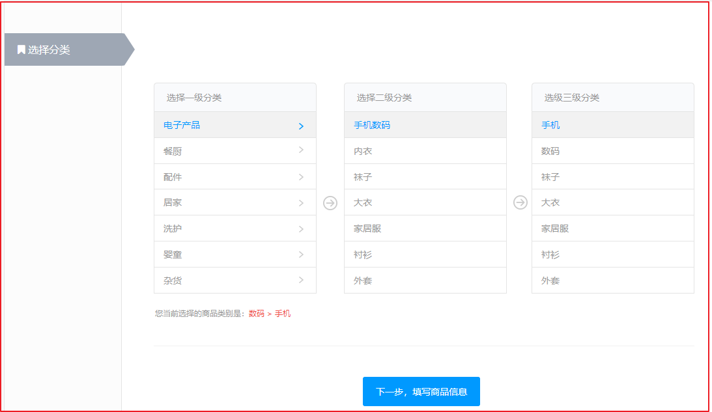

在实现商品增加之前，需要先选择对应的分类，选择分类的时候，首选选择一级分类，然后根据选中的分类，将选中的分类作为查询的父ID，再查询对应的子分类集合，因此我们可以在后台编写一个方法，根据父类ID查询对应的分类集合即可。


##### 3.2.4.1.2. 代码实现

(1)Service层

修改`com.changgou.goods.service.CategoryService`添加根据父类ID查询所有子节点，代码如下：

```java
/***
 * 根据分类的父ID查询子分类节点集合
 */
List<Category> findByParentId(Integer pid);
```

修改`com.changgou.goods.service.impl.CategoryServiceImpl`添加上面的实现，代码如下：

```java
/***
 * 根据分类的父节点ID查询所有子节点
 * @param pid
 * @return
 */
@Override
public List<Category> findByParentId(Integer pid) {
    //SELECT * FROM tb_category WHERE parent_id=?
    Category category = new Category();
    category.setParentId(pid);
    return categoryMapper.select(category);
}
```


(2)Controller层

修改`com.changgou.goods.controller.CategoryController`添加根据父ID查询所有子类集合，代码如下：

```java
/****
 * 根据节点ID查询所有子节点分类集合
 */
@GetMapping(value = "/list/{pid}")
public Result<List<Category>> findByParentId(@PathVariable(value = "pid")Integer pid){
    //调用Service实现查询
    List<Category> categories = categoryService.findByParentId(pid);
    return new Result<List<Category>>(true,StatusCode.OK,"查询成功！",categories);
}
```


#### 3.2.4.2. 模板查询(规格参数组)

同学作业


##### 3.2.4.2.1. 分析


如上图，当用户选中了分类后，需要根据分类的ID查询出对应的模板数据，并将模板的名字显示在这里，模板表结构如下：

```sql
CREATE TABLE `tb_template` (
  `id` int(11) NOT NULL AUTO_INCREMENT COMMENT 'ID',
  `name` varchar(50) DEFAULT NULL COMMENT '模板名称',
  `spec_num` int(11) DEFAULT '0' COMMENT '规格数量',
  `para_num` int(11) DEFAULT '0' COMMENT '参数数量',
  PRIMARY KEY (`id`)
) ENGINE=InnoDB AUTO_INCREMENT=44 DEFAULT CHARSET=utf8;
```


##### 3.2.4.2.2. 代码实现

(1)Service层

修改`com.changgou.goods.service.TemplateService`接口，添加如下方法根据分类ID查询模板：

```java
/**
 * 根据分类ID查询模板信息
 * @param id
 * @return
 */
Template findByCategoryId(Integer id);
```


修改`com.changgou.goods.service.impl.TemplateServiceImpl`添加上面方法的实现：

```java
@Autowired
private CategoryMapper categoryMapper;

/***
 * 根据分类ID查询模板信息
 * @param id
 * @return
 */
@Override
public Template findByCategoryId(Integer id) {
    //查询分类信息
    Category category = categoryMapper.selectByPrimaryKey(id);

    //根据模板Id查询模板信息
    return templateMapper.selectByPrimaryKey(category.getTemplateId());
}
```


(2)Controller层

修改`com.changgou.goods.controller.TemplateController`，添加根据分类ID查询模板数据：

```java
/***
 * 根据分类查询模板数据
 * @param id:分类ID
 */
@GetMapping(value = "/category/{id}")
public Result<Template> findByCategoryId(@PathVariable(value = "id")Integer id){
    //调用Service查询
    Template template = templateService.findByCategoryId(id);
    return new Result<Template>(true, StatusCode.OK,"查询成功",template);
}
```


#### 3.2.4.3. 查询分类品牌数据

##### 3.2.4.3.1. 分析


用户每次选择了分类之后，可以根据用户选择的分类到`tb_category_brand`表中查询指定的品牌集合ID,然后根据品牌集合ID查询对应的品牌集合数据，再将品牌集合数据拿到这里来展示即可实现上述功能。


##### 3.2.4.3.2. 代码实现

(1)Dao实现

修改`com.changgou.goods.dao.BrandMapper`添加根据分类ID查询对应的品牌数据，代码如下：

```java
public interface BrandMapper extends Mapper<Brand> {

    /***
     * 查询分类对应的品牌集合
     */
    @Select("SELECT tb.* FROM tb_category_brand tcb,tb_brand tb WHERE tcb.category_id=#{categoryid} AND tb.id=tcb.brand_id")
    List<Brand> findByCategory(Integer categoryid);
}
```


(2)Service层

修改`com.changgou.goods.service.BrandService`，添加根据分类ID查询指定的品牌集合方法，代码如下：

```java
/***
 * 根据分类ID查询品牌集合
 * @param categoryid:分类ID
 */
List<Brand> findByCategory(Integer categoryid);
```

修改`com.changgou.goods.service.impl.BrandServiceImpl`添加上面方法的实现，代码如下：

```java
/***
 * 根据分类ID查询品牌集合
 * @param categoryid:分类ID
 * @return
 */
@Override
public List<Brand> findByCategory(Integer categoryid) {
    //1.查询当前分类所对应的所有品牌信息
    //2.根据品牌ID查询对应的品牌集合

    //自己创建DAO实现查询
    return brandMapper.findByCategory(categoryid);
}
```


(3)Controller层

修改,添加根据分类ID查询对应的品牌数据代码如下：

```java
/***
 * 根据分类实现品牌列表查询
 * /brand/category/{id}  分类ID
 */
@GetMapping(value = "/category/{id}")
public Result<List<Brand>> findBrandByCategory(@PathVariable(value = "id")Integer categoryId){
    //调用Service查询品牌数据
    List<Brand> categoryList = brandService.findByCategory(categoryId);
    return new Result<List<Brand>>(true,StatusCode.OK,"查询成功！",categoryList);
}
```


#### 3.2.4.4. 规格查询

##### 3.2.4.4.1. 分析

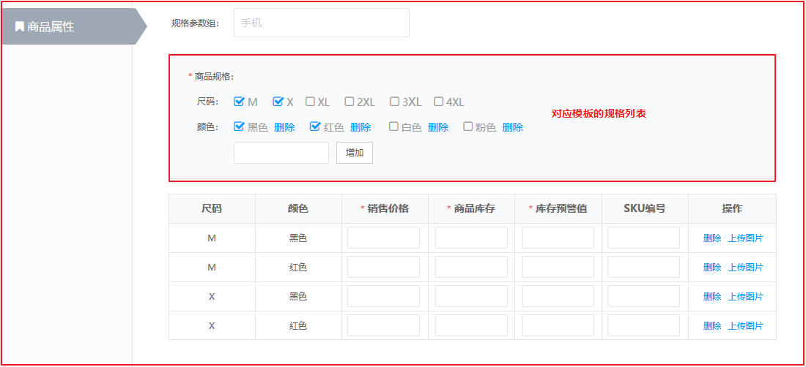

用户选择分类后，需要根据所选分类对应的模板ID查询对应的规格，规格表结构如下：

```sql
CREATE TABLE `tb_spec` (
  `id` int(11) NOT NULL AUTO_INCREMENT COMMENT 'ID',
  `name` varchar(50) DEFAULT NULL COMMENT '名称',
  `options` varchar(2000) DEFAULT NULL COMMENT '规格选项',
  `seq` int(11) DEFAULT NULL COMMENT '排序',
  `template_id` int(11) DEFAULT NULL COMMENT '模板ID',
  PRIMARY KEY (`id`)
) ENGINE=InnoDB AUTO_INCREMENT=40 DEFAULT CHARSET=utf8;
```


##### 3.2.4.4.2. 代码实现

(1)Service层

修改`com.changgou.goods.service.SpecService`添加根据分类ID查询规格列表，代码如下：

```java
/***
 * 根据分类ID查询规格列表
 * @param categoryid
 * @return
 */
List<Spec> findByCategoryId(Integer categoryid);
```

修改`com.changgou.goods.service.impl.SpecServiceImpl`添加上面方法的实现，代码如下：

```java
@Autowired
private CategoryMapper categoryMapper;

/***
 * 根据分类ID查询规格列表
 * @param categoryid
 * @return
 */
@Override
public List<Spec> findByCategoryId(Integer categoryid) {
    //查询分类
    Category category = categoryMapper.selectByPrimaryKey(categoryid);
    //根据分类的模板ID查询规格
    Spec spec = new Spec();
    spec.setTemplateId(category.getTemplateId());
    return specMapper.select(spec);
}
```


(2)Controller层

修改`com.changgou.goods.controller.SpecController`添加根据分类ID查询规格数据，代码如下：

```java
/***
 * 根据分类ID查询对应的规格列表
 */
@GetMapping(value = "/category/{id}")
public Result<List<Spec>> findByCategoryId(@PathVariable(value = "id")Integer categoryid){
    //调用Service查询
    List<Spec> specs = specService.findByCategoryId(categoryid);
    return new Result<List<Spec>>(true, StatusCode.OK,"查询成功",specs);
}
```


#### 3.2.4.5. 参数列表查询

##### 3.2.4.5.1. 分析


当用户选中分类后，需要根据分类的模板ID查询对应的参数列表，参数表结构如下：

```sql
CREATE TABLE `tb_para` (
  `id` int(11) NOT NULL AUTO_INCREMENT COMMENT 'id',
  `name` varchar(50) DEFAULT NULL COMMENT '名称',
  `options` varchar(2000) DEFAULT NULL COMMENT '选项',
  `seq` int(11) DEFAULT NULL COMMENT '排序',
  `template_id` int(11) DEFAULT NULL COMMENT '模板ID',
  PRIMARY KEY (`id`)
) ENGINE=InnoDB AUTO_INCREMENT=3 DEFAULT CHARSET=utf8;
```


##### 3.2.4.5.2. 代码实现

(1)Service层

修改`com.changgou.goods.service.ParaService`添加根据分类ID查询参数列表，代码如下：

```java
/***
 * 根据分类ID查询参数列表
 * @param id
 * @return
 */
List<Para> findByCategoryId(Integer id);
```

修改`com.changgou.goods.service.impl.ParaServiceImpl`添加上面方法的实现，代码如下：

```java
@Autowired
private CategoryMapper categoryMapper;

/***
 * 根据分类ID查询参数列表
 * @param id
 * @return
 */
@Override
public List<Para> findByCategoryId(Integer id) {
    //查询分类信息
    Category category = categoryMapper.selectByPrimaryKey(id);
    //根据分类的模板ID查询参数列表
    Para para = new Para();
    para.setTemplateId(category.getTemplateId());
    return paraMapper.select(para);
}
```


(2)Controller层

修改`com.changgou.goods.controller.ParaController`，添加根据分类ID查询参数列表，代码如下：

```java
/**
 * 根据分类ID查询参数列表
 * @param id
 * @return
 */
@GetMapping(value = "/category/{id}")
public Result<List<Para>> getByCategoryId(@PathVariable(value = "id")Integer id){
    //根据分类ID查询对应的参数信息
    List<Para> paras = paraService.findByCategoryId(id);
    Result<List<Para>> result = new Result<List<Para>>(true,StatusCode.OK,"查询分类对应的品牌成功！",paras);
    return result;
}
```


#### 3.2.4.6. SPU+SKU保存 

##### 3.2.4.6.1. 分析

保存商品数据的时候，需要保存Spu和Sku，一个Spu对应多个Sku，我们可以先构建一个Goods对象，将`Spu`和`List<Sku>`组合到一起,前端将2者数据提交过来，再实现添加操作。


##### 3.2.4.6.2. 代码实现

(1)Pojo改造

修改changgou-service-goods-api工程创建组合实体类，创建com.changgou.goods.pojo.Goods,代码如下：

```java
public class Goods implements Serializable {
    //SPU
    private Spu spu;
    //SKU集合
    private List<Sku> skuList;

    //..get..set..toString
}
```


(2) 业务层

修改com.changgou.goods.service.SpuService接口，添加保存Goods方法，代码如下：

```java
/**
 * 保存商品
 * @param goods
 */
void saveGoods(Goods goods);
```


修改com.changgou.goods.service.impl.SpuServiceImpl类，添加保存Goods的方法实现，代码如下：

```java
@Autowired
private IdWorker idWorker;

@Autowired
private CategoryMapper categoryMapper;

@Autowired
private BrandMapper brandMapper;

@Autowired
private SkuMapper skuMapper;

/***
 * 保存Goods
 * @param goods
 */
@Override
public void saveGoods(Goods goods) {
    //增加Spu
    Spu spu = goods.getSpu();
    spu.setId(idWorker.nextId());
    spuMapper.insertSelective(spu);

    //增加Sku
    Date date = new Date();
    Category category = categoryMapper.selectByPrimaryKey(spu.getCategory3Id());
    Brand brand = brandMapper.selectByPrimaryKey(spu.getBrandId());
    //获取Sku集合
    List<Sku> skus = goods.getSkus();
    //循环将数据加入到数据库
    for (Sku sku : skus) {
        //构建SKU名称，采用SPU+规格值组装
        if(StringUtils.isEmpty(sku.getSpec())){
            sku.setSpec("{}");
        }
        //获取Spu的名字
        String name = spu.getName();

        //将规格转换成Map
        Map<String,String> specMap = JSON.parseObject(sku.getSpec(), Map.class);
        //循环组装Sku的名字
        for (Map.Entry<String, String> entry : specMap.entrySet()) {
            name+="  "+entry.getValue();
        }
        sku.setName(name);
        //ID
        sku.setId(idWorker.nextId());
        //SpuId
        sku.setSpuId(spu.getId());
        //创建日期
        sku.setCreateTime(date);
        //修改日期
        sku.setUpdateTime(date);
        //商品分类ID
        sku.setCategoryId(spu.getCategory3Id());
        //分类名字
        sku.setCategoryName(category.getName());
        //品牌名字
        sku.setBrandName(brand.getName());
        //增加
        skuMapper.insertSelective(sku);
    }
}
```


(3)控制层

修改com.changgou.goods.controller.SpuController，增加保存Goods方法，代码如下：

```java
/***
 * 添加Goods
 * @param goods
 * @return
 */
@PostMapping("/save")
public Result save(@RequestBody Goods goods){
    spuService.saveGoods(goods);
    return new Result(true,StatusCode.OK,"保存成功");
}
```


测试数据

```json
{
  "skuList": [
    {
      "alertNum": 10,
      "brandName": "华为",
      "categoryId": 64,
      "commentNum": 0,
      "image": "http://www.baidu.com",
      "images": "",
      "name": "华为P30手机",
      "num": 5,
      "price": 1000,
      "saleNum": 0,
      "sn": "No1001",
      "spec": "{\"颜色\":\"红色\",\"网络\":\"移动3G\"}",
      "weight": 0
    }
  ],
  "spu": {
    "brandId": 8557,
    "caption": "华为手机大促销",
    "category1Id": 1,
    "category2Id": 59,
    "category3Id": 64,
    "commentNum": 0,
    "freightId": 0,
    "images": "http://www.qingcheng.com/./image/1.jpg,http://www.qingcheng.com/./image/2.jpg",
    "introduction": "华为产品世界最强",
    "isEnableSpec": "1",
    "isMarketable": "1",
    "name": "string",
    "specItems": "{\"颜色\":[\"红\",\"绿\"],\"机身内存\":[\"64G\",\"8G\"]}",
    "paraItems": "{\"赠品\":\"充电器\",\"出厂年份\":\"2019\"}",
    "saleNum": 0,
    "saleService": "一年包换",
    "sn": "No10001",
    "status": "1",
    "templateId": 42
  }
}
```


#### 3.2.4.7. 根据ID查询商品 

##### 3.2.4.7.1. 需求分析

需求：根据id 查询SPU和SKU列表 ，显示效果如下：

```json
{
    "spu": {
		"brandId": 0,
		"caption": "111",
		"category1Id": 558,
		"category2Id": 559,
		"category3Id": 560,
		"commentNum": null,
		"freightId": null,
		"id": 149187842867993,
		"image": null,
		"images": null,
		"introduction": null,
		"isDelete": null,
		"isEnableSpec": "0",
		"isMarketable": "1",
		"name": "黑马智能手机",
		"paraItems": null,
		"saleNum": null,
		"saleService": null,
		"sn": null,
		"specItems": null,
		"status": null,
		"templateId": 42
	},
	"skuList": [{
		"alertNum": null,
		"brandName": "金立（Gionee）",
		"categoryId": 560,
		"categoryName": "手机",
		"commentNum": null,
		"createTime": "2018-11-06 10:17:08",
		"id": 1369324,
		"image": null,
		"images": "blob:http://localhost:8080/ec04d1a5-d865-4e7f-a313-2e9a76cfb3f8",
		"name": "黑马智能手机",
		"num": 100,
		"price": 900000,
		"saleNum": null,
		"sn": "",
		"spec": null,
		"spuId": 149187842867993,
		"status": "1",
		"updateTime": "2018-11-06 10:17:08",
		"weight": null
	},{
		"alertNum": null,
		"brandName": "金立（Gionee）",
		"categoryId": 560,
		"categoryName": "手机",
		"commentNum": null,
		"createTime": "2018-11-06 10:17:08",
		"id": 1369325,
		"image": null,
		"images": "blob:http://localhost:8080/ec04d1a5-d865-4e7f-a313-2e9a76cfb3f8",
		"name": "黑马智能手机",
		"num": 100,
		"price": 900000,
		"saleNum": null,
		"sn": "",
		"spec": null,
		"spuId": 149187842867993,
		"status": "1",
		"updateTime": "2018-11-06 10:17:08",
		"weight": null
	  }
   ]
}
```


##### 3.2.4.7.2. 代码实现

(1)业务层

修改qingcheng-service-goods工程,修改com.changgou.goods.service.SpuService接口,添加根据ID查找方法findGoodsById代码如下：

```java
/***
 * 根据SPU的ID查找SPU以及对应的SKU集合
 * @param spuId
 */
Goods findGoodsById(Long spuId);
```


修改qingcheng-service-goods工程，修改com.changgou.goods.service.impl.SpuServiceImpl类，添加根据ID查找findGoodsById方法，代码如下：

```java
/***
 * 根据SpuID查询goods信息
 * @param spuId
 * @return
 */
@Override
public Goods findGoodsById(Long spuId) {
    //查询Spu
    Spu spu = spuMapper.selectByPrimaryKey(spuId);

    //查询List<Sku>
    Sku sku = new Sku();
    sku.setSpuId(spuId);
    List<Sku> skus = skuMapper.select(sku);
    //封装Goods
    Goods goods = new Goods();
    goods.setSkus(skus);
    goods.setSpu(spu);
    return goods;
}
```


(2)控制层

修改com.changgou.goods.controller.SpuController，修改findById方法，代码如下：

```java
/***
 * 根据ID查询Goods
 * @param id
 * @return
 */
@GetMapping("/goods/{id}")
public Result<Goods> findGoodsById(@PathVariable Long id){
    //根据ID查询Goods(SPU+SKU)信息
    Goods goods = spuService.findGoodsById(id);
    return new Result<Goods>(true,StatusCode.OK,"查询成功",goods);
}
```

测试：`http://localhost:18081/spu/goods/1088256029394866176`


#### 3.2.4.8. 保存修改 

修改changgou-service-goods的SpuServiceImpl的saveGoods方法，修改添加SPU部分代码：


上图代码如下：

```java
if(spu.getId()==null){
    //增加
    spu.setId(idWorker.nextId());
    spuMapper.insertSelective(spu);
}else{
    //修改数据
    spuMapper.updateByPrimaryKeySelective(spu);
    //删除该Spu的Sku
    Sku sku = new Sku();
    sku.setSpuId(spu.getId());
    skuMapper.delete(sku);
}
```


#### 3.2.4.9. 修改SKU库存

（学员实现）

  

## 3.3. 商品审核与上下架

### 3.3.1. 需求分析

商品新增后，审核状态为0（未审核），默认为下架状态。

审核商品，需要校验是否是被删除的商品，如果未删除则修改审核状态为1，并自动上架

下架商品，需要校验是否是被删除的商品，如果未删除则修改上架状态为0

上架商品，需要审核通过的商品


### 3.3.2. 实现思路

（1）按照ID查询SPU信息

（2）判断修改审核、上架和下架状态

（3）保存SPU


### 3.3.3. 代码实现

#### 3.3.3.1. 商品审核

实现审核通过，自动上架。


(1)业务层

修改修改changgou-service-goods工程的com.changgou.goods.service.SpuService接口，添加审核方法，代码如下：

```java
/***
 * 商品审核
 * @param spuId
 */
void audit(Long spuId);
```


修改changgou-service-goods工程的com.changgou.goods.service.impl.SpuServiceImpl类，添加audit方法，代码如下：

```java
/***
 * 商品审核
 * @param spuId
 */
@Override
public void audit(Long spuId) {
    //查询商品
    Spu spu = spuMapper.selectByPrimaryKey(spuId);
    //判断商品是否已经删除
    if(spu.getIsDelete().equalsIgnoreCase("1")){
        throw new RuntimeException("该商品已经删除！");
    }
    //实现上架和审核
    spu.setStatus("1"); //审核通过
    spu.setIsMarketable("1"); //上架
    spuMapper.updateByPrimaryKeySelective(spu);
}
```


(2)控制层

修改com.changgou.goods.controller.SpuController，新增audit方法，代码如下：

```java
/**
 * 审核
 * @param id
 * @return
 */
@PutMapping("/audit/{id}")
public Result audit(@PathVariable Long id){
    spuService.audit(id);
    return new Result(true,StatusCode.OK,"审核成功");
}
```


#### 3.3.3.2. 下架商品

(1)业务层

修改com.changgou.goods.service.SpuService接口，添加pull方法，用于商品下架，代码如下：

```java
/***
 * 商品下架
 * @param spuId
 */
void pull(Long spuId);
```


修改com.changgou.goods.service.impl.SpuServiceImpl，添加如下方法：

```java
/**
 * 商品下架
 * @param spuId
 */
@Override
public void pull(Long spuId) {
    Spu spu = spuMapper.selectByPrimaryKey(spuId);
    if(spu.getIsDelete().equals("1")){
        throw new RuntimeException("此商品已删除！");
    }
    spu.setIsMarketable("0");//下架状态
    spuMapper.updateByPrimaryKeySelective(spu);
}
```


(2)控制层

修改com.changgou.goods.controller.SpuController，添加pull方法，代码如下：

```java
/**
 * 下架
 * @param id
 * @return
 */
@PutMapping("/pull/{id}")
public Result pull(@PathVariable Long id){
    spuService.pull(id);
    return new Result(true,StatusCode.OK,"下架成功");
}
```


#### 3.3.3.3. 上架商品 

必须是通过审核的商品才能上架

(1)业务层

修改com.changgou.goods.service.SpuService，添加put方法，代码如下：

```java
/***
 * 商品上架
 * @param spuId
 */
void put(Long spuId);
```


修改com.changgou.goods.service.impl.SpuServiceImpl，添加put方法实现，代码如下：

```java
/***
 * 商品上架
 * @param spuId
 */
@Override
public void put(Long spuId) {
    Spu spu = spuMapper.selectByPrimaryKey(spuId);
    //检查是否删除的商品
    if(spu.getIsDelete().equals("1")){
        throw new RuntimeException("此商品已删除！");
    }
    if(!spu.getStatus().equals("1")){
        throw new RuntimeException("未通过审核的商品不能！");
    }
    //上架状态
    spu.setIsMarketable("1");
    spuMapper.updateByPrimaryKeySelective(spu);
}
```


(2)控制层

修改com.changgou.goods.controller.SpuController，添加put方法代码如下：

```java
/**
 * 商品上架
 * @param id
 * @return
 */
@PutMapping("/put/{id}")
public Result put(@PathVariable Long id){
    spuService.put(id);
    return new Result(true,StatusCode.OK,"上架成功");
}
```


#### 3.3.3.4. 批量上架 

前端传递一组商品ID，后端进行批量上下架处理

(1)业务层

修改com.changgou.goods.service.SpuService接口，代码如下：

```java
int putMany(Long[] ids);
```


修改com.changgou.goods.service.impl.SpuServiceImpl，添加批量上架方法实现，代码如下：

```java
/***
 * 批量上架
 * @param ids:需要上架的商品ID集合
 * @return
 */
@Override
public int putMany(Long[] ids) {
    Spu spu=new Spu();
    spu.setIsMarketable("1");//上架
    //批量修改
    Example example=new Example(Spu.class);
    Example.Criteria criteria = example.createCriteria();
    criteria.andIn("id", Arrays.asList(ids));//id
    //下架
    criteria.andEqualTo("isMarketable","0");
    //审核通过的
    criteria.andEqualTo("status","1");
    //非删除的
    criteria.andEqualTo("isDelete","0");
    return spuMapper.updateByExampleSelective(spu, example);
}
```


(2)控制层

修改com.changgou.goods.controller.SpuController，天啊及批量上架方法，代码如下：

```java
/**
 *  批量上架
 * @param ids
 * @return
 */
@PutMapping("/put/many")
public Result putMany(@RequestBody Long[] ids){
    int count = spuService.putMany(ids);
    return new Result(true,StatusCode.OK,"上架"+count+"个商品");
}
```


使用Postman测试：


#### 3.3.3.5. 批量下架

学员实现


## 3.4. 删除与还原商品 

### 3.4.1. 需求分析 

请看管理后台的静态原型

商品列表中的删除商品功能，并非真正的删除，而是将删除标记的字段设置为1，

在回收站中有恢复商品的功能，将删除标记的字段设置为0

在回收站中有删除商品的功能，是真正的物理删除。


### 3.4.2. 实现思路 

逻辑删除商品，修改spu表is_delete字段为1

商品回收站显示spu表is_delete字段为1的记录

回收商品，修改spu表is_delete字段为0


### 3.4.3. 代码实现 

#### 3.4.3.1. 逻辑删除商品 

(1)业务层

修改com.changgou.goods.service.SpuService接口，增加logicDelete方法，代码如下：

```java
/***
 * 逻辑删除
 * @param spuId
 */
void logicDelete(Long spuId);
```


修改com.changgou.goods.service.impl.SpuServiceImpl，添加logicDelete方法实现，代码如下：

```java
/***
 * 逻辑删除
 * @param spuId
 */
@Override
@Transactional
public void logicDelete(Long spuId) {
    Spu spu = spuMapper.selectByPrimaryKey(spuId);
    //检查是否下架的商品
    if(!spu.getIsMarketable().equals("0")){
        throw new RuntimeException("必须先下架再删除！");
    }
    //删除
    spu.setIsDelete("1");
    //未审核
    spu.setStatus("0");
    spuMapper.updateByPrimaryKeySelective(spu);
}
```


(2)控制层

修改com.changgou.goods.controller.SpuController，添加logicDelete方法，如下：

```java
/**
 * 逻辑删除
 * @param id
 * @return
 */
@DeleteMapping("/logic/delete/{id}")
public Result logicDelete(@PathVariable Long id){
    spuService.logicDelete(id);
    return new Result(true,StatusCode.OK,"逻辑删除成功！");
}
```


#### 3.4.3.2. 还原被删除的商品 

(1)业务层

修改com.changgou.goods.service.SpuService接口，添加restore方法代码如下：

```java
/***
 * 还原被删除商品
 * @param spuId
 */
void restore(Long spuId);
```

修改com.changgou.goods.service.impl.SpuServiceImpl类，添加restore方法，代码如下：

```java
/**
 * 恢复数据
 * @param spuId
 */
@Override
public void restore(Long spuId) {
    Spu spu = spuMapper.selectByPrimaryKey(spuId);
    //检查是否删除的商品
    if(!spu.getIsDelete().equals("1")){
        throw new RuntimeException("此商品未删除！");
    }
    //未删除
    spu.setIsDelete("0");
    //未审核
    spu.setStatus("0");
    spuMapper.updateByPrimaryKeySelective(spu);
}
```


(2)控制层

修改com.changgou.goods.controller.SpuController，添加restore方法，代码如下：

```java
/**
 * 恢复数据
 * @param id
 * @return
 */
@PutMapping("/restore/{id}")
public Result restore(@PathVariable Long id){
    spuService.restore(id);
    return new Result(true,StatusCode.OK,"数据恢复成功！");
}
```


#### 3.4.3.3. 物理删除商品  

修改com.changgou.goods.service.impl.SpuServiceImpl的delete方法,代码如下：

```java
/**
 * 删除
 * @param id
 */
@Override
public void delete(Long id){
    Spu spu = spuMapper.selectByPrimaryKey(id);
    //检查是否被逻辑删除  ,必须先逻辑删除后才能物理删除
    if(!spu.getIsDelete().equals("1")){
        throw new RuntimeException("此商品不能删除！");
    }
    spuMapper.deleteByPrimaryKey(id);
}
```


## 3.5. 商品列表

### 3.5.1. 需求分析

如图所示 展示商品的列表。并实现分页。


思路：

```properties
根据查询的条件 分页查询 并返回分页结果即可。
分页查询 采用 pagehelper ，条件查询  通过map进行封装传递给后台即可。
```


### 3.5.2. 代码实现

在代码生成器生成的代码中已经包含了该实现，这里就省略了。

控制层（SpuController）:

```java
/***
 * Spu分页条件搜索实现
 * @param spu
 * @param page
 * @param size
 * @return
 */
@PostMapping(value = "/search/{page}/{size}" )
public Result<PageInfo> findPage(@RequestBody(required = false) Spu spu, @PathVariable  int page, @PathVariable  int size){
    //执行搜索
    PageInfo<Spu> pageInfo = spuService.findPage(spu, page, size);
    return new Result(true,StatusCode.OK,"查询成功",pageInfo);
}
```


其他每层代码，代码生成器已经生成，这里就不再列出来了。


# 4. lua、Canal实现广告缓存

**学习目标**

- Lua介绍

  ```
  Lua语法 输出、变量定义、数据类型、流程控制(if..)、循环操作、函数、表(数组)、模块
  ```

- OpenResty介绍(理解配置)

  ```
  封装了Nginx，并且提供了Lua扩展，大大提升了Nginx对并发处理的能，10K-1000K
  Lua->广告缓存操作
  ```

- 广告缓存载入与读取

- Nginx讲解

  ```
  限流操作:漏斗限流原理
  	1.控制速率
  	2.并发量控制
  ```

- Canal讲解

  ```
  实现数据同步操作->MySQL
  ```

- Canal实现首页缓存同步


## 4.1. 首页分析

首页门户系统需要展示各种各样的广告数据。如图，以jd为例：


变更频率低的数据，如何提升访问速度？

```
1.数据做成静态页[商品详情页]
2.做缓存[Redis]
```


基本的思路如下：


如上图此种方式 简单，直接通过数据库查询数据展示给用户即可，但是通常情况下，首页（门户系统的流量一般非常的高）不适合直接通过mysql数据库直接访问的方式来获取展示。

如下思路：

1.首先访问nginx ，我们可以采用缓存的方式，先从nginx本地缓存中获取，获取到直接响应

2.如果没有获取到，再次访问redis，我们可以从redis中获取数据，如果有 则返回，并缓存到nginx中

3.如果没有获取到,再次访问mysql,我们从mysql中获取数据，再将数据存储到redis中，返回。

而这里面，我们都可以使用LUA脚本嵌入到程序中执行这些查询相关的业务。


## 4.2. Lua(了解)

### 4.2.1. lua是什么

Lua [1]  是一个小巧的[脚本语言](https://baike.baidu.com/item/%E8%84%9A%E6%9C%AC%E8%AF%AD%E8%A8%80)。它是巴西里约热内卢天主教大学（Pontifical Catholic University of Rio de Janeiro）里的一个由Roberto Ierusalimschy、Waldemar Celes 和 Luiz Henrique de Figueiredo三人所组成的研究小组于1993年开发的。 其设计目的是为了通过灵活嵌入应用程序中从而为应用程序提供灵活的扩展和定制功能。Lua由标准C编写而成，几乎在所有操作系统和平台上都可以编译，运行。Lua并没有提供强大的库，这是由它的定位决定的。所以Lua不适合作为开发独立应用程序的语言。Lua 有一个同时进行的JIT项目，提供在特定平台上的即时编译功能。

简单来说：

Lua 是一种轻量小巧的脚本语言，用标准C语言编写并以源代码形式开放， 其设计目的是为了嵌入应用程序中，从而为应用程序提供灵活的扩展和定制功能。


### 4.2.2. 特性

- 支持面向过程(procedure-oriented)编程和函数式编程(functional programming)；
- 自动内存管理；只提供了一种通用类型的表（table），用它可以实现数组，哈希表，集合，对象；
- 语言内置模式匹配；闭包(closure)；函数也可以看做一个值；提供多线程（协同进程，并非操作系统所支持的线程）支持；
- 通过闭包和table可以很方便地支持面向对象编程所需要的一些关键机制，比如数据抽象，虚函数，继承和重载等。


### 4.2.3. 应用场景

- 游戏开发
- 独立应用脚本
- Web 应用脚本
- 扩展和数据库插件如：MySQL Proxy 和 MySQL WorkBench
- 安全系统，如入侵检测系统
- redis中嵌套调用实现类似事务的功能
- web容器中应用处理一些过滤 缓存等等的逻辑，例如nginx。


### 4.2.4. lua的安装

有linux版本的安装也有mac版本的安装。。我们采用linux版本的安装，首先我们准备一个linux虚拟机。

安装步骤,在linux系统中执行下面的命令。

```properties
curl -R -O http://www.lua.org/ftp/lua-5.3.5.tar.gz
tar zxf lua-5.3.5.tar.gz
cd lua-5.3.5
make linux test
```

注意：此时安装，有可能会出现如下错误：


此时需要安装lua相关依赖库的支持，执行如下命令即可：

```properties
yum install libtermcap-devel ncurses-devel libevent-devel readline-devel
```

此时再执行lua测试看lua是否安装成功

```properties
[root@localhost ~]# lua
Lua 5.1.4  Copyright (C) 1994-2008 Lua.org, PUC-Rio
```


### 4.2.5. 入门程序

创建hello.lua文件，内容为

编辑文件hello.lua

```
vi hello.lua
```

在文件中输入：

```
print("hello");
```

保存并退出。

执行命令

```
lua hello.lua
```

输出为：

```
Hello
```

效果如下：


### 4.2.6. LUA的基本语法(了解)

lua有交互式编程和脚本式编程。

交互式编程就是直接输入语法，就能执行。

脚本式编程需要编写脚本，然后再执行命令 执行脚本才可以。

一般采用脚本式编程。（例如：编写一个hello.lua的文件，输入文件内容，并执行lua hell.lua即可）

(1)交互式编程

Lua 提供了交互式编程模式。我们可以在命令行中输入程序并立即查看效果。

Lua 交互式编程模式可以通过命令 lua -i 或 lua 来启用：

```
lua -i
```

如下图：


(2)脚本式编程

我们可以将 Lua 程序代码保持到一个以 lua 结尾的文件，并执行，该模式称为脚本式编程，例如上面入门程序中将lua语法写到hello.lua文件中。


#### 4.2.6.1. 注释

一行注释：两个减号是单行注释:

```
--
```

多行注释：

```lua
--[[
 多行注释
 多行注释
 --]]
```


#### 4.2.6.2. 定义变量

全局变量，默认的情况下，定义一个变量都是全局变量，

如果要用局部变量 需要声明为local.例如：

```lua
-- 全局变量赋值
a=1
-- 局部变量赋值
local b=2 
```

如果变量没有初始化：则 它的值为nil 这和java中的null不同。

如下图案例：


#### 4.2.6.3. Lua中的数据类型

Lua 是动态类型语言，变量不要类型定义,只需要为变量赋值。 值可以存储在变量中，作为参数传递或结果返回。

Lua 中有 8 个基本类型分别为：nil、boolean、number、string、userdata、function、thread 和 table。

| 数据类型 | 描述                                                         |
| -------- | ------------------------------------------------------------ |
| nil      | 这个最简单，只有值nil属于该类，表示一个无效值（在条件表达式中相当于false）。 |
| boolean  | 包含两个值：false和true。                                    |
| number   | 表示双精度类型的实浮点数                                     |
| string   | 字符串由一对双引号或单引号来表示                             |
| function | 由 C 或 Lua 编写的函数                                       |
| userdata | 表示任意存储在变量中的C数据结构                              |
| thread   | 表示执行的独立线路，用于执行协同程序                         |
| table    | Lua 中的表（table）其实是一个"关联数组"（associative arrays），数组的索引可以是数字、字符串或表类型。在 Lua 里，table 的创建是通过"构造表达式"来完成，最简单构造表达式是{}，用来创建一个空表。 |

实例：

```properties
print(type("Hello world"))      --> string
print(type(10.4*3))             --> number
print(type(print))              --> function
print(type(type))               --> function
print(type(true))               --> boolean
print(type(nil))                --> nil
```


#### 4.2.6.4. 流程控制

(1)if语句

Lua **if 语句** 由一个布尔表达式作为条件判断，其后紧跟其他语句组成。

语法：

```properties
if(布尔表达式)
then
   --[ 在布尔表达式为 true 时执行的语句 --]
end
```

实例：


(2)if..else语句

Lua if 语句可以与 else 语句搭配使用, 在 if 条件表达式为 false 时执行 else 语句代码块。

语法：

```properties
if(布尔表达式)
then
   --[ 布尔表达式为 true 时执行该语句块 --]
else
   --[ 布尔表达式为 false 时执行该语句块 --]
end
```

实例：


#### 4.2.6.5. 循环

学员完成

(1)while循环[==满足条件就循环==]

Lua 编程语言中 while 循环语句在判断条件为 true 时会重复执行循环体语句。
语法：

```properties
while(condition)
do
   statements
end
```

实例：

```properties
a=10
while( a < 20 )
do
   print("a 的值为:", a)
   a = a+1
end
```

效果如下：


(2)for循环

Lua 编程语言中 for 循环语句可以重复执行指定语句，重复次数可在 for 语句中控制。

语法：  1->10  1:exp1  10:exp2  2:exp3:递增的数量   

```properties
for var=exp1,exp2,exp3 
do  
    <执行体>  
end  
```

var 从 exp1 变化到 exp2，每次变化以 exp3 为步长递增 var，并执行一次 **"执行体"**。exp3 是可选的，如果不指定，默认为1。

例子：

```properties
for i=1,9,2
do
   print(i)
end
```

`for i=1,9,2`:i=1从1开始循环，9循环数据到9结束，2每次递增2


(3)repeat...until语句[==满足条件结束==]

Lua 编程语言中 repeat...until 循环语句不同于 for 和 while循环，for 和 while 循环的条件语句在当前循环执行开始时判断，而 repeat...until 循环的条件语句在当前循环结束后判断。

语法：

```properties
repeat
   statements
until( condition )
```

案例：


#### 4.2.6.6. 函数

lua中也可以定义函数，类似于java中的方法。例如：

```lua
--[[ 函数返回两个值的最大值 --]]
function max(num1, num2)

   if (num1 > num2) then
      result = num1;
   else
      result = num2;
   end

   return result; 
end
-- 调用函数
print("两值比较最大值为 ",max(10,4))
print("两值比较最大值为 ",max(5,6))
```

执行之后的结果：

```
两值比较最大值为     10
两值比较最大值为     6
```


..:表示拼接


#### 4.2.6.7. 表

table 是 Lua 的一种数据结构用来帮助我们创建不同的数据类型，如：数组、字典等。

Lua也是通过table来解决模块（module）、包（package）和对象（Object）的。

案例：

```properties
-- 初始化表
mytable = {}

-- 指定值
mytable[1]= "Lua"

-- 移除引用
mytable = nil
```


#### 4.2.6.8. 模块

(1)模块定义

模块类似于一个封装库，从 Lua 5.1 开始，Lua 加入了标准的模块管理机制，可以把一些公用的代码放在一个文件里，以 API 接口的形式在其他地方调用，有利于代码的重用和降低代码耦合度。

创建一个文件叫module.lua，在module.lua中创建一个独立的模块，代码如下：

```properties
-- 文件名为 module.lua
-- 定义一个名为 module 的模块
module = {}
 
-- 定义一个常量
module.constant = "这是一个常量"
 
-- 定义一个函数
function module.func1()
    print("这是一个公有函数")
end
 
local function func2()
    print("这是一个私有函数！")
end
 
function module.func3()
    func2()
end
 
return module
```

由上可知，模块的结构就是一个 table 的结构，因此可以像操作调用 table 里的元素那样来操作调用模块里的常量或函数。

上面的 func2 声明为程序块的局部变量，即表示一个私有函数，因此是不能从外部访问模块里的这个私有函数，必须通过模块里的公有函数来调用.


(2)require 函数

require 用于 引入其他的模块，类似于java中的类要引用别的类的效果。

用法：

```properties
require("<模块名>")
```

```properties
require "<模块名>"
```

两种都可以。

我们可以将上面定义的module模块引入使用,创建一个test_module.lua文件，代码如下：

```properties
-- test_module.lua 文件
-- module 模块为上文提到到 module.lua
require("module")

print(module.constant)

module.func3()
```


## 4.3. OpenResty介绍

OpenResty(又称：ngx_openresty) 是一个基于 nginx的可伸缩的 Web 平台，由中国人章亦春发起，提供了很多高质量的第三方模块。

OpenResty 是一个强大的 Web 应用服务器，Web 开发人员可以使用 Lua 脚本语言调动 Nginx 支持的各种 C 以及 Lua 模块,更主要的是在性能方面，OpenResty可以 快速构造出足以胜任 10K 以上并发连接响应的超高性能 Web 应用系统。

360，UPYUN，阿里云，新浪，腾讯网，去哪儿网，酷狗音乐等都是 OpenResty 的深度用户。

OpenResty 简单理解成 就相当于封装了nginx,并且集成了LUA脚本，开发人员只需要简单的其提供了模块就可以实现相关的逻辑，而不再像之前，还需要在nginx中自己编写lua的脚本，再进行调用了。

### 4.3.1. 安装openresty

linux安装openresty:

1.添加仓库执行命令

```shell
 yum install yum-utils
 yum-config-manager --add-repo https://openresty.org/package/centos/openresty.repo
```

2.执行安装

```
yum install openresty
```

3.安装成功后 会在默认的目录如下：

```
/usr/local/openresty
```


### 4.3.2. 安装nginx

默认已经安装好了nginx,在目录：/usr/local/openresty/nginx 下。

修改/usr/local/openresty/nginx/conf/nginx.conf,将配置文件使用的根设置为root,目的就是将来要使用lua脚本的时候 ，直接可以加载在root下的lua脚本。

```
cd /usr/local/openresty/nginx/conf
vi nginx.conf
```

修改代码如下：

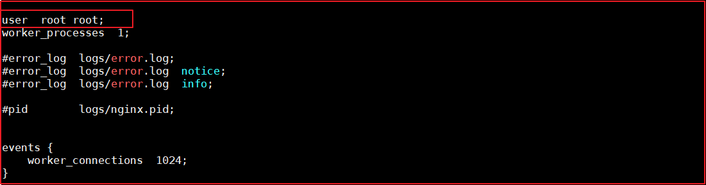


### 4.3.3. 测试访问

重启下centos虚拟机，然后访问测试Nginx

访问地址：`http://192.168.211.132/`


## 4.4. 广告缓存的载入与读取

### 4.4.1. 需求分析

需要在页面上显示广告的信息。

### 4.4.2. Lua+Nginx配置

(1)实现思路-查询数据放入redis中

实现思路：

定义请求：用于查询数据库中的数据更新到redis中。

a.连接mysql ，按照广告分类ID读取广告列表，转换为json字符串。

b.连接redis，将广告列表json字符串存入redis 。

定义请求：

```
请求：
	/update_content
参数：
	id  --指定广告分类的id
返回值：
	json
```

请求地址：`<http://192.168.211.132/update_content?id=1>`

创建/root/lua目录，在该目录下创建update_content.lua： 目的就是连接mysql  查询数据 并存储到redis中。

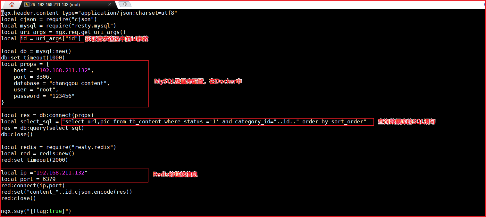

上图代码如下：

```lua
ngx.header.content_type="application/json;charset=utf8"
local cjson = require("cjson")
local mysql = require("resty.mysql")
local uri_args = ngx.req.get_uri_args()
local id = uri_args["id"]

local db = mysql:new()
db:set_timeout(1000)
local props = {
    host = "192.168.211.132",
    port = 3306,
    database = "changgou_content",
    user = "root",
    password = "123456"
}

local res = db:connect(props)
local select_sql = "select url,pic from tb_content where status ='1' and category_id="..id.." order by sort_order"
res = db:query(select_sql)
db:close()

local redis = require("resty.redis")
local red = redis:new()
red:set_timeout(2000)

local ip ="192.168.211.132"
local port = 6379
red:connect(ip,port)
red:set("content_"..id,cjson.encode(res))
red:close()

ngx.say("{flag:true}")
```


修改/usr/local/openresty/nginx/conf/nginx.conf文件： 添加头信息，和 location信息


代码如下：

```nginx
server {
    listen       80;
    server_name  localhost;

    location /update_content {
        content_by_lua_file /root/lua/update_content.lua;
    }
}
```

定义lua缓存命名空间，修改nginx.conf，添加如下代码即可：


代码如下：

```properties
lua_shared_dict dis_cache 128m;
```


请求`<http://192.168.211.132/update_content?id=1>`可以实现缓存的添加


(2)实现思路-从redis中获取数据

实现思路：

定义请求，用户根据广告分类的ID 获取广告的列表。通过lua脚本直接从redis中获取数据即可。

定义请求：

```
请求:/read_content
参数：id
返回值：json
```

在/root/lua目录下创建read_content.lua:

```lua
--设置响应头类型
ngx.header.content_type="application/json;charset=utf8"
--获取请求中的参数ID
local uri_args = ngx.req.get_uri_args();
local id = uri_args["id"];
--引入redis库
local redis = require("resty.redis");
--创建redis对象
local red = redis:new()
--设置超时时间
red:set_timeout(2000)
--连接
local ok, err = red:connect("192.168.211.132", 6379)
--获取key的值
local rescontent=red:get("content_"..id)
--输出到返回响应中
ngx.say(rescontent)
--关闭连接
red:close()
```

在/usr/local/openresty/nginx/conf/nginx.conf中配置如下：

如图：


代码：

```nginx
location /read_content {
     content_by_lua_file /root/lua/read_content.lua;
}
```


(3)加入openresty本地缓存

如上的方式没有问题，但是如果请求都到redis，redis压力也很大，所以我们一般采用多级缓存的方式来减少下游系统的服务压力。参考基本思路图的实现。

先查询openresty本地缓存 如果 没有

再查询redis中的数据，如果没有

再查询mysql中的数据，但凡有数据 则返回即可。

修改read_content.lua文件，代码如下：


上图代码如下：

```lua
ngx.header.content_type="application/json;charset=utf8"
local uri_args = ngx.req.get_uri_args();
local id = uri_args["id"];
--获取本地缓存
local cache_ngx = ngx.shared.dis_cache;
--根据ID 获取本地缓存数据
local contentCache = cache_ngx:get('content_cache_'..id);

if contentCache == "" or contentCache == nil then
    local redis = require("resty.redis");
    local red = redis:new()
    red:set_timeout(2000)
    red:connect("192.168.211.132", 6379)
    local rescontent=red:get("content_"..id);

    if ngx.null == rescontent then
        local cjson = require("cjson");
        local mysql = require("resty.mysql");
        local db = mysql:new();
        db:set_timeout(2000)
        local props = {
            host = "192.168.211.132",
            port = 3306,
            database = "changgou_content",
            user = "root",
            password = "123456"
        }
        local res = db:connect(props);
        local select_sql = "select url,pic from tb_content where status ='1' and category_id="..id.." order by sort_order";
        res = db:query(select_sql);
        local responsejson = cjson.encode(res);
        red:set("content_"..id,responsejson);
        ngx.say(responsejson);
        db:close()
    else
        cache_ngx:set('content_cache_'..id, rescontent, 10*60);
        ngx.say(rescontent)
    end
    red:close()
else
    ngx.say(contentCache)
end
```


测试地址：`http://192.168.211.132/update_content?id=1`

此时会将分类ID=1的所有广告查询出来，并存入到Redis缓存。

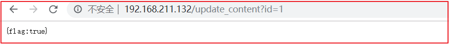

测试地址：`http://192.168.211.132/read_content?id=1`

此时会获取分类ID=1的所有广告信息。


## 4.5. nginx限流

一般情况下，首页的并发量是比较大的，即使 有了多级缓存，当用户不停的刷新页面的时候，也是没有必要的，另外如果有恶意的请求 大量达到，也会对系统造成影响。

而限流就是保护措施之一。


### 4.5.1. 生活中限流对比

+ 水坝泄洪，通过闸口限制洪水流量（控制流量速度）。

+ 办理银行业务：所有人先领号，各窗口叫号处理。每个窗口处理速度根据客户具体业务而定，所有人排队等待叫号即可。若快下班时，告知客户明日再来(拒绝流量)
+ 火车站排队买票安检，通过排队 的方式依次放入。（缓存带处理任务）


### 4.5.2. nginx的限流

nginx提供两种限流的方式：

- 一是控制速率

- 二是控制并发连接数


#### 4.5.2.1. 控制速率

控制速率的方式之一就是采用漏桶算法。


(1)漏桶算法实现控制速率限流

漏桶(Leaky Bucket)算法思路很简单,水(请求)先进入到漏桶里,漏桶以一定的速度出水(接口有响应速率),当水流入速度过大会直接溢出(访问频率超过接口响应速率),然后就拒绝请求,可以看出漏桶算法能强行限制数据的传输速率.示意图如下:


(2)nginx的配置

配置示意图如下：


修改/usr/local/openresty/nginx/conf/nginx.conf:

```nginx
user  root root;
worker_processes  1;

events {
    worker_connections  1024;
}

http {
    include       mime.types;
    default_type  application/octet-stream;

    #cache
    lua_shared_dict dis_cache 128m;

    #限流设置
    limit_req_zone $binary_remote_addr zone=contentRateLimit:10m rate=2r/s;

    sendfile        on;
    #tcp_nopush     on;

    #keepalive_timeout  0;
    keepalive_timeout  65;

    #gzip  on;

    server {
        listen       80;
        server_name  localhost;

        location /update_content {
            content_by_lua_file /root/lua/update_content.lua;
        }

        location /read_content {
            #使用限流配置
            limit_req zone=contentRateLimit;
            content_by_lua_file /root/lua/read_content.lua;
        }
    }
}
```

配置说明：

```
binary_remote_addr 是一种key，表示基于 remote_addr(客户端IP) 来做限流，binary_ 的目的是压缩内存占用量。
zone：定义共享内存区来存储访问信息， contentRateLimit:10m 表示一个大小为10M，名字为contentRateLimit的内存区域。1M能存储16000 IP地址的访问信息，10M可以存储16W IP地址访问信息。
rate 用于设置最大访问速率，rate=10r/s 表示每秒最多处理10个请求。Nginx 实际上以毫秒为粒度来跟踪请求信息，因此 10r/s 实际上是限制：每100毫秒处理一个请求。这意味着，自上一个请求处理完后，若后续100毫秒内又有请求到达，将拒绝处理该请求.我们这里设置成2 方便测试。
```

测试：

重新加载配置文件

```properties
cd /usr/local/openresty/nginx/sbin

./nginx -s reload
```

访问页面：`http://192.168.211.132/read_content?id=1` ,连续刷新会直接报错。


(3)处理突发流量

上面例子限制 2r/s，如果有时正常流量突然增大，超出的请求将被拒绝，无法处理突发流量，可以结合 **burst** 参数使用来解决该问题。

例如，如下配置表示：


上图代码如下：

```nginx
server {
    listen       80;
    server_name  localhost;
    location /update_content {
        content_by_lua_file /root/lua/update_content.lua;
    }
    location /read_content {
        limit_req zone=contentRateLimit burst=4;
        content_by_lua_file /root/lua/read_content.lua;
    }
}
```

burst 译为突发、爆发，表示在超过设定的处理速率后能额外处理的请求数,当 rate=10r/s 时，将1s拆成10份，即每100ms可处理1个请求。

此处，**burst=4 **，若同时有4个请求到达，Nginx 会处理第一个请求，剩余3个请求将放入队列，然后每隔500ms从队列中获取一个请求进行处理。若请求数大于4，将拒绝处理多余的请求，直接返回503.

不过，单独使用 burst 参数并不实用。假设 burst=50 ，rate依然为10r/s，排队中的50个请求虽然每100ms会处理一个，但第50个请求却需要等待 50 * 100ms即 5s，这么长的处理时间自然难以接受。

因此，burst 往往结合 nodelay 一起使用。

例如：如下配置：

```nginx
server {
    listen       80;
    server_name  localhost;
    location /update_content {
        content_by_lua_file /root/lua/update_content.lua;
    }
    location /read_content {
        limit_req zone=contentRateLimit burst=4 nodelay;
        content_by_lua_file /root/lua/read_content.lua;
    }
}
```

如上表示：

平均每秒允许不超过2个请求，突发不超过4个请求，并且处理突发4个请求的时候，没有延迟，等到完成之后，按照正常的速率处理。

如上两种配置结合就达到了速率稳定，但突然流量也能正常处理的效果。完整配置代码如下：

```nginx
user  root root;
worker_processes  1;

events {
    worker_connections  1024;
}

http {
    include       mime.types;
    default_type  application/octet-stream;

    #cache
    lua_shared_dict dis_cache 128m;

    #限流设置
    limit_req_zone $binary_remote_addr zone=contentRateLimit:10m rate=2r/s;

    sendfile        on;
    #tcp_nopush     on;

    #keepalive_timeout  0;
    keepalive_timeout  65;

    #gzip  on;

    server {
        listen       80;
        server_name  localhost;

        location /update_content {
            content_by_lua_file /root/lua/update_content.lua;
        }

        location /read_content {
            limit_req zone=contentRateLimit burst=4 nodelay;
            content_by_lua_file /root/lua/read_content.lua;
        }
    }
}
```


测试：如下图 在1秒钟之内可以刷新4次，正常处理。


但是超过之后，连续刷新5次，抛出异常。


#### 4.5.2.2. 控制并发量（连接数）

ngx_http_limit_conn_module  提供了限制连接数的能力。主要是利用limit_conn_zone和limit_conn两个指令。

利用连接数限制 某一个用户的ip连接的数量来控制流量。

注意：并非所有连接都被计算在内 只有当服务器正在处理请求并且已经读取了整个请求头时，才会计算有效连接。此处忽略测试。

配置语法：

```
Syntax:	limit_conn zone number;
Default: —;
Context: http, server, location;
```


(1)配置限制固定连接数

如下，配置如下： 


上图配置如下：

```nginx
http {
    include       mime.types;
    default_type  application/octet-stream;

    #cache
    lua_shared_dict dis_cache 128m;

    #限流设置
    limit_req_zone $binary_remote_addr zone=contentRateLimit:10m rate=2r/s;

    #根据IP地址来限制，存储内存大小10M
    limit_conn_zone $binary_remote_addr zone=addr:1m;

    sendfile        on;
    #tcp_nopush     on;

    #keepalive_timeout  0;
    keepalive_timeout  65;

    #gzip  on;

    server {
        listen       80;
        server_name  localhost;
        #所有以brand开始的请求，访问本地changgou-service-goods微服务
        location /brand {
            limit_conn addr 2;
            proxy_pass http://192.168.211.1:18081;
        }

        location /update_content {
            content_by_lua_file /root/lua/update_content.lua;
        }

        location /read_content {
            limit_req zone=contentRateLimit burst=4 nodelay;
            content_by_lua_file /root/lua/read_content.lua;
        }
    }
}
```

表示：

```
limit_conn_zone $binary_remote_addr zone=addr:10m;  表示限制根据用户的IP地址来显示，设置存储地址为的内存大小10M

limit_conn addr 2;   表示 同一个地址只允许连接2次。
```

测试：

此时开3个线程，测试的时候会发生异常，开2个就不会有异常


(2)限制每个客户端IP与服务器的连接数，同时限制与虚拟服务器的连接总数。(了解)

如下配置： 

```nginx
limit_conn_zone $binary_remote_addr zone=perip:10m;
limit_conn_zone $server_name zone=perserver:10m; 
server {  
    listen       80;
    server_name  localhost;
    charset utf-8;
    location / {
        limit_conn perip 10;#单个客户端ip与服务器的连接数．
        limit_conn perserver 100; ＃限制与服务器的总连接数
        root   html;
        index  index.html index.htm;
    }
}
```


## 4.6. canal同步广告

canal可以用来监控数据库数据的变化，从而获得新增数据，或者修改的数据。

canal是应阿里巴巴存在杭州和美国的双机房部署，存在跨机房同步的业务需求而提出的。

阿里系公司开始逐步的尝试基于数据库的日志解析，获取增量变更进行同步，由此衍生出了增量订阅&消费的业务。


### 4.6.1. Canal工作原理


原理相对比较简单：

1. canal模拟mysql slave的交互协议，伪装自己为mysql slave，向mysql master发送dump协议
2. mysql master收到dump请求，开始推送binary log给slave(也就是canal)
3. canal解析binary log对象(原始为byte流)


canal需要使用到mysql，我们需要先安装mysql,给大家发的虚拟机中已经安装了mysql容器，但canal是基于mysql的主从模式实现的，所以必须先开启binlog.


### 4.6.2. 开启binlog模式

先使用docker 创建mysql容器,此处不再演示.


(1) 连接到mysql中,并修改/etc/mysql/mysql.conf.d/mysqld.cnf  需要开启主 从模式，开启binlog模式。

执行如下命令，编辑mysql配置文件


命令行如下：

```properties
docker exec -it mysql /bin/bash
cd /etc/mysql/mysql.conf.d
vi mysqld.cnf
```


修改mysqld.cnf配置文件，添加如下配置：


上图配置如下：

```properties
log-bin/var/lib/mysql/mysql-bin
server-id=12345
```


(2) 创建账号 用于测试使用,

使用root账号创建用户并授予权限

```properties
create user canal@'%' IDENTIFIED by 'canal';
GRANT SELECT, REPLICATION SLAVE, REPLICATION CLIENT,SUPER ON *.* TO 'canal'@'%';
FLUSH PRIVILEGES;
```


(3)重启mysql容器

```properties
docker restart mysql
```


### 4.6.3. canal容器安装

下载镜像：

```properties
docker pull docker.io/canal/canal-server
```

容器安装

```properties
docker run -p 11111:11111 --name canal -d docker.io/canal/canal-server
```

进入容器,修改核心配置canal.properties 和instance.properties，canal.properties 是canal自身的配置，instance.properties是需要同步数据的数据库连接配置。

执行代码如下:

```properties
docker exec -it canal /bin/bash
cd canal-server/conf/
vi canal.properties
cd example/
vi instance.properties
```

修改canal.properties的id，不能和mysql的server-id重复，如下图：


修改instance.properties,配置数据库连接地址:


这里的`canal.instance.filter.regex`有多种配置，如下：

可以参考地址如下:

```
https://github.com/alibaba/canal/wiki/AdminGuide
```

```properties
mysql 数据解析关注的表，Perl正则表达式.
多个正则之间以逗号(,)分隔，转义符需要双斜杠(\\) 
常见例子：
1.  所有表：.*   or  .*\\..*
2.  canal schema下所有表： canal\\..*
3.  canal下的以canal打头的表：canal\\.canal.*
4.  canal schema下的一张表：canal.test1
5.  多个规则组合使用：canal\\..*,mysql.test1,mysql.test2 (逗号分隔)
注意：此过滤条件只针对row模式的数据有效(ps. mixed/statement因为不解析sql，所以无法准确提取tableName进行过滤)
```

配置完成后，设置开机启动，并记得重启canal。

```properties
docker update --restart=always canal
docker restart canal
```


### 4.6.4. canal微服务搭建

 当用户执行 数据库的操作的时候，binlog 日志会被canal捕获到，并解析出数据。我们就可以将解析出来的数据进行同步到redis中即可。

思路：创建一个独立的程序，并监控canal服务器，获取binlog日志，解析数据，将数据更新到redis中。这样广告的数据就更新了。


(1)安装辅助jar包

在`canal\spring-boot-starter-canal-master`中有一个工程`starter-canal`，它主要提供了SpringBoot环境下`canal`的支持，我们需要先安装该工程，在`starter-canal`目录下执行`mvn install`，如下图：


(2)canal微服务工程搭建

在changgou-service下创建changgou-service-canal工程，并引入相关配置。

pom.xml

```xml
<?xml version="1.0" encoding="UTF-8"?>
<project xmlns="http://maven.apache.org/POM/4.0.0"
         xmlns:xsi="http://www.w3.org/2001/XMLSchema-instance"
         xsi:schemaLocation="http://maven.apache.org/POM/4.0.0 http://maven.apache.org/xsd/maven-4.0.0.xsd">
    <parent>
        <artifactId>changgou-service</artifactId>
        <groupId>com.changgou</groupId>
        <version>1.0-SNAPSHOT</version>
    </parent>
    <modelVersion>4.0.0</modelVersion>
    <artifactId>changgou-service-canal</artifactId>

    <dependencies>
        <dependency>
            <groupId>org.springframework.boot</groupId>
            <artifactId>spring-boot-starter</artifactId>
        </dependency>

        <!--canal依赖-->
        <dependency>
            <groupId>com.xpand</groupId>
            <artifactId>starter-canal</artifactId>
            <version>0.0.1-SNAPSHOT</version>
        </dependency>
    </dependencies>
</project>
```


application.yml配置

```properties
server:
  port: 18082
spring:
  application:
    name: canal
eureka:
  client:
    service-url:
      defaultZone: http://127.0.0.1:7001/eureka
  instance:
    prefer-ip-address: true
feign:
  hystrix:
    enabled: true
#hystrix 配置
hystrix:
  command:
    default:
      execution:
        timeout:
        #如果enabled设置为false，则请求超时交给ribbon控制
          enabled: true
        isolation:
          strategy: SEMAPHORE
#canal配置
canal:
  client:
    instances:
      example:
        host: 192.168.211.132
        port: 11111
```


(3)监听创建

创建一个CanalDataEventListener类，实现对表增删改操作的监听，代码如下：

```java
package com.changgou.canal.listener;
import com.alibaba.otter.canal.protocol.CanalEntry;
import com.xpand.starter.canal.annotation.*;
@CanalEventListener
public class CanalDataEventListener {

    /***
     * 增加数据监听
     * @param eventType
     * @param rowData
     */
    @InsertListenPoint
    public void onEventInsert(CanalEntry.EventType eventType, CanalEntry.RowData rowData) {
        rowData.getAfterColumnsList().forEach((c) -> System.out.println("By--Annotation: " + c.getName() + " ::   " + c.getValue()));
    }

    /***
     * 修改数据监听
     * @param rowData
     */
    @UpdateListenPoint
    public void onEventUpdate(CanalEntry.RowData rowData) {
        System.out.println("UpdateListenPoint");
        rowData.getAfterColumnsList().forEach((c) -> System.out.println("By--Annotation: " + c.getName() + " ::   " + c.getValue()));
    }

    /***
     * 删除数据监听
     * @param eventType
     */
    @DeleteListenPoint
    public void onEventDelete(CanalEntry.EventType eventType) {
        System.out.println("DeleteListenPoint");
    }

    /***
     * 自定义数据修改监听
     * @param eventType
     * @param rowData
     */
    @ListenPoint(destination = "example", schema = "changgou_content", table = {"tb_content_category", "tb_content"}, eventType = CanalEntry.EventType.UPDATE)
    public void onEventCustomUpdate(CanalEntry.EventType eventType, CanalEntry.RowData rowData) {
        System.err.println("DeleteListenPoint");
        rowData.getAfterColumnsList().forEach((c) -> System.out.println("By--Annotation: " + c.getName() + " ::   " + c.getValue()));
    }
}
```


(4)启动类创建

在com.changgou中创建启动类，代码如下：

```properties
@SpringBootApplication(exclude={DataSourceAutoConfiguration.class})
@EnableEurekaClient
@EnableCanalClient
public class CanalApplication {

    public static void main(String[] args) {
        SpringApplication.run(CanalApplication.class,args);
    }
}
```


(5)测试

启动canal微服务，然后修改任意数据库的表数据，canal微服务后台输出如下：


### 4.6.5. 广告同步(作业)


如上图，每次执行广告操作的时候，会记录操作日志到，然后将操作日志发送给canal，canal将操作记录发送给canal微服务，canal微服务根据修改的分类ID调用content微服务查询分类对应的所有广告，canal微服务再将所有广告存入到Redis缓存。


#### 4.6.5.1. content微服务搭建

在changgou-service中搭建changgou-service-content微服务，对应的dao、service、controller、pojo由代码生成器生成。

首先在changgou-service-api中创建changgou-service-content-api,将pojo拷贝到API工程中，如下图：


(1)pom.xml配置

```xml
<?xml version="1.0" encoding="UTF-8"?>
<project xmlns="http://maven.apache.org/POM/4.0.0"
         xmlns:xsi="http://www.w3.org/2001/XMLSchema-instance"
         xsi:schemaLocation="http://maven.apache.org/POM/4.0.0 http://maven.apache.org/xsd/maven-4.0.0.xsd">
    <parent>
        <artifactId>changgou-service</artifactId>
        <groupId>com.changgou</groupId>
        <version>1.0-SNAPSHOT</version>
    </parent>
    <modelVersion>4.0.0</modelVersion>
    <artifactId>changgou-service-content</artifactId>

    <dependencies>
        <dependency>
            <groupId>com.changgou</groupId>
            <artifactId>changgou-common</artifactId>
            <version>1.0-SNAPSHOT</version>
        </dependency>
        <dependency>
            <groupId>com.changgou</groupId>
            <artifactId>changgou-service-content-api</artifactId>
            <version>1.0-SNAPSHOT</version>
        </dependency>
    </dependencies>

</project>
```


(2)application.yml配置

```properties
server:
  port: 18084
spring:
  application:
    name: content
  datasource:
    driver-class-name: com.mysql.jdbc.Driver
    url: jdbc:mysql://192.168.211.132:3306/changgou_content?useUnicode=true&characterEncoding=UTF-8&serverTimezone=UTC
    username: root
    password: 123456
eureka:
  client:
    service-url:
      defaultZone: http://127.0.0.1:7001/eureka
  instance:
    prefer-ip-address: true
feign:
  hystrix:
    enabled: true
mybatis:
  configuration:
    map-underscore-to-camel-case: true  #开启驼峰功能

#hystrix 配置
hystrix:
  command:
    default:
      execution:
        timeout:
        #如果enabled设置为false，则请求超时交给ribbon控制
          enabled: true
        isolation:
          strategy: SEMAPHORE
```


(3)启动类创建

```java
@SpringBootApplication
@EnableEurekaClient
@MapperScan(basePackages = {"com.changgou.content.dao"})
public class ContentApplication {

    public static void main(String[] args) {
        SpringApplication.run(ContentApplication.class);
    }
}
```


#### 4.6.5.2. 广告查询

在content微服务中，添加根据分类查询广告。

(1)业务层

修改changgou-service-content的com.changgou.content.service.ContentService接口，添加根据分类ID查询广告数据，代码如下：

```java
/***
 * 根据categoryId查询广告集合
 * @param id
 * @return
 */
List<Content> findByCategory(Long id);
```


修改changgou-service-content的com.changgou.content.service.impl.ContentServiceImpl接口实现类，添加根据分类ID查询广告数据，代码如下：

```java
/***
 * 根据分类ID查询
 * @param id
 * @return
 */
@Override
public List<Content> findByCategory(Long id) {
    Content content = new Content();
    content.setCategoryId(id);
    content.setStatus("1");
    return contentMapper.select(content);
}
```


(2)控制层

修改changgou-service-content的com.changgou.content.controller.ContentController,添加根据分类ID查询广告数据，代码如下：

```java
/***
 * 根据categoryId查询广告集合
 */
@GetMapping(value = "/list/category/{id}")
public Result<List<Content>> findByCategory(@PathVariable Long id){
    //根据分类ID查询广告集合
    List<Content> contents = contentService.findByCategory(id);
    return new Result<List<Content>>(true,StatusCode.OK,"查询成功！",contents);
}
```


(3)feign配置

在changgou-service-content-api工程中添加feign，代码如下：

```java
@FeignClient(name="content")
@RequestMapping(value = "/content")
public interface ContentFeign {

    /***
     * 根据分类ID查询所有广告
     */
    @GetMapping(value = "/list/category/{id}")
    Result<List<Content>> findByCategory(@PathVariable Long id);
}
```


#### 4.6.5.3. 同步实现

在canal微服务中修改如下:

(1)配置redis

修改application.yml配置文件，添加redis配置，如下代码：


(2)启动类中开启feign

修改CanalApplication，添加`@EnableFeignClients`注解，代码如下：

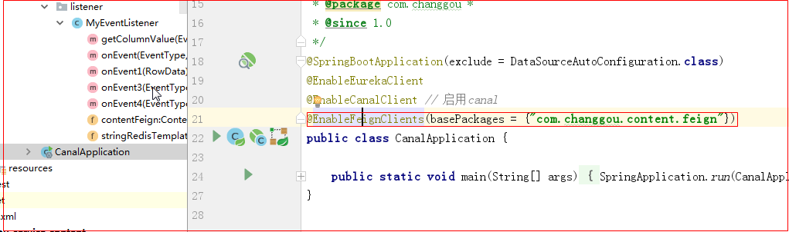


(3)同步实现

修改监听类CanalDataEventListener，实现监听广告的增删改，并根据增删改的数据使用feign查询对应分类的所有广告，将广告存入到Redis中，代码如下：


上图代码如下：

```java
@CanalEventListener
public class CanalDataEventListener {
    @Autowired
    private ContentFeign contentFeign;
    //字符串
    @Autowired
    private StringRedisTemplate stringRedisTemplate;

    //自定义数据库的 操作来监听
    //destination = "example"
    @ListenPoint(destination = "example",
            schema = "changgou_content",
            table = {"tb_content", "tb_content_category"},
            eventType = {
                    CanalEntry.EventType.UPDATE,
                    CanalEntry.EventType.DELETE,
                    CanalEntry.EventType.INSERT})
    public void onEventCustomUpdate(CanalEntry.EventType eventType, CanalEntry.RowData rowData) {
        //1.获取列名 为category_id的值
        String categoryId = getColumnValue(eventType, rowData);
        //2.调用feign 获取该分类下的所有的广告集合
        Result<List<Content>> categoryresut = contentFeign.findByCategory(Long.valueOf(categoryId));
        List<Content> data = categoryresut.getData();
        //3.使用redisTemplate存储到redis中
        stringRedisTemplate.boundValueOps("content_" + categoryId).set(JSON.toJSONString(data));
    }

    private String getColumnValue(CanalEntry.EventType eventType, CanalEntry.RowData rowData) {
        String categoryId = "";
        //判断 如果是删除  则获取beforlist
        if (eventType == CanalEntry.EventType.DELETE) {
            for (CanalEntry.Column column : rowData.getBeforeColumnsList()) {
                if (column.getName().equalsIgnoreCase("category_id")) {
                    categoryId = column.getValue();
                    return categoryId;
                }
            }
        } else {
            //判断 如果是添加 或者是更新 获取afterlist
            for (CanalEntry.Column column : rowData.getAfterColumnsList()) {
                if (column.getName().equalsIgnoreCase("category_id")) {
                    categoryId = column.getValue();
                    return categoryId;
                }
            }
        }
        return categoryId;
    }
}

```


测试：

修改数据库数据，可以看到Redis中的缓存跟着一起变化


# 5. 商品搜索

**学习目标**

- Elasticsearch安装

  ```
  docker安装Elasticsearch
  系统参数问题
  跨域操作
  ```

- IK分词器配置

- Kibana的使用->==DSL语句==

  ```
  Kibana->DSL语句操作->Elasticsearch
  ```

- ==ES导入商品搜索数据==

  ```
  Sku数据导入到Elasticsearch
  Map数据类型->Object
  ```

- ==关键词搜索->能够实现搜索流程代码的编写==

- ==分类统计搜索==


## 5.1. Elasticsearch 安装 

我们之前已经使用过elasticsearch了，这里不再对它进行介绍了，直接下载安装，本章节将采用Docker安装，不过在市面上还有很多采用linxu安装，关于linux安装，已经提供了安装手册，这里就不讲了。


(1)docker镜像下载

```properties
docker pull elasticsearch:5.6.8
```

注意：由于镜像有570MB，所以提供的虚拟机里已经下载好了该镜像，如下图：


(2)安装es容器

```properties
docker run -di --name=changgou_elasticsearch -p 9200:9200 -p 9300:9300 elasticsearch:5.6.8
```

 9200端口(Web管理平台端口)  9300(服务默认端口)

浏览器输入地址访问：`http://192.168.211.132:9200/`


(3)开启远程连接

上面完成安装后，es并不能正常使用，elasticsearch从5版本以后默认不开启远程连接，程序直接连接会报如下错误：

```java
failed to load elasticsearch nodes : org.elasticsearch.client.transport.NoNodeAvailableException: None of the configured nodes are available: [{#transport#-1}{5ttLpMhkRjKLkvoY7ltUWg}{192.168.211.132}{192.168.211.132:9300}]
```

我们需要修改es配置开启远程连接，代码如下：

登录容器

```properties
docker exec -it changgou_elasticsearch /bin/bash
```

查看目录结构 输入: dir

```properties
root@07f22eb41bb5:/usr/share/elasticsearch# dir
NOTICE.txt  README.textile  bin  config  data  lib  logs  modules  plugins
```

进入config目录

```properties
cd config
```

查看文件

```properties
root@07f22eb41bb5:/usr/share/elasticsearch/config# ls
elasticsearch.yml  log4j2.properties  scripts
```

修改elasticsearch.yml文件

```properties
root@07f22eb41bb5:/usr/share/elasticsearch/config# vi elasticsearch.yml
bash: vi: command not found
```

vi命令无法识别，因为docker容器里面没有该命令，我们可以安装该编辑器。

安装vim编辑器

```properties
apt-get update
apt-get install vim
```

安装好了后，修改elasticsearch.yml配置，如下图：

```properties
vi elasticsearch.yml
```

修改如下图：


同时添加下面一行代码：

```properties
cluster.name: my-application
```

重启docker

```properties
docker restart changgou_elasticsearch
```

(4)系统参数配置

重启后发现重启启动失败了，这时什么原因呢？这与我们刚才修改的配置有关，因为elasticsearch在启动的时候会进行一些检查，比如最多打开的文件的个数以及虚拟内存区域数量等等，如果你放开了此配置，意味着需要打开更多的文件以及虚拟内存，所以我们还需要系统调优 

修改vi /etc/security/limits.conf ，追加内容 (nofile是单个进程允许打开的最大文件个数 soft nofile 是软限制 hard nofile是硬限制 )

```properties
* soft nofile 65536
* hard nofile 65536
```

修改vi /etc/sysctl.conf，追加内容 (限制一个进程可以拥有的VMA(虚拟内存区域)的数量 )

```properties
vm.max_map_count=655360
```

执行下面命令 修改内核参数马上生效

```properties
sysctl -p
```

重新启动虚拟机，再次启动容器，发现已经可以启动并远程访问 

```properties
reboot
```


(5)跨域配置

修改elasticsearch/config下的配置文件：elasticsearch.yml，增加以下三句命令，并重启:

```properties
http.cors.enabled: true
http.cors.allow-origin: "*"
network.host: 192.168.211.132
```

其中：
http.cors.enabled: true：此步为允许elasticsearch跨域访问，默认是false。
http.cors.allow-origin: "*"：表示跨域访问允许的域名地址（*表示任意）。

重启

```properties
 docker restart changgou_elasticsearch
```


小提示：如果想让容器开启重启，可以执行下面命令

```properties
docker update --restart=always 容器名称或者容器id
```


## 5.2. IK分词器安装 

(1)安装ik分词器

IK分词器下载地址https://github.com/medcl/elasticsearch-analysis-ik/releases

将ik分词器上传到服务器上，然后解压，并改名字为ik

```properties
unzip elasticsearch-analysis-ik-5.6.8.zip
mv elasticsearch ik
```

将ik目录拷贝到docker容器的plugins目录下

```properties
docker cp ./ik changgou_elasticsearch:/usr/share/elasticsearch/plugins
```


(2)IK分词器测试

访问：`http://192.168.211.132:9200/_analyze?analyzer=ik_smart&pretty=true&text=我是程序员`


访问：`http://192.168.211.132:9200/_analyze?analyzer=ik_max_word&pretty=true&text=我是程序员`


## 5.3. Kibana使用-掌握DSL语句

我们上面使用的是elasticsearch-head插件实现数据查找的，但是elasticsearch-head的功能比较单一，我们这里需要一个更专业的工具实现对日志的实时分析，也就是我们接下来要讲的kibana。

Kibana 是一款开源的数据分析和可视化平台，它是 Elastic Stack 成员之一，设计用于和 Elasticsearch 协作。您可以使用 Kibana 对 Elasticsearch 索引中的数据进行搜索、查看、交互操作。您可以很方便的利用图表、表格及地图对数据进行多元化的分析和呈现。

Kibana 可以使大数据通俗易懂。它很简单，基于浏览器的界面便于您快速创建和分享动态数据仪表板来追踪 Elasticsearch 的实时数据变化。

搭建 Kibana 非常简单。您可以分分钟完成 Kibana 的安装并开始探索 Elasticsearch 的索引数据 — 没有代码、不需要额外的基础设施。


### 5.3.1. Kibana下载安装

我们项目中不再使用linux，直接使用Docker，所有这里就不演示在windows的下载安装了。

(1)镜像下载

```properties
docker pull docker.io/kibana:5.6.8
```

为了节省时间，虚拟机中已经存在该版本的镜像了.

(2)安装kibana容器

执行如下命令，开始安装kibana容器

```properties
docker run -it -d -e ELASTICSEARCH_URL=http://192.168.211.132:9200 --name kibana --restart=always -p 5601:5601 kibana:5.6.8
```

ELASTICSEARCH_URL=http://192.168.211.132:9200：是指链接的ES地址

restart=always:每次服务都会重启，也就是开启启动

5601:5601:端口号


(3)访问测试

访问`http://192.168.211.132:5601`如下：


### 5.3.2. Kibana使用

#### 5.3.2.1. 配置索引

要使用Kibana，您必须至少配置一个索引。索引用于标识Elasticsearch索引以运行搜索和分析。它们还用于配置字段。 


我们修改索引名称的匹配方式即可，下面2个选项不用勾选。点击create，会展示出当前配置的索引的域信息，如下图：


域的每个标题选项分别代表如下意思：


#### 5.3.2.2. 数据搜索

Discover为数据搜索部分，可以对日志信息进行搜索操作。


可以使用Discover实现数据搜索过滤和搜索条件显示以及关键词搜索，如下图：


#### 5.3.2.3. DSL语句使用

##### 5.3.2.3.1. Query DSL结构化查询介绍

Query DSL是一个Java开源框架用于构建类型安全的SQL查询语句。采用API代替传统的拼接字符串来构造查询语句。目前Querydsl支持的平台包括JPA,JDO，SQL，Java Collections，RDF，Lucene，Hibernate Search。elasticsearch提供了一整套基于JSON的查询DSL语言来定义查询。
Query DSL当作是一系列的抽象的查询表达式树(AST)特定查询能够包含其它的查询，(如 bool ), 有些查询能够包含过滤器(如 constant_score), 还有的可以同时包含查询和过滤器 (如 filtered). 都能够从ES支持查询集合里面选择任意一个查询或者是从过滤器集合里面挑选出任意一个过滤器, 这样的话，我们就可以构造出任意复杂（maybe 非常有趣）的查询了。


##### 5.3.2.3.2. 索引操作

查询所有索引

```properties
GET /_cat/indices?v
```

结果如下：


(2)删除某个索引

```properties
DELETE /skuinfo
```

效果如下：


(3)新增索引

```properties
PUT /user
```

效果如下：


(4)创建映射

```properties
PUT /user/userinfo/_mapping
{
  "properties": {
    "name":{
      "type": "text",
      "analyzer": "ik_smart",
      "search_analyzer": "ik_smart",
      "store": false
    },
    "city":{
      "type": "text",
      "analyzer": "ik_smart",
      "search_analyzer": "ik_smart",
      "store": false
    },
    "age":{
      "type": "long",
      "store": false
    },
    "description":{
      "type": "text",
      "analyzer": "ik_smart",
      "search_analyzer": "ik_smart",
      "store": false
    }
  }
}
```

效果如下：


(5)新增文档数据

```properties
PUT /user/userinfo/1
{
  "name":"李四",
  "age":22,
  "city":"深圳",
  "description":"李四来自湖北武汉！"
}
```

效果如下：


我们再增加3条记录：

```properties
# #新增文档数据 id=2
PUT /user/userinfo/2
{
  "name":"王五",
  "age":35,
  "city":"深圳",
  "description":"王五家住在深圳！"
}

# #新增文档数据 id=3
PUT /user/userinfo/3
{
  "name":"张三",
  "age":19,
  "city":"深圳",
  "description":"在深圳打工，来自湖北武汉"
}

# #新增文档数据 id=4
PUT /user/userinfo/4
{
  "name":"张三丰",
  "age":66,
  "city":"武汉",
  "description":"在武汉读书，家在武汉！"
}

# #新增文档数据 id=5
PUT /user/userinfo/5
{
  "name":"赵子龙",
  "age":77,
  "city":"广州",
  "description":"赵子龙来自深圳宝安，但是在广州工作！",
  "address":"广东省茂名市"
}

# #新增文档数据 id=6
PUT /user/userinfo/6
{
  "name":"赵毅",
  "age":55,
  "city":"广州",
  "description":"赵毅来自广州白云区，从事电子商务8年！"
}

# #新增文档数据 id=7
PUT /user/userinfo/7
{
  "name":"赵哈哈",
  "age":57,
  "city":"武汉",
  "description":"武汉赵哈哈，在深圳打工已有半年了，月薪7500！"
}
```


(6)修改数据

**a.替换操作**

更新数据可以使用之前的增加操作,这种操作会将整个数据替换掉，代码如下：

```properties
# #更新数据,id=4
PUT /user/userinfo/4
{
  "name":"张三丰",
  "description":"在武汉读书，家在武汉！在深圳工作！"
}
```

效果如下：


使用GET命令查看：

```properties
# #根据ID查询
GET /user/userinfo/4
```

效果如下：


**b.更新操作**

我们先使用下面命令恢复数据：

```properties
# #恢复文档数据 id=4
PUT /user/userinfo/4
{
  "name":"张三丰",
  "age":66,
  "city":"武汉",
  "description":"在武汉读书，家在武汉！"
}
```

使用POST更新某个列的数据

```properties
# #使用POST更新某个域的数据
POST /user/userinfo/4/_update
{
  "doc":{
    "name":"张三丰",
    "description":"在武汉读书，家在武汉！在深圳工作！"
  }
}
```

效果如下：


使用GET命令查看：

```properties
# #根据ID查询
GET /user/userinfo/4
```

效果如下：


(7)删除Document

```properties
# #删除数据
DELETE user/userinfo/7
```


##### 5.3.2.3.3. 数据查询

(1)查询所有数据

```properties
# #查询所有
GET /user/_search
```

效果如下：


(2)根据ID查询

```properties
# #根据ID查询
GET /user/userinfo/2
```

效果如下：


(3)Sort排序

```properties
# #搜索排序
GET /user/_search
{
  "query":{
    "match_all": {}
  },
  "sort":{
    "age":{
      "order":"desc"
    }
  }
}
```

效果如下：


(4)分页

```properties
# #分页实现
GET /user/_search
{
  "query":{
    "match_all": {}
  },
  "sort":{
    "age":{
      "order":"desc"
    }
  },
  "from": 0,
  "size": 2
}
```

解释：

from:从下N的记录开始查询

size:每页显示条数

效果如下：


##### 5.3.2.3.4. 过滤查询

(1)term过滤

term主要用于分词精确匹配，如字符串、数值、日期等（不适合情况：1.列中除英文字符外有其它值 2.字符串值中有冒号或中文 3.系统自带属性如_version） 

如下案例：

```json
# #过滤查询-term
GET _search
{
  "query":{
    "term":{
      "city":"武汉"
    }
  }
}
```

效果如下：


(2)terms 过滤

terms 跟 term 有点类似，但 terms 允许指定多个匹配条件。 如果某个字段指定了多个值，那么文档需要一起去做匹配 。

案例如下：

```json
# #过滤查询-terms 允许多个Term
GET _search
{
  "query":{
    "terms":{
      "city":
        [
          "武汉",
          "广州"
        ]
    }
  }
}
```

果如下：

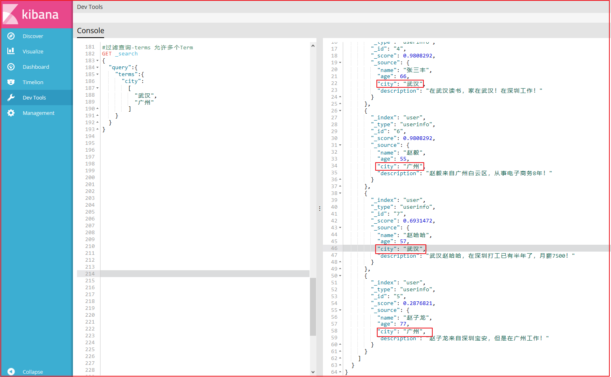


(3) range 过滤

range过滤允许我们按照指定范围查找一批数据。例如我们查询年龄范围

案例如下：

```json
# #过滤-range 范围过滤
# #gt表示> gte表示=>
# #lt表示< lte表示<=
GET _search
{
  "query":{
    "range": {
      "age": {
        "gte": 30,
        "lte": 57
      }
    }
  }
}
```

上图效果如下：


(4)exists过滤

exists 过滤可以用于查找拥有某个域的数据 

案例如下：

```json
# #过滤搜索 exists：是指包含某个域的数据检索
GET _search
{
  "query": {
    "exists":{
      "field":"address"
    }
  }
}
```

效果如下：


(5) bool 过滤

bool 过滤可以用来合并多个过滤条件查询结果的布尔逻辑，它包含一下操作符：

- must : 多个查询条件的完全匹配,相当于 and。
- must_not : 多个查询条件的相反匹配，相当于 not。
- should : 至少有一个查询条件匹配, 相当于 or。

这些参数可以分别继承一个过滤条件或者一个过滤条件的数组：

案例如下：

```json
# #过滤搜索 bool 
# #must : 多个查询条件的完全匹配,相当于 and。
# #must_not : 多个查询条件的相反匹配，相当于 not。
# #should : 至少有一个查询条件匹配, 相当于 or。
GET _search
{
  "query": {
    "bool": {
      "must": [
        {
          "term": {
            "city": {
              "value": "深圳"
            }
          }
        },
        {
          "range":{
            "age":{
              "gte":20,
              "lte":99
            }
          }
        }
      ]
    }
  }
}
```

效果如下：


(6) match_all 查询

可以查询到所有文档，是没有查询条件下的默认语句。 

案例如下：

```json
# #查询所有 match_all
GET _search
{
  "query": {
    "match_all": {}
  }
}
```

(7) match 查询

match查询是一个标准查询，不管你需要全文本查询还是精确查询基本上都要用到它。

如果你使用 match 查询一个全文本字段，它会在真正查询之前用分析器先分析match一下查询字符：

案例如下：

```json
# #字符串匹配
GET _search
{
  "query": {
    "match": {
      "description": "武汉"
    }
  }
}
```

效果如下：


(8)prefix 查询

以什么字符开头的，可以更简单地用 prefix ,例如查询所有以张开始的用户描述

案例如下：

```properties
# #前缀匹配 prefix
GET _search
{
  "query": {
    "prefix": {
      "name": {
        "value": "赵"
      }
    }
  }
}
```

效果如下：


(9)multi_match 查询

multi_match查询允许你做match查询的基础上同时搜索多个字段，在多个字段中同时查一个 

案例如下：

```json
# #多个域匹配搜索
GET _search
{
  "query": {
    "multi_match": {
      "query": "深圳",
      "fields": [
        "city",
        "description"
      ]
    }
  }
}
```

效果如下：


##### 5.3.2.3.5. 完整DSL语句代码

```properties
# #查看所有索引
GET /_cat/indices?v

# #删除某个索引
DELETE /skuinfo

# #新增索引
PUT /user

# #创建映射
PUT /user/userinfo/_mapping
{
  "properties": {
    "name":{
      "type": "text",
      "analyzer": "ik_smart",
      "search_analyzer": "ik_smart",
      "store": false
    },
    "city":{
      "type": "text",
      "analyzer": "ik_smart",
      "search_analyzer": "ik_smart",
      "store": false
    },
    "age":{
      "type": "long",
      "store": false
    },
    "description":{
      "type": "text",
      "analyzer": "ik_smart",
      "search_analyzer": "ik_smart",
      "store": false
    }
  }
}

# #新增文档数据 id=1
PUT /user/userinfo/1
{
  "name":"李四",
  "age":22,
  "city":"深圳",
  "description":"李四来自湖北武汉！"
}

# #新增文档数据 id=2
PUT /user/userinfo/2
{
  "name":"王五",
  "age":35,
  "city":"深圳",
  "description":"王五家住在深圳！"
}

# #新增文档数据 id=3
PUT /user/userinfo/3
{
  "name":"张三",
  "age":19,
  "city":"深圳",
  "description":"在深圳打工，来自湖北武汉"
}

# #新增文档数据 id=4
PUT /user/userinfo/4
{
  "name":"张三丰",
  "age":66,
  "city":"武汉",
  "description":"在武汉读书，家在武汉！"
}

# #新增文档数据 id=5
PUT /user/userinfo/5
{
  "name":"赵子龙",
  "age":77,
  "city":"广州",
  "description":"赵子龙来自深圳宝安，但是在广州工作！",
  "address":"广东省茂名市"
}

# #新增文档数据 id=6
PUT /user/userinfo/6
{
  "name":"赵毅",
  "age":55,
  "city":"广州",
  "description":"赵毅来自广州白云区，从事电子商务8年！"
}

# #新增文档数据 id=7
PUT /user/userinfo/7
{
  "name":"赵哈哈",
  "age":57,
  "city":"武汉",
  "description":"武汉赵哈哈，在深圳打工已有半年了，月薪7500！"
}

# #更新数据,id=4
PUT /user/userinfo/4
{
  "name":"张三丰",
  "description":"在武汉读书，家在武汉！在深圳工作！"
}


# #根据ID查询
GET /user/userinfo/4

# #恢复文档数据 id=4
PUT /user/userinfo/4
{
  "name":"张三丰",
  "age":66,
  "city":"武汉",
  "description":"在武汉读书，家在武汉！"
}

# #使用POST更新某个域的数据
POST /user/userinfo/4/_update
{
  "doc":{
    "name":"张三丰",
    "description":"在武汉读书，家在武汉！在深圳工作！"
  }
}

# #根据ID查询
GET /user/userinfo/4

# #删除数据
DELETE user/userinfo/4

# #查询所有
GET /user/_search

# #根据ID查询
GET /user/userinfo/2

# #搜索排序
GET /user/_search
{
  "query":{
    "match_all": {}
  },
  "sort":{
    "age":{
      "order":"desc"
    }
  }
}

# #分页实现
GET /user/_search
{
  "query":{
    "match_all": {}
  },
  "sort":{
    "age":{
      "order":"desc"
    }
  },
  "from": 0,
  "size": 2
}

# #过滤查询-term
GET _search
{
  "query":{
    "term":{
      "city":"武汉"
    }
  }
}

# #过滤查询-terms 允许多个Term
GET _search
{
  "query":{
    "terms":{
      "city":
        [
          "武汉",
          "广州"
        ]
    }
  }
}

# #过滤-range 范围过滤
# #gt表示> gte表示=>
# #lt表示< lte表示<=
GET _search
{
  "query":{
    "range": {
      "age": {
        "gte": 30,
        "lte": 57
      }
    }
  }
}


# #过滤搜索 exists：是指包含某个域的数据检索
GET _search
{
  "query": {
    "exists":{
      "field":"address"
    }
  }
}

# #过滤搜索 bool 
# #must : 多个查询条件的完全匹配,相当于 and。
# #must_not : 多个查询条件的相反匹配，相当于 not。
# #should : 至少有一个查询条件匹配, 相当于 or。
GET _search
{
  "query": {
    "bool": {
      "must": [
        {
          "term": {
            "city": {
              "value": "深圳"
            }
          }
        },
        {
          "range":{
            "age":{
              "gte":20,
              "lte":99
            }
          }
        }
      ]
    }
  }
}

# #查询所有 match_all
GET _search
{
  "query": {
    "match_all": {}
  }
}

# #字符串匹配
GET _search
{
  "query": {
    "match": {
      "description": "武汉"
    }
  }
}

# #前缀匹配 prefix
GET _search
{
  "query": {
    "prefix": {
      "name": {
        "value": "赵"
      }
    }
  }
}

# #多个域匹配搜索
GET _search
{
  "query": {
    "multi_match": {
      "query": "深圳",
      "fields": [
        "city",
        "description"
      ]
    }
  }
}
```


## 5.4. 数据导入ES

### 5.4.1. SpringData Elasticsearch介绍

#### 5.4.1.1. SpringData介绍

Spring Data是一个用于简化数据库访问，并支持云服务的开源框架。其主要目标是使得对数据的访问变得方便快捷，并支持map-reduce框架和云计算数据服务。 Spring Data可以极大的简化JPA的写法，可以在几乎不用写实现的情况下，实现对数据的访问和操作。除了CRUD外，还包括如分页、排序等一些常用的功能。

Spring Data的官网：http://projects.spring.io/spring-data/


#### 5.4.1.2. SpringData ES介绍

Spring Data ElasticSearch 基于 spring data API 简化 elasticSearch操作，将原始操作elasticSearch的客户端API 进行封装 。Spring Data为Elasticsearch项目提供集成搜索引擎。Spring Data Elasticsearch POJO的关键功能区域为中心的模型与Elastichsearch交互文档和轻松地编写一个存储库数据访问层。 官方网站：http://projects.spring.io/spring-data-elasticsearch/ 


### 5.4.2. 搜索工程搭建

创建搜索微服务工程，changgou-service-search,该工程主要提供搜索服务以及索引数据的更新操作。

(1)API工程搭建

首先创建search的API工程,在changgou-service-api中创建changgou-service-search-api，如下图：


pom.xml如下：

```xml
<?xml version="1.0" encoding="UTF-8"?>
<project xmlns="http://maven.apache.org/POM/4.0.0"
         xmlns:xsi="http://www.w3.org/2001/XMLSchema-instance"
         xsi:schemaLocation="http://maven.apache.org/POM/4.0.0 http://maven.apache.org/xsd/maven-4.0.0.xsd">
    <parent>
        <artifactId>changgou-service-api</artifactId>
        <groupId>com.changgou</groupId>
        <version>1.0-SNAPSHOT</version>
    </parent>
    <modelVersion>4.0.0</modelVersion>
    <artifactId>changgou-service-search-api</artifactId>

    <dependencies>
        <!--goods API依赖-->
        <dependency>
            <groupId>com.changgou</groupId>
            <artifactId>changgou-service-goods-api</artifactId>
            <version>1.0-SNAPSHOT</version>
        </dependency>
        <!--SpringDataES依赖-->
        <dependency>
            <groupId>org.springframework.boot</groupId>
            <artifactId>spring-boot-starter-data-elasticsearch</artifactId>
        </dependency>
    </dependencies>
</project>
```


(2)搜索微服务搭建

在changgou-service中搭建changgou-service-search微服务，并进行相关配置。

**pom.xml配置**

```xml
<?xml version="1.0" encoding="UTF-8"?>
<project xmlns="http://maven.apache.org/POM/4.0.0"
         xmlns:xsi="http://www.w3.org/2001/XMLSchema-instance"
         xsi:schemaLocation="http://maven.apache.org/POM/4.0.0 http://maven.apache.org/xsd/maven-4.0.0.xsd">
    <parent>
        <artifactId>changgou-service</artifactId>
        <groupId>com.changgou</groupId>
        <version>1.0-SNAPSHOT</version>
    </parent>
    <modelVersion>4.0.0</modelVersion>
    <artifactId>changgou-service-search</artifactId>

    <dependencies>
        <!--依赖search api-->
        <dependency>
            <groupId>com.changgou</groupId>
            <artifactId>changgou-service-search-api</artifactId>
            <version>1.0-SNAPSHOT</version>
        </dependency>
    </dependencies>

</project>
```


**application.yml配置**

```properties
server:
  port: 18086
spring:
  application:
    name: search
  data:
    elasticsearch:
      cluster-name: my-application
      cluster-nodes: 192.168.211.132:9300
eureka:
  client:
    service-url:
      defaultZone: http://127.0.0.1:7001/eureka
  instance:
    prefer-ip-address: true
feign:
  hystrix:
    enabled: true
# #超时配置
ribbon:
  ReadTimeout: 300000

hystrix:
  command:
    default:
      execution:
        isolation:
          thread:
            timeoutInMilliseconds: 10000
```

配置说明：

```properties
connection-timeout:服务连接超时时间
socket-connect：HTTP请求超时时间
ribbon.ReadTimeout: Feign请求读取数据超时时间
timeoutInMilliseconds：feign连接超时时间
cluster-name：Elasticsearch的集群节点名称，这里需要和Elasticsearch集群节点名称保持一致
cluster-nodes：Elasticsearch节点通信地址
```


(3)启动类

创建SearchApplication作为搜索微服务工程的启动类，代码如下：

```java
@SpringBootApplication(exclude={DataSourceAutoConfiguration.class})
@EnableEurekaClient
public class SearchApplication {

    public static void main(String[] args) {
        /**
        * Springboot整合Elasticsearch 在项目启动前设置一下的属性，防止报错
        * 解决netty冲突后初始化client时还会抛出异常
        * availableProcessors is already set to [12], rejecting [12]
        ***/
        System.setProperty("es.set.netty.runtime.available.processors", "false");
        SpringApplication.run(SearchApplication.class,args);
    }
}
```

分别创建对应的包，dao、service、controller，如下图：


### 5.4.3. 数据导入

现在需要将数据从数据库中查询出来，然后将数据导入到ES中。


数据导入流程如下：

```properties
1.请求search服务,调用数据导入地址
2.根据注册中心中的注册的goods服务的地址，使用Feign方式查询所有已经审核的Sku
3.使用SpringData Es将查询到的Sku集合导入到ES中
```


#### 5.4.3.1. 文档映射Bean创建

搜索商品的时候，会根据如下属性搜索数据,并且不是所有的属性都需要分词搜索，我们创建JavaBean，将JavaBean数据存入到ES中要以搜索条件和搜索展示结果为依据，部分关键搜索条件分析如下：

```properties
1.可能会根据商品名称搜素，而且可以搜索商品名称中的任意一个词语，所以需要分词
2.可能会根据商品分类搜索，商品分类不需要分词
3.可能会根据商品品牌搜索，商品品牌不需要分词
4.可能会根据商品商家搜索，商品商家不需要分词
5.可能根据规格进行搜索，规格时一个键值对结构，用Map
```

根据上面的分析，我们可以在changgou-service-search-api工程中创建com.changgou.search.pojo.SkuInfo，如下

```java
@Document(indexName = "skuinfo",type = "docs")
public class SkuInfo implements Serializable {
    //商品id，同时也是商品编号
    @Id
    private Long id;

    //SKU名称
    @Field(type = FieldType.Text, analyzer = "ik_smart")
    private String name;

    //商品价格，单位为：元
    @Field(type = FieldType.Double)
    private Long price;

    //库存数量
    private Integer num;

    //商品图片
    private String image;

    //商品状态，1-正常，2-下架，3-删除
    private String status;

    //创建时间
    private Date createTime;

    //更新时间
    private Date updateTime;

    //是否默认
    private String isDefault;

    //SPUID
    private Long spuId;

    //类目ID
    private Long categoryId;

    //类目名称
    @Field(type = FieldType.Keyword)
    private String categoryName;

    //品牌名称
    @Field(type = FieldType.Keyword)
    private String brandName;

    //规格
    private String spec;

    //规格参数
    private Map<String,Object> specMap;

	//...略
}
```


#### 5.4.3.2. 搜索审核通过Sku

修改changgou-service-goods微服务，添加搜索审核通过的Sku，供search微服务调用。下面都是针对goods微服务的操作。

修改SkuService接口，添加根据状态查询Sku方法，代码如下：

```java
/**
 * 根据状态查询SKU列表
 */
List<Sku> findByStatus(String status);
```


修改SkuServiceImpl，添加根据状态查询Sku实现方法，代码如下：

```java
/***
 * 根据状态查询SKU列表
 * @return
 */
@Override
public List<Sku> findByStatus(String status) {
    Sku sku = new Sku();
    sku.setStatus(status);
    return skuMapper.select(sku);
}
```


修改com.changgou.goods.controller.SkuController，添加根据审核状态查询Sku方法，代码如下：

```java
/***
 * 根据审核状态查询Sku
 * @param status
 * @return
 */
@GetMapping("/status/{status}")
public Result<List<Sku>> findByStatus(@PathVariable String status){
    List<Sku> list = skuService.findByStatus(status);
    return new Result<List<Sku>>(true,StatusCode.OK,"查询成功",list);
}
```


#### 5.4.3.3. Sku导入ES实现

(1) Feign配置

修改changgou-service-goods-api工程，在com.changgou.goods.feign.SkuFeign上添加findSkuList方法，代码如下：

```java
@FeignClient(name="goods")
@RequestMapping(value = "/sku")
public interface SkuFeign {

    /***
     * 根据审核状态查询Sku
     * @param status
     * @return
     */
    @GetMapping("/status/{status}")
    Result<List<Sku>> findByStatus(@PathVariable String status);
}
```


(2) Dao创建

修改changgou-service-search工程，创建com.changgou.search.dao.SkuEsMapper,该接口主要用于索引数据操作，主要使用它来实现将数据导入到ES索引库中，代码如下：

```java
@Repository
public interface SkuEsMapper extends ElasticsearchRepository<Sku,Long> {
}
```


(3) 服务层创建

修改changgou-service-search工程，创建com.changgou.search.service.SkuService,代码如下：

```java
public interface SkuService {

    /***
     * 导入SKU数据
     */
    void importSku();
}
```


修改changgou-service-search工程，创建com.changgou.search.service.impl.SkuServiceImpl,实现Sku数据导入到ES中，代码如下：

```java
@Service
public class SkuServiceImpl implements SkuService {

    @Autowired
    private SkuFeign skuFeign;

    @Autowired
    private SkuEsMapper skuEsMapper;

    /**
     * 导入sku数据到es
     */
    @Override
    public void importSku(){
        //调用changgou-service-goods微服务
        Result<List<Sku>> skuListResult = skuFeign.findByStatus("1");
        //将数据转成search.Sku
        List<SkuInfo> skuInfos=  JSON.parseArray(JSON.toJSONString(skuListResult.getData()),SkuInfo.class);
        for(SkuInfo skuInfo:skuInfos){
            Map<String, Object> specMap= JSON.parseObject(skuInfo.getSpec()) ;
            skuInfo.setSpecMap(specMap);
        }
        skuEsMapper.saveAll(skuInfos);
    }
}
```


(4)控制层配置

修改changgou-service-search工程，在com.changgou.search.controller.SkuController类中添加如下方法调用上述导入方法，代码如下：

```java
@RestController
@RequestMapping(value = "/search")
@CrossOrigin
public class SkuController {

    @Autowired
    private SkuService skuService;

    /**
     * 导入数据
     * @return
     */
    @GetMapping("/import")
    public Result search(){
        skuService.importSku();
        return new Result(true, StatusCode.OK,"导入数据到索引库中成功！");
    }
}
```


(5)修改启动类

启动类中需要开启Feign客户端，并且需要添加ES包扫描，代码如下：

```java
@SpringBootApplication(exclude={DataSourceAutoConfiguration.class})
@EnableEurekaClient
@EnableFeignClients(basePackages = "com.changgou.goods.feign")
@EnableElasticsearchRepositories(basePackages = "com.changgou.search.dao")
public class SearchApplication {

    public static void main(String[] args) {
        /**
        * Springboot整合Elasticsearch 在项目启动前设置一下的属性，防止报错
        * 解决netty冲突后初始化client时还会抛出异常
        * java.lang.IllegalStateException: availableProcessors is already set to [12], rejecting [12]
        ***/
        System.setProperty("es.set.netty.runtime.available.processors", "false");
        SpringApplication.run(SearchApplication.class,args);
    }
}
```


(6)测试

调用http://localhost:18085/search/import进行测试

打开es-head可以看到如下数据：


## 5.5. 关键字搜索


我们先使用SpringDataElasticsearch实现一个简单的搜索功能，先实现根据关键字搜索，从上面搜索图片可以看得到，每次搜索的时候，除了关键字外，还有可能有品牌、分类、规格等，后台接收搜索条件使用Map接收比较合适。


### 5.5.1. 服务层实现

修改search服务的com.changgou.search.service.SkuService,添加搜索方法，代码如下：

```java
/***
 * 搜索
 * @param searchMap
 * @return
 */
Map search(Map<String, String> searchMap);
```


修改search服务的com.changgou.search.service.impl.SkuServiceImpl,添加搜索实现方法,代码如下：

```java
@Autowired
private ElasticsearchTemplate esTemplate;

public Map search(Map<String, String> searchMap) {

    //1.获取关键字的值
    String keywords = searchMap.get("keywords");

    if (StringUtils.isEmpty(keywords)) {
        keywords = "华为";//赋值给一个默认的值
    }
    //2.创建查询对象 的构建对象
    NativeSearchQueryBuilder nativeSearchQueryBuilder = new NativeSearchQueryBuilder();

    //3.设置查询的条件

    nativeSearchQueryBuilder.withQuery(QueryBuilders.matchQuery("name", keywords));

    //4.构建查询对象
    NativeSearchQuery query = nativeSearchQueryBuilder.build();

    //5.执行查询
    AggregatedPage<SkuInfo> skuPage = esTemplate.queryForPage(query, SkuInfo.class);

    
    //6.返回结果
    Map resultMap = new HashMap<>();    
    resultMap.put("rows", skuPage.getContent());
    resultMap.put("total", skuPage.getTotalElements());
    resultMap.put("totalPages", skuPage.getTotalPages());

    return resultMap;
}
```


### 5.5.2. 控制层实现

修改com.changgou.search.controller.SkuController，在控制层调用Service层即可，代码如下：

```java
/**
 * 搜索
 * @param searchMap
 * @return
 */
@PostMapping
public Map search(@RequestBody(required = false) Map searchMap){
    return  skuService.search(searchMap);
}
```


### 5.5.3. 测试

使用Postman工具，输入http://localhost:18085/search

选中POST提交


## 5.6. 分类统计

### 5.6.1. 分类统计分析

看下面的SQL语句，我们在执行搜索的时候，第1条SQL语句是执行搜，第2条语句是根据分类名字分组查看有多少分类，大概执行了2个步骤就可以获取数据结果以及分类统计，我们可以发现他们的搜索条件完全一样。

```sql
-- 查询所有
SELECT * FROM tb_sku WHERE name LIKE '%手机%';
-- 根据分类名字分组查询
SELECT category_name FROM  tb_sku WHERE name LIKE '%手机%' GROUP BY category_name;
```


我们每次执行搜索的时候，需要显示商品分类名称，这里要显示的分类名称其实就是符合搜素条件的所有商品的分类集合，我们可以按照上面的实现思路，使用ES根据分组名称做一次分组查询即可实现。


### 5.6.2. 分类分组统计实现

修改search微服务的com.changgou.search.service.impl.SkuServiceImpl类，整体代码如下：

```java
public Map search(Map<String, String> searchMap) {

    //1.获取关键字的值
    String keywords = searchMap.get("keywords");

    if (StringUtils.isEmpty(keywords)) {
        keywords = "华为";//赋值给一个默认的值
    }
    //2.创建查询对象 的构建对象
    NativeSearchQueryBuilder nativeSearchQueryBuilder = new NativeSearchQueryBuilder();

    //3.设置查询的条件

    //设置分组条件  商品分类
    nativeSearchQueryBuilder.addAggregation(AggregationBuilders.terms("skuCategorygroup").field("categoryName").size(50));
    nativeSearchQueryBuilder.withQuery(QueryBuilders.matchQuery("name", keywords));

    //4.构建查询对象
    NativeSearchQuery query = nativeSearchQueryBuilder.build();

    //5.执行查询
    AggregatedPage<SkuInfo> skuPage = esTemplate.queryForPage(query, SkuInfo.class);

    //获取分组结果
    StringTerms stringTerms = (StringTerms) skuPage.getAggregation("skuCategorygroup");

    List<String> categoryList = new ArrayList<>();

    if (stringTerms != null) {
        for (StringTerms.Bucket bucket : stringTerms.getBuckets()) {
            String keyAsString = bucket.getKeyAsString();//分组的值
            categoryList.add(keyAsString);
        }
    }
    //6.返回结果
    Map resultMap = new HashMap<>();
    resultMap.put("categoryList", categoryList);
    resultMap.put("rows", skuPage.getContent());
    resultMap.put("total", skuPage.getTotalElements());
    resultMap.put("totalPages", skuPage.getTotalPages());

    return resultMap;
}
```

添加的代码如下:

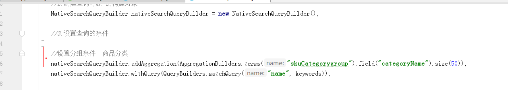


### 5.6.3. 测试

请求http://localhost:18086/search

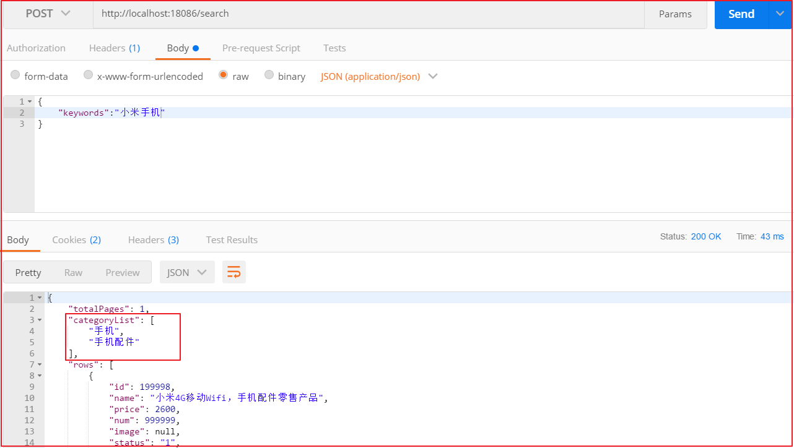


### 5.6.4. 代码优化

如上,可以将获取分组的代码进行提取,如下代码所示:

```java
/**
 * 获取分类列表数据
 *
 * @param stringTerms
 * @return
 */
private List<String> getStringsCategoryList(StringTerms stringTerms) {
    List<String> categoryList = new ArrayList<>();
    if (stringTerms != null) {
        for (StringTerms.Bucket bucket : stringTerms.getBuckets()) {
            String keyAsString = bucket.getKeyAsString();//分组的值
            categoryList.add(keyAsString);
        }
    }
    return categoryList;
}
```


在search方法中进行调用:

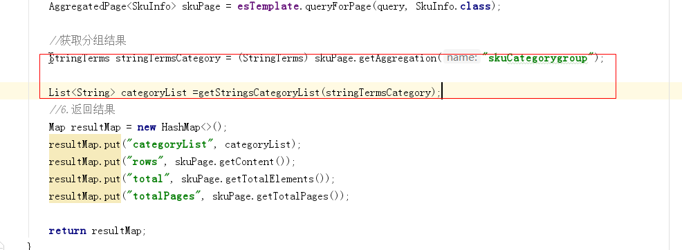

```java
List<String> categoryList = getStringsCategoryList(stringTermsCategory);
```


整体代码如下:

```java
public Map search(Map<String, String> searchMap) {

    //1.获取关键字的值
    String keywords = searchMap.get("keywords");

    if (StringUtils.isEmpty(keywords)) {
        keywords = "华为";//赋值给一个默认的值
    }
    //2.创建查询对象 的构建对象
    NativeSearchQueryBuilder nativeSearchQueryBuilder = new NativeSearchQueryBuilder();

    //3.设置查询的条件

    //设置分组条件  商品分类
    nativeSearchQueryBuilder.addAggregation(AggregationBuilders.terms("skuCategorygroup").field("categoryName").size(50));
    nativeSearchQueryBuilder.withQuery(QueryBuilders.matchQuery("name", keywords));

    //4.构建查询对象
    NativeSearchQuery query = nativeSearchQueryBuilder.build();

    //5.执行查询
    AggregatedPage<SkuInfo> skuPage = esTemplate.queryForPage(query, SkuInfo.class);

    //获取分组结果
    StringTerms stringTermsCategory = (StringTerms) skuPage.getAggregation("skuCategorygroup");

    List<String> categoryList =getStringsCategoryList(stringTermsCategory);
    //6.返回结果
    Map resultMap = new HashMap<>();
    resultMap.put("categoryList", categoryList);
    resultMap.put("rows", skuPage.getContent());
    resultMap.put("total", skuPage.getTotalElements());
    resultMap.put("totalPages", skuPage.getTotalPages());

    return resultMap;
}

private List<String> getStringsCategoryList(StringTerms stringTerms) {
    List<String> categoryList = new ArrayList<>();
    if (stringTerms != null) {
        for (StringTerms.Bucket bucket : stringTerms.getBuckets()) {
            String keyAsString = bucket.getKeyAsString();//分组的值
            categoryList.add(keyAsString);
        }
    }
    return categoryList;
}
```

# 6. 商品搜索（高级搜索）

**学习目标**

- 条件筛选
- 多条件搜索[品牌、规格条件搜索]
- 规格过滤
- 价格区间搜索
- 搜索分页
- 搜索排序
- 搜索高亮


## 6.1. 品牌统计


用户搜索的时候，除了使用分类搜索外，还有可能使用品牌搜索，所以我们还需要显示品牌数据和规格数据，品牌数据和规格数据的显示比较容易，都可以考虑使用分类统计的方式进行分组实现。


### 6.1.1. 品牌统计分析

看下面的SQL语句，我们在执行搜索的时候，第1条SQL语句是执行搜，第2条语句是根据品牌名字分组查看有多少品牌，大概执行了2个步骤就可以获取数据结果以及品牌统计，我们可以发现他们的搜索条件完全一样。

```sql
-- 查询所有
SELECT * FROM tb_sku WHERE name LIKE '%手机%';
-- 根据品牌名字分组查询
SELECT brand_name FROM  tb_sku WHERE name LIKE '%手机%' GROUP BY brand_name;
```

我们每次执行搜索的时候，需要显示商品品牌名称，这里要显示的品牌名称其实就是符合搜素条件的所有商品的品牌集合，我们可以按照上面的实现思路，使用ES根据分组名称做一次分组查询即可实现。


### 6.1.2. 品牌分组统计实现

修改search微服务的com.changgou.search.service.impl.SkuServiceImpl类，添加一个品牌分组搜索,如图:

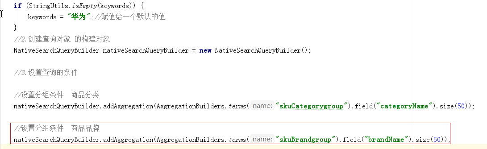


添加的代码如下:

```
//设置分组条件  商品品牌
nativeSearchQueryBuilder.addAggregation(AggregationBuilders.terms("skuBrandgroup").field("brandName").size(50));
```


执行获取分组结果:

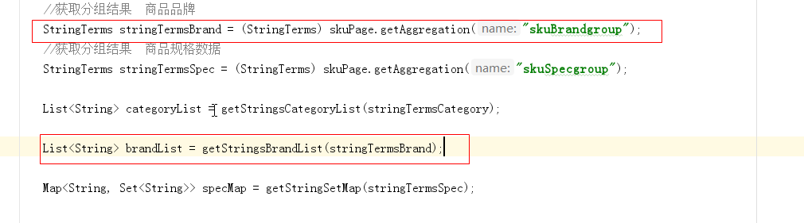

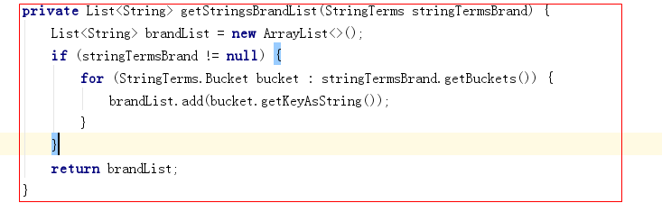


整体代码如下：

```java
public Map search(Map<String, String> searchMap) {

    //1.获取关键字的值
    String keywords = searchMap.get("keywords");

    if (StringUtils.isEmpty(keywords)) {
        keywords = "华为";//赋值给一个默认的值
    }
    //2.创建查询对象 的构建对象
    NativeSearchQueryBuilder nativeSearchQueryBuilder = new NativeSearchQueryBuilder();

    //3.设置查询的条件

    //设置分组条件  商品分类
    nativeSearchQueryBuilder.addAggregation(AggregationBuilders.terms("skuCategorygroup").field("categoryName").size(50));

    //设置分组条件  商品品牌
    nativeSearchQueryBuilder.addAggregation(AggregationBuilders.terms("skuBrandgroup").field("brandName").size(50));


    nativeSearchQueryBuilder.withQuery(QueryBuilders.matchQuery("name", keywords));

    //4.构建查询对象
    NativeSearchQuery query = nativeSearchQueryBuilder.build();

    //5.执行查询
    AggregatedPage<SkuInfo> skuPage = esTemplate.queryForPage(query, SkuInfo.class);

    //获取分组结果  商品分类
    StringTerms stringTermsCategory = (StringTerms) skuPage.getAggregation("skuCategorygroup");
    //获取分组结果  商品品牌
    StringTerms stringTermsBrand = (StringTerms) skuPage.getAggregation("skuBrandgroup");


    List<String> categoryList = getStringsCategoryList(stringTermsCategory);

    List<String> brandList = getStringsBrandList(stringTermsBrand);


    //6.返回结果
    Map resultMap = new HashMap<>();


    resultMap.put("categoryList", categoryList);
    resultMap.put("brandList", brandList);
    resultMap.put("rows", skuPage.getContent());
    resultMap.put("total", skuPage.getTotalElements());
    resultMap.put("totalPages", skuPage.getTotalPages());

    return resultMap;
}
/**
     * 获取品牌列表
     *
     * @param stringTermsBrand
     * @return
     */
private List<String> getStringsBrandList(StringTerms stringTermsBrand) {
    List<String> brandList = new ArrayList<>();
    if (stringTermsBrand != null) {
        for (StringTerms.Bucket bucket : stringTermsBrand.getBuckets()) {
            brandList.add(bucket.getKeyAsString());
        }
    }
    return brandList;
}

/**
     * 获取分类列表数据
     *
     * @param stringTerms
     * @return
     */
private List<String> getStringsCategoryList(StringTerms stringTerms) {
    List<String> categoryList = new ArrayList<>();
    if (stringTerms != null) {
        for (StringTerms.Bucket bucket : stringTerms.getBuckets()) {
            String keyAsString = bucket.getKeyAsString();//分组的值
            categoryList.add(keyAsString);
        }
    }
    return categoryList;
}

```


### 6.1.3. 测试

使用PostMan请求http://localhost:18086/search


## 6.2. 规格统计


用户搜索的时候，除了使用分类、品牌搜索外，还有可能使用规格搜索，所以我们还需要显示规格数据，规格数据的显示相比上面2种实现略微较难一些，需要对数据进行处理，我们也可以考虑使用分类统计和品牌统计的方式进行分组实现。


### 6.2.1. 规格统计分析

看下面的SQL语句，我们在执行搜索的时候，第1条SQL语句是执行搜，第2条语句是根据规格分组查看有多少规格，大概执行了2个步骤就可以获取数据结果以及规格统计，我们可以发现他们的搜索条件完全一样。

```sql
-- 查询所有
SELECT * FROM tb_sku WHERE name LIKE '%手机%';
-- 根据规格名字分组查询
SELECT spec FROM  tb_sku WHERE name LIKE '%手机%' GROUP BY spec;
```

上述SQL语句执行后的结果如下图：


获取到的规格数据我们发现有重复，不过也可以解决，解决思路如下：

```
1.获取所有规格数据
2.将所有规格数据转换成Map
3.定义一个Map<String,Set>,key是规格名字，防止重复所以用Map，valu是规格值，规格值有多个，所以用集合，为了防止规格重复，用Set去除重复
4.循环规格的Map，将数据填充到定义的Map<String,Set>中
```


我们每次执行搜索的时候，需要显示商品规格数据，这里要显示的规格数据其实就是符合搜素条件的所有商品的规格集合，我们可以按照上面的实现思路，使用ES根据分组名称做一次分组查询，并去除重复数据即可实现。


### 6.2.2. 规格统计分组实现

修改search微服务的com.changgou.search.service.impl.SkuServiceImpl类，添加一个规格分组搜索

如图:添加规格分组条件


上图代码如下:

```
//设置分组条件  商品的规格
nativeSearchQueryBuilder.addAggregation(AggregationBuilders.terms("skuSpecgroup").field("spec.keyword").size(100));
```


如图:获取规格分组结果:


封装调用分组结果的方法:

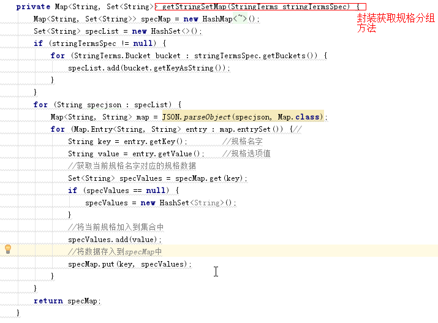

上图代码如下:

```java
/**
 * 获取规格列表数据
 *
 * @param stringTermsSpec
 * @return
 */
private Map<String, Set<String>> getStringSetMap(StringTerms stringTermsSpec) {
    Map<String, Set<String>> specMap = new HashMap<String, Set<String>>();
    Set<String> specList = new HashSet<>();
    if (stringTermsSpec != null) {
        for (StringTerms.Bucket bucket : stringTermsSpec.getBuckets()) {
            specList.add(bucket.getKeyAsString());
        }
    }
    for (String specjson : specList) {
        Map<String, String> map = JSON.parseObject(specjson, Map.class);
        for (Map.Entry<String, String> entry : map.entrySet()) {//
            String key = entry.getKey();        //规格名字
            String value = entry.getValue();    //规格选项值
            //获取当前规格名字对应的规格数据
            Set<String> specValues = specMap.get(key);
            if (specValues == null) {
                specValues = new HashSet<String>();
            }
            //将当前规格加入到集合中
            specValues.add(value);
            //将数据存入到specMap中
            specMap.put(key, specValues);
        }
    }
    return specMap;
}
```


整体代码如下:

```java
public Map search(Map<String, String> searchMap) {

    //1.获取关键字的值
    String keywords = searchMap.get("keywords");

    if (StringUtils.isEmpty(keywords)) {
        keywords = "华为";//赋值给一个默认的值
    }
    //2.创建查询对象 的构建对象
    NativeSearchQueryBuilder nativeSearchQueryBuilder = new NativeSearchQueryBuilder();

    //3.设置查询的条件

    //设置分组条件  商品分类
    nativeSearchQueryBuilder.addAggregation(AggregationBuilders.terms("skuCategorygroup").field("categoryName").size(50));

    //设置分组条件  商品品牌
    nativeSearchQueryBuilder.addAggregation(AggregationBuilders.terms("skuBrandgroup").field("brandName").size(50));

    //设置分组条件  商品的规格
    nativeSearchQueryBuilder.addAggregation(AggregationBuilders.terms("skuSpecgroup").field("spec.keyword").size(100));


    nativeSearchQueryBuilder.withQuery(QueryBuilders.matchQuery("name", keywords));

    //4.构建查询对象
    NativeSearchQuery query = nativeSearchQueryBuilder.build();

    //5.执行查询
    AggregatedPage<SkuInfo> skuPage = esTemplate.queryForPage(query, SkuInfo.class);

    //获取分组结果  商品分类
    StringTerms stringTermsCategory = (StringTerms) skuPage.getAggregation("skuCategorygroup");
    //获取分组结果  商品品牌
    StringTerms stringTermsBrand = (StringTerms) skuPage.getAggregation("skuBrandgroup");
    //获取分组结果  商品规格数据
    StringTerms stringTermsSpec = (StringTerms) skuPage.getAggregation("skuSpecgroup");

    List<String> categoryList = getStringsCategoryList(stringTermsCategory);

    List<String> brandList = getStringsBrandList(stringTermsBrand);

    Map<String, Set<String>> specMap = getStringSetMap(stringTermsSpec);


    //6.返回结果
    Map resultMap = new HashMap<>();

    resultMap.put("specMap", specMap);
    resultMap.put("categoryList", categoryList);
    resultMap.put("brandList", brandList);
    resultMap.put("rows", skuPage.getContent());
    resultMap.put("total", skuPage.getTotalElements());
    resultMap.put("totalPages", skuPage.getTotalPages());

    return resultMap;
}

/**
     * 获取品牌列表
     *
     * @param stringTermsBrand
     * @return
     */
private List<String> getStringsBrandList(StringTerms stringTermsBrand) {
    List<String> brandList = new ArrayList<>();
    if (stringTermsBrand != null) {
        for (StringTerms.Bucket bucket : stringTermsBrand.getBuckets()) {
            brandList.add(bucket.getKeyAsString());
        }
    }
    return brandList;
}

/**
     * 获取分类列表数据
     *
     * @param stringTerms
     * @return
     */
private List<String> getStringsCategoryList(StringTerms stringTerms) {
    List<String> categoryList = new ArrayList<>();
    if (stringTerms != null) {
        for (StringTerms.Bucket bucket : stringTerms.getBuckets()) {
            String keyAsString = bucket.getKeyAsString();//分组的值
            categoryList.add(keyAsString);
        }
    }
    return categoryList;
}

/**
     * 获取规格列表数据
     *
     * @param stringTermsSpec
     * @return
     */
private Map<String, Set<String>> getStringSetMap(StringTerms stringTermsSpec) {
    Map<String, Set<String>> specMap = new HashMap<String, Set<String>>();
    Set<String> specList = new HashSet<>();
    if (stringTermsSpec != null) {
        for (StringTerms.Bucket bucket : stringTermsSpec.getBuckets()) {
            specList.add(bucket.getKeyAsString());
        }
    }
    for (String specjson : specList) {
        Map<String, String> map = JSON.parseObject(specjson, Map.class);
        for (Map.Entry<String, String> entry : map.entrySet()) {//
            String key = entry.getKey();        //规格名字
            String value = entry.getValue();    //规格选项值
            //获取当前规格名字对应的规格数据
            Set<String> specValues = specMap.get(key);
            if (specValues == null) {
                specValues = new HashSet<String>();
            }
            //将当前规格加入到集合中
            specValues.add(value);
            //将数据存入到specMap中
            specMap.put(key, specValues);
        }
    }
    return specMap;
}
```


### 6.2.3. 测试

使用Postman测试访问http://localhost:18086/search  效果如下：


## 6.3. 条件筛选 


用户有可能会根据分类搜索、品牌搜索，还有可能根据规格搜索，以及价格搜索和排序操作。根据分类和品牌搜索的时候，可以直接根据指定域搜索，而规格搜索的域数据是不确定的，价格是一个区间搜索，所以我们可以分为三段时间，先实现分类、品牌搜素，再实现规格搜索，然后实现价格区间搜索。


### 6.3.1. 分类、品牌筛选

#### 6.3.1.1. 需求分析

页面每次向后台传入对应的分类和品牌，后台据分类和品牌进行条件过滤即可。


#### 6.3.1.2. 代码实现

修改搜索微服务com.changgou.search.service.impl.SkuServiceImpl的search方法，添加分类和品牌过滤,

添加过滤条件如下:

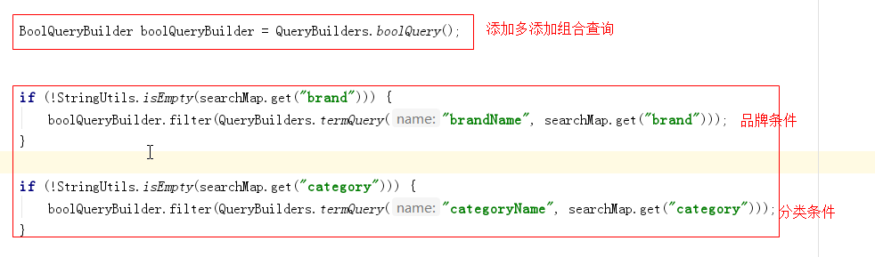

PS说明: 以上,我们建议使用filter ,它的搜索效率要优于must.可以参考官方文档说明:

https://www.elastic.co/guide/en/elasticsearch/reference/current/query-dsl-bool-query.html


执行过滤查询如下:


上图整体代码如下：

```java
@Override
public Map search(Map<String, String> searchMap) {

    //1.获取关键字的值
    String keywords = searchMap.get("keywords");

    if (StringUtils.isEmpty(keywords)) {
        keywords = "华为";//赋值给一个默认的值
    }
    //2.创建查询对象 的构建对象
    NativeSearchQueryBuilder nativeSearchQueryBuilder = new NativeSearchQueryBuilder();

    //3.设置查询的条件

    //设置分组条件  商品分类
    nativeSearchQueryBuilder.addAggregation(AggregationBuilders.terms("skuCategorygroup").field("categoryName").size(50));

    //设置分组条件  商品品牌
    nativeSearchQueryBuilder.addAggregation(AggregationBuilders.terms("skuBrandgroup").field("brandName").size(50));

    //设置分组条件  商品的规格
    nativeSearchQueryBuilder.addAggregation(AggregationBuilders.terms("skuSpecgroup").field("spec.keyword").size(1000));


    //设置主关键字查询
    nativeSearchQueryBuilder.withQuery(QueryBuilders.matchQuery("name", keywords));


    BoolQueryBuilder boolQueryBuilder = QueryBuilders.boolQuery();


    if (!StringUtils.isEmpty(searchMap.get("brand"))) {
        boolQueryBuilder.filter(QueryBuilders.termQuery("brandName", searchMap.get("brand")));
    }

    if (!StringUtils.isEmpty(searchMap.get("category"))) {
        boolQueryBuilder.filter(QueryBuilders.termQuery("categoryName", searchMap.get("category")));
    }

    //构建过滤查询
    nativeSearchQueryBuilder.withFilter(boolQueryBuilder);

    //4.构建查询对象
    NativeSearchQuery query = nativeSearchQueryBuilder.build();

    //5.执行查询
    AggregatedPage<SkuInfo> skuPage = esTemplate.queryForPage(query, SkuInfo.class);

    //获取分组结果  商品分类
    StringTerms stringTermsCategory = (StringTerms) skuPage.getAggregation("skuCategorygroup");
    //获取分组结果  商品品牌
    StringTerms stringTermsBrand = (StringTerms) skuPage.getAggregation("skuBrandgroup");
    //获取分组结果  商品规格数据
    StringTerms stringTermsSpec = (StringTerms) skuPage.getAggregation("skuSpecgroup");

    List<String> categoryList = getStringsCategoryList(stringTermsCategory);

    List<String> brandList = getStringsBrandList(stringTermsBrand);

    Map<String, Set<String>> specMap = getStringSetMap(stringTermsSpec);


    //6.返回结果
    Map resultMap = new HashMap<>();

    resultMap.put("specMap", specMap);
    resultMap.put("categoryList", categoryList);
    resultMap.put("brandList", brandList);
    resultMap.put("rows", skuPage.getContent());
    resultMap.put("total", skuPage.getTotalElements());
    resultMap.put("totalPages", skuPage.getTotalPages());

    return resultMap;
}
```


#### 6.3.1.3. 测试

测试效果如下：

访问地址：http://localhost:18085/search


此时只能搜到华为手环设备


### 6.3.2. 规格过滤

#### 6.3.2.1. 需求分析


规格这一块，需要向后台发送规格名字以及规格值，我们可以按照一定要求来发送数据，例如规格名字以特殊前缀提交到后台：`spec_网络制式：电信4G、spec_显示屏尺寸：4.0-4.9英寸`

后台接到数据后，可以根据前缀spec_来区分是否是规格，如果以`spec_xxx`开始的数据则为规格数据，需要根据指定规格找信息。


上图是规格的索引存储格式，真实数据在spechMap.规格名字.keyword中，所以找数据也是按照如下格式去找：

`spechMap.规格名字.keyword`

#### 6.3.2.2. 代码实现

修改com.changgou.search.service.impl.SkuServiceImpl的search方法，增加规格查询操作，代码如下：


```java
//规格过滤查询
if (searchMap != null) {
    for (String key : searchMap.keySet()) {
        if (key.startsWith("spec_")) {
            boolQueryBuilder.filter(QueryBuilders.termQuery("specMap." + key.substring(5) + ".keyword", searchMap.get(key)));
        }
    }
}
```


#### 6.3.2.3. 测试

访问地址：http://localhost:18085/search


### 6.3.3. 价格区间查询

#### 6.3.3.1. 需求分析


价格区间查询，每次需要将价格传入到后台，前端传入后台的价格大概是`price=0-500`或者`price=500-1000`依次类推，最后一个是`price=3000`,后台可以根据-分割，如果分割得到的结果最多有2个，第1个表示`x<price`，第2个表示`price<=y`。


1.3.2 代码实现

修改com.changgou.search.service.impl.SkuServiceImpl的search方法，增加价格区间查询操作，代码如下：


上图代码如下：

```java
//价格过滤查询
String price = searchMap.get("price");
if (!StringUtils.isEmpty(price)) {
    String[] split = price.split("-");
    if (!split[1].equalsIgnoreCase("*")) {
        boolQueryBuilder.filter(QueryBuilders.rangeQuery("price").from(split[0], true).to(split[1], true));
    } else {
        boolQueryBuilder.filter(QueryBuilders.rangeQuery("price").gte(split[0]));
    }
}
```


#### 6.3.3.2. 测试

访问地址：http://localhost:18085/search


效果如下(部分数据)：

```json
 [
        {
            "id": 1088256019328536576,
            "name": "守护宝幼儿安全手环",
            "price": 500,
            "num": 100,
            "image": "http://img10.360buyimg.com/n1/s450x450_jfs/t3457/294/236823024/102048/c97f5825/58072422Ndd7e66c4.jpg",
            "status": "1",
            "createTime": "2019-01-24T10:03:48.000+0000",
            "updateTime": "2019-01-24T10:03:48.000+0000",
            "isDefault": null,
            "spuId": 1088256019315953664,
            "categoryId": 1108,
            "categoryName": "户外工具",
            "brandName": "守护宝",
            "spec": "{\"颜色\":\"红\",\"机身内存\":\"64G\"}",
            "specMap": {
                "颜色": "红",
                "机身内存": "64G"
            }
        },
        {
            "id": 1088256014043713536,
            "name": "计步器小米手环，适用老人、小孩",
            "price": 800,
            "num": 100,
            "image": "http://img10.360buyimg.com/n1/s450x450_jfs/t3457/294/236823024/102048/c97f5825/58072422Ndd7e66c4.jpg",
            "status": "1",
            "createTime": "2019-01-24T10:03:47.000+0000",
            "updateTime": "2019-01-24T10:03:47.000+0000",
            "isDefault": null,
            "spuId": 1088256014026936320,
            "categoryId": 1192,
            "categoryName": "小家电",
            "brandName": "小米",
            "spec": "{\"颜色\":\"红\",\"机身内存\":\"64G\"}",
            "specMap": {
                "颜色": "红",
                "机身内存": "64G"
            }
        }
    ]
```


## 6.4. 搜索分页

### 6.4.1. 分页分析


页面需要实现分页搜索，所以我们后台每次查询的时候，需要实现分页。用户页面每次会传入当前页和每页查询多少条数据，当然如果不传入每页显示多少条数据，默认查询30条即可。


### 6.4.2. 分页实现

分页使用PageRequest.of( pageNo- 1, pageSize);实现，第1个参数表示第N页，从0开始，第2个参数表示每页显示多少条，实现代码如下：

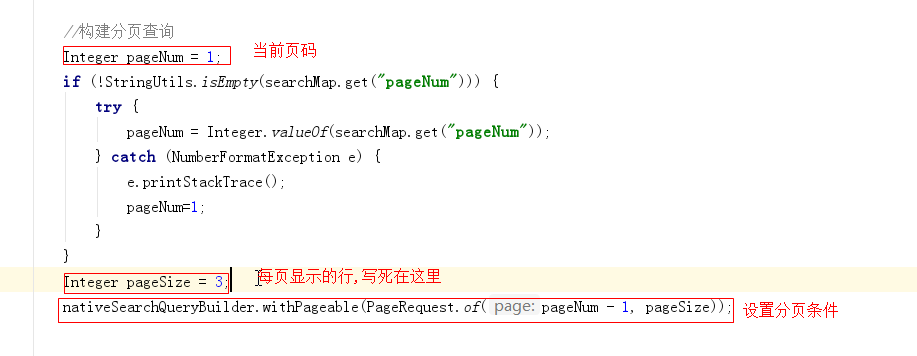

上图代码如下：

```java
 		//略

		//构建过滤查询
        nativeSearchQueryBuilder.withFilter(boolQueryBuilder);

        //构建分页查询
        Integer pageNum = 1;
        if (!StringUtils.isEmpty(searchMap.get("pageNum"))) {
            try {
                pageNum = Integer.valueOf(searchMap.get("pageNum"));
            } catch (NumberFormatException e) {
                e.printStackTrace();
                pageNum=1;
            }
        }
        Integer pageSize = 3;
        nativeSearchQueryBuilder.withPageable(PageRequest.of(pageNum - 1, pageSize));

		//略


        //4.构建查询对象
        NativeSearchQuery query = nativeSearchQueryBuilder.build();
		//略
```

测试如下:

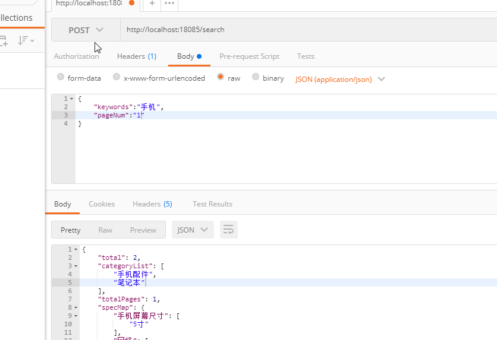


## 6.5. 搜索排序

### 6.5.1. 排序分析


排序这里总共有根据价格排序、根据评价排序、根据新品排序、根据销量排序，排序要想实现非常简单，只需要告知排序的域以及排序方式即可实现。

价格排序：只需要根据价格高低排序即可，降序价格高->低，升序价格低->高

评价排序：评价分为好评、中评、差评，可以在数据库中设计3个列，用来记录好评、中评、差评的量，每次排序的时候，好评的比例来排序，当然还要有条数限制，评价条数需要超过N条。

新品排序：直接根据商品的发布时间或者更新时间排序。

销量排序：销量排序除了销售数量外，还应该要有时间段限制。


### 6.5.2. 排序实现

这里我们不单独针对某个功能实现排序，我们只需要在后台接收2个参数，分别是排序域名字和排序方式，代码如下：

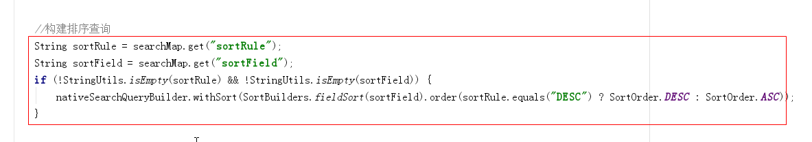

解释: 前端页面传递要排序的字段(field)和要排序的类型(ASC,DESC),后台接收.


上图代码如下：

```java
//构建排序查询
String sortRule = searchMap.get("sortRule");
String sortField = searchMap.get("sortField");
if (!StringUtils.isEmpty(sortRule) && !StringUtils.isEmpty(sortField)) {
    nativeSearchQueryBuilder.withSort(SortBuilders.fieldSort(sortField).order(sortRule.equals("DESC") ? SortOrder.DESC : SortOrder.ASC));
}
```

测试

根据价格降序：

```
{"keywords":"手机","pageNum":"1","sortRule":"DESC","sortField":"price"}
```

根据价格升序：

```
{"keywords":"手机","pageNum":"1","sortRule":"ASC","sortField":"price"}
```


## 6.6. 高亮显示

### 6.6.1. 高亮分析


高亮显示是指根据商品关键字搜索商品的时候，显示的页面对关键字给定了特殊样式，让它显示更加突出，如上图商品搜索中，关键字编程了红色，其实就是给定了红色样式。


### 6.6.2. 高亮搜索实现步骤解析

将之前的搜索换掉，换成高亮搜索，我们需要做3个步骤：

```
1.指定高亮域，也就是设置哪个域需要高亮显示
  设置高亮域的时候，需要指定前缀和后缀，也就是关键词用什么html标签包裹，再给该标签样式
2.高亮搜索实现
3.将非高亮数据替换成高亮数据
```

第1点，例如在百度中搜索数据的时候，会有2个地方高亮显示，分别是标题和描述，商城搜索的时候，只是商品名称高亮显示了。而高亮显示其实就是添加了样式，例如`<span style="color:red;">笔记本</span>`,而其中span开始标签可以称为前缀，span结束标签可以称为后缀。

第2点，高亮搜索使用ElasticsearchTemplate实现。

第3点，高亮搜索后，会搜出非高亮数据和高亮数据，高亮数据会加上第1点中的高亮样式，此时我们需要将非高亮数据换成高亮数据即可。例如非高亮:`华为笔记本性能超强悍`  高亮数据：`华为<span style="color:red;"笔记本</span>性能超强悍`,将非高亮的换成高亮的，到页面就能显示样式了。


### 6.6.3. 高亮代码实现

修改com.changgou.search.service.impl.SkuServiceImpl的search方法搜索代码，添加高亮显示的域:


上图代码如下：

```java
 //设置高亮条件
        nativeSearchQueryBuilder.withHighlightFields(new HighlightBuilder.Field("name"));
        nativeSearchQueryBuilder.withHighlightBuilder(new HighlightBuilder().preTags("<em style=\"color:red\">").postTags("</em>"));

        //设置主关键字查询
        nativeSearchQueryBuilder.withQuery(QueryBuilders.multiMatchQuery(keywords,"name","brandName","categoryName"));
```


修改 查询的方法,自定义结果映射器,入下图:


上图图片如下:

```
AggregatedPage<SkuInfo> skuPage = esTemplate.queryForPage(query, SkuInfo.class, new SearchResultMapperImpl());
```


自定义一个映射结果类实现接口,作用就是:自定义映射结果集,获取高亮的数据展示,如下图:


代码如下:

```java
public class SearchResultMapperImpl implements SearchResultMapper {
    @Override
    public <T> AggregatedPage<T> mapResults(SearchResponse response, Class<T> clazz, Pageable pageable) {
        List<T> content = new ArrayList<>();
        //如果没有结果返回为空
        if (response.getHits() == null || response.getHits().getTotalHits() <= 0) {
            return new AggregatedPageImpl<T>(content);
        }
        for (SearchHit searchHit : response.getHits()) {
            String sourceAsString = searchHit.getSourceAsString();
            SkuInfo skuInfo = JSON.parseObject(sourceAsString, SkuInfo.class);

            Map<String, HighlightField> highlightFields = searchHit.getHighlightFields();
            HighlightField highlightField = highlightFields.get("name");

            //有高亮则设置高亮的值
            if (highlightField != null) {
                StringBuffer stringBuffer = new StringBuffer();
                for (Text text : highlightField.getFragments()) {
                    stringBuffer.append(text.string());
                }
                skuInfo.setName(stringBuffer.toString());
            }
            content.add((T) skuInfo);
        }


        return new AggregatedPageImpl<T>(content, pageable, response.getHits().getTotalHits(), response.getAggregations(), response.getScrollId());
    }
}
```


### 6.6.4. 测试


效果如下：

```
"name": "HTC M8Sd (E8) 波尔多红 电信4G<span style=\"color:red\">手机</span> 双卡双待双通",
```


整体代码如下:

```java
@Service
public class SkuServiceImpl implements SkuService {
    @Autowired
    private SkuEsMapper skuEsMapper;

    @Autowired
    private SkuFeign skuFeign;

    @Override
    public void importSku() {
        Result<List<Sku>> listResult = skuFeign.findByStatus("1");

        List<Sku> data = listResult.getData();

        List<SkuInfo> skuInfos = JSON.parseArray(JSON.toJSONString(data), SkuInfo.class);

        for (SkuInfo skuInfo : skuInfos) {
            String spec = skuInfo.getSpec();
            Map map = JSON.parseObject(spec, Map.class);
            skuInfo.setSpecMap(map);
        }

        skuEsMapper.saveAll(skuInfos);
    }

    @Autowired
    private ElasticsearchTemplate esTemplate;

    /**
* @param searchMap
* @return
*/
    @Override
    public Map search(Map<String, String> searchMap) {

        //1.获取关键字的值
        String keywords = searchMap.get("keywords");

        if (StringUtils.isEmpty(keywords)) {
            keywords = "华为";//赋值给一个默认的值
        }
        //2.创建查询对象 的构建对象
        NativeSearchQueryBuilder nativeSearchQueryBuilder = new NativeSearchQueryBuilder();

        //3.设置查询的条件

        //设置分组条件  商品分类
        nativeSearchQueryBuilder.addAggregation(AggregationBuilders.terms("skuCategorygroup").field("categoryName").size(50));

        //设置分组条件  商品品牌
        nativeSearchQueryBuilder.addAggregation(AggregationBuilders.terms("skuBrandgroup").field("brandName").size(50));

        //设置分组条件  商品的规格
        nativeSearchQueryBuilder.addAggregation(AggregationBuilders.terms("skuSpecgroup").field("spec.keyword").size(500000));


        //设置高亮条件
        nativeSearchQueryBuilder.withHighlightFields(new HighlightBuilder.Field("name"));
        nativeSearchQueryBuilder.withHighlightBuilder(new HighlightBuilder().preTags("<em style=\"color:red\">").postTags("</em>"));

        //设置主关键字查询
        nativeSearchQueryBuilder.withQuery(QueryBuilders.multiMatchQuery(keywords,"name","brandName","categoryName"));


        BoolQueryBuilder boolQueryBuilder = QueryBuilders.boolQuery();


        if (!StringUtils.isEmpty(searchMap.get("brand"))) {
            boolQueryBuilder.filter(QueryBuilders.termQuery("brandName", searchMap.get("brand")));
        }

        if (!StringUtils.isEmpty(searchMap.get("category"))) {
            boolQueryBuilder.filter(QueryBuilders.termQuery("categoryName", searchMap.get("category")));
        }

        //规格过滤查询
        if (searchMap != null) {
            for (String key : searchMap.keySet()) {
                if (key.startsWith("spec_")) {
                    boolQueryBuilder.filter(QueryBuilders.termQuery("specMap." + key.substring(5) + ".keyword", searchMap.get(key)));
                }
            }
        }

        //价格过滤查询
        String price = searchMap.get("price");
        if (!StringUtils.isEmpty(price)) {
            String[] split = price.split("-");
            if (!split[1].equalsIgnoreCase("*")) {
                boolQueryBuilder.filter(QueryBuilders.rangeQuery("price").from(split[0], true).to(split[1], true));
            } else {
                boolQueryBuilder.filter(QueryBuilders.rangeQuery("price").gte(split[0]));
            }
        }


        //构建过滤查询
        nativeSearchQueryBuilder.withFilter(boolQueryBuilder);

        //构建分页查询
        Integer pageNum = 1;
        if (!StringUtils.isEmpty(searchMap.get("pageNum"))) {
            try {
                pageNum = Integer.valueOf(searchMap.get("pageNum"));
            } catch (NumberFormatException e) {
                e.printStackTrace();
                pageNum=1;
            }
        }
        Integer pageSize = 3;
        nativeSearchQueryBuilder.withPageable(PageRequest.of(pageNum - 1, pageSize));


        //构建排序查询
        String sortRule = searchMap.get("sortRule");
        String sortField = searchMap.get("sortField");
        if (!StringUtils.isEmpty(sortRule) && !StringUtils.isEmpty(sortField)) {
            nativeSearchQueryBuilder.withSort(SortBuilders.fieldSort(sortField).order(sortRule.equals("DESC") ? SortOrder.DESC : SortOrder.ASC));
        }


        //4.构建查询对象
        NativeSearchQuery query = nativeSearchQueryBuilder.build();

        //5.执行查询
        AggregatedPage<SkuInfo> skuPage = esTemplate.queryForPage(query, SkuInfo.class, new SearchResultMapperImpl());

        //获取分组结果  商品分类
        StringTerms stringTermsCategory = (StringTerms) skuPage.getAggregation("skuCategorygroup");
        //获取分组结果  商品品牌
        StringTerms stringTermsBrand = (StringTerms) skuPage.getAggregation("skuBrandgroup");
        //获取分组结果  商品规格数据
        StringTerms stringTermsSpec = (StringTerms) skuPage.getAggregation("skuSpecgroup");

        List<String> categoryList = getStringsCategoryList(stringTermsCategory);

        List<String> brandList = getStringsBrandList(stringTermsBrand);

        Map<String, Set<String>> specMap = getStringSetMap(stringTermsSpec);


        //6.返回结果
        Map resultMap = new HashMap<>();

        resultMap.put("specMap", specMap);
        resultMap.put("categoryList", categoryList);
        resultMap.put("brandList", brandList);
        resultMap.put("rows", skuPage.getContent());
        resultMap.put("total", skuPage.getTotalElements());
        resultMap.put("totalPages", skuPage.getTotalPages());

        return resultMap;
    }

    /**
* 获取品牌列表
*
* @param stringTermsBrand
* @return
*/
    private List<String> getStringsBrandList(StringTerms stringTermsBrand) {
        List<String> brandList = new ArrayList<>();
        if (stringTermsBrand != null) {
            for (StringTerms.Bucket bucket : stringTermsBrand.getBuckets()) {
                brandList.add(bucket.getKeyAsString());
            }
        }
        return brandList;
    }

    /**
* 获取分类列表数据
*
* @param stringTerms
* @return
*/
    private List<String> getStringsCategoryList(StringTerms stringTerms) {
        List<String> categoryList = new ArrayList<>();
        if (stringTerms != null) {
            for (StringTerms.Bucket bucket : stringTerms.getBuckets()) {
                String keyAsString = bucket.getKeyAsString();//分组的值
                categoryList.add(keyAsString);
            }
        }
        return categoryList;
    }

    /**
* 获取规格列表数据
*
* @param stringTermsSpec
* @return
*/
    private Map<String, Set<String>> getStringSetMap(StringTerms stringTermsSpec) {
        Map<String, Set<String>> specMap = new HashMap<String, Set<String>>();

        Set<String> specList = new HashSet<>();

        if (stringTermsSpec != null) {
            for (StringTerms.Bucket bucket : stringTermsSpec.getBuckets()) {
                specList.add(bucket.getKeyAsString());
            }
        }

        for (String specjson : specList) {
            Map<String, String> map = JSON.parseObject(specjson, Map.class);
            for (Map.Entry<String, String> entry : map.entrySet()) {//
                String key = entry.getKey();        //规格名字
                String value = entry.getValue();    //规格选项值
                //获取当前规格名字对应的规格数据
                Set<String> specValues = specMap.get(key);
                if (specValues == null) {
                    specValues = new HashSet<String>();
                }
                //将当前规格加入到集合中
                specValues.add(value);
                //将数据存入到specMap中
                specMap.put(key, specValues);
            }
        }
        return specMap;
    }
}
```


