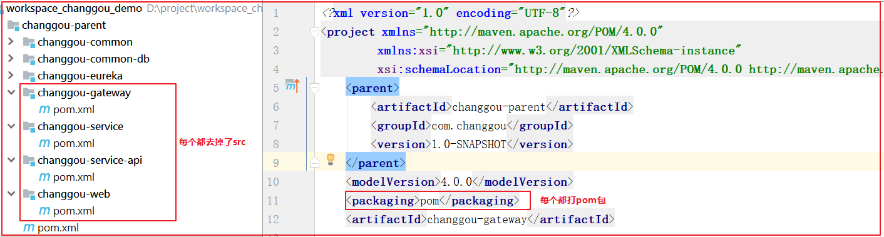
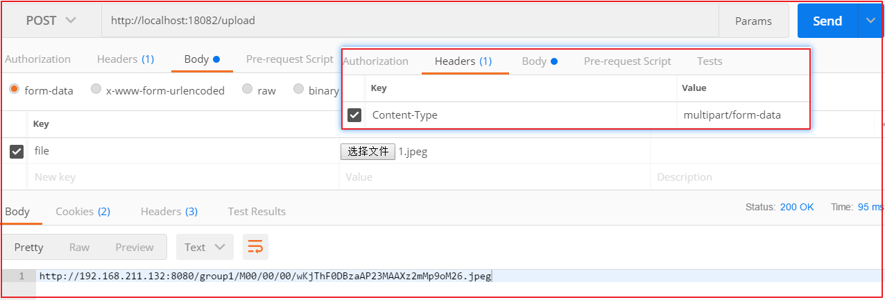

# 1. 框架搭建 

**学习目标**

- 了解电商
- 了解畅购架构
- 了解畅购工程结构
- 畅购工程搭建
- 商品微服务搭建
- 品牌增删改查


## 1.1. 走进电商

### 1.1.1. 电商行业分析

近年来，世界经济正向数字化转型，大力发展数字经济成为全球共识。党的十九大报告明确提出要建设“数字中国”“网络强国”，我国数字经济发展进入新阶段，市场规模位居全球第二，数字经济与实体经济深度融合，有力促进了供给侧结构性改革。电子商务是数字经济的重要组成部分，是数字经济最活跃、最集中的表现形式之一。2017年，在政府和市场共同推动下，我国电子商务发展更加注重效率、质量和创新，取得了一系列新的进展，在壮大数字经济、共建“一带一路”、助力乡村振兴、带动创新创业、促进经济转型升级等诸多方面发挥了重要作用，成为我国经济增长的新动力。
2017年，我国电子商务交易规模继续扩大，并保持高速增长态势。国家统计局数据显示，2017年全国电子商务交易额达29.16万亿元，同比增长11.7%；网上零售额7.18万亿元，同比增长32.2%。我国电子商务优势进一步扩大，网络零售规模全球最大、产业创新活力世界领先。数据显示，截止2017年底，全国网络购物用户规模达5.33亿，同比增长14.3%；非银行支付机构发生网络支付金额达143.26万亿元，同比增长44.32%；全国快递服务企业业务量累计完成400.6亿件，同比增长28%；电子商务直接从业人员和间接带动就业达4250万人。


2018天猫全天成交额记录


### 1.1.2. 电商系统技术特点

-  技术新

- 技术范围广

- 分布式

- 高并发、集群、负载均衡、高可用

- 海量数据

- 业务复杂

- 系统安全


### 1.1.3. 主要电商模式

**B2B**

```
B2B （ Business to Business）是指进行电子商务交易的供需双方都是商家（或企业、公司），她（他）们使用了互联网的技术或各种商务网络平台，完成商务交易的过程。电子商务是现代 B2B marketing的一种具体主要的表现形式。

案例：阿里巴巴、慧聪网
```


**C2C**

```
C2C即 Customer（Consumer） to Customer（Consumer），意思就是消费者个人间的电子商务行为。比如一个消费者有一台电脑，通过网络进行交易，把它出售给另外一个消费者，此种交易类型就称为C2C电子商务。

案例：淘宝、易趣、瓜子二手车
```


**B2C**

```
B2C是Business-to-Customer的缩写，而其中文简称为“商对客”。“商对客”是电子商务的一种模式，也就是通常说的直接面向消费者销售产品和服务商业零售模式。这种形式的电子商务一般以网络零售业为主，主要借助于互联网开展在线销售活动。B2C即企业通过互联网为消费者提供一个新型的购物环境——网上商店，消费者通过网络在网上购物、网上支付等消费行为。

案例：唯品会、乐蜂网
```


**C2B**

```
C2B（Consumer to Business，即消费者到企业），是互联网经济时代新的商业模式。这一模式改变了原有生产者（企业和机构）和消费者的关系，是一种消费者贡献价值（Create Value）， 企业和机构消费价值（Consume Value）。

C2B模式和我们熟知的供需模式（DSM, Demand SupplyModel）恰恰相反，真正的C2B 应该先有消费者需求产生而后有企业生产，即先有消费者提出需求，后有生产企业按需求组织生产。通常情况为消费者根据自身需求定制产品和价格，或主动参与产品设计、生产和定价，产品、价格等彰显消费者的个性化需求，生产企业进行定制化生产。

案例：海尔商城、 尚品宅配
```


**O2O**

```
O2O即Online To Offline（在线离线/线上到线下），是指将线下的商务机会与互联网结合，让互联网成为线下交易的平台，这个概念最早来源于美国。O2O的概念非常广泛，既可涉及到线上，又可涉及到线下,可以通称为O2O。主流商业管理课程均对O2O这种新型的商业模式有所介绍及关注。

案例：美团、饿了吗
```


**F2C**

```
F2C指的是Factory to customer，即从厂商到消费者的电子商务模式。
```


**B2B2C**

```
B2B2C是一种电子商务类型的网络购物商业模式，B是BUSINESS的简称，C是CUSTOMER的简称，第一个B指的是商品或服务的供应商，第二个B指的是从事电子商务的企业，C则是表示消费者。

案例：京东商城、天猫商城
注：我们《畅购电商系统开发》课程采用B2C模式，之后的项目实战《品优购电商系统开发实战》采用B2B2C模式。
```


## 1.2. 畅购-需求分析与系统设计

### 1.2.1. 需求分析

网站前台静态原型演示，打开`资料\页面\前台\project-changgou-portal-fis3-master`，首页`index.html`


网站管理后台静态原型演示:http://czpm.itcast.cn/青橙后台/#g=1&p=后台首页


打开`资料\页面\后台\project-changgou-cmm-fis3-master\pages`,首页`all-medical-main.html`


### 1.2.2. 系统设计

畅购商城属于B2C电商模式，运营商将自己的产品发布到网站上，会员注册后，在网站上将商品添加到购物车，并且下单，完成线上支付，用户还可以参与秒杀抢购。


#### 1.2.2.1. 前后端分离

网站后台的部分采用前后端分离方式。

以前的JavaWeb项目大多数都是java程序员又当爹又当妈，又搞前端，又搞后端。随着时代的发展，渐渐的许多大中小公司开始把前后端的界限分的越来越明确，前端工程师只管前端的事情，后端工程师只管后端的事情。正所谓术业有专攻，一个人如果什么都会，那么他毕竟什么都不精。

**对于后端java工程师：**

把精力放在设计模式，spring+springmvc，linux，mysql事务隔离与锁机制，mongodb，http/tcp，多线程，分布式架构，弹性计算架构，微服务架构，java性能优化，以及相关的项目管理等等。

**对于前端工程师：**

把精力放在html5，css3，vuejs，webpack，nodejs，Google V8引擎，javascript多线程，模块化，面向切面编程，设计模式，浏览器兼容性，性能优化等等。


我们在本课程中提供与项目课程配套的管理后台的前端代码，但是不讲解前端的内容。这样我们会将更多的精力放在**后端代码**的开发上！


#### 1.2.2.2. 技术架构


#### 1.2.2.3. 系统架构图


## 1.3. 畅购-框架搭建

### 1.3.1. 环境准备

（1）VMware Workstation Pro安装centos7 镜像

（2）安装docker

（3）拉取mySQL镜像，并创建容器

（4）客户端连接mysql容器，建库建表（建库建表语句在资源文件夹中提供）


虚拟机数据：

- 虚拟机IP:192.168.211.132

- 虚拟机账号：root     密码：123456
- 数据库端口:3306
- 数据库账号：root   密码：123456


数据库脚本：`资料\数据库脚本`


### 1.3.2. 项目结构说明


结构说明：

changgou-gateway

```
网关模块，根据网站的规模和需要，可以将综合逻辑相关的服务用网关路由组合到一起。在这里还可以做鉴权和限流相关操作。
```

changgou-service

```
微服务模块，该模块用于存放所有独立的微服务工程。
```

changgou-service_api

```
对应工程的JavaBean、Feign、以及Hystrix配置，该工程主要对外提供依赖。
```

changgou-transaction-fescar

```
分布式事务模块，将分布式事务抽取到该工程中，任何工程如需要使用分布式事务，只需依赖该工程即可。
```

changgou-web

```
web服务工程，对应功能模块如需要调用多个微服务，可以将他们写入到该模块中，例如网站后台、网站前台等
```


### 1.3.3. 公共工程搭建

#### 1.3.3.1. 父工程搭建

创建父工程 changgou-parent  ,pom.xml文件中增加配置

```xml
<?xml version="1.0" encoding="UTF-8"?>
<project xmlns="http://maven.apache.org/POM/4.0.0"
         xmlns:xsi="http://www.w3.org/2001/XMLSchema-instance"
         xsi:schemaLocation="http://maven.apache.org/POM/4.0.0 http://maven.apache.org/xsd/maven-4.0.0.xsd">
    <modelVersion>4.0.0</modelVersion>

    <groupId>com.changgou</groupId>
    <artifactId>changgou-parent</artifactId>
    <version>1.0-SNAPSHOT</version>

    <parent>
        <groupId>org.springframework.boot</groupId>
        <artifactId>spring-boot-starter-parent</artifactId>
        <version>2.1.4.RELEASE</version>
    </parent>

    <properties>
        <project.build.sourceEncoding>UTF-8</project.build.sourceEncoding>
        <maven.compiler.source>1.8</maven.compiler.source>
        <maven.compiler.target>1.8</maven.compiler.target>
        <skipTests>true</skipTests>
    </properties>

    <!--依赖包-->
    <dependencies>
        <!--测试包-->
        <dependency>
            <groupId>org.springframework.boot</groupId>
            <artifactId>spring-boot-starter-test</artifactId>
        </dependency>

        <!--fastjson-->
        <dependency>
            <groupId>com.alibaba</groupId>
            <artifactId>fastjson</artifactId>
            <version>1.2.51</version>
        </dependency>

        <!--swagger文档-->
        <dependency>
            <groupId>io.springfox</groupId>
            <artifactId>springfox-swagger2</artifactId>
            <version>2.6.1</version>
        </dependency>

        <dependency>
            <groupId>io.springfox</groupId>
            <artifactId>springfox-swagger-ui</artifactId>
            <version>2.6.1</version>
        </dependency>

        <!--
            http://localhost:9011/swagger-ui.html
        -->
    </dependencies>

    <dependencyManagement>
        <dependencies>
            <dependency>
                <groupId>org.springframework.cloud</groupId>
                <artifactId>spring-cloud-dependencies</artifactId>
                <version>Greenwich.SR1</version>
                <type>pom</type>
                <scope>import</scope>
            </dependency>
        </dependencies>
    </dependencyManagement>
</project>
```

删除src文件夹


#### 1.3.3.2. 其他公共模块搭建

创建changgou-gateway、changgou-service、changgou-service-api、changgou-web工程，工程全部为pom工程，并将所有工程的src文件删除。

pom.xml中打pom包

```xml
<packaging>pom</packaging>
```

项目结构如下：




### 1.3.4. Eureka微服务搭建

#### 1.3.4.1. pom.xml依赖

创建模块changgou-eureka ，pom.xml引入依赖 

```xml
<?xml version="1.0" encoding="UTF-8"?>
<project xmlns="http://maven.apache.org/POM/4.0.0"
         xmlns:xsi="http://www.w3.org/2001/XMLSchema-instance"
         xsi:schemaLocation="http://maven.apache.org/POM/4.0.0 http://maven.apache.org/xsd/maven-4.0.0.xsd">
    <parent>
        <artifactId>changgou_parent</artifactId>
        <groupId>com.changgou</groupId>
        <version>1.0-SNAPSHOT</version>
    </parent>
    <modelVersion>4.0.0</modelVersion>
    <artifactId>changgou_eureka</artifactId>

    <dependencies>
        <dependency>
            <groupId>org.springframework.cloud</groupId>
            <artifactId>spring-cloud-starter-netflix-eureka-server</artifactId>
        </dependency>
    </dependencies>
</project>
```


#### 1.3.4.2. appliation.yml配置

创建配置文件application.yml

```yaml
server:
  port: 7001
eureka:
  instance:
    hostname: 127.0.0.1
  client:
    register-with-eureka: false   #是否将自己注册到eureka中
    fetch-registry: false         #是否从eureka中获取信息
    service-url:
      defaultZone: http://${eureka.instance.hostname}:${server.port}/eureka/
```


#### 1.3.4.3. 启动类配置

创建包com.changgou  包下创建启动类EurekaApplication，代码如下：


上图代码如下：

```Java
@SpringBootApplication
@EnableEurekaServer
public class EurekaApplication {

    public static void main(String[] args) {
        SpringApplication.run(EurekaApplication.class);
    }
}
```


测试访问`http://localhost:7001/`,效果如下：


### 1.3.5. 公共模块搭建

#### 1.3.5.1. pom.xml依赖

创建公共子模块changgou-common，pom.xml引入依赖

```xml
<?xml version="1.0" encoding="UTF-8"?>
<project xmlns="http://maven.apache.org/POM/4.0.0"
         xmlns:xsi="http://www.w3.org/2001/XMLSchema-instance"
         xsi:schemaLocation="http://maven.apache.org/POM/4.0.0 http://maven.apache.org/xsd/maven-4.0.0.xsd">
    <parent>
        <artifactId>changgou-parent</artifactId>
        <groupId>com.changgou</groupId>
        <version>1.0-SNAPSHOT</version>
    </parent>
    <modelVersion>4.0.0</modelVersion>
    <artifactId>changgou-common</artifactId>

    <dependencies>
        <!--web起步依赖-->
        <dependency>
            <groupId>org.springframework.boot</groupId>
            <artifactId>spring-boot-starter-web</artifactId>
        </dependency>
        <!-- redis 使用-->
        <dependency>
            <groupId>org.springframework.boot</groupId>
            <artifactId>spring-boot-starter-data-redis</artifactId>
        </dependency>
        <!--eureka-client-->
        <dependency>
            <groupId>org.springframework.cloud</groupId>
            <artifactId>spring-cloud-starter-netflix-eureka-client</artifactId>
        </dependency>
        <!--openfeign-->
        <dependency>
            <groupId>org.springframework.cloud</groupId>
            <artifactId>spring-cloud-starter-openfeign</artifactId>
        </dependency>
        <!--微信支付-->
        <dependency>
            <groupId>com.github.wxpay</groupId>
            <artifactId>wxpay-sdk</artifactId>
            <version>0.0.3</version>
        </dependency>
        <!--httpclient支持-->
        <dependency>
            <groupId>org.apache.httpcomponents</groupId>
            <artifactId>httpclient</artifactId>
        </dependency>
    </dependencies>
</project>
```

公共子模块引入这些依赖后，其他微服务引入changgou-common后也自动引入了这些依赖


#### 1.3.5.2. 常用对象

创建entity包 ，在entity包下创建返回状态码实体类

```java
/**
 * 返回码
 */
public class StatusCode {
    public static final int OK = 20000;//成功
    public static final int ERROR = 20001;//失败
    public static final int LOGINERROR = 20002;//用户名或密码错误
    public static final int ACCESSERROR = 20003;//权限不足
    public static final int REMOTEERROR = 20004;//远程调用失败
    public static final int REPERROR = 20005;//重复操作
    public static final int NOTFOUNDERROR = 20006;//没有对应的抢购数据
}
```


包下建立类Result用于微服务返回结果给前端

```java
/**
 * 返回结果实体类
 */
public class Result<T> {
    private boolean flag;//是否成功
    private Integer code;//返回码
    private String message;//返回消息
    private T data;//返回数据

    public Result(boolean flag, Integer code, String message, Object data) {
        this.flag = flag;
        this.code = code;
        this.message = message;
        this.data = (T) data;
    }

    public Result(boolean flag, Integer code, String message) {
        this.flag = flag;
        this.code = code;
        this.message = message;
    }

    public Result() {
        this.flag = true;
        this.code = StatusCode.OK;
        this.message = "操作成功!";
    }

    // getter and setter.....
}
```


在entity包下建立类用于承载分页的数据结果

```java
/**
 * 分页结果类
 */
public class PageResult<T> {

    private Long total;//总记录数
    private List<T> rows;//记录

    public PageResult(Long total, List<T> rows) {
        this.total = total;
        this.rows = rows;
    }

    public PageResult() {
    }

    //getter and setter ......
}
```


当然，我们还可以将其他工具类都一起倒入到工程中，以后会用到，将`资料\工具类`中的所有类直接导入到entity包下。


### 1.3.6. 数据访问工程搭建

创建公共模块changgou-common-db ，pom文件引入依赖

```xml
<?xml version="1.0" encoding="UTF-8"?>
<project xmlns="http://maven.apache.org/POM/4.0.0"
         xmlns:xsi="http://www.w3.org/2001/XMLSchema-instance"
         xsi:schemaLocation="http://maven.apache.org/POM/4.0.0 http://maven.apache.org/xsd/maven-4.0.0.xsd">
    <parent>
        <artifactId>changgou-parent</artifactId>
        <groupId>com.changgou</groupId>
        <version>1.0-SNAPSHOT</version>
    </parent>
    <modelVersion>4.0.0</modelVersion>
    <artifactId>changgou-common-db</artifactId>

    <!--依赖-->
    <dependencies>
        <!--对changgou-common的依赖-->
        <dependency>
            <groupId>com.changgou</groupId>
            <artifactId>changgou-common</artifactId>
            <version>1.0-SNAPSHOT</version>
        </dependency>
        <!--通用mapper起步依赖-->
        <dependency>
            <groupId>tk.mybatis</groupId>
            <artifactId>mapper-spring-boot-starter</artifactId>
            <version>2.0.4</version>
        </dependency>
        <!--MySQL数据库驱动-->
        <dependency>
            <groupId>mysql</groupId>
            <artifactId>mysql-connector-java</artifactId>
        </dependency>
        <!--mybatis分页插件-->
        <dependency>
            <groupId>com.github.pagehelper</groupId>
            <artifactId>pagehelper-spring-boot-starter</artifactId>
            <version>1.2.3</version>
        </dependency>
    </dependencies>
</project>
```

这个公共模块是连接mysql数据库的公共微服务模块，所以需要连接mysql的微服务都继承自此工程。


### 1.3.7. 商品微服务搭建 

商品微服务主要是实现对商品的增删改查相关操作，以及商品相关信息的增删改查。


#### 1.3.7.1. 公共组件工程搭建

创建changgou-service-api子模块changgou-service-goods-api，并将`资料\javabean\changgou-service-goods-api`中的Pojo导入到工程中。


修改父工程changgou-service-api的pom.xml，添加`persistence-api`和`changgou-common`的依赖，代码如下：

```xml
<dependencies>
    <!--通用的common-->
    <dependency>
        <groupId>com.changgou</groupId>
        <artifactId>changgou-common</artifactId>
        <version>1.0-SNAPSHOT</version>
    </dependency>

    <!--每个工程都有Pojo，都需要用到该包对应的注解-->
    <dependency>
        <groupId>javax.persistence</groupId>
        <artifactId>persistence-api</artifactId>
        <version>1.0</version>
        <scope>compile</scope>
    </dependency>
</dependencies>
```


#### 1.3.7.2. 微服务工程搭建

修改changgou-service的pom.xml引入`changgou-common-db`的依赖，代码如下：

```xml
<!--依赖-->
<dependencies>
    <dependency>
        <groupId>com.changgou</groupId>
        <artifactId>changgou-common-db</artifactId>
        <version>1.0-SNAPSHOT</version>
    </dependency>
</dependencies>
```


在changgou-service中创建changgou-service-goods ，pom.xml引入依赖 

```xml
<?xml version="1.0" encoding="UTF-8"?>
<project xmlns="http://maven.apache.org/POM/4.0.0"
         xmlns:xsi="http://www.w3.org/2001/XMLSchema-instance"
         xsi:schemaLocation="http://maven.apache.org/POM/4.0.0 http://maven.apache.org/xsd/maven-4.0.0.xsd">
    <parent>
        <artifactId>changgou-service</artifactId>
        <groupId>com.changgou</groupId>
        <version>1.0-SNAPSHOT</version>
    </parent>
    <modelVersion>4.0.0</modelVersion>
    <artifactId>changgou-service-goods</artifactId>

    <!--依赖-->
    <dependencies>
        <dependency>
            <groupId>com.changgou</groupId>
            <artifactId>changgou-service-goods-api</artifactId>
            <version>1.0-SNAPSHOT</version>
        </dependency>
    </dependencies>
</project>
```


在resources下创建配置文件application.yml

```yaml
server:
  port: 18081
spring:
  application:
    name: goods
  datasource:
    driver-class-name: com.mysql.jdbc.Driver
    url: jdbc:mysql://192.168.211.132:3306/changgou_goods?useUnicode=true&characterEncoding=UTF-8&serverTimezone=UTC
    username: root
    password: 123456
eureka:
  client:
    service-url:
      defaultZone: http://127.0.0.1:7001/eureka
  instance:
    prefer-ip-address: true
feign:
  hystrix:
    enabled: true
mybatis:
  configuration:
    map-underscore-to-camel-case: true
  mapper-locations: classpath:mapper/*Mapper.xml
  type-aliases-package: com.changgou.goods.pojo
```


在包com.changgou.goods 包下创建启动类GoodsApplication，代码如下：


上图代码如下：

```JAVA
@SpringBootApplication
@EnableEurekaClient
@MapperScan(basePackages = {"com.changgou.goods.dao"})
public class GoodsApplication {
    public static void main(String[] args) {
        SpringApplication.run(GoodsApplication.class);
    }
}
```

***注意*** ：@MapperScan是`tk.mybatis.spring.annotation`包下的，用于扫描Mapper接口


启动`changgou-service-goods` 再访问`<http://localhost:7001/>`效果如下：


## 1.4. 商品微服务-品牌增删改查

### 1.4.1. 需求分析

创建商品微服务，实现对品牌表的增删改查功能。具体包括

（1）查询全部列表数据

（2）根据ID查询实体数据

（3）增加

（4）修改

（5）删除

（6）条件查询

（7）分页查询

（8）分页+条件查询

（9）公共异常处理


### 1.4.2. 表结构分析

品牌表：tb_brand

| 字段名称   | 字段含义   | 字段类型    | 字段长度 | 备注   |
| ------ | ------ | ------- | ---- | ---- |
| id     | 品牌id   | INT     |      |      |
| name   | 品牌名称   | VARCHAR |      |      |
| image  | 品牌图片地址 | VARCHAR |      |      |
| letter | 品牌的首字母 | CHAR    |      |      |
| seq    | 排序     | INT     |      |      |


### 1.4.3. 代码实现

上面品牌表对应Brand实体类

```java
@Table(name="tb_brand")
public class Brand implements Serializable{
	@Id
	private Integer id;//品牌id
	private String name;//品牌名称
	private String image;//品牌图片地址
	private String letter;//品牌的首字母
	private Integer seq;//排序
	
	// getter and setter  .....(省略)
}
```

@Table和@Id都是JPA注解，@Table用于配置表与实体类的映射关系，@Id用于标识主键属性。


#### 1.4.3.1. 品牌列表

(1)Dao创建

在changgou-service-goods微服务下创建com.changgou.goods.dao.BrandMapper接口，代码如下：

```java
public interface BrandMapper extends Mapper<Brand> {
}
```

继承了Mapper接口，就自动实现了增删改查的常用方法。


(2)业务层

创建com.changgou.goods.service.BrandService接口，代码如下：

```java
public interface BrandService {

    /***
     * 查询所有品牌
     * @return
     */
    List<Brand> findAll();
}
```


创建com.changgou.goods.service.impl.BrandServiceImpl实现类，代码如下：

```java
@Service
public class BrandServiceImpl {

    @Autowired
    private BrandMapper brandMapper;

    /**
     * 全部数据
     * @return
     */
    public List<Brand> findAll(){
        return brandMapper.selectAll();
    }
}
```


(3)控制层

控制层  com.changgou.goods包下创建controller包  ，包下创建类

```java
@RestController
@RequestMapping("/brand")
@CrossOrigin
public class BrandController {

    @Autowired
    private BrandService brandService;

    /***
     * 查询全部数据
     * @return
     */
    @GetMapping
    public Result<Brand> findAll(){
        List<Brand> brandList = brandService.findAll();
        return new Result<Brand>(true, StatusCode.OK,"查询成功",brandList) ;
    }
}
```


测试：http://localhost:18081/brand


#### 1.4.3.2. 根据ID查询品牌

(1)业务层

修改com.changgou.goods.service.BrandService接口，添加根据ID查询品牌数据方法，代码如下：

```java
/**
 * 根据ID查询
 * @param id
 * @return
 */
Brand findById(Integer id);
```


修改com.changgou.goods.service.impl.BrandServiceImpl新增方法，代码如下：

```java
/**
 * 根据ID查询
 * @param id
 * @return
 */
@Override
public Brand findById(Integer id){
    return  brandMapper.selectByPrimaryKey(id);
}
```


(2)控制层

BrandController新增方法

```java
/***
 * 根据ID查询品牌数据
 * @param id
 * @return
 */
@GetMapping("/{id}")
public Result<Brand> findById(@PathVariable Integer id){
    //根据ID查询
    Brand brand = brandService.findById(id);
    return new Result<Brand>(true,StatusCode.OK,"查询成功",brand);
}
```


测试：<http://localhost:18081/brand/14026>


#### 1.4.3.3. 新增品牌

(1)业务层

修改com.changgou.goods.service.BrandService，新增方法

```java
/***
 * 新增品牌
 * @param brand
 */
void add(Brand brand);
```


修改com.changgou.goods.service.impl.BrandServiceImpl，新增增加品牌方法代码如下：

```java
/**
 * 增加
 * @param brand
 */
@Override
public void add(Brand brand){
    brandMapper.insertSelective(brand);
}
```


(2) 控制层

BrandController新增方法

```java
/***
 * 新增品牌数据
 * @param brand
 * @return
 */
@PostMapping
public Result add(@RequestBody Brand brand){
    brandService.add(brand);
    return new Result(true,StatusCode.OK,"添加成功");
}
```


测试：http://localhost:18081/brand


#### 1.4.3.4. 修改品牌

(1)业务层

需改com.changgou.goods.service.BrandService,添加修改品牌方法，代码如下：

```java
/***
 * 修改品牌数据
 * @param brand
 */
void update(Brand brand);
```


修改com.changgou.goods.service.impl.BrandServiceImpl，添加修改品牌方法，代码如下：

```java
/**
 * 修改
 * @param brand
 */
@Override
public void update(Brand brand){
    brandMapper.updateByPrimaryKeySelective(brand);
}
```


(2)控制层

BrandController新增方法

```java
/***
 * 修改品牌数据
 * @param brand
 * @param id
 * @return
 */
@PutMapping(value="/{id}")
public Result update(@RequestBody Brand brand,@PathVariable Integer id){
    //设置ID
    brand.setId(id);
    //修改数据
    brandService.update(brand);
    return new Result(true,StatusCode.OK,"修改成功");
}
```


测试：http://localhost:18081/brand/325415


#### 1.4.3.5. 删除品牌

(1)业务层

修改com.changgou.goods.service.BrandService，添加删除品牌方法，代码如下：

```java
/***
 * 删除品牌
 * @param id
 */
void delete(Integer id);
```


修改com.changgou.goods.service.impl.BrandServiceImpl，新增删除品牌方法，代码如下：

```java
/**
 * 删除
 * @param id
 */
@Override
public void delete(Integer id){
    brandMapper.deleteByPrimaryKey(id);
}
```


(2)控制层

BrandController新增方法

```java
/***
 * 根据ID删除品牌数据
 * @param id
 * @return
 */
@DeleteMapping(value = "/{id}" )
public Result delete(@PathVariable Integer id){
    brandService.delete(id);
    return new Result(true,StatusCode.OK,"删除成功");
}
```


测试：http://localhost:18081/brand/325415


#### 1.4.3.6. 品牌列表条件查询

(1)业务层

修改com.changgou.goods.service.BrandService，增加根据条件搜索品牌方法，代码如下：

```java
/***
 * 多条件搜索品牌方法
 * @param brand
 * @return
 */
List<Brand> findList(Brand brand);
```


修改com.changgou.goods.service.impl.BrandServiceImpl，添加根据多条件搜索品牌方法的实现，代码如下：

```java
/**
 * 条件查询
 * @param brand
 * @return
 */
@Override
public List<Brand> findList(Brand brand){
    //构建查询条件
    Example example = createExample(brand);
    //根据构建的条件查询数据
    return brandMapper.selectByExample(example);
}


/**
 * 构建查询对象
 * @param brand
 * @return
 */
public Example createExample(Brand brand){
    Example example=new Example(Brand.class);
    Example.Criteria criteria = example.createCriteria();
    if(brand!=null){
        // 品牌名称
        if(!StringUtils.isEmpty(brand.getName())){
            criteria.andLike("name","%"+brand.getName()+"%");
        }
        // 品牌图片地址
        if(!StringUtils.isEmpty(brand.getImage())){
            criteria.andLike("image","%"+brand.getImage()+"%");
        }
        // 品牌的首字母
        if(!StringUtils.isEmpty(brand.getLetter())){
            criteria.andLike("letter","%"+brand.getLetter()+"%");
        }
        // 品牌id
        if(!StringUtils.isEmpty(brand.getLetter())){
            criteria.andEqualTo("id",brand.getId());
        }
        // 排序
        if(!StringUtils.isEmpty(brand.getSeq())){
            criteria.andEqualTo("seq",brand.getSeq());
        }
    }
    return example;
}
```


(2) 控制层

BrandController新增方法

```java
/***
 * 多条件搜索品牌数据
 * @param brand
 * @return
 */
@PostMapping(value = "/search" )
public Result<List<Brand>> findList(@RequestBody(required = false) Brand brand){
    List<Brand> list = brandService.findList(brand);
    return new Result<List<Brand>>(true,StatusCode.OK,"查询成功",list);
}
```


测试：http://localhost:18081/brand/search


#### 1.4.3.7. 品牌列表分页查询

(1)业务层

修改com.changgou.goods.service.BrandService添加分页方法，代码如下：

```java
/***
 * 分页查询
 * @param page
 * @param size
 * @return
 */
PageInfo<Brand> findPage(int page, int size);
```


修改com.changgou.goods.service.impl.BrandServiceImpl添加分页方法实现，代码如下：

```java
/**
 * 分页查询
 * @param page
 * @param size
 * @return
 */
@Override
public PageInfo<Brand> findPage(int page, int size){
    //静态分页
    PageHelper.startPage(page,size);
    //分页查询
    return new PageInfo<Brand>(brandMapper.selectAll());
}
```


(2)控制层

BrandController新增方法

```java
/***
 * 分页搜索实现
 * @param page:当前页
 * @param size:每页显示多少条
 * @return
 */
@GetMapping(value = "/search/{page}/{size}" )
public Result<PageInfo> findPage(@PathVariable  int page, @PathVariable  int size){
    //分页查询
    PageInfo<Brand> pageInfo = brandService.findPage(page, size);
    return new Result<PageInfo>(true,StatusCode.OK,"查询成功",pageInfo);
}
```


测试：http://localhost:18081/brand/search/1/3


#### 1.4.3.8. 品牌列表条件+分页查询

(1)业务层

修改com.changgou.goods.service.BrandService，增加多条件分页查询方法，代码如下：

```java
/***
 * 多条件分页查询
 * @param brand
 * @param page
 * @param size
 * @return
 */
PageInfo<Brand> findPage(Brand brand, int page, int size);
```


修改com.changgou.goods.service.impl.BrandServiceImpl，添加多条件分页查询方法代码如下：

```java
/**
 * 条件+分页查询
 * @param brand 查询条件
 * @param page 页码
 * @param size 页大小
 * @return 分页结果
 */
@Override
public PageInfo<Brand> findPage(Brand brand, int page, int size){
    //分页
    PageHelper.startPage(page,size);
    //搜索条件构建
    Example example = createExample(brand);
    //执行搜索
    return new PageInfo<Brand>(brandMapper.selectByExample(example));
}
```


(2)控制层

BrandController新增方法

```java
/***
 * 分页搜索实现
 * @param brand
 * @param page
 * @param size
 * @return
 */
@PostMapping(value = "/search/{page}/{size}" )
public Result<PageInfo> findPage(@RequestBody(required = false) Brand brand, @PathVariable  int page, @PathVariable  int size){
    //执行搜索
    PageInfo<Brand> pageInfo = brandService.findPage(brand, page, size);
    return new Result(true,StatusCode.OK,"查询成功",pageInfo);
}
```


测试：http://localhost:18081/brand/search/1/3


#### 1.4.3.9. 公共异常处理

为了使我们的代码更容易维护，我们创建一个类集中处理异常,该异常类可以创建在changgou-common工程中，创建com.changgou.framework.exception.BaseExceptionHandler，代码如下：

```java
@ControllerAdvice
public class BaseExceptionHandler {

    /***
     * 异常处理
     * @param e
     * @return
     */
    @ExceptionHandler(value = Exception.class)
    @ResponseBody
    public Result error(Exception e) {
        e.printStackTrace();
        return new Result(false, StatusCode.ERROR, e.getMessage());
    }
}
```

注意：@ControllerAdvice注解，全局捕获异常类，只要作用在@RequestMapping上，所有的异常都会被捕获。

# 2. 分布式文件存储FastDFS

**学习目标理**

- ==理解FastDFS工作流程==

  ```properties
  分布式文件管理系统
  	文件上传
  	文件下载
  	文件删除
  	文件缓存控制
  ```

- ==搭建文件上传微服务==

- 相册管理(实战)

- 规格参数管理(实战)

- 商品分类管理(实战)


## 2.1. FastDFS

### 2.1.1. FastDFS简介

#### 2.1.1.1. FastDFS体系结构 

FastDFS是一个开源的轻量级[分布式文件系统](https://baike.baidu.com/item/%E5%88%86%E5%B8%83%E5%BC%8F%E6%96%87%E4%BB%B6%E7%B3%BB%E7%BB%9F/1250388)，它对文件进行管理，功能包括：文件存储、文件同步、文件访问（文件上传、文件下载）等，解决了大容量存储和负载均衡的问题。特别适合以文件为载体的在线服务，如相册网站、视频网站等等。

FastDFS为互联网量身定制，充分考虑了冗余备份、负载均衡、线性扩容等机制，并注重高可用、高性能等指标，使用FastDFS很容易搭建一套高性能的文件服务器集群提供文件上传、下载等服务。

FastDFS 架构包括 Tracker server 和 Storage server。客户端请求 Tracker server 进行文件上传、下载，通过Tracker server 调度最终由 Storage server 完成文件上传和下载。

Tracker server 作用是负载均衡和调度，通过 Tracker server 在文件上传时可以根据一些策略找到Storage server 提供文件上传服务。可以将 tracker 称为追踪服务器或调度服务器。Storage server 作用是文件存储，客户端上传的文件最终存储在 Storage 服务器上，Storageserver 没有实现自己的文件系统而是利用操作系统的文件系统来管理文件。可以将storage称为存储服务器。


#### 2.1.1.2. 上传流程


客户端上传文件后存储服务器将文件 ID 返回给客户端，此文件 ID 用于以后访问该文件的索引信息。文件索引信息包括：组名，虚拟磁盘路径，数据两级目录，文件名。


**组名**：文件上传后所在的 storage 组名称，在文件上传成功后有storage 服务器返回，需要客户端自行保存。

**虚拟磁盘路径**：storage 配置的虚拟路径，与磁盘选项store_path*对应。如果配置了

store_path0 则是 M00，如果配置了 store_path1 则是 M01，以此类推。

**数据两级目录**：storage 服务器在每个虚拟磁盘路径下创建的两级目录，用于存储数据

文件。

**文件名**：与文件上传时不同。是由存储服务器根据特定信息生成，文件名包含：源存储

服务器 IP 地址、文件创建时间戳、文件大小、随机数和文件拓展名等信息。


### 2.1.2. FastDFS搭建

#### 2.1.2.1. 安装FastDFS镜像

我们使用Docker搭建FastDFS的开发环境,虚拟机中已经下载了fastdfs的镜像，可以通过`docker images`查看，如下图：


拉取镜像(已经下载了该镜像，大家无需下载了)

```properties
docker pull morunchang/fastdfs
```

运行tracker

```properties
docker run -d --name tracker --net=host morunchang/fastdfs sh tracker.sh
```

运行storage

```properties
docker run -d --name storage --net=host -e TRACKER_IP=192.168.211.132:22122 -e GROUP_NAME=group1 morunchang/fastdfs sh storage.sh
```

- 使用的网络模式是–net=host, 192.168.211.132是宿主机的IP
- group1是组名，即storage的组  
- 如果想要增加新的storage服务器，再次运行该命令，注意更换 新组名


#### 2.1.2.2. 配置Nginx

Nginx在这里主要提供对FastDFS图片访问的支持，Docker容器中已经集成了Nginx，我们需要修改nginx的配置,进入storage的容器内部，修改nginx.conf

```properties
docker exec -it storage  /bin/bash
```

进入后

```properties
vi /etc/nginx/conf/nginx.conf
```

添加以下内容


上图配置如下：

```properties
location ~ /M00 {
     root /data/fast_data/data;
     ngx_fastdfs_module;
}
```


禁止缓存：

```
add_header Cache-Control no-store;
```


退出容器

```
exit
```


重启storage容器

```properties
docker restart storage
```


查看启动容器`docker ps`

```properties
9f2391f73d97 morunchang/fastdfs "sh storage.sh" 12 minutes ago Up 12 seconds storage
e22a3c7f95ea morunchang/fastdfs "sh tracker.sh" 13 minutes ago Up 13 minutes tracker
```


开启启动设置

```properties
docker update --restart=always tracker
docker update --restart=always storage
```


### 2.1.3. 文件存储微服务

创建文件管理微服务changgou-service-file，该工程主要用于实现文件上传以及文件删除等功能。


#### 2.1.3.1. pom.xml依赖

修改pom.xml，引入依赖

```xml
<?xml version="1.0" encoding="UTF-8"?>
<project xmlns="http://maven.apache.org/POM/4.0.0"
         xmlns:xsi="http://www.w3.org/2001/XMLSchema-instance"
         xsi:schemaLocation="http://maven.apache.org/POM/4.0.0 http://maven.apache.org/xsd/maven-4.0.0.xsd">
    <parent>
        <artifactId>changgou-service</artifactId>
        <groupId>com.changgou</groupId>
        <version>1.0-SNAPSHOT</version>
    </parent>
    <modelVersion>4.0.0</modelVersion>
    <artifactId>changgou-service-file</artifactId>
    <description>文件上传工程</description>

    <!--依赖包-->
    <dependencies>
        <dependency>
            <groupId>net.oschina.zcx7878</groupId>
            <artifactId>fastdfs-client-java</artifactId>
            <version>1.27.0.0</version>
        </dependency>
        <dependency>
            <groupId>com.changgou</groupId>
            <artifactId>changgou-common</artifactId>
            <version>1.0-SNAPSHOT</version>
        </dependency>
    </dependencies>
</project>
```


#### 2.1.3.2. FastDFS配置

在resources文件夹下创建fasfDFS的配置文件fdfs_client.conf

```properties
connect_timeout=60
network_timeout=60
charset=UTF-8
http.tracker_http_port=8080
tracker_server=192.168.211.132:22122
```

connect_timeout：连接超时时间，单位为秒。

network_timeout：通信超时时间，单位为秒。发送或接收数据时。假设在超时时间后还不能发送或接收数据，则本次网络通信失败

charset： 字符集

http.tracker_http_port  ：.tracker的http端口

tracker_server： tracker服务器IP和端口设置


#### 2.1.3.3. application.yml配置

在resources文件夹下创建application.yml

```yaml
spring:
  servlet:
    multipart:
      max-file-size: 10MB
      max-request-size: 10MB
  application:
    name: file
server:
  port: 18082
eureka:
  client:
    service-url:
      defaultZone: http://127.0.0.1:7001/eureka
  instance:
    prefer-ip-address: true
feign:
  hystrix:
    enabled: true
```

max-file-size是单个文件大小，max-request-size是设置总上传的数据大小


#### 2.1.3.4. 启动类

创建com.changgou包，创建启动类FileApplication

```java
@SpringBootApplication(exclude={DataSourceAutoConfiguration.class})
@EnableEurekaClient
public class FileApplication {

    public static void main(String[] args) {
        SpringApplication.run(FileApplication.class);
    }
}
```

这里禁止了DataSource的加载创建。


### 2.1.4. 文件上传


#### 2.1.4.1. 文件信息封装

文件上传一般都有文件的名字、文件的内容、文件的扩展名、文件的md5值、文件的作者等相关属性，我们可以创建一个对象封装这些属性，代码如下：

创建`com.changgou.file.FastDFSFile`代码如下：

```java
public class FastDFSFile implements Serializable {

    //文件名字
    private String name;
    //文件内容
    private byte[] content;
    //文件扩展名
    private String ext;
    //文件MD5摘要值
    private String md5;
    //文件创建作者
    private String author;

    public FastDFSFile(String name, byte[] content, String ext, String md5, String author) {
        this.name = name;
        this.content = content;
        this.ext = ext;
        this.md5 = md5;
        this.author = author;
    }

    public FastDFSFile(String name, byte[] content, String ext) {
        this.name = name;
        this.content = content;
        this.ext = ext;
    }

    public FastDFSFile() {
    }

    //..get..set..toString
}
```


(可选)测试文件相关操作:

```java
package com.changgou.file.test;

import org.csource.fastdfs.*;
import org.junit.Test;

import java.io.*;
import java.net.InetSocketAddress;

/**
 * 描述
 *
 * @author 三国的包子
 * @version 1.0
 * @package PACKAGE_NAME *
 * @since 1.0
 */

public class FastdfsClientTest {

    /**
     * 文件上传
     *
     * @throws Exception
     */
    @Test
    public void upload() throws Exception {

        //加载全局的配置文件
        ClientGlobal.init("C:\\Users\\Administrator\\IdeaProjects\\beike\\changgou\\changgou-service\\changgou-service-file\\src\\main\\resources\\fdfs_client.conf");

        //创建TrackerClient客户端对象
        TrackerClient trackerClient = new TrackerClient();
        //通过TrackerClient对象获取TrackerServer信息
        TrackerServer trackerServer = trackerClient.getConnection();
        //获取StorageClient对象
        StorageClient storageClient = new StorageClient(trackerServer, null);

        //执行文件上传
        String[] jpgs = storageClient.upload_file("C:\\Users\\Administrator\\Pictures\\5b13cd6cN8e12d4aa.jpg", "jpg", null);

        for (String jpg : jpgs) {

            System.out.println(jpg);
        }

    }

    @Test
    public void delete() throws Exception {

        //加载全局的配置文件
        ClientGlobal.init("C:\\Users\\Administrator\\IdeaProjects\\beike\\changgou\\changgou-service\\changgou-service-file\\src\\main\\resources\\fdfs_client.conf");

        //创建TrackerClient客户端对象
        TrackerClient trackerClient = new TrackerClient();
        //通过TrackerClient对象获取TrackerServer信息
        TrackerServer trackerServer = trackerClient.getConnection();
        //获取StorageClient对象
        StorageClient storageClient = new StorageClient(trackerServer, null);
        //执行文件上传

        int group1 = storageClient.delete_file("group1", "M00/00/00/wKjThF1VEiyAJ0xzAANdC6JX9KA522.jpg");
        System.out.println(group1);
    }

    @Test
    public void download() throws Exception {

        //加载全局的配置文件
        ClientGlobal.init("C:\\Users\\Administrator\\IdeaProjects\\beike\\changgou\\changgou-service\\changgou-service-file\\src\\main\\resources\\fdfs_client.conf");

        //创建TrackerClient客户端对象
        TrackerClient trackerClient = new TrackerClient();
        //通过TrackerClient对象获取TrackerServer信息
        TrackerServer trackerServer = trackerClient.getConnection();
        //获取StorageClient对象
        StorageClient storageClient = new StorageClient(trackerServer, null);
        //执行文件上传
        byte[] bytes = storageClient.download_file("group1", "M00/00/00/wKjThF1VFfKAJRJDAANdC6JX9KA980.jpg");

        File file = new File("D:\\ceshi\\1234.jpg");

        FileOutputStream fileOutputStream = new FileOutputStream(file);

        BufferedOutputStream bufferedOutputStream = new BufferedOutputStream(fileOutputStream);

        bufferedOutputStream.write(bytes);

        bufferedOutputStream.close();

        fileOutputStream.close();
    }

    //获取文件的信息数据
    @Test
    public void getFileInfo() throws Exception {
        //加载全局的配置文件
        ClientGlobal.init("C:\\Users\\Administrator\\IdeaProjects\\beike\\changgou\\changgou-service\\changgou-service-file\\src\\main\\resources\\fdfs_client.conf");

        //创建TrackerClient客户端对象
        TrackerClient trackerClient = new TrackerClient();
        //通过TrackerClient对象获取TrackerServer信息
        TrackerServer trackerServer = trackerClient.getConnection();
        //获取StorageClient对象
        StorageClient storageClient = new StorageClient(trackerServer, null);
        //执行文件上传

        FileInfo group1 = storageClient.get_file_info("group1", "M00/00/00/wKjThF1VFfKAJRJDAANdC6JX9KA980.jpg");

        System.out.println(group1);

    }

    //获取组相关的信息
    @Test
    public void getGroupInfo() throws Exception {
        //加载全局的配置文件
        ClientGlobal.init("C:\\Users\\Administrator\\IdeaProjects\\beike\\changgou\\changgou-service\\changgou-service-file\\src\\main\\resources\\fdfs_client.conf");

        //创建TrackerClient客户端对象
        TrackerClient trackerClient = new TrackerClient();
        //通过TrackerClient对象获取TrackerServer信息
        TrackerServer trackerServer = trackerClient.getConnection();

        StorageServer group1 = trackerClient.getStoreStorage(trackerServer, "group1");
        System.out.println(group1.getStorePathIndex());

        //组对应的服务器的地址  因为有可能有多个服务器.
        ServerInfo[] group1s = trackerClient.getFetchStorages(trackerServer, "group1", "M00/00/00/wKjThF1VFfKAJRJDAANdC6JX9KA980.jpg");
        for (ServerInfo serverInfo : group1s) {
            System.out.println(serverInfo.getIpAddr());
            System.out.println(serverInfo.getPort());
        }
    }

    @Test
    public void getTrackerInfo() throws Exception {
        //加载全局的配置文件
        ClientGlobal.init("C:\\Users\\Administrator\\IdeaProjects\\beike\\changgou\\changgou-service\\changgou-service-file\\src\\main\\resources\\fdfs_client.conf");

        //创建TrackerClient客户端对象
        TrackerClient trackerClient = new TrackerClient();
        //通过TrackerClient对象获取TrackerServer信息
        TrackerServer trackerServer = trackerClient.getConnection();

        InetSocketAddress inetSocketAddress = trackerServer.getInetSocketAddress();
        System.out.println(inetSocketAddress);

    }


}
```


#### 2.1.4.2. 文件操作

创建com.changgou.util.FastDFSClient类,在该类中实现FastDFS信息获取以及文件的相关操作，代码如下：

(1)初始化Tracker信息

在`com.changgou.util.FastDFSClient`类中初始化Tracker信息,在类中添加如下静态块：

```java
/***
 * 初始化tracker信息
 */
static {
    try {
        //获取tracker的配置文件fdfs_client.conf的位置
        String filePath = new ClassPathResource("fdfs_client.conf").getPath();
        //加载tracker配置信息
        ClientGlobal.init(filePath);
    } catch (Exception e) {
        e.printStackTrace();
    }
}
```


(2)文件上传

在类中添加如下方法实现文件上传：

```java
/****
 * 文件上传
 * @param file : 要上传的文件信息封装->FastDFSFile
 * @return String[]
 *          1:文件上传所存储的组名
 *          2:文件存储路径
 */
public static String[] upload(FastDFSFile file){
    //获取文件作者
    NameValuePair[] meta_list = new NameValuePair[1];
    meta_list[0] =new NameValuePair(file.getAuthor());

    /***
     * 文件上传后的返回值
     * uploadResults[0]:文件上传所存储的组名，例如:group1
     * uploadResults[1]:文件存储路径,例如：M00/00/00/wKjThF0DBzaAP23MAAXz2mMp9oM26.jpeg
     */
    String[] uploadResults = null;
    try {
        //创建TrackerClient客户端对象
        TrackerClient trackerClient = new TrackerClient();
        //通过TrackerClient对象获取TrackerServer信息
        TrackerServer trackerServer = trackerClient.getConnection();
        //获取StorageClient对象
        StorageClient storageClient = new StorageClient(trackerServer, null);
        //执行文件上传
        uploadResults = storageClient.upload_file(file.getContent(), file.getExt(), meta_list);
    } catch (Exception e) {
        e.printStackTrace();
    }
    return uploadResults;
}
```

(3)获取文件信息

在类中添加如下方法实现获取文件信息：

```java
/***
 * 获取文件信息
 * @param groupName:组名
 * @param remoteFileName：文件存储完整名
 */
public static FileInfo getFile(String groupName,String remoteFileName){
    try {
        //创建TrackerClient对象
        TrackerClient trackerClient = new TrackerClient();
        //通过TrackerClient获得TrackerServer信息
        TrackerServer trackerServer =trackerClient.getConnection();
        //通过TrackerServer获取StorageClient对象
        StorageClient storageClient = new StorageClient(trackerServer,null);
        //获取文件信息
        return storageClient.get_file_info(groupName,remoteFileName);
    } catch (Exception e) {
        e.printStackTrace();
    }
    return null;
}
```

(4)文件下载

在类中添加如下方法实现文件下载：

```java
/***
 * 文件下载
 * @param groupName:组名
 * @param remoteFileName：文件存储完整名
 * @return
 */
public static InputStream downFile(String groupName,String remoteFileName){
    try {
        //创建TrackerClient对象
        TrackerClient trackerClient = new TrackerClient();
        //通过TrackerClient对象创建TrackerServer
        TrackerServer trackerServer = trackerClient.getConnection();
        //通过TrackerServer创建StorageClient
        StorageClient storageClient = new StorageClient(trackerServer,null);
        //通过StorageClient下载文件
        byte[] fileByte = storageClient.download_file(groupName, remoteFileName);
        //将字节数组转换成字节输入流
        return new ByteArrayInputStream(fileByte);
    } catch (Exception e) {
        e.printStackTrace();
    }
    return null;
}
```

(5)文件删除实现

```java
/***
 * 文件删除实现
 * @param groupName:组名
 * @param remoteFileName：文件存储完整名
 */
public static void deleteFile(String groupName,String remoteFileName){
    try {
        //创建TrackerClient对象
        TrackerClient trackerClient = new TrackerClient();
        //通过TrackerClient获取TrackerServer对象
        TrackerServer trackerServer = trackerClient.getConnection();
        //通过TrackerServer创建StorageClient
        StorageClient storageClient = new StorageClient(trackerServer,null);
        //通过StorageClient删除文件
        storageClient.delete_file(groupName,remoteFileName);
    } catch (Exception e) {
        e.printStackTrace();
    }
}
```

(6)获取组信息

```java
/***
 * 获取组信息
 * @param groupName :组名
 */
public static StorageServer getStorages(String groupName){
    try {
        //创建TrackerClient对象
        TrackerClient trackerClient = new TrackerClient();
        //通过TrackerClient获取TrackerServer对象
        TrackerServer trackerServer = trackerClient.getConnection();
        //通过trackerClient获取Storage组信息
        return trackerClient.getStoreStorage(trackerServer,groupName);
    } catch (Exception e) {
        e.printStackTrace();
    }
    return null;
}
```

(7)根据文件组名和文件存储路径获取Storage服务的IP、端口信息

```java
/***
 * 根据文件组名和文件存储路径获取Storage服务的IP、端口信息
 * @param groupName :组名
 * @param remoteFileName ：文件存储完整名
 */
public static ServerInfo[] getServerInfo(String groupName, String remoteFileName){
    try {
        //创建TrackerClient对象
        TrackerClient trackerClient = new TrackerClient();
        //通过TrackerClient获取TrackerServer对象
        TrackerServer trackerServer = trackerClient.getConnection();
        //获取服务信息
        return trackerClient.getFetchStorages(trackerServer,groupName,remoteFileName);
    } catch (Exception e) {
        e.printStackTrace();
    }
    return null;
}
```

(8)获取Tracker服务地址

```java
/***
 * 获取Tracker服务地址
 */
public static String getTrackerUrl(){
    try {
        //创建TrackerClient对象
        TrackerClient trackerClient = new TrackerClient();
        //通过TrackerClient获取TrackerServer对象
        TrackerServer trackerServer = trackerClient.getConnection();
        //获取Tracker地址
        return "http://"+trackerServer.getInetSocketAddress().getHostString()+":"+ClientGlobal.getG_tracker_http_port();
    } catch (IOException e) {
        e.printStackTrace();
    }
    return null;
}
```

(9)优化

我们可以发现，上面所有方法中都会涉及到获取TrackerServer或者StorageClient，我们可以把它们单独抽取出去，分别在类中添加如下2个方法：

```java
/***
 * 获取TrackerServer
 */
public static TrackerServer getTrackerServer() throws Exception{
    //创建TrackerClient对象
    TrackerClient trackerClient = new TrackerClient();
    //通过TrackerClient获取TrackerServer对象
    TrackerServer trackerServer = trackerClient.getConnection();
    return trackerServer;
}

/***
 * 获取StorageClient
 * @return
 * @throws Exception
 */
public static StorageClient getStorageClient() throws Exception{
    //获取TrackerServer
    TrackerServer trackerServer = getTrackerServer();
    //通过TrackerServer创建StorageClient
    StorageClient storageClient = new StorageClient(trackerServer,null);
    return storageClient;
}
```

修改其他方法，在需要使用TrackerServer和StorageClient的时候，直接调用上面的方法,完整代码如下：

```java
public class FastDFSClient {

    /***
     * 初始化tracker信息
     */
    static {
        try {
            //获取tracker的配置文件fdfs_client.conf的位置
            String filePath = new ClassPathResource("fdfs_client.conf").getPath();
            //加载tracker配置信息
            ClientGlobal.init(filePath);
        } catch (Exception e) {
            e.printStackTrace();
        }
    }

    /****
     * 文件上传
     * @param file : 要上传的文件信息封装->FastDFSFile
     * @return String[]
     *          1:文件上传所存储的组名
     *          2:文件存储路径
     */
    public static String[] upload(FastDFSFile file){
        //获取文件作者
        NameValuePair[] meta_list = new NameValuePair[1];
        meta_list[0] =new NameValuePair(file.getAuthor());

        /***
         * 文件上传后的返回值
         * uploadResults[0]:文件上传所存储的组名，例如:group1
         * uploadResults[1]:文件存储路径,例如：M00/00/00/wKjThF0DBzaAP23MAAXz2mMp9oM26.jpeg
         */
        String[] uploadResults = null;
        try {
            //获取StorageClient对象
            StorageClient storageClient = getStorageClient();
            //执行文件上传
            uploadResults = storageClient.upload_file(file.getContent(), file.getExt(), meta_list);
        } catch (Exception e) {
            e.printStackTrace();
        }
        return uploadResults;
    }


    /***
     * 获取文件信息
     * @param groupName:组名
     * @param remoteFileName：文件存储完整名
     */
    public static FileInfo getFile(String groupName,String remoteFileName){
        try {
            //获取StorageClient对象
            StorageClient storageClient = getStorageClient();
            //获取文件信息
            return storageClient.get_file_info(groupName,remoteFileName);
        } catch (Exception e) {
            e.printStackTrace();
        }
        return null;
    }

    /***
     * 文件下载
     * @param groupName:组名
     * @param remoteFileName：文件存储完整名
     * @return
     */
    public static InputStream downFile(String groupName,String remoteFileName){
        try {
            //获取StorageClient
            StorageClient storageClient = getStorageClient();
            //通过StorageClient下载文件
            byte[] fileByte = storageClient.download_file(groupName, remoteFileName);
            //将字节数组转换成字节输入流
            return new ByteArrayInputStream(fileByte);
        } catch (Exception e) {
            e.printStackTrace();
        }
        return null;
    }

    /***
     * 文件删除实现
     * @param groupName:组名
     * @param remoteFileName：文件存储完整名
     */
    public static void deleteFile(String groupName,String remoteFileName){
        try {
            //获取StorageClient
            StorageClient storageClient = getStorageClient();
            //通过StorageClient删除文件
            storageClient.delete_file(groupName,remoteFileName);
        } catch (Exception e) {
            e.printStackTrace();
        }
    }


    /***
     * 获取组信息
     * @param groupName :组名
     */
    public static StorageServer getStorages(String groupName){
        try {
            //创建TrackerClient对象
            TrackerClient trackerClient = new TrackerClient();
            //通过TrackerClient获取TrackerServer对象
            TrackerServer trackerServer = trackerClient.getConnection();
            //通过trackerClient获取Storage组信息
            return trackerClient.getStoreStorage(trackerServer,groupName);
        } catch (Exception e) {
            e.printStackTrace();
        }
        return null;
    }

    /***
     * 根据文件组名和文件存储路径获取Storage服务的IP、端口信息
     * @param groupName :组名
     * @param remoteFileName ：文件存储完整名
     */
    public static ServerInfo[] getServerInfo(String groupName, String remoteFileName){
        try {
            //创建TrackerClient对象
            TrackerClient trackerClient = new TrackerClient();
            //通过TrackerClient获取TrackerServer对象
            TrackerServer trackerServer = trackerClient.getConnection();
            //获取服务信息
            return trackerClient.getFetchStorages(trackerServer,groupName,remoteFileName);
        } catch (Exception e) {
            e.printStackTrace();
        }
        return null;
    }

    /***
     * 获取Tracker服务地址
     */
    public static String getTrackerUrl(){
        try {
            //创建TrackerClient对象
            TrackerClient trackerClient = new TrackerClient();
            //通过TrackerClient获取TrackerServer对象
            TrackerServer trackerServer = trackerClient.getConnection();
            //获取Tracker地址
            return "http://"+trackerServer.getInetSocketAddress().getHostString()+":"+ClientGlobal.getG_tracker_http_port();
        } catch (IOException e) {
            e.printStackTrace();
        }
        return null;
    }

    /***
     * 获取TrackerServer
     */
    public static TrackerServer getTrackerServer() throws Exception{
        //创建TrackerClient对象
        TrackerClient trackerClient = new TrackerClient();
        //通过TrackerClient获取TrackerServer对象
        TrackerServer trackerServer = trackerClient.getConnection();
        return trackerServer;
    }

    /***
     * 获取StorageClient
     * @return
     * @throws Exception
     */
    public static StorageClient getStorageClient() throws Exception{
        //获取TrackerServer
        TrackerServer trackerServer = getTrackerServer();
        //通过TrackerServer创建StorageClient
        StorageClient storageClient = new StorageClient(trackerServer,null);
        return storageClient;
    }
}
```


#### 2.1.4.3. 文件上传

创建一个FileController，在该控制器中实现文件上传操作，代码如下：

```java
@RestController
@CrossOrigin
public class FileController {

    /***
     * 文件上传
     * @return
     */
    @PostMapping(value = "/upload")
    public String upload(@RequestParam("file")MultipartFile file) throws Exception {
        //封装一个FastDFSFile
        FastDFSFile fastDFSFile = new FastDFSFile(
                file.getOriginalFilename(), //文件名字
                file.getBytes(),            //文件字节数组
                StringUtils.getFilenameExtension(file.getOriginalFilename()));//文件扩展名

        //文件上传
        String[] uploads = FastDFSClient.upload(fastDFSFile);
        //组装文件上传地址
        return FastDFSClient.getTrackerUrl()+"/"+uploads[0]+"/"+uploads[1];
    }
}
```


### 2.1.5. Postman测试文件上传

步骤：

1、选择post请求方式，输入请求地址  http://localhost:18082/upload

2、填写Headers

```properties
Key：Content-Type
Value：multipart/form-data
```

3、填写body

选择form-data   然后选择文件file   点击添加文件，最后发送即可。



访问`http://192.168.211.132:8080/group1/M00/00/00/wKjThF0DBzaAP23MAAXz2mMp9oM26.jpeg`如下图


注意，这里每次访问的端口是8080端口，访问的端口其实是storage容器的nginx端口，如果想修改该端口可以直接进入到storage容器，然后修改即可。

```properties
docker exec -it storage  /bin/bash
vi /etc/nginx/conf/nginx.conf
```


修改后重启storage即可根据自己修改的端口访问图片了。


## 2.2. 相册管理（实战）

### 2.2.1. 需求分析

相册是用于存储图片的管理单元，我们通常会将商品的图片先上传到相册中，在添加商品时可以直接在相册中选择，获取相册中的图片地址，保存到商品表中。

前端交互方式见管理后台的静态原型

### 2.2.2. 表结构分析

tb_album  表（**相册表**）

| 字段名称    | 字段含义 | 字段类型     | 备注 |
| ----------- | -------- | ------------ | ---- |
| id          | 编号     | BIGINT(20)   | 主键 |
| title       | 相册名称 | VARCHAR(100) |      |
| image       | 相册封面 | VARCHAR(100) |      |
| image_items | 图片列表 | TEXT         |      |

表中image_items数据如下示例：

```json
[
  {
    "url": "http://localhost:9101/img/1.jpg",
    "uid": 1548143143154,
    "status": "success"
  },
  {
    "url": "http://localhost:9101/img/7.jpg",
    "uid": 1548143143155,
    "status": "success"
  }
]
```


### 2.2.3. 代码实现

#### 2.2.3.1. Pojo

在changgou-service-goods-api工程中创建com.changgou.goods.pojo.Album，代码如下：

```java
@Table(name="tb_album")
public class Album implements Serializable{

	@Id
    @GeneratedValue(strategy = GenerationType.IDENTITY)
    @Column(name = "id")
	private Long id;//编号

    @Column(name = "title")
	private String title;//相册名称

    @Column(name = "image")
	private String image;//相册封面

    @Column(name = "image_items")
	private String imageItems;//图片列表

	//get...set...toString..
}
```


#### 2.2.3.2. Dao

在changgou-service-goods中创建com.changgou.goods.dao.AlbumMapper接口，代码如下：

```java
public interface AlbumMapper extends Mapper<Album> {
}
```


#### 2.2.3.3. 业务层

(1)业务层接口

在changgou-service-goods中创建com.changgou.goods.service.AlbumService接口，并添加常用方法，代码如下：

```java
public interface AlbumService {

    /***
     * Album多条件分页查询
     * @param album
     * @param page
     * @param size
     * @return
     */
    PageInfo<Album> findPage(Album album, int page, int size);

    /***
     * Album分页查询
     * @param page
     * @param size
     * @return
     */
    PageInfo<Album> findPage(int page, int size);

    /***
     * Album多条件搜索方法
     * @param album
     * @return
     */
    List<Album> findList(Album album);

    /***
     * 删除Album
     * @param id
     */
    void delete(Long id);

    /***
     * 修改Album数据
     * @param album
     */
    void update(Album album);

    /***
     * 新增Album
     * @param album
     */
    void add(Album album);

    /**
     * 根据ID查询Album
     * @param id
     * @return
     */
     Album findById(Long id);

    /***
     * 查询所有Album
     * @return
     */
    List<Album> findAll();
}
```


(2)业务层实现类

在changgou-service-goods中创建com.changgou.goods.service.impl.AlbumServiceImpl，并实现接口方法，代码如下：

```java
@Service
public class AlbumServiceImpl implements AlbumService {

    @Autowired
    private AlbumMapper albumMapper;


    /**
     * Album条件+分页查询
     * @param album 查询条件
     * @param page 页码
     * @param size 页大小
     * @return 分页结果
     */
    @Override
    public PageInfo<Album> findPage(Album album, int page, int size){
        //分页
        PageHelper.startPage(page,size);
        //搜索条件构建
        Example example = createExample(album);
        //执行搜索
        return new PageInfo<Album>(albumMapper.selectByExample(example));
    }

    /**
     * Album分页查询
     * @param page
     * @param size
     * @return
     */
    @Override
    public PageInfo<Album> findPage(int page, int size){
        //静态分页
        PageHelper.startPage(page,size);
        //分页查询
        return new PageInfo<Album>(albumMapper.selectAll());
    }

    /**
     * Album条件查询
     * @param album
     * @return
     */
    @Override
    public List<Album> findList(Album album){
        //构建查询条件
        Example example = createExample(album);
        //根据构建的条件查询数据
        return albumMapper.selectByExample(example);
    }


    /**
     * Album构建查询对象
     * @param album
     * @return
     */
    public Example createExample(Album album){
        Example example=new Example(Album.class);
        Example.Criteria criteria = example.createCriteria();
        if(album!=null){
            // 编号
            if(!StringUtils.isEmpty(album.getId())){
                    criteria.andEqualTo("id",album.getId());
            }
            // 相册名称
            if(!StringUtils.isEmpty(album.getTitle())){
                    criteria.andLike("title","%"+album.getTitle()+"%");
            }
            // 相册封面
            if(!StringUtils.isEmpty(album.getImage())){
                    criteria.andEqualTo("image",album.getImage());
            }
            // 图片列表
            if(!StringUtils.isEmpty(album.getImageItems())){
                    criteria.andEqualTo("imageItems",album.getImageItems());
            }
        }
        return example;
    }

    /**
     * 删除
     * @param id
     */
    @Override
    public void delete(Long id){
        albumMapper.deleteByPrimaryKey(id);
    }

    /**
     * 修改Album
     * @param album
     */
    @Override
    public void update(Album album){
        albumMapper.updateByPrimaryKey(album);
    }

    /**
     * 增加Album
     * @param album
     */
    @Override
    public void add(Album album){
        albumMapper.insert(album);
    }

    /**
     * 根据ID查询Album
     * @param id
     * @return
     */
    @Override
    public Album findById(Long id){
        return  albumMapper.selectByPrimaryKey(id);
    }

    /**
     * 查询Album全部数据
     * @return
     */
    @Override
    public List<Album> findAll() {
        return albumMapper.selectAll();
    }
}
```


#### 2.2.3.4. 控制层

在changgou-service-service工程中创建com.changgou.goods.controller.AlbumController，代码如下：

```java
@RestController
@RequestMapping("/album")
@CrossOrigin
public class AlbumController {

    @Autowired
    private AlbumService albumService;

    /***
     * Album分页条件搜索实现
     * @param album
     * @param page
     * @param size
     * @return
     */
    @PostMapping(value = "/search/{page}/{size}" )
    public Result<PageInfo> findPage(@RequestBody(required = false)  Album album, @PathVariable  int page, @PathVariable  int size){
        //执行搜索
        PageInfo<Album> pageInfo = albumService.findPage(album, page, size);
        return new Result(true,StatusCode.OK,"查询成功",pageInfo);
    }

    /***
     * Album分页搜索实现
     * @param page:当前页
     * @param size:每页显示多少条
     * @return
     */
    @GetMapping(value = "/search/{page}/{size}" )
    public Result<PageInfo> findPage(@PathVariable  int page, @PathVariable  int size){
        //分页查询
        PageInfo<Album> pageInfo = albumService.findPage(page, size);
        return new Result<PageInfo>(true,StatusCode.OK,"查询成功",pageInfo);
    }

    /***
     * 多条件搜索品牌数据
     * @param album
     * @return
     */
    @PostMapping(value = "/search" )
    public Result<List<Album>> findList(@RequestBody(required = false)  Album album){
        List<Album> list = albumService.findList(album);
        return new Result<List<Album>>(true,StatusCode.OK,"查询成功",list);
    }

    /***
     * 根据ID删除品牌数据
     * @param id
     * @return
     */
    @DeleteMapping(value = "/{id}" )
    public Result delete(@PathVariable Long id){
        albumService.delete(id);
        return new Result(true,StatusCode.OK,"删除成功");
    }

    /***
     * 修改Album数据
     * @param album
     * @param id
     * @return
     */
    @PutMapping(value="/{id}")
    public Result update(@RequestBody  Album album,@PathVariable Long id){
        //设置主键值
        album.setId(id);
        //修改数据
        albumService.update(album);
        return new Result(true,StatusCode.OK,"修改成功");
    }

    /***
     * 新增Album数据
     * @param album
     * @return
     */
    @PostMapping
    public Result add(@RequestBody   Album album){
        albumService.add(album);
        return new Result(true,StatusCode.OK,"添加成功");
    }

    /***
     * 根据ID查询Album数据
     * @param id
     * @return
     */
    @GetMapping("/{id}")
    public Result<Album> findById(@PathVariable Long id){
        //根据ID查询
        Album album = albumService.findById(id);
        return new Result<Album>(true,StatusCode.OK,"查询成功",album);
    }

    /***
     * 查询Album全部数据
     * @return
     */
    @GetMapping
    public Result<Album> findAll(){
        List<Album> list = albumService.findAll();
        return new Result<Album>(true, StatusCode.OK,"查询成功",list) ;
    }
}
```


## 2.3. 规格参数模板（实战）

### 2.3.1. 需求分析

规格参数模板是用于管理规格参数的单元。规格是例如颜色、手机运行内存等信息，参数是例如系统：安卓（Android）后置摄像头像素：2000万及以上  热点：快速充电等信息 。

前端交互方式见管理后台的静态原型


### 2.3.2. 表结构分析

规格参数模板相关的表有3个

tb_template  表（模板表）

| 字段名称     | 字段含义 | 字段类型    | 字段长度 | 备注   |
| -------- | ---- | ------- | ---- | ---- |
| id       | ID   | INT     |      |      |
| name     | 模板名称 | VARCHAR |      |      |
| spec_num | 规格数量 | INT     |      |      |
| para_num | 参数数量 | INT     |      |      |

tb_spec  表（ 规格表）

| 字段名称        | 字段含义 | 字段类型    | 字段长度 | 备注   |
| ----------- | ---- | ------- | ---- | ---- |
| id          | ID   | INT     |      |      |
| name        | 名称   | VARCHAR |      |      |
| options     | 规格选项 | VARCHAR |      |      |
| seq         | 排序   | INT     |      |      |
| template_id | 模板ID | INT     |      |      |

tb_para  表（参数表）

| 字段名称        | 字段含义 | 字段类型    | 字段长度 | 备注   |
| ----------- | ---- | ------- | ---- | ---- |
| id          | id   | INT     |      |      |
| name        | 名称   | VARCHAR |      |      |
| options     | 选项   | VARCHAR |      |      |
| seq         | 排序   | INT     |      |      |
| template_id | 模板ID | INT     |      |      |

模板与规格是一对多关系 ，模板与参数是一对多关系


### 2.3.3. 模板管理

#### 2.3.3.1. Pojo

在changgou-service-goods-api工程中创建com.changgou.goods.pojo.Template，代码如下：

```java
@Table(name="tb_template")
public class Template implements Serializable{

	@Id
    @GeneratedValue(strategy = GenerationType.IDENTITY)
    @Column(name = "id")
	private Integer id;//ID

    @Column(name = "name")
	private String name;//模板名称

    @Column(name = "spec_num")
	private Integer specNum;//规格数量

    @Column(name = "para_num")
	private Integer paraNum;//参数数量
	//..get..set..toString
}
```


#### 2.3.3.2. Dao

在changgou-service-goods中创建com.changgou.goods.dao.TemplateMapper,代码如下：

```java
public interface TemplateMapper extends Mapper<Template> {
}
```


#### 2.3.3.3. 业务层

(1)业务层接口

在changgou-service-goods中创建com.changgou.goods.service.TemplateService接口，并添加相关方法，代码如下：

```java
public interface TemplateService {

    /***
     * Template多条件分页查询
     * @param template
     * @param page
     * @param size
     * @return
     */
    PageInfo<Template> findPage(Template template, int page, int size);

    /***
     * Template分页查询
     * @param page
     * @param size
     * @return
     */
    PageInfo<Template> findPage(int page, int size);

    /***
     * Template多条件搜索方法
     * @param template
     * @return
     */
    List<Template> findList(Template template);

    /***
     * 删除Template
     * @param id
     */
    void delete(Integer id);

    /***
     * 修改Template数据
     * @param template
     */
    void update(Template template);

    /***
     * 新增Template
     * @param template
     */
    void add(Template template);

    /**
     * 根据ID查询Template
     * @param id
     * @return
     */
     Template findById(Integer id);

    /***
     * 查询所有Template
     * @return
     */
    List<Template> findAll();
}
```


(2)业务层接口实现类

在changgou-service-goods中创建com.changgou.goods.service.impl.TemplateServiceImpl实现类，并实现对应的方法，代码如下：

```java
@Service
public class TemplateServiceImpl implements TemplateService {

    @Autowired
    private TemplateMapper templateMapper;


    /**
     * Template条件+分页查询
     * @param template 查询条件
     * @param page 页码
     * @param size 页大小
     * @return 分页结果
     */
    @Override
    public PageInfo<Template> findPage(Template template, int page, int size){
        //分页
        PageHelper.startPage(page,size);
        //搜索条件构建
        Example example = createExample(template);
        //执行搜索
        return new PageInfo<Template>(templateMapper.selectByExample(example));
    }

    /**
     * Template分页查询
     * @param page
     * @param size
     * @return
     */
    @Override
    public PageInfo<Template> findPage(int page, int size){
        //静态分页
        PageHelper.startPage(page,size);
        //分页查询
        return new PageInfo<Template>(templateMapper.selectAll());
    }

    /**
     * Template条件查询
     * @param template
     * @return
     */
    @Override
    public List<Template> findList(Template template){
        //构建查询条件
        Example example = createExample(template);
        //根据构建的条件查询数据
        return templateMapper.selectByExample(example);
    }


    /**
     * Template构建查询对象
     * @param template
     * @return
     */
    public Example createExample(Template template){
        Example example=new Example(Template.class);
        Example.Criteria criteria = example.createCriteria();
        if(template!=null){
            // ID
            if(!StringUtils.isEmpty(template.getId())){
                    criteria.andEqualTo("id",template.getId());
            }
            // 模板名称
            if(!StringUtils.isEmpty(template.getName())){
                    criteria.andLike("name","%"+template.getName()+"%");
            }
            // 规格数量
            if(!StringUtils.isEmpty(template.getSpecNum())){
                    criteria.andEqualTo("specNum",template.getSpecNum());
            }
            // 参数数量
            if(!StringUtils.isEmpty(template.getParaNum())){
                    criteria.andEqualTo("paraNum",template.getParaNum());
            }
        }
        return example;
    }

    /**
     * 删除
     * @param id
     */
    @Override
    public void delete(Integer id){
        templateMapper.deleteByPrimaryKey(id);
    }

    /**
     * 修改Template
     * @param template
     */
    @Override
    public void update(Template template){
        templateMapper.updateByPrimaryKey(template);
    }

    /**
     * 增加Template
     * @param template
     */
    @Override
    public void add(Template template){
        templateMapper.insert(template);
    }

    /**
     * 根据ID查询Template
     * @param id
     * @return
     */
    @Override
    public Template findById(Integer id){
        return  templateMapper.selectByPrimaryKey(id);
    }

    /**
     * 查询Template全部数据
     * @return
     */
    @Override
    public List<Template> findAll() {
        return templateMapper.selectAll();
    }
}
```


#### 2.3.3.4. 控制层

在changgou-service-goods中创建com.changgou.goods.controller.TemplateController，代码如下：

```java
@RestController
@RequestMapping("/template")
@CrossOrigin
public class TemplateController {

    @Autowired
    private TemplateService templateService;

    /***
     * Template分页条件搜索实现
     * @param template
     * @param page
     * @param size
     * @return
     */
    @PostMapping(value = "/search/{page}/{size}" )
    public Result<PageInfo> findPage(@RequestBody(required = false)  Template template, @PathVariable  int page, @PathVariable  int size){
        //执行搜索
        PageInfo<Template> pageInfo = templateService.findPage(template, page, size);
        return new Result(true,StatusCode.OK,"查询成功",pageInfo);
    }

    /***
     * Template分页搜索实现
     * @param page:当前页
     * @param size:每页显示多少条
     * @return
     */
    @GetMapping(value = "/search/{page}/{size}" )
    public Result<PageInfo> findPage(@PathVariable  int page, @PathVariable  int size){
        //分页查询
        PageInfo<Template> pageInfo = templateService.findPage(page, size);
        return new Result<PageInfo>(true,StatusCode.OK,"查询成功",pageInfo);
    }

    /***
     * 多条件搜索品牌数据
     * @param template
     * @return
     */
    @PostMapping(value = "/search" )
    public Result<List<Template>> findList(@RequestBody(required = false)  Template template){
        List<Template> list = templateService.findList(template);
        return new Result<List<Template>>(true,StatusCode.OK,"查询成功",list);
    }

    /***
     * 根据ID删除品牌数据
     * @param id
     * @return
     */
    @DeleteMapping(value = "/{id}" )
    public Result delete(@PathVariable Integer id){
        templateService.delete(id);
        return new Result(true,StatusCode.OK,"删除成功");
    }

    /***
     * 修改Template数据
     * @param template
     * @param id
     * @return
     */
    @PutMapping(value="/{id}")
    public Result update(@RequestBody  Template template,@PathVariable Integer id){
        //设置主键值
        template.setId(id);
        //修改数据
        templateService.update(template);
        return new Result(true,StatusCode.OK,"修改成功");
    }

    /***
     * 新增Template数据
     * @param template
     * @return
     */
    @PostMapping
    public Result add(@RequestBody   Template template){
        templateService.add(template);
        return new Result(true,StatusCode.OK,"添加成功");
    }

    /***
     * 根据ID查询Template数据
     * @param id
     * @return
     */
    @GetMapping("/{id}")
    public Result<Template> findById(@PathVariable Integer id){
        //根据ID查询
        Template template = templateService.findById(id);
        return new Result<Template>(true,StatusCode.OK,"查询成功",template);
    }

    /***
     * 查询Template全部数据
     * @return
     */
    @GetMapping
    public Result<Template> findAll(){
        List<Template> list = templateService.findAll();
        return new Result<Template>(true, StatusCode.OK,"查询成功",list) ;
    }
}
```


### 2.3.4. 规格管理

#### 2.3.4.1. Pojo

在changgou-service-goods-api中创建com.changgou.goods.pojo.Spec,代码如下：

```java
@Table(name="tb_spec")
public class Spec implements Serializable{

	@Id
    @GeneratedValue(strategy = GenerationType.IDENTITY)
    @Column(name = "id")
	private Integer id;//ID

    @Column(name = "name")
	private String name;//名称

    @Column(name = "options")
	private String options;//规格选项

    @Column(name = "seq")
	private Integer seq;//排序

    @Column(name = "template_id")
	private Integer templateId;//模板ID
	
	//get..set..toString
}
```


#### 2.3.4.2. Dao

在changgou-service-goods中创建com.changgou.goods.dao.SpecMapper，代码如下：

```java
public interface SpecMapper extends Mapper<Spec> {
}
```


#### 2.3.4.3. 业务层

(1)业务层接口

在changgou-service-goods中创建com.changgou.goods.service.SpecService接口，并实现对应的方法，代码如下：

```java
public interface SpecService {

    /***
     * Spec多条件分页查询
     * @param spec
     * @param page
     * @param size
     * @return
     */
    PageInfo<Spec> findPage(Spec spec, int page, int size);

    /***
     * Spec分页查询
     * @param page
     * @param size
     * @return
     */
    PageInfo<Spec> findPage(int page, int size);

    /***
     * Spec多条件搜索方法
     * @param spec
     * @return
     */
    List<Spec> findList(Spec spec);

    /***
     * 删除Spec
     * @param id
     */
    void delete(Integer id);

    /***
     * 修改Spec数据
     * @param spec
     */
    void update(Spec spec);

    /***
     * 新增Spec
     * @param spec
     */
    void add(Spec spec);

    /**
     * 根据ID查询Spec
     * @param id
     * @return
     */
     Spec findById(Integer id);

    /***
     * 查询所有Spec
     * @return
     */
    List<Spec> findAll();
}
```


(2)业务层实现类

在changgou-service-goods中创建com.changgou.goods.service.impl.SpecServiceImpl,代码如下：

```java
@Service
public class SpecServiceImpl implements SpecService {

    @Autowired
    private SpecMapper specMapper;

    @Autowired
    private TemplateMapper templateMapper;

    /**
     * Spec条件+分页查询
     * @param spec 查询条件
     * @param page 页码
     * @param size 页大小
     * @return 分页结果
     */
    @Override
    public PageInfo<Spec> findPage(Spec spec, int page, int size){
        //分页
        PageHelper.startPage(page,size);
        //搜索条件构建
        Example example = createExample(spec);
        //执行搜索
        return new PageInfo<Spec>(specMapper.selectByExample(example));
    }

    /**
     * Spec分页查询
     * @param page
     * @param size
     * @return
     */
    @Override
    public PageInfo<Spec> findPage(int page, int size){
        //静态分页
        PageHelper.startPage(page,size);
        //分页查询
        return new PageInfo<Spec>(specMapper.selectAll());
    }

    /**
     * Spec条件查询
     * @param spec
     * @return
     */
    @Override
    public List<Spec> findList(Spec spec){
        //构建查询条件
        Example example = createExample(spec);
        //根据构建的条件查询数据
        return specMapper.selectByExample(example);
    }


    /**
     * Spec构建查询对象
     * @param spec
     * @return
     */
    public Example createExample(Spec spec){
        Example example=new Example(Spec.class);
        Example.Criteria criteria = example.createCriteria();
        if(spec!=null){
            // ID
            if(!StringUtils.isEmpty(spec.getId())){
                    criteria.andEqualTo("id",spec.getId());
            }
            // 名称
            if(!StringUtils.isEmpty(spec.getName())){
                    criteria.andLike("name","%"+spec.getName()+"%");
            }
            // 规格选项
            if(!StringUtils.isEmpty(spec.getOptions())){
                    criteria.andEqualTo("options",spec.getOptions());
            }
            // 排序
            if(!StringUtils.isEmpty(spec.getSeq())){
                    criteria.andEqualTo("seq",spec.getSeq());
            }
            // 模板ID
            if(!StringUtils.isEmpty(spec.getTemplateId())){
                    criteria.andEqualTo("templateId",spec.getTemplateId());
            }
        }
        return example;
    }

    /**
     * 删除
     * @param id
     */
    @Override
    public void delete(Integer id){
        //查询模板
        Spec spec = specMapper.selectByPrimaryKey(id);
        //变更模板数量
        updateSpecNum(spec,-1);

        //删除指定规格
        specMapper.deleteByPrimaryKey(id);
    }

    /**
     * 修改Spec
     * @param spec
     */
    @Override
    public void update(Spec spec){
        specMapper.updateByPrimaryKey(spec);
    }

    /**
     * 增加Spec
     * @param spec
     */
    @Override
    public void add(Spec spec){
        specMapper.insert(spec);
        //变更模板数量
        updateSpecNum(spec,1);
    }

    /**
     * 根据ID查询Spec
     * @param id
     * @return
     */
    @Override
    public Spec findById(Integer id){
        return  specMapper.selectByPrimaryKey(id);
    }

    /**
     * 查询Spec全部数据
     * @return
     */
    @Override
    public List<Spec> findAll() {
        return specMapper.selectAll();
    }


    /**
     * 修改模板统计数据
     * @param spec:操作的模板
     * @param count:变更的数量
     */
    public void updateSpecNum(Spec spec,int count){
        //修改模板数量统计
        Template template = templateMapper.selectByPrimaryKey(spec.getTemplateId());
        template.setSpecNum(template.getSpecNum()+count);
        templateMapper.updateByPrimaryKeySelective(template);
    }
}
```

这里注意，每次执行增加和删除的时候，需要调用模板，修改统计数据，另外大家思考下，如果是修改呢，是否会对模板统计数据造成变更呢？


#### 2.3.4.4. 控制层

在changgou-service-goods中创建com.changgou.goods.controller.SpecController,代码如下：

```java
@RestController
@RequestMapping("/spec")
@CrossOrigin
public class SpecController {

    @Autowired
    private SpecService specService;

    /***
     * Spec分页条件搜索实现
     * @param spec
     * @param page
     * @param size
     * @return
     */
    @PostMapping(value = "/search/{page}/{size}" )
    public Result<PageInfo> findPage(@RequestBody(required = false)  Spec spec, @PathVariable  int page, @PathVariable  int size){
        //执行搜索
        PageInfo<Spec> pageInfo = specService.findPage(spec, page, size);
        return new Result(true,StatusCode.OK,"查询成功",pageInfo);
    }

    /***
     * Spec分页搜索实现
     * @param page:当前页
     * @param size:每页显示多少条
     * @return
     */
    @GetMapping(value = "/search/{page}/{size}" )
    public Result<PageInfo> findPage(@PathVariable  int page, @PathVariable  int size){
        //分页查询
        PageInfo<Spec> pageInfo = specService.findPage(page, size);
        return new Result<PageInfo>(true,StatusCode.OK,"查询成功",pageInfo);
    }

    /***
     * 多条件搜索品牌数据
     * @param spec
     * @return
     */
    @PostMapping(value = "/search" )
    public Result<List<Spec>> findList(@RequestBody(required = false)  Spec spec){
        List<Spec> list = specService.findList(spec);
        return new Result<List<Spec>>(true,StatusCode.OK,"查询成功",list);
    }

    /***
     * 根据ID删除品牌数据
     * @param id
     * @return
     */
    @DeleteMapping(value = "/{id}" )
    public Result delete(@PathVariable Integer id){
        specService.delete(id);
        return new Result(true,StatusCode.OK,"删除成功");
    }

    /***
     * 修改Spec数据
     * @param spec
     * @param id
     * @return
     */
    @PutMapping(value="/{id}")
    public Result update(@RequestBody  Spec spec,@PathVariable Integer id){
        //设置主键值
        spec.setId(id);
        //修改数据
        specService.update(spec);
        return new Result(true,StatusCode.OK,"修改成功");
    }

    /***
     * 新增Spec数据
     * @param spec
     * @return
     */
    @PostMapping
    public Result add(@RequestBody   Spec spec){
        specService.add(spec);
        return new Result(true,StatusCode.OK,"添加成功");
    }

    /***
     * 根据ID查询Spec数据
     * @param id
     * @return
     */
    @GetMapping("/{id}")
    public Result<Spec> findById(@PathVariable Integer id){
        //根据ID查询
        Spec spec = specService.findById(id);
        return new Result<Spec>(true,StatusCode.OK,"查询成功",spec);
    }

    /***
     * 查询Spec全部数据
     * @return
     */
    @GetMapping
    public Result<Spec> findAll(){
        List<Spec> list = specService.findAll();
        return new Result<Spec>(true, StatusCode.OK,"查询成功",list) ;
    }
}
```


### 2.3.5. 参数管理

#### 2.3.5.1. Pojo

在changgou-service-goods-api中创建com.changgou.goods.pojo.Para，代码如下：

```java
@Table(name="tb_para")
public class Para implements Serializable{

	@Id
    @GeneratedValue(strategy = GenerationType.IDENTITY)
    @Column(name = "id")
	private Integer id;//id

    @Column(name = "name")
	private String name;//名称

    @Column(name = "options")
	private String options;//选项

    @Column(name = "seq")
	private Integer seq;//排序

    @Column(name = "template_id")
	private Integer templateId;//模板ID
	//get..set..toString
}
```


#### 2.3.5.2. Dao

在changgou-service-goods中创建com.changgou.goods.dao.ParaMapper,代码如下：

```java
public interface ParaMapper extends Mapper<Para> {
}
```


#### 2.3.5.3. 业务层

(1)业务层接口

在changgou-service-goods中创建com.changgou.goods.service.ParaService接口，并添加常用方法，代码如下：

```java
public interface ParaService {

    /***
     * Para多条件分页查询
     * @param para
     * @param page
     * @param size
     * @return
     */
    PageInfo<Para> findPage(Para para, int page, int size);

    /***
     * Para分页查询
     * @param page
     * @param size
     * @return
     */
    PageInfo<Para> findPage(int page, int size);

    /***
     * Para多条件搜索方法
     * @param para
     * @return
     */
    List<Para> findList(Para para);

    /***
     * 删除Para
     * @param id
     */
    void delete(Integer id);

    /***
     * 修改Para数据
     * @param para
     */
    void update(Para para);

    /***
     * 新增Para
     * @param para
     */
    void add(Para para);

    /**
     * 根据ID查询Para
     * @param id
     * @return
     */
    Para findById(Integer id);

    /***
     * 查询所有Para
     * @return
     */
    List<Para> findAll();
}
```


(2)业务层接口实现类

在changgou-service-goods中创建com.changgou.goods.service.impl.ParaServiceImpl接口实现类，代码如下：

```java
@Service
public class ParaServiceImpl implements ParaService {

    @Autowired
    private ParaMapper paraMapper;

    @Autowired
    private TemplateMapper templateMapper;

    /**
     * Para条件+分页查询
     * @param para 查询条件
     * @param page 页码
     * @param size 页大小
     * @return 分页结果
     */
    @Override
    public PageInfo<Para> findPage(Para para, int page, int size){
        //分页
        PageHelper.startPage(page,size);
        //搜索条件构建
        Example example = createExample(para);
        //执行搜索
        return new PageInfo<Para>(paraMapper.selectByExample(example));
    }

    /**
     * Para分页查询
     * @param page
     * @param size
     * @return
     */
    @Override
    public PageInfo<Para> findPage(int page, int size){
        //静态分页
        PageHelper.startPage(page,size);
        //分页查询
        return new PageInfo<Para>(paraMapper.selectAll());
    }

    /**
     * Para条件查询
     * @param para
     * @return
     */
    @Override
    public List<Para> findList(Para para){
        //构建查询条件
        Example example = createExample(para);
        //根据构建的条件查询数据
        return paraMapper.selectByExample(example);
    }


    /**
     * Para构建查询对象
     * @param para
     * @return
     */
    public Example createExample(Para para){
        Example example=new Example(Para.class);
        Example.Criteria criteria = example.createCriteria();
        if(para!=null){
            // id
            if(!StringUtils.isEmpty(para.getId())){
                    criteria.andEqualTo("id",para.getId());
            }
            // 名称
            if(!StringUtils.isEmpty(para.getName())){
                    criteria.andLike("name","%"+para.getName()+"%");
            }
            // 选项
            if(!StringUtils.isEmpty(para.getOptions())){
                    criteria.andEqualTo("options",para.getOptions());
            }
            // 排序
            if(!StringUtils.isEmpty(para.getSeq())){
                    criteria.andEqualTo("seq",para.getSeq());
            }
            // 模板ID
            if(!StringUtils.isEmpty(para.getTemplateId())){
                    criteria.andEqualTo("templateId",para.getTemplateId());
            }
        }
        return example;
    }

    /**
     * 删除
     * @param id
     */
    @Override
    public void delete(Integer id){
        //根据ID查询
        Para para = paraMapper.selectByPrimaryKey(id);
        //修改模板统计数据
        updateParaNum(para,-1);

        paraMapper.deleteByPrimaryKey(id);
    }

    /**
     * 修改Para
     * @param para
     */
    @Override
    public void update(Para para){
        paraMapper.updateByPrimaryKey(para);
    }

    /**
     * 增加Para
     * @param para
     */
    @Override
    public void add(Para para){
        paraMapper.insert(para);

        //修改模板统计数据
        updateParaNum(para,1);
    }

    /**
     * 根据ID查询Para
     * @param id
     * @return
     */
    @Override
    public Para findById(Integer id){
        return  paraMapper.selectByPrimaryKey(id);
    }

    /**
     * 查询Para全部数据
     * @return
     */
    @Override
    public List<Para> findAll() {
        return paraMapper.selectAll();
    }

    /**
     * 修改模板统计数据
     * @param para:操作的参数
     * @param count:变更的数量
     */
    public void updateParaNum(Para para, int count){
        //修改模板数量统计
        Template template = templateMapper.selectByPrimaryKey(para.getTemplateId());
        template.setParaNum(template.getParaNum()+count);
        templateMapper.updateByPrimaryKeySelective(template);
    }
}
```


#### 2.3.5.4. 控制层

在changgou-service-goods下创建com.changgou.goods.controller.ParaController,代码如下：

```java
@RestController
@RequestMapping("/para")
@CrossOrigin
public class ParaController {

    @Autowired
    private ParaService paraService;

    /***
     * Para分页条件搜索实现
     * @param para
     * @param page
     * @param size
     * @return
     */
    @PostMapping(value = "/search/{page}/{size}" )
    public Result<PageInfo> findPage(@RequestBody(required = false)  Para para, @PathVariable  int page, @PathVariable  int size){
        //执行搜索
        PageInfo<Para> pageInfo = paraService.findPage(para, page, size);
        return new Result(true,StatusCode.OK,"查询成功",pageInfo);
    }

    /***
     * Para分页搜索实现
     * @param page:当前页
     * @param size:每页显示多少条
     * @return
     */
    @GetMapping(value = "/search/{page}/{size}" )
    public Result<PageInfo> findPage(@PathVariable  int page, @PathVariable  int size){
        //分页查询
        PageInfo<Para> pageInfo = paraService.findPage(page, size);
        return new Result<PageInfo>(true,StatusCode.OK,"查询成功",pageInfo);
    }

    /***
     * 多条件搜索品牌数据
     * @param para
     * @return
     */
    @PostMapping(value = "/search" )
    public Result<List<Para>> findList(@RequestBody(required = false)  Para para){
        List<Para> list = paraService.findList(para);
        return new Result<List<Para>>(true,StatusCode.OK,"查询成功",list);
    }

    /***
     * 根据ID删除品牌数据
     * @param id
     * @return
     */
    @DeleteMapping(value = "/{id}" )
    public Result delete(@PathVariable Integer id){
        paraService.delete(id);
        return new Result(true,StatusCode.OK,"删除成功");
    }

    /***
     * 修改Para数据
     * @param para
     * @param id
     * @return
     */
    @PutMapping(value="/{id}")
    public Result update(@RequestBody  Para para,@PathVariable Integer id){
        //设置主键值
        para.setId(id);
        //修改数据
        paraService.update(para);
        return new Result(true,StatusCode.OK,"修改成功");
    }

    /***
     * 新增Para数据
     * @param para
     * @return
     */
    @PostMapping
    public Result add(@RequestBody   Para para){
        paraService.add(para);
        return new Result(true,StatusCode.OK,"添加成功");
    }

    /***
     * 根据ID查询Para数据
     * @param id
     * @return
     */
    @GetMapping("/{id}")
    public Result<Para> findById(@PathVariable Integer id){
        //根据ID查询
        Para para = paraService.findById(id);
        return new Result<Para>(true,StatusCode.OK,"查询成功",para);
    }

    /***
     * 查询Para全部数据
     * @return
     */
    @GetMapping
    public Result<Para> findAll(){
        List<Para> list = paraService.findAll();
        return new Result<Para>(true, StatusCode.OK,"查询成功",list) ;
    }
}
```


## 2.4. 商品分类（实战）

### 2.4.1. 需求分析

商品分类一共分三级管理，主要作用是在网站首页中显示商品导航，以及在管理后台管理商品时使用。

前端交互方式见管理后台的静态原型


### 2.4.2. 表结构分析

tb_category  表 （**商品分类**）

| 字段名称        | 字段含义 | 字段类型    | 字段长度 | 备注            |
| ----------- | ---- | ------- | ---- | ------------- |
| id          | 分类ID | INT     |      |               |
| name        | 分类名称 | VARCHAR |      |               |
| goods_num   | 商品数量 | INT     |      |               |
| is_show     | 是否显示 | CHAR    |      | 0 不显示 1显示     |
| is_menu     | 是否导航 | CHAR    |      | 0 不时导航  1 为导航 |
| seq         | 排序   | INT     |      |               |
| parent_id   | 上级ID | INT     |      |               |
| template_id | 模板ID | INT     |      |               |

商品分类与模板是多对一关系


### 2.4.3. 实现

#### 2.4.3.1. Pojo

在changgou-service-goods-api中创建com.changgou.goods.pojo.Category,代码如下：

```java
@Table(name="tb_category")
public class Category implements Serializable{

	@Id
    @GeneratedValue(strategy = GenerationType.IDENTITY)
    @Column(name = "id")
	private Integer id;//分类ID

    @Column(name = "name")
	private String name;//分类名称

    @Column(name = "goods_num")
	private Integer goodsNum;//商品数量

    @Column(name = "is_show")
	private String isShow;//是否显示

    @Column(name = "is_menu")
	private String isMenu;//是否导航

    @Column(name = "seq")
	private Integer seq;//排序

    @Column(name = "parent_id")
	private Integer parentId;//上级ID

    @Column(name = "template_id")
	private Integer templateId;//模板ID
	//..set..get..toString
}
```


#### 2.4.3.2. Dao

在changgou-servicegoods中创建com.changgou.goods.dao.CategoryMapper接口，代码如下：

```java
public interface CategoryMapper extends Mapper<Category> {
}
```


#### 2.4.3.3. 业务层

(1)业务层接口

修改changgou-service-goods，添加com.changgou.goods.service.CategoryService接口，代码如下：

```java
public interface CategoryService {

    /***
     * Category多条件分页查询
     * @param category
     * @param page
     * @param size
     * @return
     */
    PageInfo<Category> findPage(Category category, int page, int size);

    /***
     * Category分页查询
     * @param page
     * @param size
     * @return
     */
    PageInfo<Category> findPage(int page, int size);

    /***
     * Category多条件搜索方法
     * @param category
     * @return
     */
    List<Category> findList(Category category);

    /***
     * 删除Category
     * @param id
     */
    void delete(Integer id);

    /***
     * 修改Category数据
     * @param category
     */
    void update(Category category);

    /***
     * 新增Category
     * @param category
     */
    void add(Category category);

    /**
     * 根据ID查询Category
     * @param id
     * @return
     */
     Category findById(Integer id);

    /***
     * 查询所有Category
     * @return
     */
    List<Category> findAll();

    /***
     * 根据父节点ID查询
     * @param pid:父节点ID
     */
    List<Category> findByParentId(Integer pid);
}
```


(2)业务层接口实现类

修改changgou-service-goods，添加com.changgou.goods.service.impl.CategoryServiceImpl接口实现类，代码如下：

```java
@Service
public class CategoryServiceImpl implements CategoryService {

    @Autowired
    private CategoryMapper categoryMapper;


    /**
     * Category条件+分页查询
     * @param category 查询条件
     * @param page 页码
     * @param size 页大小
     * @return 分页结果
     */
    @Override
    public PageInfo<Category> findPage(Category category, int page, int size){
        //分页
        PageHelper.startPage(page,size);
        //搜索条件构建
        Example example = createExample(category);
        //执行搜索
        return new PageInfo<Category>(categoryMapper.selectByExample(example));
    }

    /**
     * Category分页查询
     * @param page
     * @param size
     * @return
     */
    @Override
    public PageInfo<Category> findPage(int page, int size){
        //静态分页
        PageHelper.startPage(page,size);
        //分页查询
        return new PageInfo<Category>(categoryMapper.selectAll());
    }

    /**
     * Category条件查询
     * @param category
     * @return
     */
    @Override
    public List<Category> findList(Category category){
        //构建查询条件
        Example example = createExample(category);
        //根据构建的条件查询数据
        return categoryMapper.selectByExample(example);
    }


    /**
     * Category构建查询对象
     * @param category
     * @return
     */
    public Example createExample(Category category){
        Example example=new Example(Category.class);
        Example.Criteria criteria = example.createCriteria();
        if(category!=null){
            // 分类ID
            if(!StringUtils.isEmpty(category.getId())){
                    criteria.andEqualTo("id",category.getId());
            }
            // 分类名称
            if(!StringUtils.isEmpty(category.getName())){
                    criteria.andLike("name","%"+category.getName()+"%");
            }
            // 商品数量
            if(!StringUtils.isEmpty(category.getGoodsNum())){
                    criteria.andEqualTo("goodsNum",category.getGoodsNum());
            }
            // 是否显示
            if(!StringUtils.isEmpty(category.getIsShow())){
                    criteria.andEqualTo("isShow",category.getIsShow());
            }
            // 是否导航
            if(!StringUtils.isEmpty(category.getIsMenu())){
                    criteria.andEqualTo("isMenu",category.getIsMenu());
            }
            // 排序
            if(!StringUtils.isEmpty(category.getSeq())){
                    criteria.andEqualTo("seq",category.getSeq());
            }
            // 上级ID
            if(!StringUtils.isEmpty(category.getParentId())){
                    criteria.andEqualTo("parentId",category.getParentId());
            }
            // 模板ID
            if(!StringUtils.isEmpty(category.getTemplateId())){
                    criteria.andEqualTo("templateId",category.getTemplateId());
            }
        }
        return example;
    }

    /**
     * 删除
     * @param id
     */
    @Override
    public void delete(Integer id){
        categoryMapper.deleteByPrimaryKey(id);
    }

    /**
     * 修改Category
     * @param category
     */
    @Override
    public void update(Category category){
        categoryMapper.updateByPrimaryKey(category);
    }

    /**
     * 增加Category
     * @param category
     */
    @Override
    public void add(Category category){
        categoryMapper.insert(category);
    }

    /**
     * 根据ID查询Category
     * @param id
     * @return
     */
    @Override
    public Category findById(Integer id){
        return  categoryMapper.selectByPrimaryKey(id);
    }

    /**
     * 查询Category全部数据
     * @return
     */
    @Override
    public List<Category> findAll() {
        return categoryMapper.selectAll();
    }

    /***
     * 根据父节点ID查询
     * @param pid:父节点ID
     */
    @Override
    public List<Category> findByParentId(Integer pid) {
        Category category = new Category();
        category.setParentId(pid);
        return categoryMapper.select(category);
    }
}
```


#### 2.4.3.4. 控制层

修改changgou-service-goods，添加com.changgou.goods.controller.CategoryController,代码如下：

```java
@RestController
@RequestMapping("/category")
@CrossOrigin
public class CategoryController {

    @Autowired
    private CategoryService categoryService;

    /***
     * Category分页条件搜索实现
     * @param category
     * @param page
     * @param size
     * @return
     */
    @PostMapping(value = "/search/{page}/{size}" )
    public Result<PageInfo> findPage(@RequestBody(required = false)  Category category, @PathVariable  int page, @PathVariable  int size){
        //执行搜索
        PageInfo<Category> pageInfo = categoryService.findPage(category, page, size);
        return new Result(true,StatusCode.OK,"查询成功",pageInfo);
    }

    /***
     * Category分页搜索实现
     * @param page:当前页
     * @param size:每页显示多少条
     * @return
     */
    @GetMapping(value = "/search/{page}/{size}" )
    public Result<PageInfo> findPage(@PathVariable  int page, @PathVariable  int size){
        //分页查询
        PageInfo<Category> pageInfo = categoryService.findPage(page, size);
        return new Result<PageInfo>(true,StatusCode.OK,"查询成功",pageInfo);
    }

    /***
     * 多条件搜索品牌数据
     * @param category
     * @return
     */
    @PostMapping(value = "/search" )
    public Result<List<Category>> findList(@RequestBody(required = false)  Category category){
        List<Category> list = categoryService.findList(category);
        return new Result<List<Category>>(true,StatusCode.OK,"查询成功",list);
    }

    /***
     * 根据ID删除品牌数据
     * @param id
     * @return
     */
    @DeleteMapping(value = "/{id}" )
    public Result delete(@PathVariable Integer id){
        categoryService.delete(id);
        return new Result(true,StatusCode.OK,"删除成功");
    }

    /***
     * 修改Category数据
     * @param category
     * @param id
     * @return
     */
    @PutMapping(value="/{id}")
    public Result update(@RequestBody  Category category,@PathVariable Integer id){
        //设置主键值
        category.setId(id);
        //修改数据
        categoryService.update(category);
        return new Result(true,StatusCode.OK,"修改成功");
    }

    /***
     * 新增Category数据
     * @param category
     * @return
     */
    @PostMapping
    public Result add(@RequestBody   Category category){
        categoryService.add(category);
        return new Result(true,StatusCode.OK,"添加成功");
    }

    /***
     * 根据ID查询Category数据
     * @param id
     * @return
     */
    @GetMapping("/{id}")
    public Result<Category> findById(@PathVariable Integer id){
        //根据ID查询
        Category category = categoryService.findById(id);
        return new Result<Category>(true,StatusCode.OK,"查询成功",category);
    }

    /***
     * 查询Category全部数据
     * @return
     */
    @GetMapping
    public Result<Category> findAll(){
        List<Category> list = categoryService.findAll();
        return new Result<Category>(true, StatusCode.OK,"查询成功",list) ;
    }

    /**
     * 根据父ID查询
     */
    @RequestMapping(value ="/list/{pid}")
    public Result<Category> findByPrantId(@PathVariable(value = "pid")Integer pid){
        //根据父节点ID查询
        List<Category> list = categoryService.findByParentId(pid);
        return new Result<Category>(true,StatusCode.OK,"查询成功",list);
    }
}
```

# 3. 商品发布

**学习目标**

- SPU与SKU概念理解

  ```
  SPU：某一款商品的公共属性
  SKU:某款商品的不同参数对应的商品信息[某个商品]
  ```

- ==新增商品、修改商品==

  ```
  增加：增加SPU和SKU
  修改：修改SPU和SKU
  ```

- 商品审核、上架、下架

  ```
  审核：修改审核状态
  上架下架：修改上架下架状态
  ```

- 删除商品

  ```
  逻辑删除：修改了删除状态
  物理删除：真实删除了数据
  ```

- 找回商品

  ```
  找回商品：一定是属于逻辑删除的商品
  ```


## 3.1. SPU与SKU

### 3.1.1. SPU与SKU概念

**SPU = Standard Product Unit  （标准产品单位）**

* 概念 : SPU 是商品信息聚合的最小单位，是一组可复用、易检索的标准化信息的集合，该集合描述了一个产品的特性。

* 通俗点讲，属性值、特性相同的货品就可以称为一个 SPU

  ==同款商品的公共属性抽取==
  
  
  
  例如：**华为P30 就是一个 SPU**

**SKU=stock keeping unit( 库存量单位)**

* SKU 即库存进出计量的单位， 可以是以件、盒、托盘等为单位。

* SKU 是物理上不可分割的最小存货单元。在使用时要根据不同业态，不同管理模式来处理。

* 在服装、鞋类商品中使用最多最普遍。

  例如：**华为P30 红色 64G 就是一个 SKU**
  
  ==某个库存单位的商品独有属性(某个商品的独有属性)==


### 3.1.2. 表结构分析

tb_spu  表 （SPU表）

| 字段名称           | 字段含义   | 字段类型    | 字段长度 | 备注   |
| -------------- | ------ | ------- | ---- | ---- |
| id             | 主键     | BIGINT  |      |      |
| sn             | 货号     | VARCHAR |      |      |
| name           | SPU名   | VARCHAR |      |      |
| caption        | 副标题    | VARCHAR |      |      |
| brand_id       | 品牌ID   | INT     |      |      |
| category1_id   | 一级分类   | INT     |      |      |
| category2_id   | 二级分类   | INT     |      |      |
| category3_id   | 三级分类   | INT     |      |      |
| template_id    | 模板ID   | INT     |      |      |
| freight_id     | 运费模板id | INT     |      |      |
| image          | 图片     | VARCHAR |      |      |
| images         | 图片列表   | VARCHAR |      |      |
| sale_service   | 售后服务   | VARCHAR |      |      |
| introduction   | 介绍     | TEXT    |      |      |
| spec_items     | 规格列表   | VARCHAR |      |      |
| para_items     | 参数列表   | VARCHAR |      |      |
| sale_num       | 销量     | INT     |      |      |
| comment_num    | 评论数    | INT     |      |      |
| is_marketable  | 是否上架   | CHAR    |      |      |
| is_enable_spec | 是否启用规格 | CHAR    |      |      |
| is_delete      | 是否删除   | CHAR    |      |      |
| status         | 审核状态   | CHAR    |      |      |

tb_sku  表（SKU商品表）

| 字段名称          | 字段含义                | 字段类型     | 字段长度 | 备注   |
| ------------- | ------------------- | -------- | ---- | ---- |
| id            | 商品id                | BIGINT   |      |      |
| sn            | 商品条码                | VARCHAR  |      |      |
| name          | SKU名称               | VARCHAR  |      |      |
| price         | 价格（分）               | INT      |      |      |
| num           | 库存数量                | INT      |      |      |
| alert_num     | 库存预警数量              | INT      |      |      |
| image         | 商品图片                | VARCHAR  |      |      |
| images        | 商品图片列表              | VARCHAR  |      |      |
| weight        | 重量（克）               | INT      |      |      |
| create_time   | 创建时间                | DATETIME |      |      |
| update_time   | 更新时间                | DATETIME |      |      |
| spu_id        | SPUID               | BIGINT   |      |      |
| category_id   | 类目ID                | INT      |      |      |
| category_name | 类目名称                | VARCHAR  |      |      |
| brand_name    | 品牌名称                | VARCHAR  |      |      |
| spec          | 规格                  | VARCHAR  |      |      |
| sale_num      | 销量                  | INT      |      |      |
| comment_num   | 评论数                 | INT      |      |      |
| status        | 商品状态 1-正常，2-下架，3-删除 | CHAR     |      |      |


## 3.2. 新增和修改商品 

### 3.2.1. 需求分析 

实现商品的新增与修改功能。

(1)第1个步骤，先选择添加的商品所属分类


这块在第2天的代码中已经有一个根据父节点ID查询分类信息的方法，参考第2天的4.3.4的findByPrantId方法，首先查询顶级分类，也就是pid=0，然后根据用户选择的分类，将选择的分类作为pid查询子分类。


（2)第2个步骤，填写SPU的信息


(3)第3个步骤，填写SKU信息


先进入选择商品分类 再填写商品的信息 填写商品的属性添加商品。


### 3.2.2. 实现思路 

前端传递给后端的数据格式 是一个spu对象和sku列表组成的对象,如下图:


上图JSON数据如下：

```json
{
  "spu": {
    "name": "这个是商品名称",
    "caption": "这个是副标题",
    "brandId": 12,
    "category1Id": 558,
    "category2Id": 559,
    "category3Id": 560,
    "freightId": 10,
    "image": "http://www.qingcheng.com/image/1.jpg",
    "images": "http://www.qingcheng.com/image/1.jpg,http://www.qingcheng.com/image/2.jpg",
    "introduction": "这个是商品详情，html代码",
    "paraItems": {
      "出厂年份": "2019",
      "赠品": "充电器"
    },
    "saleService": "七天包退,闪电退货",
    "sn": "020102331",
    "specItems": {
      "颜色": [
        "红",
        "绿"
      ],
      "机身内存": [
        "64G",
        "8G"
      ]
    },
    "templateId": 42
  },
  "skuList": [
    {
      "sn": "10192010292",
      "num": 100,
      "alertNum": 20,
      "price": 900000,
      "spec": {
        "颜色": "红",
        "机身内存": "64G"
      },
      "image": "http://www.qingcheng.com/image/1.jpg",
      "images": "http://www.qingcheng.com/image/1.jpg,http://www.qingcheng.com/image/2.jpg",
      "status": "1",
      "weight": 130
    },
    {
      "sn": "10192010293",
      "num": 100,
      "alertNum": 20,
      "price": 600000,
      "spec": {
        "颜色": "绿",
        "机身内存": "8G"
      },
      "image": "http://www.qingcheng.com/image/1.jpg",
      "images": "http://www.qingcheng.com/image/1.jpg,http://www.qingcheng.com/image/2.jpg",
      "status": "1",
      "weight": 130
    }
  ]
}
```


### 3.2.3. 代码生成

准备工作：为了更快的实现代码编写，我们可以采用《黑马代码生成器》来批量生成代码，这些代码就已经实现了我们之前的增删改查功能。

《黑马代码生成器》一款由传智播客教育集团JavaEE教研团队开发的基于Freemarker模板引擎的“代码生成神器”。即便是一个工程几百个表，也可以瞬间完成基础代码的构建！用户只需建立数据库表结构，运行main方法就可快速生成可以运行的一整套代码，可以极大地缩短开发周期，降低人力成本。《黑马代码生成器》的诞生主要用于迅速构建生成微服务工程的Pojo、Dao、Service、Controller各层、并且可以生成swagger API模板等。 用户通过自己开发模板也可以实现生成php、python、C# 、c++、数据库存储过程等其它编程语言的代码。

《黑马代码生成器》目前已经开源  地址：https://github.com/shenkunlin/code-template.git

如下图资料,将其导入到idea中 并执行即可:


使用说明,简单来说如下图所示:


### 3.2.4. 代码实现 

一会儿会用到ID生成，我们可以使用IdWorker，在启动类GoodsApplication中添加如下代码,用于创建IdWorker，并将IdWorker交给Spring容器，代码如下：

```java
/***
 * IdWorker
 * @return
 */
@Bean
public IdWorker idWorker(){
    return new IdWorker(0,0);
}
```


#### 3.2.4.1. 查询分类

##### 3.2.4.1.1. 分析


在实现商品增加之前，需要先选择对应的分类，选择分类的时候，首选选择一级分类，然后根据选中的分类，将选中的分类作为查询的父ID，再查询对应的子分类集合，因此我们可以在后台编写一个方法，根据父类ID查询对应的分类集合即可。


##### 3.2.4.1.2. 代码实现

(1)Service层

修改`com.changgou.goods.service.CategoryService`添加根据父类ID查询所有子节点，代码如下：

```java
/***
 * 根据分类的父ID查询子分类节点集合
 */
List<Category> findByParentId(Integer pid);
```

修改`com.changgou.goods.service.impl.CategoryServiceImpl`添加上面的实现，代码如下：

```java
/***
 * 根据分类的父节点ID查询所有子节点
 * @param pid
 * @return
 */
@Override
public List<Category> findByParentId(Integer pid) {
    //SELECT * FROM tb_category WHERE parent_id=?
    Category category = new Category();
    category.setParentId(pid);
    return categoryMapper.select(category);
}
```


(2)Controller层

修改`com.changgou.goods.controller.CategoryController`添加根据父ID查询所有子类集合，代码如下：

```java
/****
 * 根据节点ID查询所有子节点分类集合
 */
@GetMapping(value = "/list/{pid}")
public Result<List<Category>> findByParentId(@PathVariable(value = "pid")Integer pid){
    //调用Service实现查询
    List<Category> categories = categoryService.findByParentId(pid);
    return new Result<List<Category>>(true,StatusCode.OK,"查询成功！",categories);
}
```


#### 3.2.4.2. 模板查询(规格参数组)

同学作业


##### 3.2.4.2.1. 分析


如上图，当用户选中了分类后，需要根据分类的ID查询出对应的模板数据，并将模板的名字显示在这里，模板表结构如下：

```sql
CREATE TABLE `tb_template` (
  `id` int(11) NOT NULL AUTO_INCREMENT COMMENT 'ID',
  `name` varchar(50) DEFAULT NULL COMMENT '模板名称',
  `spec_num` int(11) DEFAULT '0' COMMENT '规格数量',
  `para_num` int(11) DEFAULT '0' COMMENT '参数数量',
  PRIMARY KEY (`id`)
) ENGINE=InnoDB AUTO_INCREMENT=44 DEFAULT CHARSET=utf8;
```


##### 3.2.4.2.2. 代码实现

(1)Service层

修改`com.changgou.goods.service.TemplateService`接口，添加如下方法根据分类ID查询模板：

```java
/**
 * 根据分类ID查询模板信息
 * @param id
 * @return
 */
Template findByCategoryId(Integer id);
```


修改`com.changgou.goods.service.impl.TemplateServiceImpl`添加上面方法的实现：

```java
@Autowired
private CategoryMapper categoryMapper;

/***
 * 根据分类ID查询模板信息
 * @param id
 * @return
 */
@Override
public Template findByCategoryId(Integer id) {
    //查询分类信息
    Category category = categoryMapper.selectByPrimaryKey(id);

    //根据模板Id查询模板信息
    return templateMapper.selectByPrimaryKey(category.getTemplateId());
}
```


(2)Controller层

修改`com.changgou.goods.controller.TemplateController`，添加根据分类ID查询模板数据：

```java
/***
 * 根据分类查询模板数据
 * @param id:分类ID
 */
@GetMapping(value = "/category/{id}")
public Result<Template> findByCategoryId(@PathVariable(value = "id")Integer id){
    //调用Service查询
    Template template = templateService.findByCategoryId(id);
    return new Result<Template>(true, StatusCode.OK,"查询成功",template);
}
```


#### 3.2.4.3. 查询分类品牌数据

##### 3.2.4.3.1. 分析


用户每次选择了分类之后，可以根据用户选择的分类到`tb_category_brand`表中查询指定的品牌集合ID,然后根据品牌集合ID查询对应的品牌集合数据，再将品牌集合数据拿到这里来展示即可实现上述功能。


##### 3.2.4.3.2. 代码实现

(1)Dao实现

修改`com.changgou.goods.dao.BrandMapper`添加根据分类ID查询对应的品牌数据，代码如下：

```java
public interface BrandMapper extends Mapper<Brand> {

    /***
     * 查询分类对应的品牌集合
     */
    @Select("SELECT tb.* FROM tb_category_brand tcb,tb_brand tb WHERE tcb.category_id=#{categoryid} AND tb.id=tcb.brand_id")
    List<Brand> findByCategory(Integer categoryid);
}
```


(2)Service层

修改`com.changgou.goods.service.BrandService`，添加根据分类ID查询指定的品牌集合方法，代码如下：

```java
/***
 * 根据分类ID查询品牌集合
 * @param categoryid:分类ID
 */
List<Brand> findByCategory(Integer categoryid);
```

修改`com.changgou.goods.service.impl.BrandServiceImpl`添加上面方法的实现，代码如下：

```java
/***
 * 根据分类ID查询品牌集合
 * @param categoryid:分类ID
 * @return
 */
@Override
public List<Brand> findByCategory(Integer categoryid) {
    //1.查询当前分类所对应的所有品牌信息
    //2.根据品牌ID查询对应的品牌集合

    //自己创建DAO实现查询
    return brandMapper.findByCategory(categoryid);
}
```


(3)Controller层

修改,添加根据分类ID查询对应的品牌数据代码如下：

```java
/***
 * 根据分类实现品牌列表查询
 * /brand/category/{id}  分类ID
 */
@GetMapping(value = "/category/{id}")
public Result<List<Brand>> findBrandByCategory(@PathVariable(value = "id")Integer categoryId){
    //调用Service查询品牌数据
    List<Brand> categoryList = brandService.findByCategory(categoryId);
    return new Result<List<Brand>>(true,StatusCode.OK,"查询成功！",categoryList);
}
```


#### 3.2.4.4. 规格查询

##### 3.2.4.4.1. 分析


用户选择分类后，需要根据所选分类对应的模板ID查询对应的规格，规格表结构如下：

```sql
CREATE TABLE `tb_spec` (
  `id` int(11) NOT NULL AUTO_INCREMENT COMMENT 'ID',
  `name` varchar(50) DEFAULT NULL COMMENT '名称',
  `options` varchar(2000) DEFAULT NULL COMMENT '规格选项',
  `seq` int(11) DEFAULT NULL COMMENT '排序',
  `template_id` int(11) DEFAULT NULL COMMENT '模板ID',
  PRIMARY KEY (`id`)
) ENGINE=InnoDB AUTO_INCREMENT=40 DEFAULT CHARSET=utf8;
```


##### 3.2.4.4.2. 代码实现

(1)Service层

修改`com.changgou.goods.service.SpecService`添加根据分类ID查询规格列表，代码如下：

```java
/***
 * 根据分类ID查询规格列表
 * @param categoryid
 * @return
 */
List<Spec> findByCategoryId(Integer categoryid);
```

修改`com.changgou.goods.service.impl.SpecServiceImpl`添加上面方法的实现，代码如下：

```java
@Autowired
private CategoryMapper categoryMapper;

/***
 * 根据分类ID查询规格列表
 * @param categoryid
 * @return
 */
@Override
public List<Spec> findByCategoryId(Integer categoryid) {
    //查询分类
    Category category = categoryMapper.selectByPrimaryKey(categoryid);
    //根据分类的模板ID查询规格
    Spec spec = new Spec();
    spec.setTemplateId(category.getTemplateId());
    return specMapper.select(spec);
}
```


(2)Controller层

修改`com.changgou.goods.controller.SpecController`添加根据分类ID查询规格数据，代码如下：

```java
/***
 * 根据分类ID查询对应的规格列表
 */
@GetMapping(value = "/category/{id}")
public Result<List<Spec>> findByCategoryId(@PathVariable(value = "id")Integer categoryid){
    //调用Service查询
    List<Spec> specs = specService.findByCategoryId(categoryid);
    return new Result<List<Spec>>(true, StatusCode.OK,"查询成功",specs);
}
```


#### 3.2.4.5. 参数列表查询

##### 3.2.4.5.1. 分析


当用户选中分类后，需要根据分类的模板ID查询对应的参数列表，参数表结构如下：

```sql
CREATE TABLE `tb_para` (
  `id` int(11) NOT NULL AUTO_INCREMENT COMMENT 'id',
  `name` varchar(50) DEFAULT NULL COMMENT '名称',
  `options` varchar(2000) DEFAULT NULL COMMENT '选项',
  `seq` int(11) DEFAULT NULL COMMENT '排序',
  `template_id` int(11) DEFAULT NULL COMMENT '模板ID',
  PRIMARY KEY (`id`)
) ENGINE=InnoDB AUTO_INCREMENT=3 DEFAULT CHARSET=utf8;
```


##### 3.2.4.5.2. 代码实现

(1)Service层

修改`com.changgou.goods.service.ParaService`添加根据分类ID查询参数列表，代码如下：

```java
/***
 * 根据分类ID查询参数列表
 * @param id
 * @return
 */
List<Para> findByCategoryId(Integer id);
```

修改`com.changgou.goods.service.impl.ParaServiceImpl`添加上面方法的实现，代码如下：

```java
@Autowired
private CategoryMapper categoryMapper;

/***
 * 根据分类ID查询参数列表
 * @param id
 * @return
 */
@Override
public List<Para> findByCategoryId(Integer id) {
    //查询分类信息
    Category category = categoryMapper.selectByPrimaryKey(id);
    //根据分类的模板ID查询参数列表
    Para para = new Para();
    para.setTemplateId(category.getTemplateId());
    return paraMapper.select(para);
}
```


(2)Controller层

修改`com.changgou.goods.controller.ParaController`，添加根据分类ID查询参数列表，代码如下：

```java
/**
 * 根据分类ID查询参数列表
 * @param id
 * @return
 */
@GetMapping(value = "/category/{id}")
public Result<List<Para>> getByCategoryId(@PathVariable(value = "id")Integer id){
    //根据分类ID查询对应的参数信息
    List<Para> paras = paraService.findByCategoryId(id);
    Result<List<Para>> result = new Result<List<Para>>(true,StatusCode.OK,"查询分类对应的品牌成功！",paras);
    return result;
}
```


#### 3.2.4.6. SPU+SKU保存 

##### 3.2.4.6.1. 分析

保存商品数据的时候，需要保存Spu和Sku，一个Spu对应多个Sku，我们可以先构建一个Goods对象，将`Spu`和`List<Sku>`组合到一起,前端将2者数据提交过来，再实现添加操作。


##### 3.2.4.6.2. 代码实现

(1)Pojo改造

修改changgou-service-goods-api工程创建组合实体类，创建com.changgou.goods.pojo.Goods,代码如下：

```java
public class Goods implements Serializable {
    //SPU
    private Spu spu;
    //SKU集合
    private List<Sku> skuList;

    //..get..set..toString
}
```


(2) 业务层

修改com.changgou.goods.service.SpuService接口，添加保存Goods方法，代码如下：

```java
/**
 * 保存商品
 * @param goods
 */
void saveGoods(Goods goods);
```


修改com.changgou.goods.service.impl.SpuServiceImpl类，添加保存Goods的方法实现，代码如下：

```java
@Autowired
private IdWorker idWorker;

@Autowired
private CategoryMapper categoryMapper;

@Autowired
private BrandMapper brandMapper;

@Autowired
private SkuMapper skuMapper;

/***
 * 保存Goods
 * @param goods
 */
@Override
public void saveGoods(Goods goods) {
    //增加Spu
    Spu spu = goods.getSpu();
    spu.setId(idWorker.nextId());
    spuMapper.insertSelective(spu);

    //增加Sku
    Date date = new Date();
    Category category = categoryMapper.selectByPrimaryKey(spu.getCategory3Id());
    Brand brand = brandMapper.selectByPrimaryKey(spu.getBrandId());
    //获取Sku集合
    List<Sku> skus = goods.getSkus();
    //循环将数据加入到数据库
    for (Sku sku : skus) {
        //构建SKU名称，采用SPU+规格值组装
        if(StringUtils.isEmpty(sku.getSpec())){
            sku.setSpec("{}");
        }
        //获取Spu的名字
        String name = spu.getName();

        //将规格转换成Map
        Map<String,String> specMap = JSON.parseObject(sku.getSpec(), Map.class);
        //循环组装Sku的名字
        for (Map.Entry<String, String> entry : specMap.entrySet()) {
            name+="  "+entry.getValue();
        }
        sku.setName(name);
        //ID
        sku.setId(idWorker.nextId());
        //SpuId
        sku.setSpuId(spu.getId());
        //创建日期
        sku.setCreateTime(date);
        //修改日期
        sku.setUpdateTime(date);
        //商品分类ID
        sku.setCategoryId(spu.getCategory3Id());
        //分类名字
        sku.setCategoryName(category.getName());
        //品牌名字
        sku.setBrandName(brand.getName());
        //增加
        skuMapper.insertSelective(sku);
    }
}
```


(3)控制层

修改com.changgou.goods.controller.SpuController，增加保存Goods方法，代码如下：

```java
/***
 * 添加Goods
 * @param goods
 * @return
 */
@PostMapping("/save")
public Result save(@RequestBody Goods goods){
    spuService.saveGoods(goods);
    return new Result(true,StatusCode.OK,"保存成功");
}
```


测试数据

```json
{
  "skuList": [
    {
      "alertNum": 10,
      "brandName": "华为",
      "categoryId": 64,
      "commentNum": 0,
      "image": "http://www.baidu.com",
      "images": "",
      "name": "华为P30手机",
      "num": 5,
      "price": 1000,
      "saleNum": 0,
      "sn": "No1001",
      "spec": "{\"颜色\":\"红色\",\"网络\":\"移动3G\"}",
      "weight": 0
    }
  ],
  "spu": {
    "brandId": 8557,
    "caption": "华为手机大促销",
    "category1Id": 1,
    "category2Id": 59,
    "category3Id": 64,
    "commentNum": 0,
    "freightId": 0,
    "images": "http://www.qingcheng.com/image/1.jpg,http://www.qingcheng.com/image/2.jpg",
    "introduction": "华为产品世界最强",
    "isEnableSpec": "1",
    "isMarketable": "1",
    "name": "string",
    "specItems": "{\"颜色\":[\"红\",\"绿\"],\"机身内存\":[\"64G\",\"8G\"]}",
    "paraItems": "{\"赠品\":\"充电器\",\"出厂年份\":\"2019\"}",
    "saleNum": 0,
    "saleService": "一年包换",
    "sn": "No10001",
    "status": "1",
    "templateId": 42
  }
}
```


#### 3.2.4.7. 根据ID查询商品 

##### 3.2.4.7.1. 需求分析

需求：根据id 查询SPU和SKU列表 ，显示效果如下：

```json
{
    "spu": {
		"brandId": 0,
		"caption": "111",
		"category1Id": 558,
		"category2Id": 559,
		"category3Id": 560,
		"commentNum": null,
		"freightId": null,
		"id": 149187842867993,
		"image": null,
		"images": null,
		"introduction": null,
		"isDelete": null,
		"isEnableSpec": "0",
		"isMarketable": "1",
		"name": "黑马智能手机",
		"paraItems": null,
		"saleNum": null,
		"saleService": null,
		"sn": null,
		"specItems": null,
		"status": null,
		"templateId": 42
	},
	"skuList": [{
		"alertNum": null,
		"brandName": "金立（Gionee）",
		"categoryId": 560,
		"categoryName": "手机",
		"commentNum": null,
		"createTime": "2018-11-06 10:17:08",
		"id": 1369324,
		"image": null,
		"images": "blob:http://localhost:8080/ec04d1a5-d865-4e7f-a313-2e9a76cfb3f8",
		"name": "黑马智能手机",
		"num": 100,
		"price": 900000,
		"saleNum": null,
		"sn": "",
		"spec": null,
		"spuId": 149187842867993,
		"status": "1",
		"updateTime": "2018-11-06 10:17:08",
		"weight": null
	},{
		"alertNum": null,
		"brandName": "金立（Gionee）",
		"categoryId": 560,
		"categoryName": "手机",
		"commentNum": null,
		"createTime": "2018-11-06 10:17:08",
		"id": 1369325,
		"image": null,
		"images": "blob:http://localhost:8080/ec04d1a5-d865-4e7f-a313-2e9a76cfb3f8",
		"name": "黑马智能手机",
		"num": 100,
		"price": 900000,
		"saleNum": null,
		"sn": "",
		"spec": null,
		"spuId": 149187842867993,
		"status": "1",
		"updateTime": "2018-11-06 10:17:08",
		"weight": null
	  }
   ]
}
```


##### 3.2.4.7.2. 代码实现

(1)业务层

修改qingcheng-service-goods工程,修改com.changgou.goods.service.SpuService接口,添加根据ID查找方法findGoodsById代码如下：

```java
/***
 * 根据SPU的ID查找SPU以及对应的SKU集合
 * @param spuId
 */
Goods findGoodsById(Long spuId);
```


修改qingcheng-service-goods工程，修改com.changgou.goods.service.impl.SpuServiceImpl类，添加根据ID查找findGoodsById方法，代码如下：

```java
/***
 * 根据SpuID查询goods信息
 * @param spuId
 * @return
 */
@Override
public Goods findGoodsById(Long spuId) {
    //查询Spu
    Spu spu = spuMapper.selectByPrimaryKey(spuId);

    //查询List<Sku>
    Sku sku = new Sku();
    sku.setSpuId(spuId);
    List<Sku> skus = skuMapper.select(sku);
    //封装Goods
    Goods goods = new Goods();
    goods.setSkus(skus);
    goods.setSpu(spu);
    return goods;
}
```


(2)控制层

修改com.changgou.goods.controller.SpuController，修改findById方法，代码如下：

```java
/***
 * 根据ID查询Goods
 * @param id
 * @return
 */
@GetMapping("/goods/{id}")
public Result<Goods> findGoodsById(@PathVariable Long id){
    //根据ID查询Goods(SPU+SKU)信息
    Goods goods = spuService.findGoodsById(id);
    return new Result<Goods>(true,StatusCode.OK,"查询成功",goods);
}
```

测试：`http://localhost:18081/spu/goods/1088256029394866176`


#### 3.2.4.8. 保存修改 

修改changgou-service-goods的SpuServiceImpl的saveGoods方法，修改添加SPU部分代码：


上图代码如下：

```java
if(spu.getId()==null){
    //增加
    spu.setId(idWorker.nextId());
    spuMapper.insertSelective(spu);
}else{
    //修改数据
    spuMapper.updateByPrimaryKeySelective(spu);
    //删除该Spu的Sku
    Sku sku = new Sku();
    sku.setSpuId(spu.getId());
    skuMapper.delete(sku);
}
```


#### 3.2.4.9. 修改SKU库存

（学员实现）

  

## 3.3. 商品审核与上下架

### 3.3.1. 需求分析

商品新增后，审核状态为0（未审核），默认为下架状态。

审核商品，需要校验是否是被删除的商品，如果未删除则修改审核状态为1，并自动上架

下架商品，需要校验是否是被删除的商品，如果未删除则修改上架状态为0

上架商品，需要审核通过的商品


### 3.3.2. 实现思路

（1）按照ID查询SPU信息

（2）判断修改审核、上架和下架状态

（3）保存SPU


### 3.3.3. 代码实现

#### 3.3.3.1. 商品审核

实现审核通过，自动上架。


(1)业务层

修改修改changgou-service-goods工程的com.changgou.goods.service.SpuService接口，添加审核方法，代码如下：

```java
/***
 * 商品审核
 * @param spuId
 */
void audit(Long spuId);
```


修改changgou-service-goods工程的com.changgou.goods.service.impl.SpuServiceImpl类，添加audit方法，代码如下：

```java
/***
 * 商品审核
 * @param spuId
 */
@Override
public void audit(Long spuId) {
    //查询商品
    Spu spu = spuMapper.selectByPrimaryKey(spuId);
    //判断商品是否已经删除
    if(spu.getIsDelete().equalsIgnoreCase("1")){
        throw new RuntimeException("该商品已经删除！");
    }
    //实现上架和审核
    spu.setStatus("1"); //审核通过
    spu.setIsMarketable("1"); //上架
    spuMapper.updateByPrimaryKeySelective(spu);
}
```


(2)控制层

修改com.changgou.goods.controller.SpuController，新增audit方法，代码如下：

```java
/**
 * 审核
 * @param id
 * @return
 */
@PutMapping("/audit/{id}")
public Result audit(@PathVariable Long id){
    spuService.audit(id);
    return new Result(true,StatusCode.OK,"审核成功");
}
```


#### 3.3.3.2. 下架商品

(1)业务层

修改com.changgou.goods.service.SpuService接口，添加pull方法，用于商品下架，代码如下：

```java
/***
 * 商品下架
 * @param spuId
 */
void pull(Long spuId);
```


修改com.changgou.goods.service.impl.SpuServiceImpl，添加如下方法：

```java
/**
 * 商品下架
 * @param spuId
 */
@Override
public void pull(Long spuId) {
    Spu spu = spuMapper.selectByPrimaryKey(spuId);
    if(spu.getIsDelete().equals("1")){
        throw new RuntimeException("此商品已删除！");
    }
    spu.setIsMarketable("0");//下架状态
    spuMapper.updateByPrimaryKeySelective(spu);
}
```


(2)控制层

修改com.changgou.goods.controller.SpuController，添加pull方法，代码如下：

```java
/**
 * 下架
 * @param id
 * @return
 */
@PutMapping("/pull/{id}")
public Result pull(@PathVariable Long id){
    spuService.pull(id);
    return new Result(true,StatusCode.OK,"下架成功");
}
```


#### 3.3.3.3. 上架商品 

必须是通过审核的商品才能上架

(1)业务层

修改com.changgou.goods.service.SpuService，添加put方法，代码如下：

```java
/***
 * 商品上架
 * @param spuId
 */
void put(Long spuId);
```


修改com.changgou.goods.service.impl.SpuServiceImpl，添加put方法实现，代码如下：

```java
/***
 * 商品上架
 * @param spuId
 */
@Override
public void put(Long spuId) {
    Spu spu = spuMapper.selectByPrimaryKey(spuId);
    //检查是否删除的商品
    if(spu.getIsDelete().equals("1")){
        throw new RuntimeException("此商品已删除！");
    }
    if(!spu.getStatus().equals("1")){
        throw new RuntimeException("未通过审核的商品不能！");
    }
    //上架状态
    spu.setIsMarketable("1");
    spuMapper.updateByPrimaryKeySelective(spu);
}
```


(2)控制层

修改com.changgou.goods.controller.SpuController，添加put方法代码如下：

```java
/**
 * 商品上架
 * @param id
 * @return
 */
@PutMapping("/put/{id}")
public Result put(@PathVariable Long id){
    spuService.put(id);
    return new Result(true,StatusCode.OK,"上架成功");
}
```


#### 3.3.3.4. 批量上架 

前端传递一组商品ID，后端进行批量上下架处理

(1)业务层

修改com.changgou.goods.service.SpuService接口，代码如下：

```java
int putMany(Long[] ids);
```


修改com.changgou.goods.service.impl.SpuServiceImpl，添加批量上架方法实现，代码如下：

```java
/***
 * 批量上架
 * @param ids:需要上架的商品ID集合
 * @return
 */
@Override
public int putMany(Long[] ids) {
    Spu spu=new Spu();
    spu.setIsMarketable("1");//上架
    //批量修改
    Example example=new Example(Spu.class);
    Example.Criteria criteria = example.createCriteria();
    criteria.andIn("id", Arrays.asList(ids));//id
    //下架
    criteria.andEqualTo("isMarketable","0");
    //审核通过的
    criteria.andEqualTo("status","1");
    //非删除的
    criteria.andEqualTo("isDelete","0");
    return spuMapper.updateByExampleSelective(spu, example);
}
```


(2)控制层

修改com.changgou.goods.controller.SpuController，天啊及批量上架方法，代码如下：

```java
/**
 *  批量上架
 * @param ids
 * @return
 */
@PutMapping("/put/many")
public Result putMany(@RequestBody Long[] ids){
    int count = spuService.putMany(ids);
    return new Result(true,StatusCode.OK,"上架"+count+"个商品");
}
```


使用Postman测试：


#### 3.3.3.5. 批量下架

学员实现


## 3.4. 删除与还原商品 

### 3.4.1. 需求分析 

请看管理后台的静态原型

商品列表中的删除商品功能，并非真正的删除，而是将删除标记的字段设置为1，

在回收站中有恢复商品的功能，将删除标记的字段设置为0

在回收站中有删除商品的功能，是真正的物理删除。


### 3.4.2. 实现思路 

逻辑删除商品，修改spu表is_delete字段为1

商品回收站显示spu表is_delete字段为1的记录

回收商品，修改spu表is_delete字段为0


### 3.4.3. 代码实现 

#### 3.4.3.1. 逻辑删除商品 

(1)业务层

修改com.changgou.goods.service.SpuService接口，增加logicDelete方法，代码如下：

```java
/***
 * 逻辑删除
 * @param spuId
 */
void logicDelete(Long spuId);
```


修改com.changgou.goods.service.impl.SpuServiceImpl，添加logicDelete方法实现，代码如下：

```java
/***
 * 逻辑删除
 * @param spuId
 */
@Override
@Transactional
public void logicDelete(Long spuId) {
    Spu spu = spuMapper.selectByPrimaryKey(spuId);
    //检查是否下架的商品
    if(!spu.getIsMarketable().equals("0")){
        throw new RuntimeException("必须先下架再删除！");
    }
    //删除
    spu.setIsDelete("1");
    //未审核
    spu.setStatus("0");
    spuMapper.updateByPrimaryKeySelective(spu);
}
```


(2)控制层

修改com.changgou.goods.controller.SpuController，添加logicDelete方法，如下：

```java
/**
 * 逻辑删除
 * @param id
 * @return
 */
@DeleteMapping("/logic/delete/{id}")
public Result logicDelete(@PathVariable Long id){
    spuService.logicDelete(id);
    return new Result(true,StatusCode.OK,"逻辑删除成功！");
}
```


#### 3.4.3.2. 还原被删除的商品 

(1)业务层

修改com.changgou.goods.service.SpuService接口，添加restore方法代码如下：

```java
/***
 * 还原被删除商品
 * @param spuId
 */
void restore(Long spuId);
```

修改com.changgou.goods.service.impl.SpuServiceImpl类，添加restore方法，代码如下：

```java
/**
 * 恢复数据
 * @param spuId
 */
@Override
public void restore(Long spuId) {
    Spu spu = spuMapper.selectByPrimaryKey(spuId);
    //检查是否删除的商品
    if(!spu.getIsDelete().equals("1")){
        throw new RuntimeException("此商品未删除！");
    }
    //未删除
    spu.setIsDelete("0");
    //未审核
    spu.setStatus("0");
    spuMapper.updateByPrimaryKeySelective(spu);
}
```


(2)控制层

修改com.changgou.goods.controller.SpuController，添加restore方法，代码如下：

```java
/**
 * 恢复数据
 * @param id
 * @return
 */
@PutMapping("/restore/{id}")
public Result restore(@PathVariable Long id){
    spuService.restore(id);
    return new Result(true,StatusCode.OK,"数据恢复成功！");
}
```


#### 3.4.3.3. 物理删除商品  

修改com.changgou.goods.service.impl.SpuServiceImpl的delete方法,代码如下：

```java
/**
 * 删除
 * @param id
 */
@Override
public void delete(Long id){
    Spu spu = spuMapper.selectByPrimaryKey(id);
    //检查是否被逻辑删除  ,必须先逻辑删除后才能物理删除
    if(!spu.getIsDelete().equals("1")){
        throw new RuntimeException("此商品不能删除！");
    }
    spuMapper.deleteByPrimaryKey(id);
}
```


## 3.5. 商品列表

### 3.5.1. 需求分析

如图所示 展示商品的列表。并实现分页。


思路：

```properties
根据查询的条件 分页查询 并返回分页结果即可。
分页查询 采用 pagehelper ，条件查询  通过map进行封装传递给后台即可。
```


### 3.5.2. 代码实现

在代码生成器生成的代码中已经包含了该实现，这里就省略了。

控制层（SpuController）:

```java
/***
 * Spu分页条件搜索实现
 * @param spu
 * @param page
 * @param size
 * @return
 */
@PostMapping(value = "/search/{page}/{size}" )
public Result<PageInfo> findPage(@RequestBody(required = false) Spu spu, @PathVariable  int page, @PathVariable  int size){
    //执行搜索
    PageInfo<Spu> pageInfo = spuService.findPage(spu, page, size);
    return new Result(true,StatusCode.OK,"查询成功",pageInfo);
}
```


其他每层代码，代码生成器已经生成，这里就不再列出来了。


